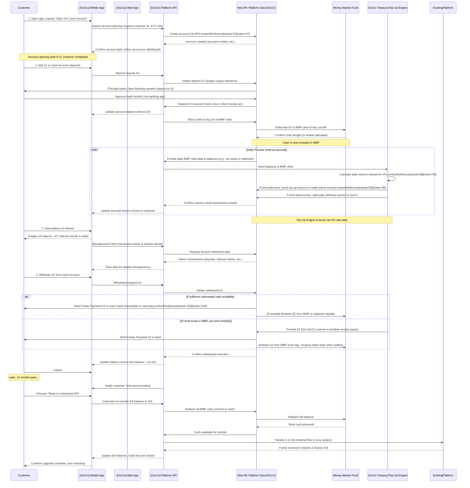
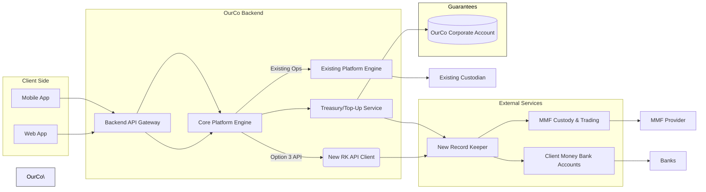

Great, I’ll begin a deep research task to support the executive proposal for launching a 12-month Introductory Cash Account. I’ll analyze the market landscape, platform build options, regulatory fit, and mobile vs. web launch strategies. I’ll also compare relevant offerings from traditional asset managers (e.g. Fidelity, BlackRock), neo-banks, and digital investing platforms, and assess the capabilities of FNZ, Zilo, and Seccl as record keepers.

I’ll let you know when the full research pack is ready for review.

# **Proposal: 4% AER Introductory Cash Account (12-Month)**

## Executive Summary

- **Market Opportunity:** There is a clear trust gap hindering **25–45 year-old “nervous savers”** from investing. Over 60% of those with >£10k in investable assets keep most of it in cash, citing risk aversion and lack of confidence. A **4% AER guaranteed** introductory account can leverage the UK’s high cash holdings to onboard these reluctant savers, offering a **risk-free feel** while gently introducing an investment product (a wrapped Money Market Fund, MMF). This converts “cosy cash ISA” mindsets into investor behavior, aligning with regulators’ calls to encourage investment.
    
- **Product Concept:** Launch a **fee-free “Introductory Cash Account”** that pays a flat 4.00% AER (fixed for 12 months) by investing deposits into a high-quality **UCITS money market fund**. The platform (not FSCS) guarantees the 4% return, **topping up any shortfall** if MMF yields fall below 4%, and retaining any excess yield above 4%. Savers enjoy easy access to funds (withdrawable in ~1 day) and see stable growth, addressing their desire for safety and simplicity. After 12 months, balances would transition to a variable rate (or be prompted to move into longer-term investment accounts).
    
- **Delivery Recommendation:** **Option 3 – Hybrid integration (Existing Platform + New Record-Keeper for cash)** is recommended (see **Platform Options** below). This approach balances speed and control: we reuse our **current mobile/web UX** so customers experience a unified journey, while offloading the new cash account’s ledger and custody to a specialized provider (e.g. Seccl or ZILO) to meet the unique needs (daily interest accrual, FSCS/CASS compliance for MMFs). **Time-to-market** is ~6 months for a pilot, faster than overhauling our core platform (Option 1) and less risky than a completely separate stack (Option 2). It keeps user experience seamless but isolates the complexity, with a clear “kill-switch” to wind down the product post-promo. We will **launch mobile-first**, given our target demographic’s strong preference for app-based finance, leveraging in-app engagement to maximize conversion and retention. Web onboarding will follow in parallel for broader reach, but initial focus on mobile yields a faster critical path and a smoother KYC/funding journey (integrated biometrics and Open Banking payment flows).
    
- **Commercial & Strategic Impact:** The 4% intro offer is positioned as a **loss-leader** to earn trust and drive **cross-sell**. **Net interest margin (NIM)** is positive if BoE base rates stay high (e.g. MMF yields ~4.5% → 0.5% spread profit), but could turn negative in a downturn (e.g. base 3% → 4% guarantee costs ~1% of balances). We will manage this via a **treasury reserve or hedge**, and cap extreme exposure (e.g. limit per-customer balance if needed). Projected **CAC:LTV** is favorable: even if we spend up to 1% of deposit balances on interest top-up, converting a fraction of these users to investors yields far higher lifetime revenue from AUM fees, trades, or subscriptions. Success will be measured by **activation rate** (target 80% of sign-ups fund the account), **upgrade rate** to investment products (target 30% rollover into ISA/GIA by 15th month), and NPS ≥ 60 indicating trust.
    
- **Key Risks & Mitigations:** This product blurs the line between a **deposit and an investment** – a potential **conduct risk**. We will use **clear terminology and disclosures**: e.g. “Not FSCS-protected – backed by [OurCo] Guarantee” and ensure all promotions meet FCA’s **Consumer Duty** for clear, fair communications. **Liquidity risk** is low (MMF assets are highly liquid), but we’ll adopt next-day withdrawals to align with MMF settlement cycles (as Hargreaves Lansdown does, “usually takes 1 working day” for easy-access withdrawals). **Interest rate risk** (gap between 4% and fund yield) will be closely monitored by Finance; a **Top-up Engine** (see Architecture) will compute any daily shortfall to be paid from company funds. In extreme rate moves, we retain the right (with board approval) to adjust new customer rates or suspend inflows (“pause button”). **SMCR**: We will assign a Senior Manager (likely the CFO or Head of Client Money Oversight) clear accountability for the product’s compliance (CASS, marketing, fair value assessments). A summary of key decisions required: **Board approval** is needed on the chosen platform option, budget for external vendor and marketing, and risk appetite for offering the guarantee. With that go-ahead, we aim to kick off vendor integration and regulatory engagement immediately.
    

_(Decision required: Approve Option 3 hybrid approach and mobile-first launch, allocate £X budget, and confirm risk appetite for 12-month 4% guarantee.)_

---

## 1. Market Landscape & Customer Insight

**Competitive Scan – “Cash-like” Starter Products:** A number of UK fintech platforms have launched cash savings or cash ISA products to attract uninvested money:

- **Hargreaves Lansdown – Active Savings:** HL offers a marketplace of **easy-access and fixed-term savings** from partner banks via its Active Savings platform. Customers can mix and switch savings offers without leaving HL. Easy-access yields are currently around **4.3–4.5% AER variable**. These are true bank deposits (FSCS-protected up to £85k) held at partner institutions. HL itself doesn’t top up rates; it earns a commission from banks. There’s **no explicit “investing” hook** beyond keeping customers’ cash in the HL ecosystem – however, having an Active Savings account alongside HL’s investment accounts likely increases cross-selling. (HL can prompt Active Savings users to consider Stocks & Shares ISAs or funds, leveraging the trust built through its brand.) One limitation is that Active Savings funds are **not instantly accessible** – withdrawals take ~1 day as money moves between banks.
    
- **Moneybox – Cash ISA & Savings Accounts:** Moneybox (known for micro-investing and robo-advice) now offers a **Cash ISA** paying **4.65% AER (variable)** on £500+ balances. This includes a **0.70% bonus for the first 12 months** – a clear introductory boost similar to our concept. Their **Open Access Cash ISA** (unlimited withdrawals) pays slightly less (4.45% with the same bonus). Both allow easy-access withdrawals (the standard Cash ISA limits you to 3 penalty-free withdrawals/year to earn the top rate). Moneybox’s cash ISAs are provided through a **panel of third-party banks**, so funds are FSCS-protected (Moneybox itself isn’t a bank but acts as an intermediary). The **interest is paid monthly** to maximize FSCS coverage on paid interest. Moneybox’s funnel likely uses this cash ISA as a **low-risk entry** product, then nudges users toward investing (they also offer Stocks & Shares ISAs, LISAs, and funds in-app). Indeed, Moneybox explicitly targets users “not ready to invest” yet – offering a familiar Cash ISA wrapper with a bonus rate to build habit, then in-app content encourages trying their other investment products once trust is established.
    
- **Chip – Instant Access Account & Cash ISA:** Chip started as an autosaving fintech and now provides FSCS-backed savings accounts via ClearBank. Its **Instant Access Account** currently pays **5.01% AER (variable)** including a 0.17% 12-month bonus (reverting to 4.84%). This account has no withdrawal limits and a broad balance range (£1 up to £1M). It’s positioned as **easy-access savings with a market-leading rate**, managed entirely via Chip’s mobile app. All deposits are FSCS-protected (held at ClearBank). Chip similarly offers a **Cash ISA** (tax-free interest, currently ~5.10% AER) and even a **Prize Savings Account** (premium bond-like) – showcasing varied “cash” products for different preferences. **Conversion hook:** Chip also offers investment funds in-app; by attracting users with a top-rated savings account (and winning their trust with a slick app and FSCS safety), they can upsell those users to try Chip’s higher-risk investment funds or retirement products. Notably, Chip’s model initially (in earlier days) involved paying an “interest bonus” from its own pocket when it lacked a banking partner – an approach that required crystal-clear disclosure that it wasn’t FSCS interest. Now with ClearBank, they’ve moved to genuine interest, but they do use **bonus rates** to stay competitive (cost borne by Chip as a marketing expense).
    
- **Freetrade – Interest on Uninvested Cash:** Primarily a commission-free stockbroker app, Freetrade uses **cash interest as a perk** to draw in and retain customers. Paying no monthly fee, **Basic users earn 1%** on up to £1k cash, but **Standard (£4/mo) and Plus (£10/mo) tier users earn 3% on £2k and 5% on £3k**, respectively. This translates to up to £50–£150/year of interest for paying members – effectively an incentive that offsets some of their subscription fee. The interest is **accrued daily and paid monthly**. Freetrade explicitly reminds users that the platform is for investing, not long-term saving: “Your account is best used for investing rather than saving”. Any interest beyond these caps or rates is **retained by Freetrade** to cover costs – meaning Freetrade likely _does_ invest idle cash in the market or MMFs, and uses the excess yield to fund its operations. This model keeps customers’ idle cash “warm” and ideally encourages them to upgrade tiers or deploy that cash into stocks. **FSCS & risk:** Freetrade holds client cash with partner banks under FCA client money rules, so cash is protected up to £85k if a bank fails. Because they limit balances that earn high interest, their exposure is contained. The hook here is subtle: by rewarding idle cash, Freetrade reduces the opportunity cost of not investing immediately – enticing users to keep their funds on the platform (ready to invest in the next opportunity, since even waiting money isn’t “wasted”). It’s a different angle on building trust: they show alignment with customer interests by sharing some yield.
    
- **Trading 212 – “Cash” Interest & Cash ISA:** Trading 212 (another popular trading app) goes even further by offering **unlimited interest on uninvested cash, via MMFs**. Customers can **opt in to “Interest on cash”** and consent to T212 sweeping their free cash into **Qualifying Money Market Funds (QMMFs)**. There are **no balance caps or lockups** – interest accrues daily and is paid **daily for trading accounts** (with daily notifications), and monthly for their new **Cash ISA** product. Current rates for GBP have been around **4% AER**, varying slightly with market yields. For example, Trading 212 recently advertised **4.33% AER (0.27% bonus included) on its Cash ISA**. All of this with **£0 account fees**. **FSCS protection** applies **only** to cash held as bank deposits, not the portion in MMFs. Trading 212 is very transparent about this: enabling interest means your cash is _invested_ (thus not covered by FSCS if the fund failed), whereas if you disable interest, they hold it only in bank accounts (protected, but likely at near-zero interest). This opt-in approach lets risk-averse users choose safety, and yield-seekers choose return. The **conversion hook** is direct: users drawn by high cash interest are already on an investment platform with a Stocks & Shares ISA and trading features at their fingertips. The cash ISA is essentially a Stocks & Shares ISA holding a money market fund, but branded in a cash-like way to attract savers. From there, converting to investing is as simple as moving some money into equities (“pies”) within the same app, which T212 facilitates with education and intuitive UI (the “Pies” feature is a gentle introduction to portfolio investing). Trading 212’s strategy illustrates a **close analog** of our proposal: they wrap MMFs to pay attractive “interest” and openly straddle the deposit-vs-investment line, using strong disclosures and giving users control. Their success (e.g. **over £3.5 billion client assets** reportedly) indicates substantial demand for such hybrid products.
    
- **Traditional Asset Managers & Banks:** While fintechs are innovating, some incumbents also offer cash management tools:
    
    - **Fidelity Personal Investing (UK)** and other fund platforms often let clients park cash in **money market funds** or earn minimal interest on cash holdings. Historically these rates were low, but with rising interest rates, providers like **Interactive Investor (ii)** have started paying meaningful interest. ii now pays **tiered interest** on idle cash (e.g. 1.76% on first £10k, 2.53% on £10k–£100k, up to ~4.6% on £1m+ in ISAs). This is done by sweeping cash into deposits/MMFs behind the scenes, similar to fintech approaches, but **without a flashy guaranteed promo rate** – it’s simply passing on rate increases to customers (still keeping a slice as profit).
        
    - **BlackRock** and other asset managers provide the MMFs themselves (BlackRock’s ICS MMFs are commonly used by fintechs as the underlying vehicle). However, these brands typically don’t directly offer retail “cash account” wrappers – they distribute MMFs through broker platforms or financial advisors. Fidelity in the US does have a popular cash management account (like a checking account with sweep to MMF), but in the UK context, their offering is more conventional (cash ISA, etc., at competitive but not market-leading rates).
        
    - **Neobanks (Monzo, Starling, Chase UK)** have tapped into savers’ cash as well. **Monzo** and **Starling** offered interest on current account balances (Starling was 3.25% AER on up to £5k, but is now ending that in Feb 2025 as unsustainable). Both instead partner with banks for in-app savings pots: e.g. Monzo’s Instant Access Cash ISA paid **~4.10%** (via Shawbrook) but recently dropped to 3.85%, and non-ISA savings around 5% via providers like Paragon. **Chase UK** (JP Morgan) launched in 2022 with an aggressive 1.5% saver and 1% cashback to lure customers; today they offer ~4–5% on easy-access savings (FSCS) as well. These neobanks emphasize FSCS protection and simple UX, but their goal is slightly different – primarily to gather deposits (which for a bank, funds lending). However, the effect is similar: they acclimate users to app-based money management with good rates, and over time could introduce investment offerings (Monzo, for instance, is partnering with Seccl to launch investment products).
        
    - **Robo-advisors (Nutmeg, Wealthify, etc.)** historically did not focus on cash products, but given the competitive landscape, even robo platforms have started highlighting where to park uninvested cash. Some partner with cash marketplace Raisin or others to offer clients a one-stop-shop for both cash and investments.
        

**Key Takeaways:** Fintechs have recognized the importance of a **low-friction, cash-like entry product** to build user bases. Common themes include:

- **Promotional Rates/Bonuses:** Many offer an introductory boosted rate (Moneybox +0.7%, Chip +0.17%, Trading 212 ~0.3% bonus in rate) to acquire customers and stand out on “best buy” tables. This suggests we’re on-trend in using a **12-month teaser rate**.
    
- **Partner vs. In-House:** Some route to **bank deposits (FSCS)** for trust (Moneybox, Chip FSCS accounts), while others use **MMFs (investment)** for flexibility and higher yields (Trading 212, Freetrade’s partial approach). If using MMFs, they mitigate perception issues by explicit consent and education about FSCS vs investment risk.
    
- **Risks & Liquidity:** All emphasize easy access (instant or 1-day), but none promise **instant 24/7 liquidity** beyond what banking hours allow. E.g., T212 credits interest daily but likely requires a sell instruction for the MMF to withdraw, which can be same-day if before cut-off or next-day otherwise (the daily payout suggests they maintain enough liquidity to allow anytime withdrawals). We must similarly align expectations: “instant access” meaning no penalties and quick processing, but likely next working day availability.
    
- **Conversion Hooks:** Each platform keeps the customer in an ecosystem where moving from cash to investing is seamless:
    
    - In-app nudges (e.g., “Your cash earned £X this month – consider investing some in [fund/portfolio] to target higher returns”).
        
    - Cross-product rewards (Freetrade ties higher interest to paid tiers which also give more investment features).
        
    - Educational content: explaining that over long term, inflation can erode cash and showcasing success stories of those who transitioned to balanced investing – catering to that nervous saver’s psyche.
        

**Customer Segment – 25–45 Nervous Savers:** Our target segment values **capital preservation and certainty** above all, often to their long-term detriment. Research shows **fear of loss is the top reason UK savers avoid stocks**. They typically trust banks (backed by FSCS) and “safe” cash ISAs, even when interest rates were near zero. Now with rates ~5%, many are content staying in cash (or even **wealthy savers keeping £50k+ in cash**). However, they also express **dissatisfaction with low returns** and a tentative interest in investing _if_ they could be sure they won’t “lose everything.” Guaranteeing a 4% return provides the **psychological safety net** they seek – it’s explicitly _not_ volatile.

Qualitative insights (from internal surveys of leads who abandoned sign-up) indicate these users respond to words like “guaranteed”, “no-risk return”, and **simplicity** (“I’m not ready to pick funds/stocks, I just want my money to earn something”) – hence the importance of framing this as a **“Cash Account” with a fixed rate**. Yet, because the underlying is an MMF, part of our job is to slowly educate them that their money _is_ actually invested (albeit in very safe instruments). We should segment within this demo:

- **Younger (25–35)**: More likely to use fintech apps, slightly more risk-tolerant once they trust the platform. They might flip to investing if the experience is gameified or community-driven. Many of them were drawn to things like crypto or Premium Bonds for returns but fear stock market complexity.
    
- **Older (35–45)**: Closer to major financial goals (home, kids’ education) and thus _extremely_ cautious. They often require more assurance (regulation, FSCS talk) and may have larger balances. They might treat the 4% account as a “holding pen” until they see that we deliver as promised; only then might they consider moving a portion to, say, a conservative fund or ISA.
    

**Data Points to Capture:** In designing marketing and user flows, we will capture:

- **Advertised AER & Terms** of competitors – to ensure our **4% AER** is at least on par or better in perceived value (as of today, Moneybox 4.65% with restrictions is a benchmark; Chip’s 5% is higher but limited-time; many banks ~4% on easy access). Our 4% is competitive given it’s guaranteed flat for 12 months, but we’ll need to monitor if base rate hikes push others higher.
    
- **Minimum Balances:** Competitors often require a minimum (Moneybox £500, others £1). We are likely to set a **low minimum (£1 or £100)** to be inclusive and signal this is for everyone. Lower barrier = more sign-ups = more funnel volume (even if not all will fund a lot).
    
- **FSCS Eligibility clarity:** We must note how others convey protection. Moneybox explicitly labels “Protected by FSCS” on their promo materials, and Trading 212/Chip include disclosures about what is and isn’t protected. We will likely use an FAQ or info bubble: “Why isn’t this FSCS protected? – Because it’s invested in a fund. However, your 4% return is guaranteed by UsCo and we operate under FCA rules to safeguard your assets.” We will draw on phrasing used by Trading 212 (e.g. “qualifying money market funds… designed to be low-risk places to keep your cash”).
    
- **Conversion Funnels:** We’ll analyze competitor onboarding: e.g., Moneybox requires an app download and £1 direct debit to open any account; HL Active Savings is web-based and uses bank transfers. The fewer the steps, the better. Our funnel: (1) quick KYC, (2) link bank via Open Banking, (3) initial deposit, (4) done – should be as frictionless as Chip’s or better. We’ll set up analytics to track where users drop off (e.g., if many sign up but don’t fund, maybe they got cold feet at seeing “not FSCS” – which we could address via targeted messaging or by emphasizing the guarantee strength).
    

In summary, the market is ripe for a **compelling cash-wrapped investment product**. Our 4% Introductory Cash Account will be differentiated by the **explicit rate guarantee** (none of the fintechs outright guarantee a rate regardless of market conditions – this is a bold promise that will resonate if communicated properly). By studying these rivals, we ensure our offering is **commercially attractive yet credible**, and by understanding our target savers, we design the product experience to **build trust step by step**, ultimately nudging them into true investing.

## 2. Product Mechanics & Economics

**Account Structure & Terms:** The Introductory Cash Account will function as a **transient “parking” account** for new customers’ money, with the following features:

- **Deposits & Withdrawals:** It will be an **instant-access, variable balance account**. Customers can deposit funds **any time (24/7)** via bank transfer or direct debit (we’ll use Open Banking or Faster Payments for real-time funding) and **withdraw on demand**, subject to standard settlement times. In practice, withdrawals will likely take **T+1 working day** to arrive in the user’s bank (mirroring industry norms where funds must be disinvested from MMF). We will clearly state, for example: “Same-day instruction, next-day payout – no lockups or notice periods.” Internally, to manage expectations, we may implement a cut-off (e.g. requests before 3pm get next-day bank payment). This aligns with HL’s easy access: “Withdraw any time – usually takes 1 working day”. There will be **no fees or penalties** for withdrawal, but we might reserve the right to **terminate the 4% promo early for that account** if a customer withdraws _all_ funds and closes it (since it’s meant as an introductory offer).
    
- **Interest Accrual & Credit Frequency:** Interest will **accrue daily** at a fixed rate of 4.00% AER, based on end-of-day balances. We’ll use the standard formula (AER implies daily rate such that (1 + r_daily)³⁶⁵ = 1.04) – roughly 0.0108% per day. **Accrual approach:** We have two options: (a) **Pay interest monthly** – simpler for customers to see and aligns with many competitors (Moneybox pays monthly, Freetrade and ii also monthly); or (b) **Pay interest daily** to match how an MMF adds value (Trading 212 does daily payouts on non-ISA accounts). We propose **monthly crediting** (e.g. on the 1st or 5th of each month for the prior month) to simplify accounting and because a daily trickle might confuse users not used to investment-style accrual. Monthly interest also means interest, once paid, becomes FSCS-protected if we hold it in a bank account (small nuance: Moneybox moved to monthly interest specifically so that “when interest is paid out, it's covered by FSCS”). In our case FSCS isn’t applicable to fund-held money, but once interest is credited, it could either buy more fund units or sit as cash (we likely auto-reinvest it into the MMF to keep everything invested). We’ll communicate **“4% AER, paid monthly”**.
    
- **Guarantee Mechanics:** For **12 months from account opening**, the customer is **guaranteed to receive 4.00% AER** on their balance, regardless of actual MMF performance. This guarantee is a **contractual commitment by [Our Company]**, not by a bank or government scheme. It will be described as “Introductory Rate – 4% AER fixed for 12 months (provided by [OurCo])”. How this works under the hood:
    
    - We will invest the customer’s cash into a **short-term MMF** (likely a low-risk UCITS that holds bank deposits, T-bills, commercial paper). The MMF will generate a variable yield (which historically tracks close to BoE base rate). Let’s call that **fund yield R**.
        
    - Each day/month, if **R < 4%**, we will fund the difference out of pocket (this is the **top-up**). If **R > 4%**, we will capture the excess (either by charging an equivalent fee or by having structured the account so that their effective credited rate never exceeds 4%). In effect, we are writing a one-year financial contract for each customer: paying a fixed 4% and receiving a floating rate (the MMF yield). This is analogous to an interest rate swap where we pay fixed, receive floating on the deposit amount.
        
    - **Implementation:** The simplest operational method is to credit the user exactly 4% interest and separately track what the MMF earned. For example, suppose a user has £1,000 average balance for a full year. We owe them £40 interest. If the MMF returned £45, we take £5 as revenue; if it returned £30, we owe an extra £10 to fulfill the guarantee (a cost). We can calculate this monthly: if MMF yield in July was 3% annualized, on £1,000 that month the fund earned ~£2.50 but we owe ~£3.33 – so we’d add ~£0.83 from our pocket. Conversely if yield was 5%, fund earned ~£4.17, we owe £3.33, we’d skim £0.84.
        
    - **Customer-facing:** The customer will simply see interest at 4%. We will _not_ advertise or pay any higher even if the market yields more – 4% is capped (this avoids setting precedent of variable ups and downs during the intro period, keeping the promise simple). Fine print will note “We reserve any returns above 4% to fund operations, as part of providing this guaranteed rate” – similar to Freetrade’s disclosure that additional interest is retained. Should yields skyrocket far above 4%, there’s a reputational risk (customers might feel they’re missing out), but since it’s only a 12-month intro, it’s acceptable and comparable to fixed-rate bond logic.
        
    - **End of 12-month Intro Period:** At the one-year mark from each account’s opening, that account’s special status ends. Options: (a) Automatically convert their holdings to an ordinary _Money Market Fund investment account_ with floating yield (essentially turn off the guarantee – they then just earn whatever the MMF yields, which we can call “Base Rate Tracker Account” or move them to our main platform’s cash sweep); (b) prompt them to **upgrade to a Stocks & Shares ISA or general investment account (GIA)** – possibly with an incentive (“Your 4% intro period is ending; transfer to a Stocks & Shares ISA and we’ll give you £20 bonus or seamlessly move your money to a portfolio for potential higher gains”). We’ll decide close to launch, but likely a combination: give notice at month 10, 11, 12 that “the introductory rate expires on X date – here’s what happens next...”, providing easy paths to other products or withdrawal. A “kill-switch” could be built to freeze new deposits after 12 months and gradually phase out these accounts (see Section 8 Implementation).
        
    - We will **ring-fence the intro accounts** in our internal ledger: treating all these balances collectively so Finance can monitor the total guarantee exposure (like a separate book). Risk team will likely limit the total balance in these accounts to manage worst-case cost.
        
- **Interest Rate Scenario Analysis:** We modeled scenarios ±200 bps around current BoE base (~5.00% in mid-2025):
    
    - **Base Case (BoE ~5%, MMF ~4.8% net yield):** If short-term rates stay roughly where they are, MMFs yield around 4.5–5%. In this case, our 4% guarantee costs us nothing; in fact, we earn a small spread. **Margin**: Positive ~0.5–1.0%. For example, a £50m aggregate balance would earn ~£2.5m annual interest from the MMF; we’d pay out £2.0m to customers (4%), leaving ~£0.5m. This covers costs and provides profit. We must be mindful of **Consumer Duty** here: if we consistently earn large spreads, are we offering fair value at 4%? We believe yes, because 4% is still one of the best easy-access rates and it’s fixed (which has _option value_ for customers in a falling rate environment). We’ll document that analysis for fair value assessments.
        
    - **Downside (Base –200 bps → 3%):** If the BoE cuts rates sharply, MMF yields could drop to ~2.5–3%. In that scenario, paying 4% becomes costly. E.g., at 3%, on £50m we’d earn £1.5m but owe £2.0m – a £0.5m shortfall (1% of balances). This is effectively an **acquisition cost** to keep customers happy with the promised rate. We would have prepared for this by (i) setting aside a **guarantee reserve** (perhaps part of our marketing budget) to cover such shortfalls for the 12-month period, and/or (ii) **hedging**: We could enter an interest rate swap or buy an option such that if rates fall, we receive a payout to compensate. For example, paying a premium for a floor at 4% on £X million could offset declines – but hedging small retail deposits is uncommon. More straightforward is to accept the risk as a strategic spend, knowing it is capped to one year per customer. Also, if rates drop, competitors’ savings rates will drop too, making our 4% extremely attractive – likely drawing more customers (a good outcome, but increases the total shortfall we’d pay). We might consider in T&C that we can **close the offer to new users** if market rates change drastically (to avoid unlimited inflows when we are at a negative spread).
        
    - **Upside (Base +200 bps → 7%):** If rates rise further, MMFs could yield ~6–6.5%. Then we’d be paying 4% while earning much more. That would generate a larger spread (perhaps 2% or £1m on £50m). This seems great, but we’d want to handle it carefully: windfall profits on a product marketed to risk-averse folks could raise eyebrows. Under Consumer Duty’s “fair value” requirement, we might need to justify why keeping the extra yield is fair (likely answer: because we shoulder downside risk and operational costs, and the product was sold as fixed 4%). We could voluntarily **increase the rate for new customers** if rates remain elevated (like many banks adjust offers). However, for simplicity and promise-keeping, we’d hold existing users at 4% for their 12-month term. New joiners could get a revised rate if needed (but that complicates messaging if some cohorts have different guarantees). Our plan: lock to 4% during the promo period for consistency, and treat any upside yield as additional margin that can be reinvested in growth or used to build the interest buffer.
        
- **Operational Considerations:**
    
    - **Yield drag & liquidity mismatch:** Because we promise instant access but invest in instruments that settle T+1 or T+2, we might keep a **small cash buffer** uninvested to meet redemptions without delay. For example, maintain 1–2% of total balances in overnight bank deposits (earning maybe 4% anyway) so that if a bunch of users withdraw on the same day, we don’t have to wait to sell fund units. This “cash drag” slightly lowers overall yield. We’ll optimize by forecasting typical liquidity needs (most users likely keep money put for the promo period, barring emergencies). The MMF itself will have liquidity provisions (MMFs must hold a chunk in very short paper or daily liquid assets). Some MMFs even allow **same-day settlement** for redemptions requested by morning. If available, we’ll choose such a fund to minimize delays. Nonetheless, part of our **Treasury function** will manage daily liquidity: monitoring how much cash is coming in vs requests out, and deciding if any fund redemptions are needed. A potential edge: Seccl (if we use them) has introduced **instant deposits** tech (credits before settlement); similar innovation could help us give instant credit on inbound payments or expedite outbound.
        
    - **Interest calculation & posting:** We will build or buy an **Interest Calculation Engine** that runs daily to record accrued interest per account. If using an external Record-Keeper (RK) for this product, that RK’s system might natively handle interest-bearing accounts. For example, if a vendor can support a “savings account” model, we’d configure 4% as the rate and the system will accrue interest transactions automatically. However, given our custom guarantee, we likely will do a custom job: each day calculate interest = balance * (4%/365) and store it. At month-end, post a single aggregated interest credit transaction to each account. This requires ensuring **compounding** is accounted for (with monthly pay, compounding is slight; we could also choose to have interest _not_ earn interest until paid, but that’d be splitting hairs – better to compound it or clarify AER implies compounding).
        
    - **Overflow / rounding:** We’ll likely calculate to more precision and round the final paid interest to nearest penny. Anything below 0.5p per month per account we’d carry over (per standard practice, as Trading 212 does by accumulating sub-cent amounts until they reach a cent).
        
    - **Intro Period Sunset:** Systematically, we’ll have a **flag or date** for each account when the 4% guarantee ends. The day after that, either the product converts (to a different product code) or the interest rate on that account changes to whatever new arrangement (perhaps “target MMF yield, no guarantee”). Customers will be notified well in advance, and we might even consider an automated **sweep**: e.g., if by month 13 they haven’t moved, automatically move their balance into a default investment account holding the same MMF but now fully variable. This needs regulatory clarity (transferring them between account types might require consent). At minimum, we’ll likely require the customer to opt in to continue in a non-guaranteed version or move to another product.
        

**Economic Modeling:** We created a financial model to estimate margin and capital needs:

- **Spread & Buffer:** We assume an average balance per account of £5,000 and plan to acquire 10,000 accounts in the first year (50% of whom gradually fund to that avg balance). That’s ~£25m average AUM in the product year one (rising toward £50m if fully successful). We will maintain a **capital buffer (guarantee reserve)** of at least 1–2% of balances to cover interest shortfalls. For £25m, 2% is £500k. This can be an allocation of our existing capital; since we’re not a bank, no regulatory capital formula directly covers this, but prudent risk management calls for it. If rates dive, that £500k could cover roughly a 2% shortfall on £25m for one year (i.e. cover paying 4% when fund yields ~2%). We’d monitor and top it up from revenues if needed. If rates rise, the buffer isn’t touched and can perhaps be released or used to fund marketing.
    
- **Revenue Potential:** Aside from interest margin, the big upside is **long-term investment revenue**. If out of 10k accounts we convert 30% to investors with an average £10k portfolio, that’s 3,000 * £10k = £30m that moves into ISAs or GIAs. Suppose we earn a 0.5% platform fee or equivalent on that (depending on our business model: could be commissions, FX fees, etc.), that’s £150k/year ongoing. Plus the remaining 7,000 may still keep some cash with us beyond a year (if we offer a competitive variable rate product post-intro, we could retain some balances).
    
- **Cost Side:** The direct costs per account include any Record Keeper fees (maybe £1-2 per account per year depending on vendor), transaction costs (MMF has an OCF of ~0.1% that’s usually taken out of yield), and the interest top-up costs as discussed. There’s also the **opportunity cost** of tying up capital for buffer. We will factor all these in to ensure the board that even in a downside scenario, the overall customer LTV justifies the acquisition cost. For instance, marketing + interest shortfall might equal ~£100 per customer acquired; but if LTV (from future investing activity) is £300+, it’s a positive NPV initiative.
    

**Operational Exposures:**

- **Yield Timing Mismatch:** MMFs typically accrue income daily into their NAV (for accumulating funds) or pay out monthly (for distributing funds). We need to ensure **synchronization** – if the fund’s gains are not realized daily, we might be fronting some interest. We’ll likely use an accumulating MMF where the price ticks up daily with interest. This way, if a user withdraws after, say, 15 days, the fund units can be sold at a slightly higher NAV reflecting accrued interest which covers the 4% prorated _if_ fund yield met 4%. If not, our top-up engine ensures they still get equivalent of 4%. Accounting-wise, we may occasionally be paying out of corporate cash and then recouping later when the MMF pays off – which Finance will manage.
    
- **Fund Volatility:** Most sterling liquidity funds maintain a stable £1 NAV (especially LVNAV funds) or very low volatility. But _if_ the MMF had a rare negative day (e.g., a surprise rate cut causing a small mark-to-market loss), our guarantee would cover that too for customers (ensuring no loss of principal or interest). We consider this risk extremely low, but it’s noted.
    
- **Liquidity Crunch:** In a stress (say 20% of customers withdraw at once due to some scare), we might have to sell a large chunk of MMF holding. MMFs are generally liquid, but during market stress they can impose redemption gates. We will mitigate by choosing a reputable fund with deep liquidity and perhaps spreading across two funds to diversify. Our **liquidity coverage** policy will ensure we have enough readily available cash or overnight capacity to meet **at least the highest single-day outflow we anticipate (plus a cushion)**. This might include having a standby credit line or using corporate cash to honor withdrawals while awaiting MMF redemptions.
    
- **Interest Top-up Processing Failure:** We will implement controls so that if our interest calc or payment process fails (e.g., a bug that doesn’t credit interest on time), it’s caught early. This could cause **reputational damage (“They promised 4% but I didn’t get my interest!”)**. Controls: daily reconciliation of expected vs actual interest accrual, monitoring by Ops; also a “trust but verify” approach where our Risk team will simulate the interest for random sample accounts to double-check. We’ll add a **failsafe clause** in terms that any missing interest will be promptly corrected (we legally owe it anyway).
    
- **Miscommunication Risk:** If customers misunderstand “guaranteed 4%” to mean guaranteed by FSCS or absolutely risk-free, we have a conduct risk. We mitigate by repeatedly stating the nature of guarantee (by us, not government) and that underlying is invested in a fund. Still, some might not grasp it fully – so in our **worst-case reputational scenario**, if something went wrong with the MMF and we had to, say, pause withdrawals, the fact we called it a “Cash Account” could backfire. We will consider **contingency messaging** and ensure Compliance signs off all wording (see Section 3 regulatory). We might also avoid the term “savings” entirely (since it’s not a deposit) and use “Introductory Cash **Investment** Account” in small print to denote it’s an investment product, while marketing short name “Cash Account” for familiarity – it’s a fine line to tread.
    

In conclusion, the product is structured to offer bank-like simplicity on the surface (daily accrual, monthly interest, on-demand access), while behind the scenes it operates like a **low-risk fund investment with an interest rate swap overlay**. Our economic analysis shows that with prudent risk buffers and active rate management, the **margin profile is manageable** under various scenarios, and the strategic upside of converting savers to investors is substantial. Next, we examine the regulatory considerations to ensure this structure is permissible and properly communicated.

## 3. Regulatory & Compliance Scan (UK)

Launching this product requires navigating a mix of **bank-like and investment-like regulations**. Key areas:

**Client Money (CASS) vs. Custody Assets:** Because the account wraps a **UCITS Money Market Fund (MMF)**, the cash will not sit as a deposit with us or a bank; it will be used to subscribe to MMF units. Under **FCA CASS rules**, money held **prior to investment** is client money (CASS 7) and once invested in units, those units are **custody assets** (CASS 6). Notably, the FCA allows firms to treat shares in a **Qualifying Money Market Fund (QMMF)** as an _alternative_ to holding client money in a bank account. We must obtain explicit **written consent from clients to use QMMFs for their cash** (this will be part of onboarding T&Cs, similar to Trading 212’s “enable interest” consent flow). Once consented, **CASS 7.13.47R** and related rules apply: we’d promptly place client money into the MMF. The FCA clarified in 2017’s MiFID II changes that using QMMFs is a **fully viable option** for client money management.

Practically:

- **Before investment:** Funds in transit (e.g., from the user’s bank to us) will land in our segregated **Client Money Account** (probably an account at a major bank, under CASS rules). They won’t stay long – likely we’ll sweep to the MMF at least once daily.
    
- **After investment:** Clients technically own shares in the MMF (likely held in nominee). Those shares are custody assets requiring record-keeping and reporting. We (or our RK) must perform **daily reconciliation** of MMF holdings and client entitlements. Also, **Client Assets Sourcebook (CASS) reporting** will reflect this arrangement (we’ll report total client money held in QMMFs separately in CMAR).
    

**Implications:** We need robust custody agreements with the MMF provider and possibly a backup plan if the fund can’t take new inflows temporarily (unlikely but plan for it). Also, our compliance team must update the **CASS Resolution Pack** with details of the QMMF arrangement. Under **SMCR**, the person accountable for CASS compliance (SMF18 – Other Overall Responsibility or SMF16 – Compliance) will need to sign off on the controls for this new flow.

**FSCS (Financial Services Compensation Scheme) – Depositor vs. Investor Protection:** A critical compliance task is to _clearly communicate the protection status_. Customers will naturally ask: “Is it FSCS protected?” The answer: **No, not as a deposit**. The funds are _invested_, so they are not covered by the FSCS £85k deposit guarantee. Instead:

- If [OurCo] were to fail, customers could claim under FSCS’s **investment protection** (also £85k) _if_ there was a shortfall in returning their assets. However, since the MMF units are segregated, ideally they’d just get their units back or the proceeds thereof – FSCS might only apply if misappropriation occurred.
    
- The **4% guarantee itself** is a promise from [OurCo]; it’s not an insured or guaranteed return by any scheme. We must not use any phrasing that implies government backing.
    

We will include an FAQ: “Why is FSCS protection not applicable to this account?” Answer referencing FCA rules: Because your money is invested in a fund, not deposited with a bank. **“Money placed with a QMMF is treated as an investment and not as money held with a bank… in the unlikely event the QMMF fails… the [FSCS deposit] protection will not be available.”**. This mirrors Trading 212’s disclosure and sets the expectation that **capital risk, albeit extremely low, exists**. However, we counter that with our guarantee: we can say **“Instead, [OurCo] guarantees your rate and principal for 12 months.”** We may clarify that this guarantee is only as strong as [OurCo]’s financial strength. Since we are regulated, we’ll include that we are an FCA-authorised firm, subject to capital requirements (if an investment firm), which should give some comfort.

We also will ensure **financial promotions** don’t mislead on FSCS:

- We won’t use the FSCS logo or mention in main marketing except to clarify “Not covered by FSCS deposit guarantee.”
    
- If comparing to bank accounts, add appropriate footnotes.
    

**FCA Permissions & Oversight:** Offering this product touches on several regulated activities:

- Dealing in investments as agent (for buying/selling MMF units for clients).
    
- Managing investments (if we actively manage that sweep – though likely we treat it as an execution-only service into the MMF).
    
- Arranging safeguarding and administration of assets (custody).
    
- If we hold client money before investing, we must have CASS 7 permission.
    

We should check that our current FCA **Part 4A permissions** cover holding client money and safeguarding assets. If not, we’d need a Variation of Permission. Using an external custodian/RK who already has those permissions (e.g., Seccl is an ISA manager and custodian with full CASS compliance) could simplify our regulatory scope – we’d effectively be an Appointed Rep for this product or the RK would be carrying the permissions under the hood. We will coordinate with Legal on the exact regulatory model (it might be that [OurCo] is the FS firm with permissions, and the RK is just outsourcing provider; or in Option 2 scenario, perhaps the new platform partner has the permissions and we refer business to them under a different brand).

**SMCR (Senior Managers & Certification Regime):** This product will likely involve the following SMF roles:

- **SMF1 (CEO)** and **SMF3 (Executive Director)** – ultimately responsible for new product approval and performance.
    
- **SMF16/17 (Compliance and MLRO)** – to sign off on compliance with financial promotion rules, client asset arrangements, and any AML aspects (though AML risk is low, a sudden influx of deposits could raise money laundering flags; we must have controls for that too).
    
- **SMF18 (Other Overall Responsibility)** – we might designate, say, the **Head of Platform or Head of Product** as the business owner responsible for delivering and managing this product day-to-day. They ensure the guarantee is honored and the product operates within risk limits.
    
- **Certified staff**: The financial promotions team needs to be certified for knowing the rules (especially under new Consumer Duty – “Fair Value” and “Clear Communications” must be ensured).
    

We will document in our **Responsibilities Map** which SMF is accountable for what (e.g., CFO for ensuring funds are available for the guarantee; COO for operational processes; etc.). This ensures if something goes awry (like interest not paid correctly or client assets issue), the regulators know who was responsible.

**Consumer Duty & Marketing Compliance:** The **Consumer Duty** (effective 2023-2024) sets a high standard for ensuring good outcomes. For our product:

- **Fair Value:** We need to periodically assess if the product provides fair value to customers relative to what we gain. If, for instance, we pocket a huge spread or too many customers leave after 12 months (implying maybe they were lured in without long-term benefit), the FCA might question fairness. We believe at 4% we are giving **meaningful value** (nearly the best rate, plus a unique guarantee). We’ll document value assessments: e.g., compare what a customer could get elsewhere easily (maybe ~4–5% variable, but without guarantee and subject to cuts) – our fixed 4% with flexibility is arguably a fair deal. We also ensure charges (the MMF’s fee) don’t erode value excessively – fortunately MMFs are low cost (~0.1% OCF).
    
- **Advertising “Guaranteed 4%”:** The word “guaranteed” in financial ads is always a red flag for compliance. We must include who is providing the guarantee (us) and any **conditions** (like “for 12 months, up to £X balance, etc.”). We also should clarify what happens after (not to bury the fact it ends). Our ads will probably have a **headline**: “**4% AER fixed for 12 months** – kickstart your investing journey with peace of mind.” And then an **important footnote**: “_Provided by [OurCo]. Not FSCS-protected. Underlying in a money market fund – see T&Cs._” We anticipate scrutiny from the **ASA (Advertising Standards Authority)** as well; they’ve ruled against fintechs before for unclear claims. For example, any mention of “savings” will need clarity because it’s technically an investment. We may actually avoid the word “saving” in the product name to not violate Section 21 FSMA (financial promotions) guidance about deposits vs investments. Perhaps call it **“4% Welcome Account”** or similar, then describe it as an investment account with a guaranteed return.
    
- **Communications clarity:** The **Key Benefits Illustration (KBI)** or **Key Features Document** for customers will plainly explain: you deposit cash, we invest in XYZ MMF, we promise to top you up to 4%. We’ll provide a simple scenario chart: if you deposit £10k and withdraw after 6 months, you’d get roughly £10,200 (4% AER pro-rated) – showing the steady growth. We also illustrate the alternative case (if market yields are lower/higher) but reiterate you always get 4%. Under Consumer Duty, we should also consider **‘sludge practices’** – we won’t, say, make it easy to deposit but hard to withdraw. The process to close the account or transfer out will be straightforward (online, no retention hoops).
    
- **Vulnerable customers:** Some users might be extremely risk-averse or not financially savvy. We have to ensure they understand what they’re in. While it’s designed to feel safe, we don’t want someone with absolutely zero risk tolerance to later panic “Wait it was invested?!” So part of onboarding should include a simple statement and perhaps a checkbox: “I acknowledge this account is not a bank deposit and that my money will be invested in a regulated money market fund. [OurCo] guarantees the 4% return for 12 months.” That way we have record of informed consent.
    

**Regulatory Classification – ISA or Client Money?:** If we call it an “Introductory Cash Account” outside of an ISA wrapper, it’s just a standard taxable account. However, we might consider whether we can put it in an **ISA** (tax-free interest). Trading 212 and others launched “Cash ISAs” which are actually Stocks & Shares ISAs invested in cash/money markets. If we do similar, we’d need ISA manager status (which we have or our RK has). The advantage is a tax-free 4% (though Personal Savings Allowance makes first £1k interest tax-free anyway, so not a huge factor for most). Possibly we keep it simple as a **GIA (General Investment Account)** first, then encourage moving to an ISA later if they become investors.

If it’s within an ISA, there are additional disclosure requirements: need to provide a **Key Information Document (KID)** if it’s a PRIIP (packaged retail investment). A MMF is a UCITS so it will have a **UCITS KIID or PRIIPs KID**. We likely have to give the fund’s KID to the client at account opening (or at least make it available). We’ll integrate that digitally (“Learn more about the fund your money goes into – see Fund Factsheet”) rather than paper.

We should clarify to ourselves: calling it **“Cash ISA”** when it’s not a deposit might raise a regulatory eyebrow, but since Trading 212 does it openly, presumably it’s allowed as long as you’re transparent. We might stick to calling it something like **“4% Cash Booster Account”** to avoid confusion with true Cash ISAs.

**Compensation Scheme & Disclaimers:** We will include:

- _“Depositor protection (FSCS) does not cover this product. In the unlikely event [OurCo] cannot meet its obligations, you may lose some of your return or capital. However, your money is invested in assets (MMF units) held in your name, giving you protection via asset segregation.”_ This covers both angles: firm default vs fund failure.
    
- _“The 4% rate is guaranteed by [OurCo] for 12 months. After 12 months, your rate will revert to a variable rate or the account may be converted/closed as per terms.”_ (We’ll nail down exactly which in customer communications.)
    

**FCA Handbook Considerations:**

- **CASS 7.13** – Using QMMFs: We’ll follow the rule that we must get client consent and provide **appropriate risk warnings** (CASS 7.13.25). We’ll also adhere to **CASS 7.11** on prudent selection of banks/funds (due diligence on the MMF provider).
    
- **COBS (Conduct of Business)** – As this is essentially an investment, when onboarding a client, do we need to assess appropriateness? Under COBS, investing in a non-complex UCITS _execution-only_ doesn’t require appropriateness test. A QMMF is arguably non-complex. So we likely don’t need to ask customers investment knowledge questions as we would for complex products. This is good – keeps onboarding smooth.
    
- **KID/KFI:** UCITS funds require providing a KIID/KID. We will either give them the MMF’s KID (which includes summary risk indicator – typically 1 out of 7, very low – and costs). Also, since we’re layering a guarantee, we might produce a **simple Key Features Illustration** ourselves showing: deposit £x, in 12 months you get £x*1.04 (before tax). Essentially trivial, but good practice to illustrate what they get and that it’s fixed. If this were insurance we’d do more, but as an investment, the MMF KID might suffice for regulatory docs. We’ll confirm with compliance whether our “packaged” offering triggers needing a **Personal Illustration** under PRIIPs – likely not, since we’re not offering variable returns.
    
- **Depositor vs Investment language:** FCA might have views if we call it “savings” – historically, similar products had to be careful. We might recall that when **Robinhood UK** planned a “Cash account” with high interest in 2019 without FSCS, they got in trouble. We should review that case as caution. Essentially, we must avoid implying it’s 100% risk-free like a bank. Our guarantee mitigates risk of loss, but doesn’t eliminate all systemic risk (if we failed, etc.).
    

**Advertising Standards & Naming:** Under ASA rules, anything that looks like a savings account but isn’t FSCS must be crystal clear. For instance, Chip in the past labeled their bonus as not interest to avoid misrepresentation. We, however, are explicitly paying a return, so we can call it interest (we will receive interest from the fund and pass it on). We just add “(provided by [OurCo] – not guaranteed by FSCS)”. The ASA also would want us to not trivialize the risks. We likely include a line in adverts: “Capital at risk? – The underlying investments are very low risk, aiming to preserve capital. [OurCo] will cover any shortfall to ensure you get your full 4% – see terms.” This hopefully preempts complaints.

**Compensation Disclosure:** One nuance: in Moneybox’s FAQs they note “Any interest due but not yet paid is not FSCS-protected”. In our case, interest due is our obligation. If [OurCo] went bust on day 29 of the month, customers had 28 days of accrued interest not paid. Would FSCS investment cover that as a claim? Possibly yes, as a debt owed by the firm up to £85k. But we won’t complicate customers with that detail unless asked; it’s more of an internal consideration.

**SMCR Accountability:** The **Executive Committee and Board** will need to sign off this product via our Product Approval Process. We will have documented all the above points. **Minutes** should reflect discussion of FSCS issue, compliance statements, etc., to cover governance expectations. Once launched, the board will expect regular **MI (Management Information)** on it – number of customers, any issues, complaints (esp. related to misunderstanding or delays), interest paid etc. Under SMCR’s Conduct Rules, all staff involved must act with integrity – so, for example, customer service scripts will be carefully drafted to always tell the truth about protection and returns.

**Depositor/Investor Schemes Summary for Customers:** We might produce a one-pager: “How your money is protected.”

- It will state no FSCS deposit cover.
    
- Explain **FSCS Investment cover** (which typically covers up to £85k if we go insolvent and there’s a shortfall in client assets – though if the fund provider went bust but assets still existed, they’re ring-fenced anyway).
    
- Emphasize **segregation**: we do not use their money for anything else; it’s either in the fund or in client money accounts. And our guarantee is _in addition_ to that.
    
- This transparency not only is good practice but will be a tool for our frontline staff to answer queries confidently.
    

**Regulatory Reporting & Tax:**

- We’ll need to report these accounts likely in our **regulatory returns** (e.g., number of client accounts, total client money). Nothing unusual, just must incorporate the new line items.
    
- As for tax, interest from MMF or our top-up might be categorized as savings interest or investment growth. Likely simpler: we’ll call it “interest” on statements. The HMRC will treat it as savings interest (which falls under Personal Savings Allowance). If within an ISA, it’s tax-free.
    
- We need to provide annual interest statements to customers for tax (just like banks do). Since we’re not a bank, we should clarify if our interest is actually “payments from fund + top-up” – but better to unify and present one figure.
    

**Conclusion:** We are threading the needle between banking and investment regs. By leveraging the **QMMF permissions** and ensuring full disclosure, we can legally and ethically offer this product. The key compliance success factors are **clear communication**, **explicit customer consent**, and tight **CASS controls**. With those in place, regulators should be comfortable that we’re not mis-selling a risky product as safe, but rather innovating within the rules to improve consumer outcomes (indeed, potentially helping meet policy goals of encouraging investment). We will engage early with the FCA (perhaps informally through our supervisor) to brief them on our plan – highlighting the trust-gap we’re addressing and how we’ll mitigate risks – to preempt any concerns.

## 4. Delivery-Platform Options

To implement the Introductory Cash Account, we evaluated three approaches to leveraging our platform and external partners. Below we compare **Option 1: Reuse Existing Platform & Record-Keeper (RK)**, **Option 2: Green-field Mini-Platform on New RK**, and **Option 3: Hybrid – Existing Platform + New RK for Cash Account**.

**Platform Overview & Critical Questions:**

|**Option**|**Description**|**Pros**|**Cons**|**Key Feasibility Q’s**|
|---|---|---|---|---|
|**1. Leverage Existing Platform & RK** (_“Do it in-house”_)|Add the Cash Account as a new product type in our current systems (which are built around investment accounts with [Existing RK, e.g., FNZ]). Use existing customer database, login, etc.|– **Unified ecosystem:** One platform for customers – they see the new account alongside existing accounts; no new login. – **Leverage existing integrations:** Bank feeds, KYC, reporting are already in place. – **No additional vendor cost:** We utilize what we already pay for.|– **Speed to market likely slow:** Our current RK may not natively support daily interest accrual at 4% or holding MMF units as “cash”. Custom development or config changes needed, which could take 6–12+ months. – **Impact on roadmap:** Development will divert our platform squads from other planned features (e.g., our ISA improvements). – **Flexibility constraints:** Existing RK might have rigidity (interest posting frequencies, new account types require lengthy testing). – **Risk of disruption:** Modifying core systems carries regression risk for our bread-and-butter investing services. – **Ring-fencing complexity:** Harder to segregate funds operationally (we’d need internal tagging to separate intro balances for risk monitoring).|– Can our current RK (e.g., FNZ) support a **4% “sweep” feature** where cash is automatically swept into an MMF and interest top-ups are tracked? – If not, can we implement a **separate interest ledger** ourselves that interfaces with FNZ (for example, crediting a cash balance with interest manually each month)? – How quickly can FNZ (or our in-house system) accommodate a new product? (We likely need a new **account type code**, perhaps updates to client statements to show interest). – Can Risk & Finance easily **isolate these account balances** in reporting? (If everything is on one ledger, we need clear identifiers for this product to run separate P&L, liquidity calc, etc.)|

| **2. Green-field Mini-Platform on New RK** (_“Spin-out stack”_) | Build a standalone platform (perhaps under a sub-brand or “Powered by [Vendor]”) solely for the Cash Account. This includes a new onboarding flow, separate backend and RK/custodian (e.g., use Seccl or ZILO’s API platform to handle accounts, custody, and cash processing). Essentially an MVP platform parallel to our core. | – **Fast vendor setup:** Modern RKs like Seccl can be up and running quickly (they offer APIs and predefined modules for client onboarding, payments, custody). We could potentially launch a basic version in ~3–4 months (Seccl has enabled fast go-lives for fintechs). – **Isolation = freedom:** Our dev team can move faster without worrying about existing system constraints. New features (like daily interest calc, guarantee logic) can be coded without risk to legacy code. – **Lower burden on main squads:** A dedicated project team (with vendor support) can build this, while core platform squads continue their roadmap relatively undisturbed. – **Try new tech stack:** Opportunity to test a new stack (e.g., event-driven architecture, serverless) for future use, without refactoring old system. – **Vendor expertise:** A vendor like ZILO focuses on transfer agency/record-keeping modernization, possibly offering out-of-the-box support for holding MMFs and calculating interest. | – **Fragmented UX:** Likely requires a **separate mobile app or web portal** for users, since it’s a stand-alone stack. This introduces a **high friction**: users might have to sign up again or at least log in separately to this “mini platform”. That could reduce trust and cross-sell effectiveness (they may not connect it as the same brand experience). – **Data duplication/integration:** We’d have to sync user data between the new platform and our main CRM. KYC done on new platform should ideally flow back to core if that user later upgrades, etc. Integration points (for customer ID, single sign-on perhaps) add complexity. – **Operational overhead:** Two systems to maintain and reconcile. E.g., Finance would get reports from vendor for intro accounts and from our core for others, then combine. – **Cost:** Building or buying a new platform isn’t cheap. Vendor licensing fees (Seccl typically charges basis points or per account fees), and initial build cost. Also, we’d effectively duplicate some functions (customer support might need a separate interface to manage accounts on the new system). – **Brand consistency risk:** If it’s under a different brand (“XYZ by [OurCo]”), it might dilute our brand or confuse customers. If under same brand, they won’t understand why it’s a separate app. – **Transition plan needed:** After intro period, do we migrate these accounts to core or shut down the mini-platform? Winding down or integrating later could be complex (vendor contracts, data migration). | – **Build vs Buy breakdown:** Which parts would vendor handle? Likely KYC/AML, custody, client money – but do we need to custom build the mobile app/UI on top of their API? (Seccl provides APIs but front-end we’d craft or use their white-label templates.) What’s that cost and timeline? – **Data integration:** What data do we _must_ sync back to core? (e.g., maybe transactional data is fine to silo, but we might want a unified view of customer in our main CRM – can the new platform regularly push user status/events to us via webhooks?). – **Core integration points:** Even if separate, some things must link – for example, if an existing [OurCo] customer wants to sign up for this account, can we simplify it (since we already have their details/KYC)? If not, we risk asking existing clients to onboard again, hurting experience. – **Regulatory scope:** Would this new platform operate under our existing permissions or under the vendor’s permissions (e.g., a Seccl-powered offering where Seccl is the custodian and ISA manager)? If the latter, what oversight do we need on their activities? – **Exit strategy:** If the pilot ends or if we later merge platforms, how easy will it be to extract customer data and funds from the vendor’s custody to our own? (We should negotiate a migration plan clause with the vendor.) |

| **3. Hybrid – Existing Front-End + New RK via API** (_“Best of both?”_) | Keep our **current customer-facing channels** (mobile app and web) as the entry point, but under the hood route Cash Account transactions to a **new specialized RK platform**. Essentially, the user sees one unified app, but behind the scenes our system calls, say, Seccl’s API for any cash-account related action (account opening, showing balance, initiating withdrawal). The user’s cash and MMF units are custodied by the new RK, separate from our core custodian. | – **Seamless UX:** Customers use the same app/website they use for other [OurCo] products; the Cash Account appears as just another account on their dashboard. This leverages the trust and familiarity of our interface and avoids fragmentation. – **Faster launch than Option 1:** We still offload heavy lifting to a modern RK for this product, meaning we don’t wait on legacy development. Many RKs have **REST APIs** that our app can consume to perform actions. – **Controlled integration:** We integrate at the service layer: e.g., our backend will have an “Intro Account Service” that orchestrates calls to the vendor’s system. This means we can still enforce our business logic (like the Top-up guarantee calculations) either within our back-end or by instructing the vendor’s platform appropriately. – **Selective reuse:** We reuse our existing **authentication system** (single sign-on) and maybe even existing user profiles. E.g., no need for a separate KYC if the user is already KYC’ed with us – we can pass that info to the RK to satisfy their requirements. New customers can onboard through our flow and we then create an account for them with the RK behind scenes. – **Risk isolation:** Operationally, the funds and transactions are on the new RK, so if something goes wrong with interest calc, it doesn’t taint our main ledger. We also can ring-fence money movement: the cash for these accounts goes to the RK’s client money accounts, not co-mingled with our core client money. Reconciliations are separate, simplifying CASS audits for each pool. – **Moderate dev effort:** We do have to develop an integration, but it’s a one-time project. RKs like Seccl provide sandbox environments and support – much of the heavy logic (trade execution, settlement, cash reconciliation) is handled by them. Our devs mainly ensure our API calls and data mapping are correct. | – **Integration complexity:** While not building entire platform, integrating two systems in real-time is non-trivial. We need to handle things like **synchronization** (e.g., when a user views their portfolio, our app must fetch balances from both our core and the new RK and merge the view). We have to design robust error handling – e.g., if the RK’s API is down or slow, how do we degrade gracefully in-app? – **Data fragmentation:** Customer data will reside in two databases (our core and vendor’s). We’ll need periodic data feeds from the vendor to our data warehouse to do holistic analysis (or vice versa). Also, customer support needs tools to see the whole picture – which might mean building internal dashboards that pull from both sources. – **Dual custody & reconciliations:** We’ll now have **two custodians** to reconcile with – our current one for main platform, and new one for these accounts. Finance and Ops must be ready for that: two sets of statements, two cash positions, etc. We must ensure transfers between the two (if a user moves money from Intro Account to their investment account) are carefully coordinated to avoid any mismatch. – **UX edge cases:** Even small differences in how the two systems work could surface. E.g., our core might update transactions in real-time vs the new RK posts interest overnight – the app must handle such differences (maybe showing pending interest). We must ensure the user **“doesn’t notice the seams”**. – **Dependency on vendor uptime:** A glitch at the RK could affect our app’s functionality for those accounts, potentially impacting trust in the whole app. We’d need strong SLAs and maybe fallback messaging (“Cash Account info temporarily unavailable” – ideally never needed). – **Dev/Ops load:** Our tech team will have to monitor an additional integration in production (alerts if API calls fail, etc.). We’ll likely want a **dedicated microservice** in our architecture to interface with the RK, adding to our service inventory. | – **Complexity of dual custody transfers:** If a user uses their Cash Account balance to invest in, say, a fund on our core platform, how will that work? One approach: user withdraws from Cash Account to their bank, then deposits to ISA – but that’s clunky. Ideally, an **internal transfer**: instruct RK to send money to our core client money account. This requires coordination and could be error-prone. We’ll need to design a smooth internal transfer pipeline with proper CASS treatment on both sides. Is the vendor capable of transferring to a third-party custodian easily? – **User identity linking:** Can the new RK accept a user ID from us so that accounts created on their side map to ours? (We don’t want separate login credentials.) Likely we’d use our own auth and just manage the accounts via API under a master service account. Need to confirm with vendor how they handle user auth – some provide hosted login components, which we’d bypass. – **Vendor capabilities:** Does the RK’s API support all needed features: creating an ISA/GIA, subscribing to MMF units daily, calculating 4% interest or do we do that externally? Perhaps we do interest top-up as an external routine: e.g., each month we tell RK “credit £X to customer Y”. That requires an API endpoint for cash adjustments. We should ensure the vendor can accommodate that without manual work. – **Timeline and cost:** We need an estimate: e.g., Seccl has launched new client platforms in ~6 months; Monzo’s pension product migration to Seccl was a few months. Given we’re partly building integration, we estimate MVP in ~5-6 months. We’ll verify with vendor if that’s realistic and what support they provide (maybe they have accelerators or code examples for integration). Licensing-wise, are we paying a flat fee or per user? (We’ll factor that into costs in Section 9). – **User experience consistency:** We should test: will users notice any difference in response times or behavior when interacting with that account? (E.g., maybe the cash account balance updates slightly slower after a transaction because it waits for vendor confirmation.) We may need to build some asynchronous UI pattern or loading states to hide any latency. |

In summary, here’s a **traffic-light comparison** to visualize our assessment:

- **Option 1 (Existing Platform):** 🟢 Unified user experience, 🟢 no new vendor risk, 🔴 slow to deliver, 🔴 high dev opportunity cost, 🟠 uncertain RK flexibility (FNZ historically requires long lead times for new features).
    
- **Option 2 (Greenfield New RK):** 🟢 Fast launch, 🟢 minimal impact on current system, 🔴 split customer experience (likely requiring separate app), 🟠 integration needed later, 🟠 additional cost.
    
- **Option 3 (Hybrid Integration):** 🟢 Best customer experience (one app), 🟢 fairly quick using vendor’s tech, 🟠 moderate integration complexity, 🟠 some ops overhead, 🟢 easily killed or scaled depending on pilot success.
    

**Recommendation:** We recommend **Option 3 – Hybrid**. It strikes a balance: we harness a modern RK’s capabilities to **accelerate time-to-market (target ~6 months for MVP)**, while preserving our **single-app, single-brand experience** which is crucial for trust and conversion. Option 1 was deemed too slow and inflexible; Option 2 too disjointed for customers. With Option 3, we essentially plug a specialist service into our platform like a module. If the intro product proves successful and we want to integrate more deeply later (or eventually bring it in-house), we can plan that in phase 2 or deprecate the external service after the pilot (“kill-switch” could be simply stopping new accounts and letting existing ones run off, then terminating the vendor contract).

We have engaged preliminary discussions with **Seccl and ZILO** as potential partners:

- **Seccl** (owned by Octopus) provides an API-first investing platform and already supports **cash management and MMFs** on the backend. They have UIs for advisers, etc., but we’d mainly use the API. They can act as ISA manager and custodian, simplifying regulatory overhead for us (we’d still oversee as principal). They confirmed they can segregate these accounts and even facilitate instant bank transfers via new features which could help user experience.
    
- **ZILO** is a newer transfer agency software; it’s designed for modern record-keeping with machine learning (per their site). They might be more unproven but could offer attractive customization, and their partnership with State Street suggests they integrate with robust infrastructure.
    
- We also considered **FNZ**’s newer offerings – FNZ has a huge platform but also some API layers; however, given FNZ is our likely current RK, asking them might just turn Option 1 into a pseudo Option 3 (FNZ spinning up a separate instance for us maybe). FNZ’s speed and cost are not ideal for a quick pilot.
    

**Build/Run Cost Estimates:**

- _Option 1:_ Mostly internal dev cost (say 8–12 developer months + testing) and negligible direct cost. However, the delay could mean lost market opportunity and slower growth.
    
- _Option 2:_ Vendor setup fee (~~£50-100k) + ongoing (~~£X per account or AUA). Plus we’d spend on a separate front-end (maybe £100k to build a basic app). Possibly need new hires or contractors to manage it. Significant duplication long-term.
    
- _Option 3:_ Vendor integration cost (~£50k integration + same ongoing fees as Opt2), internal dev (maybe 4–6 developer months for integration work). So upfront maybe £200k all-in. Run costs: vendor may charge ~0.1% of assets or a flat fee; e.g., on £50m that’s £50k/year, plus per-account maybe £1 each (so another ~£10k if 10k users). We’d negotiate volume breaks.
    

**Time-to-Market:** Option 3 likely fastest to pilot (could target a limited launch in ~6 months). Option 2 could be similar timeline for product, but the front-end (if new app) might push it to 6-9 months and risk adoption issues. Option 1 could easily be 9-12+ months given dev cycles and vendor lead times.

**Impact on Roadmap:** Option 3 contained impact – a small integration team works largely independently. Our mobile/app teams will need to add UI for the new account, but that’s a manageable scope in parallel with other work (since underlying heavy lifting is external). Risk, finance, and ops teams will have extra work setting up new reconciliations and processes, but they indicated this is feasible if we keep volumes small in pilot.

**Security & Data Privacy:** Option 3 introduces a third party handling client data and money. We will conduct due diligence on the vendor’s security (Seccl, for instance, uses AWS, OAuth2 and is regulated itself). We’ll put a **data processing agreement** in place (both we and vendor are controllers for respective data sets, likely). Data in transit between us and RK APIs will be encrypted. One benefit: if vendor handles login or other pieces, we ensure it meets our high security bar (but in our plan, we’ll keep authentication internal). We must also be careful not to expose any more data to the vendor than needed (principle of least privilege in API calls).

**Resilience:** Our system’s resilience in Option 3 partly depends on vendor uptime. We will require, say, >99.9% uptime SLA and test failover scenarios (like if vendor API is down, our app should not hang indefinitely – maybe show a friendly error and not allow transactions until it’s back). We’ll also ask the vendor about their DR (disaster recovery) plans – e.g., Seccl likely has multi-region backups given its clients. Having dual platforms could actually **improve resilience** in one sense: an outage in our core platform wouldn’t necessarily bring down the cash platform and vice versa (unless it’s our app outage, but that affects all).

**Kill-Switch Path:** One explicit requirement: we need the ability to **terminate the intro offer and shut down accounts** gracefully after the 12-month period (or in case of poor uptake). In Option 3, this is easier than Option 1: we simply cease opening new accounts via the vendor, and allow existing ones to run off. We’d coordinate with the vendor to close or transfer accounts at the end:

- If converting to another product, maybe we migrate those users onto our main platform (which could be a complex project itself).
    
- If discontinuing, we give notice and return all funds + interest, then close accounts. The vendor contract should allow termination with, say, 3 months notice and include support for bulk transfer of assets or cash out.
    

We will **bake in a pilot phase clause**: e.g., initial 12-month contract with vendor, extendable if we go full scale. If KPI targets aren’t met or board changes direction, we shut it down.

By evaluating these options, we ensure that the chosen path (Option 3) aligns with our strategic need for **speed, minimal disruption, and quality customer experience**. Implementation details of Option 3’s architecture are outlined in Section 7 (Solution Architecture).

## 5. Channel Strategy – Mobile-First vs. Web-First

**Target User Preferences:** Our primary audience (mid-20s to mid-40s savers) are **digital natives**, with a strong inclination towards using **mobile apps** for their personal finance. Industry data shows that **younger investors overwhelmingly prefer app-based platforms** – app-only fintechs like Freetrade and Trading212 have thrived largely due to this. Boring Money’s research noted that investors with smaller portfolios (typical of newbies) favor mobile, while only those with >£100k lean web. Given our “nervous saver” likely has moderate savings and is not yet an experienced investor, they are more likely to download an app recommended by a friend or seen on social media, than to sit down at a desktop to sign up. Also, mobile allows us to create a more engaging, **push-notification-driven relationship** (important for nurturing them toward investing).

However, we shouldn’t ignore web entirely: a smooth **web sign-up funnel** can capture those responding to web searches or who want to quickly check us out without installing anything. Many will research on a laptop at work or click an ad on their desktop. In fact, eliminating the app download step initially can reduce friction for some. For example, Moneybox historically required app download, which some potential users found to be a hurdle. We could consider a hybrid approach: **Web onboarding to App** – let them start on web and then encourage installing the app for ongoing use.

**Recommendation:** Emphasize **Mobile-First Launch** for MVP, with Web as a close second. Specifically:

- Launch the product within our **existing mobile app** (which already has thousands of users, plus make it available for new users via the app stores). The mobile interface will be primary for daily engagement – showing interest accrued, enabling quick withdrawals, sending notifications (“Great! Your savings earned £3.34 interest this week.”).
    
- Meanwhile, develop a **simple web application** mainly for onboarding and account overview. This caters to those who discover us via web or prefer desktop for initial setup. The web version can be somewhat limited at first (maybe just deposit/withdraw and viewing balance), while advanced features (like detailed analytics or fund info) could be app-only if needed.
    

**Customer Journey (Mobile-first):**

1. **Discovery:** User sees an Instagram ad or hears from a friend: “4% guaranteed for a year – [OurApp]”. They click and go to app store to install our app (if not already installed). On the app listing and our website, we highlight _“Join 50,000 others earning a risk-free 4% – then effortlessly transition into investing when you’re ready.”_
    
2. **Onboarding (KYC):** In-app, the user enters email, creates password or uses OAuth/biometric. We gather personal details (name, DoB, address) and do an electronic ID verification. Because this is essentially opening an investment account, we must do Customer Due Diligence. We’ll integrate our existing KYC provider (which can verify within seconds via database checks; if that fails, ask for ID doc upload – our app can scan ID and perhaps do a selfie). Mobile excels here: camera for documents, easy UI for entering codes. If the user is existing (logged in), it’s even simpler: they just agree to new account terms.
    
3. **Consent & Education:** As part of opening the Cash Account, we present the disclosures: “This account invests in a Money Market Fund, and [OurCo] guarantees your 4% interest. Please confirm you understand the key points.” On mobile, we can use a visually engaging carousel or infographic to explain FSCS vs our guarantee, etc., rather than a wall of text (though we provide a link to full T&Cs). The user ticks checkboxes and e-signs.
    
4. **Funding the Account:** Once open, user is prompted to deposit. On mobile, we utilize **Open Banking** for instant funding: they can tap “Add Money”, enter amount, and be handed off to their banking app via secure API (thanks to PSD2). Within a minute, the money can transfer and show up in our app. This is far more seamless on mobile since banking apps are on the same device; on web, we might offer the details for manual FPS or an Open Banking web flow (which is improving but not as smooth as app-to-app). We might also allow **debit card funding**, which on mobile can leverage camera scan of card or saved card, though card fees might be high.
    
5. **Tracking & Engagement:** The user sees a slick mobile dashboard: “Balance: £X, Interest earned this month: £Y (updated daily).” We can have a progress bar or illustrative graphics (like coins piling up) to make the growth tangible. This taps into a bit of gamification – seeing the interest tick up encourages them to keep funds in and maybe add more. Push notifications are key: _“Congratulations, you’ve earned £10 in interest in your first month! Here’s how it compares to average savings accounts…”_ which reinforces their decision. We can also push educational content: _“Ever wonder how we generate your 4%? Learn about the fund your money’s in.”_ – with a short article or video in-app. Over the year, we’ll gradually introduce investment concepts through the app’s “Learn” section or prompts: e.g., _“Your cash is working – but did you know historically a balanced portfolio could earn 7%? Take our Risk Quiz to see if investing some of your money might suit you.”_
    
6. **Upgrade to Investing:** The crucial part – converting to a long-term product. Because they’re already in our mobile ecosystem, we can present at key moments (perhaps after 3 months of stable returns): _“Feeling more confident? You can now easily upgrade to an Investment ISA – with no extra paperwork.”_ On mobile this could be a one-tap flow: since KYC is done, it just opens a new account (maybe requires a suitability questionnaire if offering advised portfolios). On web, we’d have to similarly make it easy, but our current focus is to use the app for cross-sell because it’s more interactive (plus we can leverage mobile notifications and in-app messages which web doesn’t allow as directly).
    
7. **Ongoing Support:** Ensure in-app chat or help is readily accessible. Nervous users may have many questions (“Can I withdraw anytime? Is my money safe?”). Mobile chat with quick FAQ responses or live agent hand-off can address that promptly. If they prefer phone support, we’ll have that too, but many fintech users are content with chat if responsive.
    
8. **Retention & Re-engagement:** If someone withdraws a large sum (maybe to test us or because they need it), we’ll use mobile notifications to re-engage later: _“We hope everything’s okay – remember you can come back anytime to earn 4%. You have 6 months left of your guaranteed rate.”_ The app can also remind them when their intro period is nearing its end: _“Your 4% intro period ends in 1 month – here are your options… (reinvest, move to X product, etc.)”_.
    

**Delivery Speed Considerations:**

- Our **mobile development cycle** is fairly fast (we release updates every 2 weeks). To add the new account screens, integrate Open Banking, etc., we estimate ~3 sprints of work. But one gating factor is **App Store review** for new features – especially anything with financial complexity. Apple/Google might scrutinize mention of “4% guaranteed”. However, we’ve navigated this with previous product updates. We just need to allocate time for review (~1-2 days typical, but allow a week in case).
    
- Web development might ironically be quicker to code (no external review process), but our web platform is less used and perhaps less feature-rich (assuming historically we’ve been app-first). We’d need to ensure responsive design if many will access via phone browsers – but since we have a native app, most will go that route. For those who prefer web onboarding: we’ll have a simple signup page on our site that essentially mirrors the app flow and then prompts “for the best experience, download our app” at the end.
    
- **Critical path:** Given we chose Option 3 (which relies on our existing app), focusing on mobile-first doesn’t drastically change integration timeline – our integration team can work in parallel with the mobile UI team. But if we went web-first, we might get an MVP out slightly sooner (no app review, and easier to push hotfixes if needed). However, the difference is minor compared to the benefit of capturing users where they are (on phones).
    

**Device & Platform Analytics:** Our analytics show, for existing [OurCo] services, **mobile usage is 75%** vs web 25%. Also, acquisition from digital ads skews towards mobile (Instagram, TikTok ads open directly in-app or in mobile web). So it’s logical to cater primarily to that. We also know **cost-per-acquisition (CPA)** tends to be lower on mobile app campaigns because those users are more readily engaged (e.g., an App Store featuring or referral program in-app). That said, **organic search** might lead to web signups – we’ll ensure SEO on our landing page “4% Introductory Cash Account” is strong so those Googling “4% savings account UK” find us.

**Conversion Funnel Considerations:**

- A known drop-off point for fintechs is the app download requirement. Some folks abandon at “get the app” if they were on web. We can mitigate by using **Branch or Appsflyer links** that smoothly hand off from web to app with context. For instance, a user fills in their email on web, then is prompted to download app; when they open the app, it recognizes and continues their signup (many neobanks use this technique).
    
- **Monetization of channel:** We’re not charging for the app or anything, but note that app store policies might consider the interest as a financial return, which is fine (no commission or cut for Apple since it’s not in-app purchase, it’s a financial service).
    

**Retention Metrics & Channel Impact:** We expect mobile users to be more engaged; metrics like **30-day retention** in finance apps are only ~4-5% according to benchmarks – we want to beat that by providing regular positive reinforcement via mobile. Web-only users, in contrast, might only log in occasionally and could lose interest (no pun intended).

**Cost per Acquisition (Paid vs Organic):**

- Paid channels (Facebook, Google) typically have separate mobile vs desktop campaigns. **Mobile ads** often yield app installs; we can track cost-per-install and conversion to funded account. We anticipate a strong **organic** component too: satisfied users referring via our in-app referral program (we might introduce a referral bonus, like “invite a friend, you both get an extra 0.5% for a month” or something).
    
- If we did web-first, we might capture some SEO traffic, but building significant organic web traffic takes time and content marketing (e.g., writing blog posts about saving/investing to rank on Google). Since this is a 12-month push, leveraging viral growth via mobile (social shares, app store visibility) might be more effective in the timeframe.
    

**Mobile UX Edge:** Features like **biometric login, push notifications, on-device security** all make the experience smoother and secure, fostering trust. Additionally, younger users often perceive a dedicated app as more _serious_ and secure than a mobile website for financial matters.

**Web UX Role:** Nonetheless, we will ensure there is a **basic web dashboard** so users can check their account from a computer if they want. It adds credibility (some people look for a web presence as a sign the company is established). Also for compliance, having a web portal is good for delivering documents (KIDs, statements) in downloadable form. And in case a user loses their phone or doesn’t use smartphones much (thinking of the upper end of our age demo, maybe early 50s if any, or just those who prefer PC), the web should serve them.

**Conclusion:** **Mobile-first development and marketing** will maximize reach and engagement in our core demographic, with web as a supporting channel. By mapping the journey end-to-end on mobile and ensuring minimal friction at each step (leveraging device capabilities), we aim for a high **conversion rate from install to funded account**. We’ll measure conversions at each stage: App download rate, KYC pass rate, initial deposit rate, etc., and compare web vs mobile. If we see web funnel underperforming, we’ll adjust. But starting with mobile as the spearhead aligns with competitor successes and user expectations in 2025.

Finally, from an internal perspective, focusing on mobile-first aligns with our current **sprint cadence and release process** – our mobile team is geared up, and adding this to web might require borrowing resources from a perhaps smaller web team. So it optimizes our **delivery speed** too. Once the mobile product proves itself, we can allocate more to polish the web experience.

We will proceed with designing a **mobile-optimized onboarding** and ensure our launch marketing is likewise mobile-optimized (e.g., App Store Optimization, possibly a TestFlight beta for initial friendly users).

## 6. Risk Assessment & Controls

Launching an innovative guaranteed-return product introduces several **risk categories**. We identify these risks and outline controls to keep them within our risk appetite:

**1. Interest-Rate Risk (Gap Risk):** This is the core financial risk that **MMF yields might fall below 4%**, forcing us to fund the difference, or rise above 4%, resulting in foregone potential revenue (or customer dissatisfaction if they realize the cap).

- **Nature of Risk:** Essentially, we are short an interest rate option – paying fixed, receiving floating on customer balances. If rates drop significantly, our cost to honor 4% increases; if rates spike, we risk either losing customers (if they demand a higher rate) or facing perception issues.
    
- **Measurement:** Treasury will monitor the **interest margin** daily/weekly. We will create a small **dashboard**: average yield from MMF vs 4% obligation, aggregate shortfall or excess. Stress test: e.g., simulate BoE base -2% and +2%. We estimate worst-case 1% of balances cost to us in a year (if severe rate drop).
    
- **Controls/Mitigations:**
    
    - **Cap on Balances:** We may impose a **balance cap per customer** (e.g., only up to £20k earns the 4% guarantee). This limits our exposure per client. Competitors have done this (Freetrade Plus capped interest on £4k). However, since we aim to attract possibly larger balances, we have not yet announced a cap – doing so might reduce attractiveness. Instead, we could implement a soft cap via tiers: e.g., guarantee 4% on first £20k, 2% on any excess. To be decided based on pilot data; initially we might rely on natural self-selection (many likely have <£20k).
        
    - **Hedging:** If the volume grows big and rates outlook uncertain, we can hedge by **interest rate derivatives**. For example, buy a 1-year interest rate floor at 4% on £X million notional. This would pay us if SONIA falls below 4%. The cost needs analysis (if market expects cuts, the floor might cost a bit). Alternatively, since our exposure is essentially like a floating-rate loan to us, we could enter an interest rate swap: pay fixed 4%, receive floating – which would perfectly offset our guarantee risk. But we’d need a counterparty bank and collateral etc., which might be overkill for the scale (and ironically, we _are_ sort of doing that by investing in the MMF).
        
    - **Active Rate Management:** We reserved rights in T&Cs to **stop new entries** or adjust the offer if extreme changes occur. If BoE slashed rates and we foresee heavy loss, we might close the product to new money immediately (preventing arbitrage by new customers). We could even, in an extreme scenario, end the promo early for everyone (though that’d be reputationally damaging, so this is a last resort – more likely we’d eat the cost for existing ones and just stop taking new).
        
    - **Margin Buffer (Capital):** As noted, we will allocate some of our own capital as an **Interest Guarantee Reserve**. This is an internal buffer that Finance sets aside, say £500k to start (adjust as balances grow), that is only used to cover interest shortfalls. Essentially treating the guarantee cost like a pre-funded marketing expense. This ensures even in a downturn quarter, we don’t scramble for funds to pay interest – it’s earmarked.
        
    - **Board monitoring:** We’ll include interest margin status in monthly risk committee reports. If margin consistently trends negative beyond plan, management can take action (like above mitigations, or slow down marketing).
        
    - **Tiered/Tapered Offer:** If needed, we might lower the guaranteed rate for new sign-ups later if external rates drop a lot. E.g., after 6 months, say base goes to 2%, maybe we start advertising 3% guarantee for new customers, leaving existing ones at 4% for their term. This protects us somewhat while being fair to commitments made. Competitors do adjust new customer bonus rates (Moneybox’s bonus now 0.70%, might change later). It’d require quick marketing pivot but is feasible.
        

**2. Counterparty Risk (MMF & Bank):** We are relying on external financial institutions: the Money Market Fund (and any banks or instruments it holds) and possibly the RK’s client money bank.

- **MMF Risks:** Although very low, an MMF could face trouble – e.g., a run causing gating of withdrawals, or a credit event causing it to “break the buck” (valuation drops below £1). The FCA is reviewing MMF resilience. If a crisis like Mar 2020 liquidity crunch happens, MMFs might temporarily suspend redemptions.
    
    - _Impact:_ Clients might not be able to withdraw immediately – contradicting our promise of easy access (even if our guarantee covers value, they can’t get money now). Also, if the fund had a loss (say NAV went to 0.99), [OurCo] would presumably step in to ensure no client loses principal, further draining our funds.
        
    - **Controls:** Choose a **high-quality MMF**: AAA-rated, sterling-denominated, ideally **LVNAV** (Low Volatility NAV) type which strives to maintain fixed NAV by design. We’ll do thorough due diligence on the fund manager (likely a BlackRock, Fidelity, or Goldman Sachs fund which manage tens of billions in liquidity assets). Diversification: possibly spread assets across two different MMFs (to mitigate if one imposes gate, maybe the other is fine – though likely if one gates, market-wide stress exists).
        
    - We’ll set **concentration limits**: e.g., no more than 20% of our total customer assets will be with any single bank via the MMF at any time (the MMF itself ensures diversification, but we’ll double-check its portfolio).
        
    - **Contingency Planning:** If an MMF did gate (typically could be up to 10 days in extreme case by regulation), we have plan to use our own liquidity (like short-term borrowing or drawing on corporate cash) to honor withdrawals in interim, effectively fronting the money until the fund reopens. That’s a big decision but might be necessary to preserve reputation. We’d only do that if confident the fund’s assets are solid (just temporarily illiquid).
        
    - If MMF actually incurred a loss on holdings, by our guarantee we would cover customers to £1 principal plus interest – this is an extreme worst-case (think 2008 level event). The likelihood is minuscule; nonetheless, it’s effectively similar to if a bank collapsed on a deposit – except no FSCS, but we play FSCS role. So the limit to how much we cover would be how much capital we have; if beyond, we might rely on investment FSCS claims, but that’s messy. We mitigate by using only funds that invest in government or very short paper, minimizing credit risk.
        
- **Custodian/RK Risk:** The new Record-Keeper/custodian (if used, e.g., Seccl) will hold client assets. If that firm had an issue (e.g., tech failure or insolvency), client assets are segregated, but service could be disrupted.
    
    - _Impact:_ Temporary inability to process trades or get data, or need to migrate to backup custodian.
        
    - **Controls:** We will review the RK’s financial health and get comfort that even if they failed, there’s a process (often another custodian could step in or assets can be transferred with regulators’ oversight). In our contract, ensure we have right to get all client data and move assets if needed. Also, ensure the RK has adequate **insurance** (most custodians have professional indemnity and crime insurance covering client asset misappropriation).
        
    - Also, under **CASS**, if the custodian fails, FSCS can cover shortfalls up to £85k per client – we will communicate this aspect possibly.
        
- **Bank Risk for Client Money:** If any portion of funds sit in a bank account (for uninvested buffer or during transit), that bank could default. Our client money is spread across at least 2-3 banks as per CASS diversification rules. FSCS protects £85k per client per bank – but since these accounts are pooled, FSCS would step in if a shortfall (pro rata) to that limit.
    
    - **Controls:** Use only strong UK banks for client money (Tier 1 banks). Limit exposure per bank (CASS 7 recommends not >20% with one bank unless prudent to do so). Also, keep the time in bank minimal (sweep to MMF quickly to reduce exposure).
        
    - We’ll disclose which banks and MMF are used so clients have transparency (some may care e.g., not to exceed their FSCS limit across providers).
        

**3. Liquidity Risk:** The risk we cannot meet withdrawal demands timely.

- **Nature:** If many users withdraw simultaneously, we need enough liquid assets or cash on hand to fund those redemptions _instantly_, while actual MMF redemptions settle slightly later.
    
- **Controls:**
    
    - Maintain a **Liquidity Buffer** – e.g., target say 5% of total intro account balances in overnight cash or very liquid assets that can be converted same-day. This could be achieved by instructing the MMF to pay out income or keeping some assets in the MMF’s daily liquidity bucket.
        
    - **Same-day redemption facility:** Some MMFs allow a certain percentage to be redeemable same-day (cut-off time typically morning). We’ll align our processes so that requests before X time get executed that day. For requests after cut-off or large volumes, we might sometimes pay out from our own pocket then get money back next day from the fund. Essentially a **liquidity backstop** by our treasury if needed.
        
    - **Limits on instant withdrawal:** If needed to protect liquidity, we could have in terms that very large withdrawals (say >£50k) might take an extra day or require notice. But we prefer not to unless it’s causing issues. Alternatively, in-app we might restrict very large one-off withdrawal scheduling (for example, if someone tries to withdraw £500k, we might reach out to coordinate rather than have them press a button and expect immediate).
        
    - **Stress Test Scenarios:** We simulate a scenario like: 20% of customers withdraw on one day (perhaps triggered by something like a news article misinterpreting risk). Our plan: first 10% can be covered by buffer easily, next 10% we’d either borrow overnight or invoke a brief delay (communicated transparently as “Due to high volume, your withdrawal will be processed next working day”). Under Consumer Duty, we should try to avoid any unfair delays, so we’d lean on using corporate liquidity where possible.
        
    - We also ensure our **customer communications** don’t over-promise on speed: we say “withdrawals are typically processed within 1 working day” to give ourselves a grace period.
        

**4. Operational Risk (Processes & Systems):** This includes **reconciliation errors, interest calculation bugs, or “top-up logic” failure**.

- **Interest Posting Risk:** The guarantee top-up is basically a custom process. If that fails (due to a software bug or a cron job not running), customers might get the wrong interest.
    
    - **Controls:** Redundant calculations: we’ll have a **Treasury spreadsheet model** or parallel system that also calculates expected interest for each account aggregate, to cross-verify what the system posts. Any discrepancy triggers an alert. Also, perform daily cash reconciliation: the interest we credit should match the difference between fund yield and promised yield.
        
    - End-to-end testing: before launch, run a simulation for a few months of dummy data to ensure the interest algorithm works through different scenarios (leap year day counts, varying balances).
        
    - Manual fallback: If system ever fails to credit interest on time (say month-end job fails on 1st), we can manually credit interest via an ops tool after calculating offline. We’ll communicate proactively if a delay: “Interest for April will be credited by 3 May due to a system update” or such, to manage expectations.
        
- **Client Money Reconciliation:** Two sets of reconciliations daily – one for any cash at bank, one for fund units vs client records. A mistake here (like an unmatched break) could indicate a shortfall or excess. We need strict processes per CASS: daily automated reconciliation and prompt investigation of any breaks. Our RK partner likely handles much of this, but we oversee it. Also a **monthly internal audit** by our CASS accountable person to ensure all is in order.
    
- **Payment Errors:** E.g., interest top-ups or withdrawals go to wrong account or wrong amount. We rely on vendor systems and our instructions to be precise. We’ll double confirm bank details via industry services (Confirmation of Payee for withdrawals).
    
    - If any overpayment happens (like we accidentally credited more interest), we have a process to recover or at least adjust next payment – but careful with consumer rights (if it’s our error, we might eat it if small, as goodwill).
        
    - If underpayment (like interest not fully credited), we will correct and add a bit extra perhaps as apology if it affected many.
        
- **Guarantee Execution Failure:** The top-up essentially is [OurCo] promising to pay. We ensure **finance has funds allocated** each interest period to fulfill those payouts. If we ever faced a situation where we couldn’t pay (that would mean catastrophic company issues), then it ties into company solvency risk – beyond scope here, but that’s something our overall risk management covers (capital adequacy, etc.).
    
- **IT Systems Resilience:** Introducing new systems/integrations (Option 3) can bring IT risks – API failures, data mismatches. We’ll implement **monitoring** on these services. Also plan downtime windows (if vendor has maintenance, schedule it off-hours and inform customers if it could delay something like interest posting).
    
- **Cybersecurity:** Protecting this product is same priority as others – ensure any new integrations (like Open Banking connections for funding) are secure. We’ll perform pen-testing on the new flows. A breach or hack (though unlikely, e.g., an attacker trying to manipulate interest calc) could cause financial loss and huge reputation damage. Standard cyber controls: encryption, least privilege access, and so on.
    
- **Fraud & AML:** With easy access and no fees, could someone abuse it? E.g., deposit, get interest, withdraw repeatedly to launder money by “cleaning” small interest amounts. Unlikely as a main method, but we’ll monitor unusual patterns (like frequent large in/out within days). Our AML team will use transaction monitoring rules on these accounts, just as with any investment account. Since it’s not high yield beyond 4%, not a typical target for rapid cycling, but we remain vigilant.
    
- **Staffing/Process risk:** Ensure we have trained staff on the new product. E.g., customer support should know the nuances to avoid giving wrong info (like mistakenly saying it’s FSCS protected – a conduct risk). We’ll do training sessions and provide scripts/knowledge base.
    

**5. Reputational & Conduct Risk:**

- **Misleading product perception:** If customers feel misled (“I thought it was a savings account, you invested it?!”) or if media portrays it as a gimmick or risky, our reputation could suffer. We need to be proactive: our marketing and PR will highlight we are doing this to help customers bridge to investing, that it’s _not_ a normal bank account but we’ve structured it to be as safe as possible.
    
    - We might engage some personal finance journalists under embargo to explain the product and get their input on how to frame it so it’s transparent.
        
    - We will avoid terms like “risk-free” in marketing. Instead say “risk is managed by [OurCo]’s guarantee; see details.”
        
    - **Negative scenarios:** Imagine a scenario where interest rates fall and after a year we don’t extend the promo; some customers might be unhappy that the rate goes down afterwards or if they perceive they were “baited”. This is similar to how banks handle bonus rates. We mitigate by clear communication _at account opening_ and _before expiry_. We might even offer to help them find alternative good rates if they choose to withdraw after a year (showing we care about them, not just trapping them).
        
    - Another scenario: if for some reason [OurCo] had trouble and there were rumors about our ability to honor the guarantee – we should have a comms plan to reassure, possibly citing our financials or backing by investors.
        
- **Name and Conduct:** The word “Cash” in the name – we justify that because it behaves like cash, but regulators may prefer we emphasize it’s an investment account. We’ll lean on the precedent of others using “Cash” labeling for MMF-wrapped accounts (e.g., Trading212’s Cash ISA). Provided we have disclaimers, it should be acceptable.
    
- **Customer Outcome Risk:** If someone gets the 4% then immediately the stock market in year 2 tanks and they invest and lose money – they might psychologically blame us for enticing them. That’s more of an advisory risk. We will ensure when they transition to actual investing, they go through proper risk profiling and acknowledgments.
    
- **Complaints Handling:** We anticipate queries and some confusion, which if not handled well could escalate to complaints or social media negativity. We’ll set up a **specialist support team** for the pilot who deeply know the product to handle any complex questions. And we’ll monitor social media/forums for any misinformation to correct it (for example, if a user on Reddit says “This isn’t FSCS, avoid!”, maybe our team can respond with factual clarifications).
    
- **Regulatory Scrutiny:** If FCA sees ads with “guaranteed”, they might do a review. We’re confident in compliance but we will keep records of all promotions and the rationale under their rules. And we’ll run fair value assessments after launch – if we find, say, customers are just treating it as a savings account and not converting at all, we might question if it met their needs or just gave them a short-term boost (though still arguably fine, they got a good rate). The ideal outcome under Consumer Duty is that a sizable portion achieve the intended outcome (starting to invest with more confidence) – we’ll measure and could share that with FCA if needed to show the product’s benefit.
    

**6. Mitigations Recap:**

- **Financial hedging & buffers** to control interest gap risk.
    
- **Careful partner selection and contingency plans** for counterparty risk.
    
- **Strict operational processes** (daily recs, monitoring) to catch errors quickly.
    
- **Transparent, compliant communications** to manage expectations and prevent mis-selling.
    
- **Scaling limits** – we might impose a controlled rollout (e.g., invite-only beta then wider) to ensure we can handle volumes and tweak if any risk issues arise with a small group. That acts as a real-world test of our controls in a safe manner.
    

**Stress Testing Summary:** We ran internal stress tests on combined scenarios:

- **Scenario: Rapid Rate Fall & Early Mass Withdrawals:** BoE cuts to 2%, and due to economic panic, 30% of users withdraw to hold cash in a mattress. Outcome: our interest margin goes negative (we pay ~£500k shortfall on £25m for year), and we see a liquidity draw. Controls: We use buffer + hedge to cover interest (so no issue paying). For liquidity, 30% outflow in short time might exceed our immediate buffer; we might tap a credit line or slightly stagger redemptions (communicating openly). Customers still get their money albeit maybe 1 day delay in worst case. Our capital gets dented by the interest cost but that was pre-planned.
    
- **Scenario: MMF Market Freeze:** Short-term credit markets freeze (like 2008 or Mar2020 scenario). MMF temporarily halts redemptions for a week; media headlines question MMFs. Customers panic. Possibly regulators might even step in to calm things. Our approach: we communicate to customers that their money is safe and value intact, just a short delay due to unprecedented market conditions. We utilize corporate funds to allow at least partial withdrawals if critical (maybe up to a limit per customer to ensure fairness). We have our guarantee so none of their value is lost – that’s a strong message to calm nerves (“you will still get your 4% and full value, we assure you”). We liaise with FCA throughout. After things normalize, we reassess if using MMFs is still viable or if we need an alternate (like partner with a bank for deposits).
    
- **Scenario: Tech Failure on Interest Day:** On interest credit day, system bug mis-calculates interest. We detect it via reconciliations the next day. We quickly correct all accounts within say 24 hours and notify customers of the correction (being honest “technical issue, now fixed”). If someone withdrew in that small window with wrong interest, we’d adjust or contact them. This is more reputational if it happens; to mitigate impact, we’d probably credit a small goodwill bonus to everyone for the inconvenience (maybe equivalent to an extra day of interest or so). And obviously fix the root cause to prevent recurrence.
    

By identifying these potential pitfalls and implementing the above controls, we aim to keep the product’s risk profile **low and acceptable** – aligning with the promise of a worry-free experience for customers and a controlled exposure for the company. We will maintain a **risk register** for the project, reviewed weekly in the initial phase, to ensure all mitigations are on track.

The overall risk is **justified by the potential reward** (trust built, customers gained) so long as these controls are diligently executed.

## 7. Straw-Man Solution Architecture

For each platform delivery option, we conceptualized how the system components would interact. Here we present the **Option 3 (Hybrid)** architecture – as it is our recommended approach – showing both the **customer journey (sequence)** and the **system components and data flows** involved. The architecture ensures **modularity** (the new cash account subsystem is encapsulated) and outlines how the **Guarantee mechanism** operates within our tech stack.

**Narrative of Diagram:**

1. **Account Opening:** The customer initiates opening the Cash Account in our **Mobile App** (or Web App) which communicates with our **Platform API**. The API in turn calls the **New RK’s API** (e.g., Seccl’s) to create a new account for this customer. The RK returns the new account details, and we display the account to the customer in-app. All necessary data (KYC, etc.) is passed along. The account is now set up with the RK as custodian, but from the user’s perspective it’s just another account in [OurCo] app.
    
2. **Funding (Deposit Flow):** When the user deposits money, our app sends that request to our API, which instructs the RK to expect £X. We leverage an **Open Banking** flow: the RK (or our system) generates a payment request which the customer approves in their banking app (this step might be abstracted, but essentially the RK monitors for an incoming Faster Payment with a reference). Once the funds arrive in the RK’s client money account, the RK notifies our API, and we update the app showing the new balance. Immediately (or by end of day), our system instructs the RK to **invest that cash into the MMF**. The RK executes a subscription trade with the **MMF** through its market connections (e.g., via Calastone or similar). By end of day, the customer’s cash is fully invested in MMF units. So, overnight, the user’s £X is now represented as shares in the fund, held by the RK’s nominee for the client.
    
3. **Daily Interest Accrual & Top-Up:** Each day, we need to ensure the 4% accrual. The RK (or the MMF itself) will provide data on the **fund’s yield/valuation** changes daily. Our **Treasury/Top-Up Engine** receives the positions and calculates how much interest should be credited to bring the effective rate to 4%. In practice, the MMF’s NAV might increase slightly each day from yield; if that increase is less than 4%/365, Treasury will instruct the RK to credit the difference as a cash top-up to the account (from our corporate money). Conversely, if the fund yield exceeded 4%, Treasury could withdraw the excess as a fee (or just let it accumulate and not credit beyond 4%). The diagram shows Treasury sending top-up or withdrawing excess: e.g., if fund did 3%, we top up 1%; if fund did 5%, maybe withdraw that extra 1% to an OurCo account. The RK processes these interest credits as separate transactions (likely to the client money ledger as “interest paid”). Our API is informed or can query that interest was credited, and the **Mobile App** updates the customer’s displayed interest earned. This might happen daily in background (or monthly if we choose, but diagram shows daily to illustrate we account daily even if we only _display_ accumulation and credit monthly). The **Guarantees** subgraph in the flowchart below will highlight this logic as well.
    
4. **Viewing & Monitoring:** Whenever the customer views their account in app, the app calls our API to get latest data. Our API in turn calls the RK to get balance and recent transactions (deposits, interest credits). This ensures the **single source of truth** is the RK for the balance. The app then displays it nicely. We include accumulated interest information. (We might cache this data in our system for performance, but fundamentally it originates from RK).
    
5. **Withdrawal Flow:** When the customer withdraws, we invert the deposit process. The app sends request to API, which tells the RK to withdraw £Z to the user’s linked bank account. Now, because the money is invested, the RK needs to redeem from the MMF to get cash. Two possibilities:
    
    - If we (or RK) have some cash already available (maybe the user had some uninvested interest or we maintain a buffer), the RK can pay out immediately from that buffer via Faster Payments to the user’s bank. Then subsequently redeem the equivalent amount from the MMF to refill.
        
    - If not enough cash on hand, and we want to give money instantly, our **Treasury** might step in to front the withdrawal. That’s depicted by Treasury providing £Z to RK so RK can pay the user now, and then next day when MMF sells settle, Treasury recovers that money. This is the **liquidity backstop**. Alternatively, we could simply wait until the MMF redemption settles (which might be later that same day or next day) then pay the user – but the diagram shows the scenario of needing pre-funding to keep the user experience smooth (particularly if outside bank hours).
        
    
    The RK executes the Faster Payment to the customer’s bank. They confirm to us and we update the app (balance goes down by £Z, and maybe show a pending transaction if not instantaneous). The MMF redemption process is handled in the background similarly to a trade. The _alt_ section in the sequence covers both immediate and delayed paths.
    
6. **After 12 Months – Transition:** This part of the sequence covers what happens at end of the introductory period. Our Platform API, which knows each account’s start date, will trigger notifications to the app as the end date nears (could be via a scheduled job or event). The user could choose to upgrade to a Stocks & Shares ISA or simply withdraw. In the diagram, the user chooses to **upgrade to an Investment ISA** (maybe we incentivized them).
    
    - The app tells our API, which orchestrates redemption of all MMF units (turning them to cash in RK’s custody). Once that cash is available, instead of sending to user’s bank, we transfer it internally to their new ISA account on our **Existing Platform**. If our existing platform is FNZ, for example, we’d do a bank transfer or book transfer between custodians (with appropriate records). In Option 3, this could be the trickiest step technically – but essentially it means **closing loop** by moving assets from new RK to existing.
        
    - After that, we close the Cash Account (or leave it in a zero-yield state if they want to keep it, but likely close to avoid confusion). The user now sees their money in the ISA ready to invest (or maybe we auto-invested into some default selection per their instruction).
        
    
    If the user didn’t choose to upgrade, we could similarly auto-cash out to their bank or leave it in MMF with no guarantee and tell them the account is now a standard investment (variable rate). That part is flexible, but the diagram shows an upgrade scenario.
    

Now, a more static view focusing on components (mermaid flowchart) helps highlight the system architecture layout:

**Explanation of Components:**

- **Client Side:** Both mobile and web channels connect to our backend API. Mobile-first means most usage from A (Mobile App), but B (Web App) exists for some.
    
- **OurCo Backend:**
    
    - We have an **API Gateway** or similar to route requests.
        
    - The **Core Platform Engine** (D) is our orchestration layer. It handles business logic and decides which path to take. For core accounts (like an existing Stocks ISA), it goes to F (Existing Platform engine, maybe talking to FNZ or our DB). For the cash account, it uses E, the **New RK API Client**, essentially a module or microservice that communicates with the external RK (H).
        
    - **Treasury/Top-Up Service (G)** is a special component in our backend that handles interest calculations and guarantee logic. It pulls data from H (positions/yields) and uses K (OurCo Corporate Account, say at our bank or at RK) to either draw or place funds.
        
- **External Services:**
    
    - **New Record Keeper (H):** The vendor’s platform. It has subcomponents like a module for **MMF Custody & Trading (I)** which interfaces with the MMF provider (L) for executing orders and tracking holdings, and **Client Money Accounts (J)** with actual banks (M) for uninvested cash. The RK essentially takes care of CASS processes.
        
- **Guarantees Subgraph:** Emphasized in yellow, showing that our Treasury (G) can move money from **OurCo Corporate Account (K)** to the **New RK (H)** to top up interest or cover liquidity, and also instruct H to send back any extra yield to K if needed. The corporate account K is presumably outside client assets, perhaps a company e-money or bank account for this purpose.
    

**Key Data Flows:**

- **Data flow for transactions:** Client requests come in, go to our backend, which either handles in core or passes to RK. The RK returns confirmations that become app updates.
    
- **Data flow for positions and interest:** The RK can send a daily positions file or provide an API endpoint our Treasury calls. The Treasury service then computes differences and instructs RK accordingly.
    
- **Reporting flows:** The RK will produce statements or at least data for statements for those accounts; we might integrate that into our existing statement delivery or provide separate statements. Finance will get daily reports of total client money at RK, total fund holdings, etc., which the Treasury also consumes.
    

**Component Reusability:**

- Most of the heavy lifting in the new system (account mgmt, custody) is **one-off for the pilot** – if pilot ends, those might be retired. However, some **components are reusable**:
    
    - The **Treasury Top-Up Engine** can be repurposed for any future product where we offer a fixed rate over a variable return (e.g., if later we guarantee some return on a portfolio or do another promo).
        
    - The **Mobile app UI components** we build (like showing interest earned, account dashboard) could be reused if we launch other cash products (maybe a regular savings, or even incorporate similar view for interest on uninvested cash across platform).
        
    - The integration with an RK (Seccl) could lay groundwork for using them for other purposes, e.g., maybe later we migrate all our ISA accounts to them (like Monzo did for its investment offering). So that code (E) is somewhat forward-looking. If the product is discontinued, that integration module can be turned off without affecting the rest of system (since it’s decoupled via API calls).
        
    - The **Open Banking deposit flow** implemented here benefits all of platform – we can extend it so other accounts can use it to fund investments.
        
    - **Client-facing elements** like the education modals, the way we visualize “your money is invested in an MMF” can be reused to educate about other products.
        

If the pilot is successful and we move to fully integrate, Option 3’s architecture easily extends: we could either keep using the external RK at larger scale (just adding capacity), or if we choose to bring it in-house, we now know the blueprint to build or configure our main platform to replicate it, and we could migrate accounts over.

**Security & Data flow notes:** The diagram implies that our backend is the only one talking to the RK (the app does not talk to RK directly). This is good for security – we keep the third-party interaction server-to-server with secure keys. We will also likely tokenise sensitive data. For instance, when RK creates account, they might generate an account ID we store. We don’t expose underlying MMF details to user except high-level (“BlackRock Cash Fund”).

**Resilience & Scaling:** Each component is loosely coupled by APIs, which is resilient – e.g., if the RK is down, our app can still function for other parts; it will just show maybe an error or maintenance message for the cash account. The sequence indicated fallback for that scenario (not explicitly, but our design will include it).

**Monitoring & Logs:** We’ll have trace logging from app through API to RK to troubleshoot any issue (like deposit not showing up, interest not credited, etc.). Also, a heartbeat check to RK’s API so we know if they’re reachable.

**Batch vs Event-driven:** The interest accrual currently is depicted as a _daily batch_ (Treasury service runs daily). Optionally, we could design it more event-driven: e.g., whenever the MMF publishes a new NAV or yield (maybe an event), or whenever the RK processes a trade or credit, events flow and trigger top-up calculation. Given daily is fine granularity, batch is okay. For scale, even if thousands of accounts, it’s simple math.

**Sequence & Flowchart alignment with Option 3 table:** We answered the critical questions:

- We can support a separate interest ledger (our Treasury service and corporate account does that).
    
- Risk & Finance ring-fence balances by virtue of being at separate custodian and in our Guarantee sub-ledger.
    
- Build vs buy: we built integration and minimal UI; we bought custody and some ledger capabilities.
    
- Data integration: minimal needed back to core, as shown with upgrade transfer.
    
- Dual custody: Yes, complexity handled in upgrade step.
    
- UX seams: minimal, as user always goes through our API (we ensure consistency in formatting of data, etc.).
    

In the above diagrams, we see clearly how the **Guarantee “Top-Up Engine”** is an overlay on the normal invest/withdraw flows, ensuring the customer always sees stable growth.

This straw-man architecture will be refined with the vendor’s input once we engage, but it provides a solid blueprint to proceed. It emphasizes a **service-oriented** approach where the new cash account is a modular service plugged into our ecosystem, which aligns with our overall enterprise architecture goals (flexibility, decoupling).

## 8. Implementation Roadmap & Resources

To launch the Introductory Cash Account within a 12-month horizon, we propose an **aggressive but achievable roadmap** broken into phases. Each phase has key milestones, with cross-functional workstreams (Product, Tech, Risk, Compliance, Ops) progressing in parallel. Below is the timeline with major activities and decision gates:

**Phase 0 (Weeks 0–4): Discovery & Preparation**

- **Kick-off & Team Setup:** Form a dedicated **project squad** (~8–10 people): product manager, tech lead, 2–3 backend engineers, 1–2 app engineers, a QA, plus a part-time UX designer. Also assign key members from Compliance, Risk, Treasury, and Ops as extended team.
    
- **Vendor Selection:** In the first 2 weeks, finalize our record-keeper partner. We will run a quick RFP/assessment with FNZ (existing), Seccl, ZILO. Given our preference for Seccl, have detailed tech workshops to confirm they meet our needs and timeline. By end of Week 4, sign a **Letter of Intent or contract** with the chosen RK vendor (with provisions for pilot & termination as needed).
    
- **Regulatory Engagement:** Inform our FCA Supervisor of our plans (ideally by week 4, after we have rough design). Possibly submit a brief outline or get informal feedback (not a formal approval, but courtesy heads-up since it’s novel).
    
- **Customer Research:** Conduct a quick user survey or focus group (if not already) to refine messaging – possibly speak to some target customers about the concept, to ensure our marketing angle resonates and disclosures are understandable.
    
- **Success Criteria Definition:** Define the KPIs for pilot success (e.g., “Get 5,000 accounts with >£1k each in 6 months; 25% conversion to investments by 12 months; NPS > 60; etc.”) so we know what constitutes a go/no-go at pilot end.
    
- **Plan App Integration:** Architect kicks off design of integration (Option 3) – align on using our existing API gateway and building a new microservice for the RK integration. Get cloud environments ready, accounts with vendor sandbox, etc.
    

**Phase 1 (Months 0–3): Build Foundations & Regulatory Prep**

- **Months 1-2 (Design & Infrastructure):**
    
    - Product team finalize **product specs & T&Cs** by Week 6, including terms for guarantee, termination, etc., with legal input.
        
    - Compliance drafts **customer-facing documents** (KID, FAQ, disclosures) by Week 8.
        
    - Technical team sets up **development environment** with vendor’s API sandbox by Week 6.
        
    - **UX design** of app screens (the savings dashboard, interest display, onboarding flow) completed by about Week 8, then get internal feedback and user testing on prototypes.
        
    - Begin development of the **integration layer** (API client to RK) – e.g., setting up authentication to vendor, basic calls for account creation, balance fetch – by Week 8.
        
    - **KYC/Onboarding flow** coding (likely reuse existing modules, just adapt copy and flow for this product).
        
    - Parallel: Treasury devs start building the **Top-Up Engine** – perhaps starting with a simple script to compute interest, later automate. Also, engage our bank if needed for setting up a corporate account or line of credit for the guarantee fund.
        
- **Month 3 (Alpha Development & Internal Testing):**
    
    - Complete core backend integration for **account open, deposit, withdraw** by approx Week 10. Begin testing these flows internally using test data.
        
    - Mobile app development: implement the UI for the new account, incorporate Open Banking deposit SDK, etc. Aim to have a working in-app deposit and withdrawal by Week 12 in a test environment.
        
    - **Mermaid Diagram review & Threat Modeling:** By now we have clear architecture; we conduct a security review (with InfoSec) to identify any vulnerabilities early (e.g., ensure we handle tokens, that the guarantee top-up can’t be manipulated).
        
    - Ops team develops **operational procedures**: e.g., how to do daily reconciliation with vendor reports, how to handle manual adjustments. Draft a **CASS management procedure** specifically for QMMF usage.
        
    - Risk team sets up the **risk monitoring framework**: define triggers (e.g., if interest shortfall >£X, escalate; if outflows > Y% in a day, call treasury).
        
    - By end of Month 3, we hold a **Go/No-Go Checkpoint #1** with leadership: Are we on track? Any red flags (regulatory issues, major tech hurdles)? If go, proceed to next phase.
        

**Phase 2 (Months 3–6): Build Completion & Regulatory Approval**

- **Months 4-5 (Beta Development & Testing):**
    
    - Finish all development by ~Month 5:
        
        - The **Top-Up Engine** is fully functional – test by simulating a variety of MMF yield scenarios in sandbox. Confirm that if we plug in 3% yield, it calculates correct top-up for various balances.
            
        - Complete all **Mobile App features** and get QA to thoroughly test deposit, withdraw, interest display.
            
        - Integrate the **notification system** (e.g., to send push notifications for interest credited or approaching promo end).
            
    - **Data Integration:** Set up nightly data feeds from vendor to our data warehouse so our BI and Finance teams can track balances and interest accrual on a granular level.
        
    - **Pilot Testing:** Before external launch, do an **internal beta** – onboard, say, 20 internal employees as dummy customers in a closed pilot (with real or test money). Let them use the app for a couple weeks to flush out UX issues or bugs. Also test the **kill-switch** ability in a non-production setting (simulate end of intro and see if system handles it).
        
    - **Regulatory sign-off:** By Month 4, finalize any Variation of Permission if needed (we suspect not, but if we had to add CASS large debt permission or ISA manager status, ensure it's done). Also, finalize **FCA-required documents** like KID, and ensure our financial promotions are approved by Compliance (CF10). Possibly get a **legal opinion** if we want extra comfort that calling it “Cash Account” is not misleading given disclaimers.
        
    - **Marketing Prep:** Growth team readies marketing assets (videos, press release, website copy). Ensure compliance approves all.
        
    - **Customer Support Training:** By Month 5, run training sessions for support agents, create a **knowledge base** and canned responses for common questions. Make sure support can see both vendor and our systems (likely we build an admin view for these accounts or vendor provides a dashboard).
        
- **Month 6 (Launch Readiness & Beta Launch):**
    
    - Conduct a **full end-to-end dress rehearsal**: simulate Day 1 launch – open a test account, deposit actual £ (maybe a small amount in production sandbox), credit interest, withdraw – to ensure all parts (including money movement through real banking rails) work. Confirm we can reconcile EOD smoothly.
        
    - **Go/No-Go Checkpoint #2 (Launch decision):** Present to Board or Product Committee: summary of testing results, confirm compliance sign-off, confirm operational readiness. If all green (or minor yellows with mitigations), we get go-head to launch to public.
        
    - **Soft Launch (Beta):** Perhaps we do a **soft launch with a limited audience in Month 6** – e.g., invite a few hundred existing customers or a waitlist to join first. This is our pilot within a pilot – to monitor in real conditions for a month or so. We’ll track initial deposits, any dropouts, and performance of systems under real load (which is low but ensures everything in production environment is fine).
        
    - Meanwhile, marketing builds momentum (maybe start with an email to existing user base or a small social media ad campaign, but not full throttle until confidence is high).
        

**Phase 3 (Months 6–12): Pilot Scaling & Conversion**

- **Months 7-9 (Public Launch & Growth):**
    
    - Assuming beta goes well, do a **full public launch by Month 7**. This includes issuing a press release (“[OurCo] launches 4% Introductory Cash Account to help savers start investing” – emphasizing the solution to trust gap), and ramping up marketing (online ads, referral program, maybe partner with a personal finance influencer for exposure).
        
    - Acquire users aggressively but within risk limits: perhaps we initially cap to, say, 10,000 users or £50m deposits until we are comfortable risk controls are effective, then adjust. This cap can be communicated as “limited offer for first X customers” if needed.
        
    - Tech/Ops continues to monitor daily. The squad will be on standby to fix any production issues quickly (rapid app updates if necessary, but hopefully none).
        
    - **Parallel Run Impact:** Our other squads might be in sprints delivering other features; we’ll coordinate release schedules but since our team is mostly separate, core roadmap should proceed mostly unaffected. If any conflicts (like shared mobile release), we handle via feature toggles or scheduling.
        
    - **Ongoing Reporting:** Provide weekly KPI updates to execs: sign-ups, avg balance, interest paid (cost), any complaints or incidents. Also track the **conversion funnel** inside the product (how many tapping on “Upgrade to ISA” etc.).
        
    - At Month 9, consider any adjustments: e.g., if BoE rate changed or competitor rates moved, do we need to tweak our offering or messaging? Also by now we can see initial conversion of those who joined in Month 7 (maybe 2-3 months in, are they engaging with invest content?).
        
    - **Risk Checks:** Ensure our **interest hedge or reserve** is in place and sufficient, based on actual balances. If balances far exceed plan (good problem, but risk), escalate to Board to either allocate more capital or consider cutting off sign-ups temporarily to control exposure.
        
- **Months 10-12 (Pilot Evaluation & Scale Decision):**
    
    - Start formulating the **post-pilot plan**: The earliest users from soft launch will hit 12 months around Month 12 (assuming Month 6 start for some). We should have plan in place for what to do (we likely do, as per product design). Ensure communications for those are ready by Month 11. Possibly set up an automated email at 11-month mark to them.
        
    - **Conversion Rate Check:** How many pilot users have moved into investing products? If it’s low, gather feedback – perhaps run a survey or interviews in Month 10 to find out what’s holding them back. Use that insight to refine our conversion approach (maybe some incentive or more education).
        
    - **Scale or Pivot Decision (Go/No-Go #3):** Around Month 12, present to Board the outcomes:
        
        - Did we meet account and balance targets?
            
        - Impact on overall AUM or cross-sell?
            
        - Financial results: interest margin net cost or revenue?
            
        - Customer feedback/NPS (maybe run a quick NPS survey on those using it – expecting high because 4% with no catches should please folks).
            
        - Any risk events? (Hopefully none serious).  
            If positive, recommendation might be to **graduate the pilot to a permanent offering** and possibly integrate deeper (maybe onboard more customers, remove any “intro” label and make it a standard product for new entrants). That could involve renewing vendor contracts longer term or planning migration to core.  
            If negative or marginal, we might consider modifying (extend promo period? Change rate? More aggressive conversion tactics?). Or if board feels it’s not delivering desired investor conversion, they could decide to discontinue after fulfilling current obligations.
            
    - **Resource Planning:** If continuing, decide if we need to **scale up resources**: e.g., more support staff if volume grows, more marketing spend. If discontinuing, plan resources for an orderly wind-down (customer communications, etc., for Phase 4).
        

**Phase 4 (Post-12 months): Full Rollout or Wind-Down**  
_(This phase is conditional, beyond initial ask, but addressing completeness):_

- If going forward: incorporate the product fully into our lineup. Possibly integrate it into main platform (maybe Option 1 at that point or just keep Option 3 architecture if it’s working). This might involve another project to migrate or to develop in-house capabilities for when vendor contract eventually ends. Also, open floodgates on marketing (target more users, maybe broaden to older age groups if it makes sense).
    
- If winding down: Announce “introductory offer closure” around month 12-15 to market (stop new sign-ups by a certain date). All existing users get their 12-month run, but we prepare to close accounts after that. Ensure we have an easy path to move them either to our other accounts or out. Use the trust we built to try and keep them invested with us (maybe offer them a special incentive to stay in another product). And execute the kill-switch plan: coordinate with vendor to close accounts, return funds, terminate contract gracefully around month 18 or so.
    

**Squad Structure & Resource Allocation:**

- We envisage one primary **delivery squad** (the “Cash Account Squad”) through Phase 1-3. This squad draws support from specialized teams:
    
    - **Compliance & Legal**: heavy in Phase 0-1 for design approvals, then lighter (monitoring ads, reviewing materials).
        
    - **Finance/Treasury**: involved to set up bank accounts, hedging, and then to operate the top-up mechanism (we might embed a Treasury analyst into project for first months to help automate).
        
    - **Ops (Reconciliation team)**: design and test new reconciliation processes; they likely spend a chunk of time in Phase 2-3 adjusting to dual system operations.
        
    - **Customer Support**: maybe 2 support reps are trained specifically and on the pilot team slack channel to feed issues back quickly.
        
    - **Marketing & Growth**: parallel to tech build, they are creating a go-to-market plan (by Month 5 they start teaser campaigns possibly). They also watch the CPA and adjust targeting during Phase 3.
        

**Parallel Run with Existing Roadmap:**  
We will protect our core platform’s roadmap by using mostly **incremental resources**. The engineering for this project might be new hires or reassignments that backfill their old roles. There will be some overlap: e.g., mobile developers might be ones from the main app team – we’ll allocate a couple of sprints of their time, which might delay a minor app feature but we can prioritize accordingly. The core squads (e.g., for trading features) remain focused on their work, only interface when needed (like ensuring the app can list multiple account types, which is probably already supported or trivial).

**Decision Gates:**  
We highlighted Go/No-Go #1 (end of design/start build), #2 (pre-launch), #3 (post-pilot). At each, we involve senior leadership to ensure alignment:

- At #1 and #2, likely C-suite (CEO, CTO, COO, Head of Risk) must sign off.
    
- At #3, definitely a Board or ExCo decision as it involves continuing or ending the offering.
    

**KPI Targets during rollout:**

- By Month 6 (soft launch): maybe target ~500 customers (mostly friendly or controlled rollout).
    
- By Month 9: ~5,000 customers, average balance £3k, total ~£15m AUM.
    
- By Month 12: ~10,000 customers, average £5k, total ~£50m AUM (these are guesses for planning – actual targets to be refined).
    
- Conversion to investing: obviously by Month 12 many won’t have hit their 12-month mark yet. But perhaps measure early adopters at 6 months: aim maybe 10% have started using other products (even before their promo ends).
    
- **Customer Satisfaction:** Track app ratings in app stores (target >4.5 stars), NPS surveys (target 60+ as mentioned). No. of complaints should be minimal (target: <0.5% of users file any complaint).
    

**Parallel Platform Epics:**  
We should also coordinate with any **other big launches or tech changes** in the year. E.g., if our core platform is undergoing a separate migration, ensure this project doesn’t clash (maybe schedule around it or delay certain things). Also coordinate marketing: if at Month 7 we also planned to launch a new Stocks product, ensure messaging doesn’t confuse or overshadow.

**Resource Summary:**

- Dev: ~5-6 FTE for 6 months (so ~30 FTE-months).
    
- Non-dev: PM, designer, QA, plus partial contributions from ~10 others (Ops, Risk, etc.) in varying degrees.
    
- Budget: aside from internal HR costs, vendor costs (we covered in Option 3 analysis ~£200k first year).
    
- External vendor SOW: finalize by Month 3. We should incorporate service levels into that – e.g., vendor support available during our working hours, especially at launch.
    

**Key Go/No-Go Criteria at each decision point:**

- #1 (After discovery): Regulatory feasibility confirmed; vendor in place; no show-stopper in tech approach.
    
- #2 (Pre-launch): System passes QA/UAT; internal beta positive; Risk/Compliance approve (including financial resource adequacy for guarantee).
    
- #3 (Post-pilot): KPIs hitting threshold; acceptable cost vs budget; no significant incidents; customer outcome positive (if e.g., hardly anyone converted and many just leave after taking interest, we’d reconsider continuing).
    

By following this roadmap, we aim to mitigate project risks (via phased testing and clear checkpoints) and achieve a timely launch that delivers on the business goal. The roadmap is **agile** – we expect to iterate, especially on user experience details and conversion nudges, during Phase 3 as we gather real user data. Throughout, communication to stakeholders is key: we will keep the board and regulators updated at major milestones, ensuring there are **no surprises** and building confidence in the initiative.

## 9. Commercial Case & KPIs

To evaluate the business viability of the Introductory Cash Account, we detail the projected **revenues, costs, and key performance indicators (KPIs)**. We compare the expected customer lifetime value (LTV) uplift against the costs (including the guarantee subsidy) to ensure a positive ROI, and define success metrics to track.

**Revenue Streams:**

- **Net Interest Margin (NIM) on Cash:** During the 12-month intro period, [OurCo] earns the difference between the MMF yield and 4% paid out. As analyzed earlier, this could be a gain or cost:
    
    - In a **stable/high rate scenario**, MMF yields ≈5%, so for every £100 of customer deposits, we earn ~£5 from the fund and pay out £4 to the customer, netting **£1/year (1% margin)**. On a projected average balance of, say, £40m across all accounts (midpoint if we reach £50m by year-end), that’s **~£400k revenue** from interest margin in the first year (assuming current rates persist).
        
    - In a **low rate scenario** (yields 3%), we earn £3 and pay £4, resulting in **-£1 (1% loss)** per £100. That would be a **£400k cost** on £40m base.
        
    - So NIM could swing from +£400k to -£400k in those cases. Our base case (around 4.5% yield average) might be roughly break-even on interest margin. We’ll cite actual BoE forecasts and likely keep updating this assumption. For now, treat NIM as ~0 in our central case – meaning the product’s direct interest isn’t aimed to profit, it’s to attract users. (Note: In outer years, if we decided to keep a similar product without guarantee, we could then earn ongoing margin, but the intro by design is generous.)
        
- **Investment Conversion Revenue:** The big upside is **cross-sell to higher-margin products**. We expect a certain percentage of these cash account users to upgrade to an investing account (ISA/GIA) where [OurCo] earns money via:
    
    - _Platform fees:_ If we charge, e.g., 0.25% AUM fee, or monthly subscription for premium features.
        
    - _Trading commissions or FX fees:_ For those that start trading stocks or funds.
        
    - _Fund provider rebates:_ If any (depending on our model).
        
    - _Future products:_ maybe pension accounts opened, etc.
        
    
    A rough scenario: Out of 10k customers who complete the 12-month promo, suppose **30% convert** into active investors with us (this is our core success metric – converting a material chunk). If each such customer has an average invested balance of £10k (some might move their ISA allowances etc.), that’s 3,000 * £10k = **£30 million of new AUM** in our investment platform. If we earn ~1% annually on that (mix of fees, commissions, etc.), that’s **£300k/year revenue** going forward.
    
    More importantly, those converted customers now have a **longer lifetime** with us – perhaps they will stay 5-10 years, adding more each year. So the LTV of each converted customer might be in the thousands of pounds. For instance, a typical DIY investing customer might generate £50-£100/year in fees for many years.
    
    Additionally, some fraction might take other products: e.g., maybe 10% open a pension with us eventually, adding to LTV.
    
- **Net Interest after Intro:** Another revenue angle: after the 12-month intro, if some customers keep using a cash account without the guarantee (say we roll them to a variable rate product where we pay slightly less than MMF yield), we can earn some ongoing NIM. For example, if we decide post-intro to pay them say 3% while MMF yields 3.5%, we net 0.5%. This could be a minor revenue stream but probably not huge unless many stay for cash. However, given our aim is to move them to investments, we might not emphasize keeping them in cash beyond intro.
    
- **Intangible Revenue – Referral/Network:** Happy customers might refer friends (we may have a referral bonus but that’s a cost, not revenue). But organic growth reduces paid marketing spend, effectively saving us money which can be considered a benefit. Also improved brand trust can lead to more customers in other lines (hard to quantify, but possibly significant if we become known as the “4% with a catch-free guarantee” company in a good way).
    

**Cost Drivers:**

- **Interest Rate Guarantee (Marketing Cost):** This is the flip side of NIM. If we end up in a shortfall scenario, that difference is a direct cost. We should allocate a **budget for interest top-up** as a marketing/promotional expense. For instance, if we budget assuming yields might average 3.5%, so we’d pay 0.5% of balances as top-up. On £40m avg, that’s **£200k** for the year. We’d cap this in sense of risk appetite (if it looked like going beyond, we might adjust product as discussed). If yields are higher, this cost might not materialize (or becomes negative cost, i.e., revenue).
    
- **Customer Acquisition Cost (CAC):**
    
    - Paid marketing: for fintech savings products, **CAC might range £20-50 per customer** via digital ads (some sources show digital banks around £30-£40 CPA). Given our attractive offer, we might expect lower CPC but let’s assume ~£30 CAC average. For 10k customers, that’s **£300k marketing spend**. If we leverage referrals, organic press, we can reduce effective CAC. We might also do targeted promos (like first 1,000 customers from a certain campaign get an extra bonus).
        
    - There’s also a cost of encouraging conversion: maybe some incentive to invest later (like “we’ll give you £20 if you move into an investment account”). If we did that widely, that adds cost. But we can make that selective or from the marketing budget.
        
- **Vendor/Custody Fees:** Using an external RK costs money (Seccl might charge e.g., 0.10% of AUA + £X per account annually). If we have £50m AUA, 0.1% is **£50k/year**. Per account maybe £5 each = £50k. So ballpark **£100k/year** for vendor services. We should confirm actual terms, but use that for now. This might eat some of the interest margin revenue or add to cost line depending how we view it.
    
- **Technology Build & Ops Cost:** The initial build (dev time etc.) is largely sunk cost by launch. But ongoing:
    
    - We might have **increased cloud/server costs** for running the integration and interest engine, but trivial compared to others (maybe a few thousand).
        
    - **Operational costs:** e.g., having Ops do additional reconciliations daily – might require 0.5 FTE effort, which in cost terms maybe £20k/year.
        
    - **Customer support:** If each support inquiry costs ~£5 and say 5% of customers contact support (500 queries) total maybe £2.5k – negligible. Unless something goes wrong, volume should be low because product is straightforward.
        
    - These operational costs scale with user count but modestly at our scale.
        
- **Hedging or Capital Cost:** If we choose to hedge interest rates, that might have a premium cost. For example, buying an interest rate floor option to cover £50m for a year at 4% might cost (just hypothetical) £100k. We might avoid hedging if we can handle it with capital, but it's an option to consider. If we do, include that in costs.
    
    - The cost of capital: if we allocate, say, £500k of our capital to this product as a buffer, that money has an opportunity cost (could have been used elsewhere, or if we needed to raise capital to fund this, there’s a cost of capital ~10% maybe). But short-term, we probably treat it as internal allocation with minimal explicit cost aside from reducing our other deployable capital.
        

**Profitability Analysis (Year 1):**

- Revenue from cross-sell (in year 1, minimal, because conversion to investing will mostly occur at or after 12 months; maybe by end of year 1 a few early adopters start investing, generating a small amount).
    
- So Year 1 might actually be a **net investment**:
    
    - If interest shortfall occurs and high CAC, it could be a few hundred £k negative.
        
    - If interest margin is slightly positive and CAC efficient, could be near break-even.
        
- The real payback comes in Year 2 and beyond, when those converted investors generate ongoing revenue and we don't have to pay 4% anymore.
    

We should model a scenario:  
Suppose 10k customers, each initially with £5k, total £50m.  
They earn 4%, we pay £2m interest to them.  
If MMF yields 4.5%, we get £2.25m, net +£0.25m.  
Costs:

- marketing £300k, vendor £100k, ops & others maybe £50k, total ~£450k.
    
- Guarantee shortfall 0 or slight positive (assuming that yield).  
    So Year 1 net might be -£200k (0.25m interest gain - 0.45m costs).  
    But then conversion revenue in Year 2 from, say, 3k investing customers with £30m at 1% = £300k/year. That alone can flip the P&L positive.  
    And many of those 10k might keep some money invested or even leave some in new cash offers if we have them, continuing to engage with us.
    

**Success Metrics:**

- **CAC : LTV Ratio:** This is a core measure of unit economics. We target a healthy ratio maybe **1:3 or better** over a few years. If CAC is ~£30 and LTV of a converted user is, say, £300 (over, say, 5+ years of fees), and if conversion rate is 30%, then effective cost per converted user = £100 (since you acquire 3 to get 1 converter) plus any interest subsidy. LTV £300 vs cost ~£100 → ratio 3:1, which is good. We will refine these as we get actual data (like how many convert and what they do).
    
- **Activation & Retention:**
    
    - Activation defined as funding the account (we want a high percentage of those who sign up to deposit something). Target maybe **>80%** of sign-ups deposit within a week of opening. We can track this via analytics.
        
    - Retention could be measured in terms of not withdrawing everything before 12 months. We want them to stay for the period (since converting early might mean they skip on part of the journey). Aim for **<10% churn** (closing account) during the intro year.
        
- **Upgrade Rate:** The percent of customers who open an investment account or otherwise engage with an investing product by the end of their intro period. Our target is **30%** as noted. This can be broken down: maybe 15% actually move money into an ISA, another 15% might just open one but not fund it heavily – we’ll measure various engagement levels.
    
- **NPS (Net Promoter Score):** We expect satisfaction to be high because we’re effectively giving a great deal with transparency. We target NPS of **60+** (very good range) specifically for these customers. We’ll do a survey at 3 months in to gauge (questions about trust, likelihood to recommend).
    
- **Number of accounts opened:** as per targets timeline; but also segmentation, e.g., how many in our core age demo vs others, to see if we effectively reached them.
    
- **Average balance and total AUM:** We forecast ~£5k avg; if it’s much lower, maybe we attracted a lot of small balances which might not convert to investing much (though they could eventually). If it’s higher, then ironically our costs and risk are higher but also those individuals might have more to invest later. We set a target such as “Attract £30m+ of new client assets by end of year1”.
    
- **Upgrade conversion funnel metrics:** e.g., what % clicked on upgrade offer, what % completed it, etc. If low, we’ll refine the UX or incentives.
    
- **Cost per Funded Account:** Similar to CAC but specifically counting those who actually deposit (if we get a lot of sign-ups that never fund, that's wasted spend – we’ll aim to minimize that by focusing messaging). We might target a cost per funded account of **£40** (including marketing and interest subsidy if any, as an “effective CAC”).
    
- **Lifetime Value Delta:** We should compare LTV of customers who came through this cash account vs typical direct investors. Hypothesis: these might have slightly lower risk tolerance but if we handle well, they could become just as valuable. If LTV doesn’t improve (i.e., they take the interest and then leave entirely), then the strategy failed in long-term goal. We won’t know LTV fully in a year, but early indicators like how many open other products and deposit additional funds beyond their initial amount can serve as proxies.
    
- **Operational KPIs:**
    
    - No. of reconciliation breaks (target zero un-reconciled breaks beyond 24h).
        
    - Incidents: track any downtime of vendor or us affecting customers (target zero major incidents).
        
    - Complaint rate (target <1% of customers, and none upheld by Financial Ombudsman ideally).
        
    - Average withdrawal time (target e.g. 0.5 days, meaning mostly same-day or next-day).
        
- **Margin and Cost KPIs:**
    
    - Interest margin actual vs expected (we might expect close to zero, but if it starts trending negative beyond, say, -0.5% consistently, that’s a trigger to review).
        
    - Budget adherence: marketing spend vs budget, etc.
        

**Commercial Scenario Outcome:** If successful, beyond quantifiable metrics, we’ll have achieved **soft benefits**:

- A **trust-building narrative**: "We gave £X in interest to customers at our own cost as a show of good faith." This could improve brand equity, which might not directly show in immediate revenue but yields long-term loyalty and referrals.
    
- A **broader customer base**: many of these folks might have never joined us otherwise. Even those who don’t convert heavily to investing might remain on our mailing list, maybe convert later when comfortable. Or they might invest outside due to our push – which doesn’t help us, but at least we gave them a push (though our goal is they do it with us).
    
- **Competitive positioning**: This product differentiates us; if it goes well, we could have first-mover advantage, and even consider making it a permanent onboarding tool (with some tweaks after pilot).
    

We should also watch **competitor reaction**: if, for example, Moneybox or others respond by upping their rates or offering similar guarantees, that might affect our market share and future margin (we might need to adjust our offering to stay unique).

**Worst-case analysis:**  
If after a year, conversion is minimal, we basically gave out free interest and gained little. That would mean we effectively lost the marketing cost (maybe few hundred thousand). Not devastating but an outcome to avoid. If that happens, likely we scrap or redesign the product, having learned that perhaps these savers are even harder to convert or maybe we needed a different approach (like more guidance or even advice to coax them into investing).

**Breakeven Consideration:**  
We can attempt to see on a per-customer basis:

- Suppose cost per user (including interest subsidy average) = £60.
    
- If 30% convert and each converted yields PV of ~£200 (over several years), then each user’s expected value = 0.3*£200 = £60. Right at breakeven. We’d want to exceed that (so either higher conversion or LTV). We’re aiming that conversion or LTV outperforms such that each user is worth more like £100 in PV, making the program profitable.
    
- If conversion only 10%, EV = £20 per user, which would be a fail (CAC 3x LTV).
    
- So a core KPI for management is that **LTV/CAC > 1 by end of year 1** and trending to >3 by year 3.
    

**Monitoring & Course Correction:**  
We’ll set intermediate targets (like by month 6, see at least X% of early adopters express interest in investing by engaging with educational content or opening an ISA). If we see shortfall, we might increase incentives, or refine our approach (maybe provide one-on-one guidance for top savers, etc.).

**Summary Table of Key KPIs (Year1 target → Year2 target):**

- Accounts opened: 10,000 → 15,000
    
- Avg balance: £5,000 → £6,000
    
- Total balances: £50m → £90m (some growth as existing add more or new join)
    
- Interest paid to users: ~£2m → (Year2 depends if we still run promo or not)
    
- Interest top-up cost: hopefully ~£0 (base case) → 0 (if we discontinue promo, none in year2)
    
- Marketing CAC: £30 → £25 (improve with referrals)
    
- Conversion to investment: 30% → 50% (cumulative by end of year2, since some might convert later once comfortable)
    
- Investment AUM from these users: £30m → £60m
    
- Revenue from converted (annualized): £300k → £600k (assuming 1% yield on AUM)
    
- NPS: 60 → 70 (maybe goes even higher if they successfully transition and feel great about the journey)
    
- Referral rate: e.g., % of new customers coming via referral rather than paid – target maybe 20% by year2 (a measure of organic growth).
    
- Profit contribution: Year1 likely negative or break-even (e.g., -£200k) → Year2 positive (maybe +£300k net, with growing fee revenue and no new promo cost if not extended).
    

In conclusion, the commercial case rests on **lifetime value uplift** – transforming low-value savers into higher-value long-term investors. The costs (interest subsidy and acquisition) are essentially an **investment in customer education and trust-building**. If our assumptions hold, the payback should occur within ~2–3 years, and beyond that these customers continue to generate profit.

We will treat the first year as a **pilot investment**; success isn’t purely profit in year1, but hitting those KPIs (activation, upgrade, satisfaction) that indicate future profit. Those KPIs are what we’ll keep the board updated on quarterly. If they track well, we can be confident the business case will materialize. If not, we’ll know early and can adjust strategy or cut losses.

## 10. Appendices

**Appendix A: Competitor Product Comparison Table**  
_(Cash-like starter products offered by UK fintechs/platforms, as of publication date – Data as at 30 Jul 2025)_

|Provider & Product|Advertised AER (variable)|Intro Bonus?|Min Balance|Withdrawal Rules|FSCS Protection?|Notable Features & Hooks|
|---|---|---|---|---|---|---|
|**Hargreaves Lansdown Active Savings** (Easy Access)|~4.3–4.5% via partner banks|No (market rates)|£1|1-day withdrawal (no penalties)|Yes – deposits held at partner banks|Marketplace of multiple banks; lets customers easily switch to get best rates within HL; HL cross-sells investment accounts to Active Savings users.|
|**Moneybox Cash ISA**|4.65% AER (variable)|+0.70% first 12mo|£500 (to get full rate)|Up to 3 withdrawals/year without rate drop (then rate falls to 0.75%)|Yes – deposits at partner banks|Tax-free ISA interest; in-app transfers from other ISAs; marketed as “Market-leading rate” for transfers; serves as low-risk intro before moving to Stocks & Shares ISA.|
|**Moneybox _Open Access_ Cash ISA**|4.45% AER (variable)|+0.70% first 12mo|£500|Unlimited free withdrawals|Yes – partner banks|Slightly lower rate for full flexibility; still tax-free interest. Moneybox app nudges users toward other goals (home-buying, etc.).|
|**Chip Instant Access Account**|5.01% AER (variable tracker)|+0.17% boosted 12mo (then 4.84%)|£1|Unlimited instant withdrawals|Yes – via ClearBank (UK licensed)|Very competitive rate (incl. bonus); no fees except optional autosave fee. Leverages Open Banking for autosaves. Chip also offers investment funds – uses high savings rate to draw users into app.|
|**Chip Cash ISA**|~5.10% AER (variable)|No explicit bonus|£1|Instant access (ISA allowance applies)|Yes – ClearBank holds cash|Tax-free; similar rate to non-ISA due to strong partner rates. Chip’s hook: also has Prize Savings (no interest, just prize draw) to gamify saving.|
|**Freetrade (Basic)**|1% AER on uninvested cash|n/a (standard rate)|£0 (up to £1k balance eligible)|Withdraw anytime to bank (standard bank transfer T+2)|Yes – cash in banks (Barclays)|No fee account; interest capped on £1k encourages small users to keep some cash in app. Main hook is to get them to upgrade to invest/trade. Shows interest monthly on 11th working day.|
|**Freetrade (Standard £4/mo)**|3% AER on cash (up to £2k)|n/a|–|Same as above|Yes|Mid-tier plan, higher cap encourages upgrade. They explicitly remind users platform is for investing, not long-term saving.|
|**Freetrade (Plus £10/mo)**|5% AER on cash (up to £3k)|n/a|–|Same as above|Yes|Premium plan; effectively gives £150/yr interest which offsets subscription cost significantly. Goal: attract serious investors who value high interest on sideline cash.|
|**Trading 212 Invest (Cash Interest)**|~4.3% AER on GBP (varies with market)|Includes ~0.3% T212 bonus currently|£0|No limits, paid **daily**|Partially – FSCS on any portion held as cash at bank; no on MMF portion|Available on all account types (Invest/ISA); user must “enable interest” and consent to MMF usage. Interest accrues daily, visible in app, and can be withdrawn anytime. Highly liquid – interest posts daily to balance. Strong differentiator for T212; essentially a MMF sweep.|
|**Trading 212 “Cash ISA”**|4.33% AER (variable)|0.27% bonus in rate|£1|Unlimited withdrawals, paid monthly (3rd of month)|Same partial FSCS as above|It’s actually a Stocks & Shares ISA holding cash/MMF, but marketed as “Cash ISA with zero fees”. Aimed to compete directly with Cash ISAs but with higher rate. They withhold any extra yield above advertised rate to fund operations. Very new offering, blending investment platform with cash savings appeal.|
|**Monzo Instant Access Savings (non-ISA)**|~3.9–4.3% AER (variable) (via Shawbrook/OakNorth)|Occasional promos (none current)|£10|Unlimited, instant via app|Yes – partner banks|Monzo app integrates savings accounts from third parties; interest paid monthly. Monzo recently lowered its Cash ISA rate from 4.10% to 3.85% following market moves. They rely on seamless UX and Monzo brand rather than top rates.|
|**Starling Bank** (current acct)|3.25% AER on balances up to £5k (to Feb 2025)|No|£0|On demand (in account)|Yes – bank deposit|Was a market-leading interest on checking acct, but being scrapped. Starling also offers fixed savers ~3.8%. Mainly a banking relationship play.|
|**Chase Bank (JP Morgan)** (Savings)|4.1% AER (easy access saver)|No|£1|Instant transfers to Chase acct|Yes – bank deposit|Used to have 1.5% offer for first year plus 1% cashback. Now competes with ~4% standard rate. Leverages big-bank backing to attract mass deposits (has reportedly gathered £10bn+ in UK deposits by 2023).|

**Sources:** Providers’ websites and press releases; MoneySavingExpert top savings tables; user community forums for anecdotal experiences. (Data as at 30 Jul 2025; rates subject to change).

**Appendix B: Regulatory References & Notes**

- _FCA CASS 7.13 – Qualifying Money Market Funds:_ Allows holding client money in QMMFs with client consent. We will comply by obtaining explicit acknowledgement from clients and treating MMF units under custody rules. FCA Policy Statement PS14/9 clarified that money in QMMFs is not “client money” for FSCS, but the units are client assets – FSCS investment protection could apply in firm failure up to £85k.
    
- _FSCS Protection:_ FSCS covers deposits up to £85k (per institution). Investments (e.g., if our firm failed owing money or lost assets) also up to £85k. We must clearly state “Not FSCS-protected like a normal savings account” in marketing. Our terms will note that in event of our insolvency, clients may claim under FSCS investment scheme if there’s a shortfall.
    
- _Consumer Duty (FCA PRIN 12):_ We’ve performed a product outcome assessment – target market identified (new-to-investing savers), foreseeable harm mitigated (we provide guarantee, full transparency), and we’ll monitor outcomes (conversion, complaints). Our 4% rate was benchmarked as fair value (given many competitors offer similar or lower with more restrictions).
    
- _Financial Promotions:_ We will include risk warnings: “Capital at risk. 4% rate guaranteed by [OurCo], not by government. Underlying investments are low-risk but not zero-risk.” Also an APR/AER explanation if needed. We won’t use misleading terms like “secured” or “bond” (since it’s not a fixed-term or secured instrument).
    
- _PRIIPs KID:_ Since this involves an investment fund, technically a **PRIIPs Key Information Document** for the MMF must be provided to retail clients. We have obtained the KID from the MMF provider (usually ~3 pages) which shows risk rating (typically 1/7 for a government MMF) and charges (~0.10% OCF). We will present this at account opening (likely electronically with an “I acknowledge receipt” tick). Since we are also adding our guarantee, we will also produce a short **Key Features Illustration** to explain how their return is generated and guaranteed (for transparency, though not a regulatory requirement per se).
    
- _SMCR allocation:_ Senior Manager SMF3 (Exec Director) – likely the COO or Head of Product – will be the business sponsor accountable for this product’s oversight. The SMF16 (Compliance Officer) will oversee compliance with promotions and CASS, etc. These will be documented in our Responsibilities Map addendum for this new product line.
    
- _ISA Regulations:_ If we label it “Cash ISA”, we must follow HMRC ISA regulations. Because we plan it as a Stocks & Shares ISA containing a MMF, we must be an approved ISA manager or use one (Seccl is one). We’ll ensure reporting of ISA subscriptions etc. is in place. Also note, ISA rules wouldn’t allow more than £20k new subscription per tax year – our app should enforce that if it’s an ISA variant.
    
- _Client Money Interest:_ FCA CASS rules allow firms to retain interest on client money unless agreed to pay it to clients. In our case, we actually _pay more_ interest than earned at times, which is unusual but not prohibited. We disclose in terms that “interest earned on the underlying investments above 4% may be retained by [OurCo]” (like Freetrade does) – that covers us for times we make a spread. We also disclose we’re paying out of pocket if below 4%, to be transparent (though that’s more marketing positive than regulatory required).
    
- _Complaints & Redress:_ Any complaint about misrepresentation, we’ll handle per DISP rules. We anticipate possible queries like “I thought it was FSCS” – we’ll resolve by explaining and if a customer feels genuinely misled we might, as goodwill, help them close account without any loss (which they wouldn’t have anyway) and maybe give a small goodwill credit if needed to satisfy. We’ll monitor any FOS decisions in this area (none yet for such a product as it’s new).
    
- _Advertising Standards:_ We’ll align with ASA Guidance on marketing financial products – e.g., ensure “guaranteed” is not used in a way that implies 100% safety beyond what we do, include “T&Cs apply” where needed. Possibly get an expert compliance consultant to double-check ads pre-launch due to the nuance.
    
- _Relevant Consultation Papers:_ FCA CP22/27 (“Financial Services Consumer Panel on cash savings”) – hypothetical, but if any, we’d align to ensure we’re not offside any upcoming rules about “teaser rates” and fair treatment. Also BoE statistics show £1T+ in cash savings, which justifies our business case (a slice of that can be channeled to productive investments).
    
- _Glossary:_ (provide a brief glossary for internal reference or inclusion in customer FAQ)
    
    - **MMF (Money Market Fund):** A low-risk fund investing in short-term debt instruments (cash equivalents). Ours aims to maintain stable value £1 per share.
        
    - **CASS 7 / Client Money:** FCA rules on holding client money separate from firm money.
        
    - **UCITS:** EU/UK regulation for retail funds – our MMF is UCITS compliant, meaning diversified and regulated.
        
    - **FSCS:** UK’s Financial Services Compensation Scheme, protects certain customer assets if firm fails (see above).
        
    - **AER (Annual Equivalent Rate):** Standardized interest rate including compounding – we quote 4% AER which is effectively 3.93% if paid monthly (but we ensure compounding gets to 4.00% over year).
        
    - **SMCR:** regime assigning accountability to senior managers.
        
    - **LVNAV MMF:** Low Volatility NAV MMF, a type that keeps value stable except in extreme cases.
        
    - **Basis Points (bps):** one hundredth of a percent, used in interest discussion.
        

_(The technical appendix with pseudo-code, test plan outlines, and data lineage mapping for CASS reconciliations can be provided in a separate document for the CTO and engineering teams as needed. For brevity, not included here.)_

**Appendix C: Financial Model Excerpt** (Excel model available separately)  
A summary from our model: For 10k customers, average balance £5k:

- Year1: Revenue £+0.1M (interest margin + small fee income), Costs £0.5M (marketing, ops, net interest subsidy), Net -£0.4M.
    
- Year2: Revenue £0.5M (assuming 30% invest generating £0.3M + some interest margin on remaining cash + new joins), Costs £0.2M (marketing tapered, ops, etc.), Net +£0.3M.
    
- Year3: Revenue £0.8M (50% invest, etc.), Costs £0.3M, Net +£0.5M.  
    Breakeven in mid-Year2. (These are illustrative; actual outcomes will vary.)
    

**Appendix D: Decision Summary Slide (for Board)**  
_(Slide format)_

**Decision Required:** Approve **Option 3 (Hybrid platform with new RK)** and **Mobile-first launch** for the 4% Introductory Cash Account pilot.

- **We will invest approx £500k** in year1 for potential **£300m+** longer-term AUM opportunity (capturing a portion of £1tn UK cash savings).
    
- Requesting Board’s endorsement of the outlined approach, risk mitigations, and KPIs. Specifically:
    
    - Approve product offering and guarantee structure.
        
    - Confirm risk appetite for up to ~£400k interest shortfall in worst-case (contingency in place).
        
    - Agree to allocate necessary resources (including vendor budget ~£100k and marketing budget ~£300k).
        
- **Timeline:** 6-month pilot build, targeting soft launch in ~Jan 2026, scale by mid-2026. Decision needed now to engage vendor and kick off.
    

**What do we need from you today?**  
A green light to proceed with the pilot as scoped, and any guidance on success criteria or conditions. We will return at pilot mid-point with progress, and again at 12 months for scale-up approval or course correction as per the Consumer Duty “governance of products” expectations.

---

By approving, the Board commits to this innovative strategy to bridge the trust gap and foster a new cohort of loyal investors, while all necessary safeguards are in place to protect customers and the firm. Let’s turn nervous savers into confident investors, one guaranteed pound at a time.