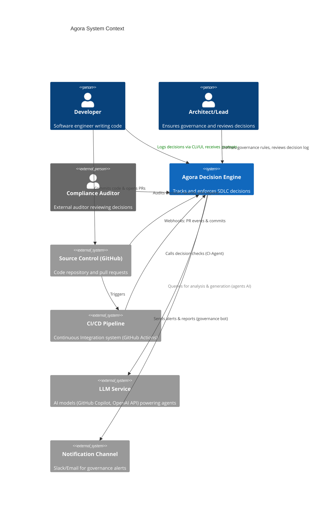
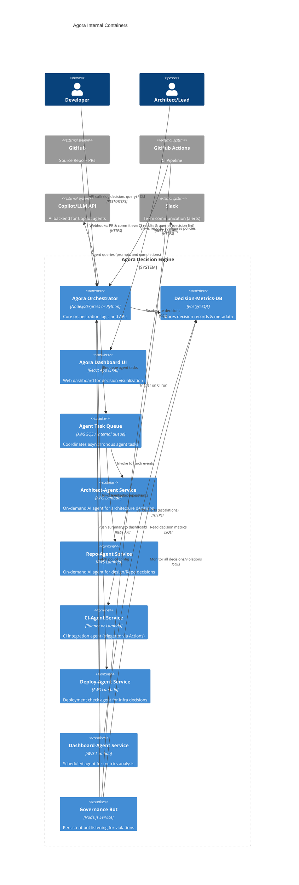
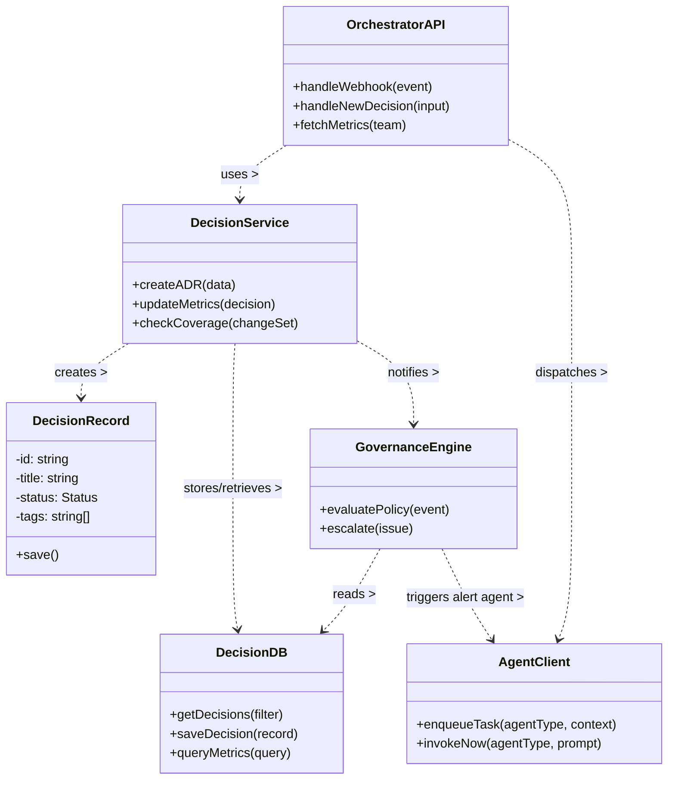
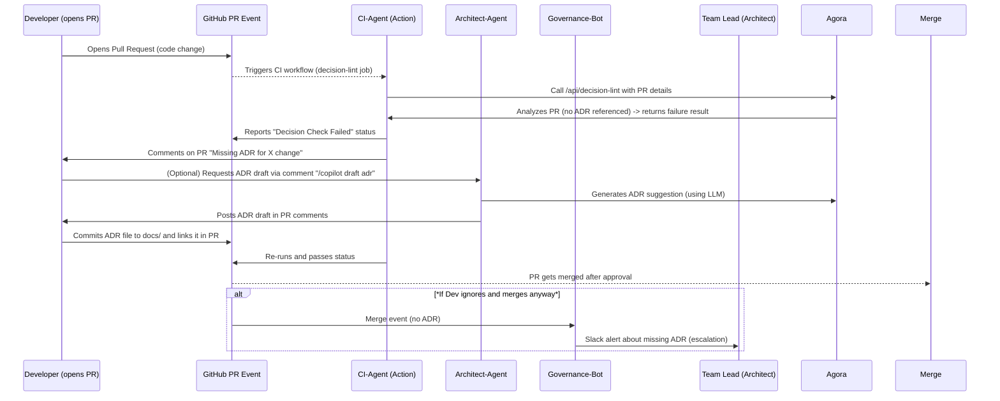

# Agora: AI-Powered Decision Tracking Engine

**Agora** is a modular AI-driven decision governance system spanning the entire SDLC, built using GitHub Copilot’s agentic capabilities. This document details the architecture, design decisions, multi-agent orchestration, and implementation roadmap for Agora.

## GitHub Copilot Agentic Mode (Overview & Orchestration)

GitHub Copilot **Agentic Mode** elevates Copilot from an autocomplete to a true AI teammate. In Agentic Mode, Copilot acts as an autonomous peer programmer capable of performing multi-step coding tasks at your command. It can analyze the entire codebase, read relevant files, propose code edits, run tests and commands, and iteratively correct errors until the task is completed. This mode uses an internal loop of planning and execution: determining relevant context, applying code changes or terminal commands, monitoring results, and refining its approach.

**Enabling Agentic Mode Locally:** Agentic Mode is accessible in VS Code (Insiders and now Stable) by opening the Copilot panel, selecting the _Agent_ mode, and entering a natural language prompt. Developers can ask high-level questions (“Explain the architecture?”) or issue directives (“Refactor this module”), and Copilot will autonomously carry out the request. Under the hood, Copilot’s agent uses a suite of tools to interface with the workspace – it can search project files, read file contents, compile or run the project, and even generate diagrams or documentation. All tool invocations and changes are transparently shown to the user, keeping the developer in control and able to intervene or undo as needed.

**Scaling via GitHub (Cloud Agent):** Beyond the editor, GitHub has introduced a _coding agent_ that runs in the cloud via GitHub Actions. By assigning a GitHub issue to “Copilot”, the agent spins up a secure VM, clones the repo, and starts working on the task in the background. It pushes commits to a draft pull request as it progresses, logging its reasoning and steps in an _agent session log_ for traceability. This cloud-based agent leverages GitHub’s infrastructure and Model Context Protocol (MCP) to pull in extra context (including external data or images) and can run in parallel with human teammates. Using the agent via GitHub allows teams to offload tedious tasks (like boilerplate coding, test generation, or dependency updates) to an AI assistant that works asynchronously and at scale. Crucially, output from the agent is treated like any other contribution – it respects branch protections and requires human review before merging, ensuring quality and safety.

**Multi-Agent Workflow Best Practices:** Orchestrating multiple AI agents requires clear role definition and coordination. Rather than one monolithic agent trying to do everything (or separate agents working in silos), it’s best to have specialized agents that collaborate towards a shared goal. Each agent should have a well-defined _scope_ (domain of responsibility) and _tools_ or permissions aligned to that scope. A central orchestrator or “driver” can manage task delegation – breaking complex objectives into sub-tasks for the appropriate agent. Agents can then pass results to each other or back to the orchestrator in a controlled workflow. Key best practices include:

- **Defined Scopes & Prompts:** Give each agent a distinct mission and persona (e.g. “architectural advisor”, “CI tester”) with tailored prompts/instructions so their outputs don’t conflict.
    
- **Shared Context & Memory:** Provide a common context or state (like a shared knowledge base or database of decisions) so agents work with consistent information. For example, an agent generating code should reference decisions made by the architecture agent.
    
- **Tool Orchestration:** Leverage tools and APIs to let agents perform actions (as Copilot does with file read/write, compile, etc.). Ensure agents can invoke these actions or request human approval when needed.
    
- **Iteration & Feedback:** Design agent workflows to be iterative. One agent’s output can be reviewed or verified by another (e.g. a test agent validating code written by a coding agent). Feedback loops catch errors early.
    
- **Monitoring & Safeguards:** Because autonomous agents can go off track, include oversight – whether via the orchestrator or governance policies (discussed later). Log each agent’s decisions and actions for transparency.
    

In summary, GitHub Copilot’s Agentic Mode provides the foundation for AI agents to perform complex development tasks autonomously. By combining multiple agents each focused on a part of the SDLC (design, coding, testing, deployment) and orchestrating them with clear workflows, Agora can automate decision capture and enforcement throughout the development lifecycle.

## Copilot Agent Definitions

Agora defines a team of specialized Copilot-based agents to cover each phase of the software lifecycle. Each agent has a specific **scope**, a tailored **prompt/persona**, and a lightweight **manifest** declaring its behavior and tools. The agents collaborate through an orchestrator and share access to a central decision log. Below is an overview of the key agents:

### **Architect-Agent**

**Scope:** High-level architecture and design decisions. The architect-agent ensures that any significant architectural choice (e.g. adopting a new framework, major module boundaries, scalability or security design) is documented as an Architecture Decision Record (ADR).

**Behavior:** It acts like an AI enterprise architect. When a new project or major feature begins, the architect-agent prompts the team to record the architecture decisions. It can draft ADR templates filled with context, options, and recommendations. It also monitors code merges for architecture-impacting changes (e.g. a new service added) and will nudge the team if an ADR is missing for that change.

**Prompt/Persona:** _“You are an Architecture Decision Assistant AI. Your goal is to help the team capture and evaluate architectural decisions. Propose an ADR when a significant design choice arises, including context, options considered, and rationale.”_ The agent’s prompt includes guidelines to reference prior ADRs for context and to output using our ADR template format.

**Manifest Structure:** Each agent is described by a YAML manifest (stored in `agents/`). For example, the **architect-agent** manifest might contain:

```yaml
name: architect-agent
description: >
  Guides and records high-level architectural decisions (architecture patterns, major tech choices, integrations).
trigger:
  on: 
    - "PR merge affecting architecture/* or infra/*"
    - "manual request from architect"
prompt: |
  You are an AI Architect Agent. Ensure any major architectural decision is documented as an ADR.
  When triggered, assist in creating or reviewing Architecture Decision Records.
tools:
  - search_code
  - read_file
  - open_issue # can open an issue or ADR draft in repo
memory:
  long_term: "architecture_adrs_index"   # reference to past ADRs for context
  short_term: 5  # keep last 5 interactions in memory
```

This illustrates the manifest fields: the agent’s role, when it triggers, its prompt, tools it can use, and memory settings. The architect-agent might use a `search_code` tool to scan for architectural keywords (e.g. “middleware”, “auth method”) in the codebase and ensure decisions about them exist, or an `open_issue` tool to create a draft ADR in the `docs/adr` directory.

**Interactions:** The architect-agent interacts primarily with the repository and the team:

- It may comment on PRs that introduce significant changes: e.g. _“Architecture change detected: consider recording a decision.”_
    
- It can generate an ADR markdown draft and open a pull request for the team to review.
    
- It works closely with the governance agent (described later) to flag missing or outdated architectural decisions.
    

### **Repo-Agent**

**Scope:** Codebase-level design decisions and repository structure. The repo-agent is concerned with day-to-day design decisions (below the architectural level) – for example, choosing a utility library, structuring modules, or refactoring approaches. It also oversees the repository layout (folders, module boundaries) and ensures they align with documented decisions.

**Behavior:** Acting as a code librarian, the repo-agent scans the repository for changes that might imply a design decision. If a developer introduces a new module or significant refactor, the repo-agent prompts to create a Design Decision Log (DDL). It maintains an index of the codebase structure and maps it to decisions (e.g., if there’s a DDL explaining the use of a specific design pattern in a module). If code is added that deviates from patterns without an accompanying decision, it alerts the team.

**Prompt/Persona:** _“You are a Repository Design agent. You ensure that code-level design decisions and the project structure are well-documented. When the codebase changes in a notable way (new directory, new design pattern, use of a new library), prompt for a DDL or update existing documentation.”_

**Manifest Highlights:**

```yaml
name: repo-agent
description: Tracks repository structure and code design decisions (module layout, design patterns, library usage).
trigger:
  on:
    - "git push on main"
    - "daily scan"
tools:
  - parse_repo_structure
  - diff_analysis
  - open_pr  # can open a PR to add/update DDL
memory:
  long_term: "design_knowledge_base"  # stores known design decisions and their locations
```

The repo-agent uses a `parse_repo_structure` tool to keep an updated map of the repository. It might run daily or on every merge, comparing the current structure to what was last recorded. If, say, a new `analytics/` directory appears without a corresponding decision entry about its purpose, the repo-agent would create a DDL placeholder or open an issue. It ensures the `docs/ddl` entries accurately reflect the actual code organization.

### **CI-Agent**

**Scope:** Continuous Integration – testing and quality gates related to decisions. The ci-agent’s job is to enforce decision governance during the build and test phase. It integrates with our CI pipeline (GitHub Actions workflow) to run “decision linting” and verification.

**Behavior:** During each pull request and nightly build, the ci-agent runs automated checks to ensure compliance with the decision governance framework. This includes:

- **Decision Linting:** Scanning commit messages, PR descriptions, and code diffs for references to decision IDs (like ADR or DDL numbers) and verifying that any required decisions exist for the changes. For example, if a PR adds a new database integration, the ci-agent will check that an ADR exists for “database choice” or similar.
    
- **Test & Coverage Checks:** It might also ensure that critical decisions (say, security-related ones) have corresponding tests or monitoring.
    
- **Failing Builds on Violations:** If the ci-agent finds a missing decision record for a significant change, it can fail the pipeline with a clear message (or at least flag a warning). For instance, _“CI Check: No ADR linked for introduced encryption module – please document this decision (ADR required).”_
    

**Prompt/Persona:** _“You are a CI Governance agent. During CI runs, verify that code changes align with documented decisions. If a required decision record is missing or tests don't cover a decision’s implications, flag an error.”_

**Manifest Highlights:**

```yaml
name: ci-agent
description: Checks decision coverage and policy compliance in CI/CD pipelines.
trigger:
  on: 
    - "github-actions: pull_request"
    - "github-actions: push"
tools:
  - read_diff
  - query_decision_db
  - post_comment  # to post results to PR
```

The ci-agent uses `read_diff` to understand what changed, and `query_decision_db` or direct lookups in `docs/` to verify relevant decisions. It doesn’t maintain long-term memory itself beyond the immediate build (the decision database serves as memory). Its output is primarily a pass/fail status and comments on the PR. By automating enforcement, it reduces the burden on reviewers to manually catch undocumented changes.

### **AWS-Deploy-Agent**

**Scope:** Deployment and infrastructure decisions. The aws-deploy-agent operates when we deploy Agora to the cloud (in our case, AWS). Its focus is on decisions related to infrastructure provisioning, configuration, and operational tweaks.

**Behavior:** This agent hooks into the deployment process (for example, as part of an Infrastructure-as-Code pipeline or as a post-deployment job). It ensures that any significant infrastructure or operations decision is logged. Examples:

- If we change the number of ECS tasks or switch from one AWS service to another, the agent checks for a decision log (maybe an ADR if it’s architecture-impacting like “Move to serverless”, or a DDL if it’s a smaller decision like “increase instance size for performance”).
    
- It can also observe runtime signals. For instance, if an operational change is made on the fly (scaling, feature toggles, etc.), it prompts to document why (creating an operations decision record).
    

**Prompt/Persona:** _“You are a Deployment agent overseeing cloud infrastructure decisions. When configuration changes or new infrastructure is deployed, ensure the reasoning is recorded. Suggest creating a record (ADR/DDL) for any infrastructure change (scaling, resource, security config) that isn’t already documented.”_

**Manifest Highlights:**

```yaml
name: aws-deploy-agent
description: Captures decisions related to AWS deployment, infrastructure, and operations.
trigger:
  on:
    - "deployment event"
    - "infrastructure code change (Terraform plan)"
tools:
  - parse_terraform_diff
  - cloud_monitor  # monitors AWS environment for changes
  - open_ticket    # create a ticket/ADR for tracking
```

For example, when a Terraform plan is applied, the agent could use `parse_terraform_diff` to see what infrastructure is changing and cross-reference if those changes are justified by an ADR (like “ADR-0007: Chose AWS Aurora DB for X”). If not, it would open a ticket or ADR draft. Similarly, if someone manually changes a setting in AWS, `cloud_monitor` could catch it and ask for documentation (this encourages all changes to go through code/ADR).

**Interactions:** The aws-deploy-agent might integrate with our monitoring and Ops workflow (could send alerts in Slack or create GitHub issues). It ensures operational decisions (which are often overlooked in documentation) are not forgotten.

### **Dashboard-Agent**

**Scope:** Organizational insights and continuous improvement. The dashboard-agent is responsible for aggregating decision metadata and providing higher-level analysis to stakeholders. It powers the **Agora Dashboard** by analyzing trends: coverage, latency, drift, etc., and can proactively identify gaps or stale decisions.

**Behavior:** This agent runs on a schedule (say, nightly or weekly) to pull data from the `decision-metrics-db` and the decision repository. It generates reports or visualizations for the dashboard, such as:

- Which teams or projects have high or low decision coverage.
    
- Aging reports (e.g., “5 ADRs older than 2 years might need revisiting”).
    
- Drift detection (comparing code to decisions – e.g., an ADR says “use PostgreSQL” but code now uses something else, implying a drift).
    
- It can also highlight most active decision areas or outliers (like “UI team has many open decisions pending approval”).
    

**Prompt/Persona:** _“You are a Dashboard Analysis agent. Compile and analyze decision records and project data to derive insights about decision-making health. Present summaries that management can use to improve governance.”_

**Manifest Highlights:**

```yaml
name: dashboard-agent
description: Analyzes decision logs and metrics to provide insights (coverage, drift, aging).
trigger:
  on:
    - "schedule: daily"
    - "manual request"
tools:
  - query_decision_db
  - send_dashboard_update  # pushes data to dashboard backend
  - natural_language_summary  # uses LLM to summarize patterns
memory:
  short_term: 1  # (stateless per run, but relies on decision DB as memory)
```

The dashboard-agent might use an LLM to generate a written summary of the state of decision governance each week (e.g., “This week, 3 new ADRs were added, decision coverage is 95%, one decision is past due for review.”). It then supplies this to the dashboard or emails it to interested parties. It effectively dogfoods the AI’s analytic capabilities on our own meta-process.

### **Governance (Governance-Bot)**

**Scope:** Global oversight of the decision process – effectively the “chief” agent that enforces the rules and escalates as necessary. The governance agent (or bot) works across all stages, making sure the entire SDLC adheres to the decision governance framework.

**Behavior:** The governance bot can be seen as the fusion of the others when it comes to enforcement:

- It sets the policies (e.g., “All major changes must have an ADR”; “Any code merged without a linked decision triggers an alert”).
    
- It receives signals from other agents (architect, repo, ci, deploy, dashboard) about non-compliance or potential issues.
    
- It handles **alerts and escalation**: for example, if the ci-agent reports a missing ADR and it’s ignored (e.g., overridden to merge anyway), the governance bot might notify an architect or team lead via chat or email.
    
- It maintains an overall status of decision hygiene for each team/project and can nudge periodically if certain metrics drop (like coverage falls below a threshold).
    

**Prompt/Persona:** _“You are a Governance AI overseeing the software development process to ensure all important decisions are documented and respected. You enforce rules, remind developers of obligations, and escalate persistent issues to leadership.”_

**Manifest Highlights:**

```yaml
name: governance-agent
description: Central governance enforcer that listens to other agents and ensures compliance.
trigger:
  on:
    - "signal: rule_violation"
    - "schedule: weekly audit"
tools:
  - send_slack_message
  - create_github_issue
  - compile_report
memory:
  long_term: "violation_history"
```

For example, if after a sprint the dashboard-agent notes a high number of decisions with status “Pending” for too long, the governance-agent will compile a report and perhaps create a GitHub issue assigned to the relevant team’s manager to address the backlog. If a particular team repeatedly merges code without required decisions, the governance bot might escalate to an engineering director with a summary (violation history).

**Interactions:** The governance agent communicates with humans more than the others – via organizational channels (Slack, email, Jira, etc.). It effectively closes the loop, ensuring that any lapses in the process are visible and addressed.

**Summary of Agent Manifests:** All agents share a common manifest structure and reside in the `agents/` directory. Each manifest defines:

- **Identity:** Name and description (role).
    
- **Triggers:** When the agent activates (events or schedules).
    
- **Prompt:** The base instructions for its AI behavior.
    
- **Tools:** A whitelist of actions it can perform (search, file access, notifications, etc.).
    
- **Memory/State:** How it retains context (most use long-term context via the shared decision logs; short-term memory for conversation is minimal outside the IDE context).
    
- **Interactions:** (Implicit) which other agents or humans it communicates with.
    

These manifests also serve as documentation for how AI is integrated into our process, and can be tuned as we refine each agent’s performance.

## C4 Architecture Diagrams (Agora System)

The Agora system is documented using the C4 model diagrams in Mermaid format. We provide Level 1 (Context), Level 2 (Container), Level 3 (Component), and Level 4 (Code-level) views of the architecture.

### C4 Level 1: System Context

This diagram shows Agora in relation to its users and external systems (development tools and platforms):



In the context diagram above, **Agora** is the central system (in scope) and is connected to:

- **Developers** (internal users) who interact with it by logging decisions and receiving guidance.
    
- **Architects/Leads** (internal) who configure governance and review outputs.
    
- **Auditors** or other external stakeholders who view decision archives (read-only).
    
- External systems: the **Source Control (GitHub)** which provides code events (pushes, pull requests) to Agora; the **CI/CD pipeline** which integrates with Agora to enforce checks; the **LLM Service** (Copilot/LLM API) which Agora’s agents use for intelligence; and **Notification channels** (like Slack or email) where Agora sends governance alerts.
    

### C4 Level 2: Container Diagram

This diagram expands Agora into its internal containers/microservices and how they interface with each other and external components:



**Explanation:** Inside the **Agora boundary**, the main components are:

- **Orchestrator (App)**: The central web service that exposes APIs (for the UI, CLI, and integrations) and coordinates everything. It receives webhooks from GitHub, calls into the agent queue, and interfaces with the DB. It is deployed on AWS ECS (Fargate container) for always-on availability.
    
- **Decision-Metrics-DB (Database)**: A relational database storing all ADRs/DDLs (or their metadata), decision statuses, and metrics. For instance, when an ADR markdown is added in the repo, the orchestrator parses key fields into this DB. The DB also tracks relationships (which code modules or requirements each decision relates to).
    
- **Dashboard UI (Web)**: A front-end single-page application (could be hosted on S3/CloudFront or served via the orchestrator) that allows users to visualize decision data (graphs, lists of ADRs, etc.) and manage the governance settings. It calls the orchestrator’s APIs to fetch data.
    
- **Agent Task Queue**: A lightweight queue system (could be AWS SQS or an internal job scheduler). When events occur that require AI agent processing, tasks are queued here. For example, a “new PR opened” event might enqueue tasks for the architect-agent (to check if an ADR is needed) and the ci-agent (for pre-merge checks).
    
- **Agent Services (Lambda functions)**: Each specialized agent (architect, repo, CI, deploy, dashboard) runs as a serverless function or ephemeral service. They pick up tasks from the queue or triggers from CI:
    
    - The _Architect-Agent_ Lambda will run the logic defined in its manifest: load context (e.g., relevant code or docs), call the LLM (via the Copilot/LLM API) with the architect prompt, then perhaps commit an ADR or comment on a PR.
        
    - The _Repo-Agent_ Lambda similarly triggers on repo scans or daily schedules.
        
    - The _CI-Agent_ might be implemented as a script running in GitHub Actions (represented here as an external to the boundary calling the orchestrator) **or** as a Lambda invoked by a GitHub Actions webhook. In either case, it performs checks and reports back.
        
    - The _Deploy-Agent_ Lambda triggers when deployment events happen (maybe via CodePipeline or a Terraform Cloud webhook) and uses the LLM to analyze infra changes.
        
    - The _Dashboard-Agent_ Lambda runs on a schedule to update metrics and summaries.
        
- **Governance Bot (Governor)**: This is a continuously running component (could be another service on ECS or a lightweight process) that subscribes to all the agent outputs and database changes. It enforces global rules. For instance, the orchestrator or agents will emit events like “ADR missing” or “Policy X violated” into perhaps an internal topic that the governance service listens to. The governance bot then takes action (e.g., send a Slack message to the team lead if a violation persists). It also provides an interface for admins to adjust governance rules (it could read config from the DB or a config file).
    

External interactions:

- Developers interact with Agora either through a CLI (perhaps to create a new ADR from their terminal) or via the Dashboard UI. In either case they hit the orchestrator’s API.
    
- GitHub (source control) sends webhooks to the orchestrator for events like PR opened, merged, or issue comments (if the governance bot uses issues for nudges).
    
- GitHub Actions (CI) communicates with Agora: e.g., the CI pipeline might call an API endpoint on orchestrator (or directly invoke the ci-agent lambda) to run decision lint checks, and orchestrator returns pass/fail.
    
- The LLM service (Copilot backend or OpenAI API) is used by all agent services to fulfill tasks that require natural language understanding or generation (like analyzing code or writing text for ADRs). For example, when the architect-agent is composing an ADR, it sends a prompt to GPT-4 via this service.
    
- Slack/Email is used by the governance bot to send notifications to humans. For instance, an escalation about a missing ADR might result in a Slack message to the #architecture channel.
    

### C4 Level 3: Component Diagram (Internals of Orchestrator)

We zoom into the **Agora Orchestrator** container to show its internal components and how it interacts with the database and external systems. The orchestrator is structured into modules each handling a part of the logic:

```mermaid
%% C4 Component Diagram: Agora Orchestrator Internal Structure
C4Component
title Agora Orchestrator - Internal Components
Container_Boundary(app, "Agora Orchestrator Service") {
  Component(api, "API Controller", "REST API Endpoints", "Handles incoming HTTP requests (UI, CLI, webhooks)")
  Component(worker, "Agent Task Dispatcher", "Scheduling Module", "Queues and dispatches tasks to agents")
  Component(decisionSvc, "Decision Service", "Business Logic", "Manages ADR/DDLs, updates Decision DB")
  Component(policy, "Governance Policy Engine", "Business Logic", "Evaluates governance rules & triggers alerts")
  Component(parser, "ADR/DDL Parser", "Utility", "Parses Markdown decision files and updates DB")
}
Component_DB(db, "Decision-Metrics-DB", "PostgreSQL", "Stores decisions, metadata, and metrics")
Component(extGH, "GitHub Webhook Handler", "Integration", "Validates and parses GitHub events")
Component(extLLM, "LLM API Client", "Integration", "Communicates with Copilot/LLM service for AI tasks")
Component(extNotif, "Notification Client", "Integration", "Sends messages (Slack/Email)")

Rel(api, decisionSvc, "Invoke decision logic")
Rel(api, worker, "Enqueue agent tasks")
Rel(worker, extLLM, "Optionally invoke LLM (for sync tasks)", "HTTPS")
Rel(worker, db, "Record task status")
Rel(decisionSvc, parser, "Calls to parse markdown")
Rel(parser, db, "Update records", "SQL")
Rel(decisionSvc, db, "Read/write decisions", "SQL")
Rel(decisionSvc, policy, "Check policies on changes")
Rel(policy, extNotif, "Send alert (if violation)")
Rel(policy, db, "Log violations", "SQL")
Rel(extGH, api, "Webhook HTTP call", "POST /webhook")
Rel(api, extGH, "Valid events forwarded to internal handling")
Rel(api, extNotif, "Ack/nack via GitHub API (e.g., add PR comment)")
```

**Notes on Components:** Within the orchestrator:

- **API Controller**: defines routes like `/decisions` (to list or add ADRs), `/webhook` (to receive GitHub events), `/metrics` (for dashboard data), etc. It authenticates requests (ensuring internal webhooks or authorized users only).
    
- **Agent Task Dispatcher**: when the API or some event demands an agent’s involvement, this module formats the task (context, prompt) and places it on the queue (or directly triggers the Lambda via AWS SDK). E.g., on a `PR opened` webhook, the dispatcher might queue a “arch-review” task for architect-agent.
    
- **Decision Service**: encapsulates business logic for creating or updating decisions. If a new ADR is submitted (either by a human via UI or by the architect-agent draft), this service validates it, assigns an ID, and saves it (both to the Git repo as a markdown file if needed and to the DB for metadata). It also computes metrics (like updating coverage stats).
    
- **Governance Policy Engine**: enforces global rules. For example, after a decision is added or a PR event processed, this component checks conditions: Are there any pending decisions that should block deployment? Did someone merge without approval? It leverages the data in the DB and triggers the notification client to alert if necessary. It might also annotate PRs via the GitHub API (for instance, labeling a PR as “Needs ADR”).
    
- **ADR/DDL Parser**: a helper that can parse markdown files in `docs/adr` or `docs/ddl`. When the repository changes (e.g., someone manually edits an ADR file), the orchestrator (via webhook or a scheduled job) uses this parser to sync changes into the DB. It ensures the DB reflects the source of truth in the markdown.
    
- **External Integration Components**:
    
    - _GitHub Webhook Handler_: Technically part of the API component but shown separately for clarity, it deals with verifying the webhook signature, extracting event details (like PR title, files changed, etc.), and then calling the appropriate internal logic (e.g., decision service or dispatch tasks).
        
    - _LLM API Client_: Used by orchestrator if some AI processing is done synchronously. For instance, if a user requests via the UI to “suggest decision options,” the orchestrator might call the LLM API directly. Most heavy AI work is offloaded to agent lambdas, but this client is available.
        
    - _Notification Client_: Handles formatting and sending messages to Slack or email via webhooks or SMTP. The governance engine uses it to escalate issues.
        

This component breakdown shows how the orchestrator handles the core coordination, while the actual AI heavy-lifting (analysis, content generation) is done by the separate agent services.

### C4 Level 4: Code-Level Model

At Level 4, the actual code and classes implement the above components. Rather than drawing every class, we illustrate with a simplified UML class diagram focusing on the interactions between a few key classes:



**Explanation:**

- **OrchestratorAPI** corresponds to controller routes (e.g., `handleWebhook` called when GitHub sends an event, which then might call `DecisionService.checkCoverage` or `AgentClient.enqueueTask` for an agent).
    
- **DecisionService** contains the logic for creating or updating decisions and computing metrics. It uses the **DecisionRecord** model (which might map to a row in the DB or a markdown file) and the **DecisionDB** repository to persist or query data. It also can call **GovernanceEngine** to inform it when something noteworthy happens (e.g., a decision was created or a violation found).
    
- **GovernanceEngine** implements policies; it might on initialization load rules from a config. Its `evaluatePolicy(event)` is called on certain triggers (like before a deployment or after a PR merge) to see if everything is compliant. If not, it uses **AgentClient** to maybe trigger a notification agent or directly uses an API to send messages (abstracted behind AgentClient or Notification client).
    
- **AgentClient** is a utility that knows how to communicate with the external agent services. For example, `enqueueTask(agentType)` might send a message to SQS or call a Lambda Invoke API with the given context and prompt. In tests or local mode, this might simply call a stubbed agent function.
    
- The **DecisionDB** is a wrapper for database operations (in a real project, this could be an ORM or DAO layer).
    

The code-level diagram is illustrative – actual implementation will have more classes (for controllers, models, etc.), but the key point is that the structure supports separation of concerns: API handling, decision logic, governance checks, agent communication, and persistence. This level ensures that the higher-level architecture (C4 levels 1-3) is realized in code.

## Architecture & Design Decisions (ADRs and DDLs)

To ensure the system’s design is well-governed from the start, we maintain **Architecture Decision Records (ADRs)** for high-level decisions and **Design Decision Logs (DDLs)** for lower-level or tactical decisions. All of Agora’s significant decisions are captured in markdown files under `docs/adr/` (for ADRs) and `docs/ddl/` (for DDLs), following established templates. Below is a curated list of initial decisions made for the Agora project:

### Key Architectural Decision Records (ADRs):

1. **ADR-0001: Adopt Architectural Decision Records** – _Decision:_ We will use MADR (Markdown ADR) templates to document important architecture decisions from project inception. _Rationale:_ Improves communication and traceability of decisions across the team. All ADRs will be stored in version control for transparency and historical reference.
    
2. **ADR-0002: Copilot Agentic Orchestration** – _Decision:_ Leverage GitHub Copilot’s Agentic Mode to implement an AI-driven development workflow. We will orchestrate multiple Copilot-based agents (as described in this document) to automate decision capture and enforcement. _Rationale:_ This approach allows us to encode governance directly into the development process with AI assistance, increasing automation and consistency.
    
3. **ADR-0003: Cloud Platform – AWS** – _Decision:_ Deploy Agora on **AWS Cloud** using a hybrid container/serverless architecture (ECS + Lambda). _Rationale:_ AWS provides managed services (Fargate, Lambda, RDS) that align with our modular agent design and scale requirements. The team’s familiarity with AWS and infrastructure-as-code support influenced this choice.
    
4. **ADR-0004: Infrastructure as Code with Terraform** – _Decision:_ Use Terraform for provisioning AWS resources (with AWS CDK for higher-level constructs as needed). _Rationale:_ IaC ensures our infrastructure decisions are versioned and reproducible. Terraform’s state and plan allow the deploy-agent to detect infra changes easily. It also integrates well in CI for automated deployments.
    
5. **ADR-0005: Monorepo Project Structure** – _Decision:_ Use a single repository (monorepo) for Agora containing all modules: agents, backend, frontend, and docs. _Rationale:_ A monorepo simplifies cross-cutting changes (e.g., updating an ADR template alongside agent code) and centralizes decision records with code. Our project is small enough that a monorepo is manageable, and we can use directory structure to separate concerns.
    
6. **ADR-0006: Decision Record Storage** – _Decision:_ Store canonical decision records as Markdown in the `docs/` directory, but also maintain a relational database for querying decision metadata. _Rationale:_ Markdown is human-friendly and works with Git versioning, but a database enables efficient querying for the dashboard (e.g., count decisions by status). We will implement a sync between the two.
    
7. **ADR-0007: Use of ADR & DDL Templates** – _Decision:_ Establish standard templates for ADRs and DDLs (in `templates/` folder). ADR template includes sections: Context, Decision, Status, Consequences (based on MADR format). DDL template is a lighter-weight variant for design logs. _Rationale:_ Consistency in documentation ensures clarity and eases parsing by tools.
    

_(ADR-0001 and ADR-0002 are foundational: ADR-0001 commits us to this whole decision governance approach, and ADR-0002 sets the tone for using AI/agents in the implementation. The others (ADR-0003 onward) are specific technical choices for building Agora.)_

### Key Design Decision Logs (DDLs):

1. **DDL-0001: Repository Layout and Naming** – We decided on a clear directory structure:
    
    - `agents/` for agent manifests and code,
        
    - `docs/adr/` and `docs/ddl/` for decision records,
        
    - `templates/` for ADR/DDL templates,
        
    - `infra/` for infrastructure code (Docker, Terraform),
        
    - `src/` (or separate `backend/`, `frontend/`) for application code,
        
    - `.github/workflows/` for CI pipelines.  
        _Rationale:_ This layout makes it straightforward to enforce governance (agents know where to find decisions and manifests). It also mirrors common conventions (e.g., docs folder) for familiarity.
        
2. **DDL-0002: Agent Manifest Format (YAML)** – We chose YAML for defining agent configurations (as opposed to JSON or code-based definitions). _Rationale:_ YAML is human-readable and allows comments, making it easy for architects to tweak agent settings without coding. JSON was considered (for direct use with some libraries), but YAML’s readability in the repo (and native support in many tools) won out.
    
3. **DDL-0003: Technology Stack for Dashboard** – The dashboard front-end will be built with React and TypeScript (possibly using an off-the-shelf admin template for speed). The backend orchestrator uses Node.js with Express (or Fastify) for the API. _Rationale:_ The team is proficient in these, and they integrate well with GitHub and AWS (Node for Lambda, etc.). React for the dashboard ensures a dynamic UI for charts and is supported by our static site deployment approach.
    
4. **DDL-0004: Decision ID Convention** – Format decision record filenames as `ADR-xxxx-title.md` and `DDL-xxxx-title.md` with zero-padded IDs (e.g., ADR-0005-use-aws.md). Within each file, include an “ID” and “Status” field. _Rationale:_ Consistent naming helps the repo-agent and parser. Zero-padding ensures proper lexicographical sorting. Status field (proposed/approved/superseded) helps governance agent know if a decision is active.
    
5. **DDL-0005: CI Workflow - Decision Lint** – Implement a custom GitHub Actions job called **decision-lint** in the CI pipeline. It runs a script (or uses the ci-agent) to parse the PR’s diff for any indicators that a decision is needed (new files in certain directories, specific keywords, or missing decision links). If a potential missing decision is found, the job will fail and output a friendly message guiding the developer on how to proceed (e.g., link to contributing guidelines for decisions). _Rationale:_ Automating this via CI prevents oversight and keeps feedback immediate (developer is alerted before code review).
    
6. **DDL-0006: Security & Permissions** – The agents running in automation (CI, deploy) will operate with read-only access to the repository by default, except the architect-agent which may need write access to commit ADRs. We will use a GitHub App or bot account for agents to raise PRs, with limited scope. _Rationale:_ Principle of least privilege – agents should not arbitrarily modify code unless intended (the architect-agent’s ADR commits will be in docs only). Using a bot account keeps a clear audit trail separate from human users.
    

_(Additional DDLs will cover things like how we configure the LLM API, how we tag decisions with metadata, etc., as those details emerge. We also have generic templates and examples in `templates/` for how to write an ADR or DDL.)_

All ADRs are stored in `docs/adr/` and all DDLs in `docs/ddl/`. Each file has front-matter or headings that include at least: **Title**, **Status**, **Context**, **Decision**, **Consequences** (for ADR) or similar for DDL. We maintain a `README.md` in each of those directories listing all records with links for easy navigation.

We also maintain reusable templates in the `templates/` directory, e.g. `templates/adr-template.md` and `templates/ddl-template.md`, so contributors can easily copy them when writing a new decision. These templates follow known best practices but are tailored to include fields needed by Agora (like tags for which team or subsystem the decision affects, to drive the dashboard metrics).

**Project Repository Structure:** To summarize, here is the planned structure of the repository:

```plaintext
agora-project/
├── agents/
│   ├── architect-agent.yaml
│   ├── repo-agent.yaml
│   ├── ci-agent.yaml
│   ├── aws-deploy-agent.yaml
│   ├── dashboard-agent.yaml
│   └── governance-agent.yaml
├── docs/
│   ├── adr/
│   │   ├── ADR-0001-adopt-adrs.md
│   │   ├── ADR-0002-copilot-agentic-mode.md
│   │   └── ... 
│   └── ddl/
│       ├── DDL-0001-repo-layout.md
│       ├── DDL-0002-agent-manifest-format.md
│       └── ... 
├── templates/
│   ├── adr-template.md
│   └── ddl-template.md
├── src/  (or /backend and /frontend/)
│   ├── orchestrator/ (API and server code)
│   └── dashboard-ui/ (React app code)
├── infra/
│   ├── docker-compose.yaml (local dev setup)
│   ├── Dockerfile (for orchestrator)
│   ├── terraform/ (Terraform IaC files)
│   └── cdk/ (if using AWS CDK for some parts)
└── .github/
    └── workflows/
        ├── ci.yml (build & test pipeline)
        ├── decision-lint.yml (governance checks pipeline)
        └── deploy.yml (CD pipeline to AWS)
```

This structure delineates clearly where each piece resides. _Docs_ holds the decisions (which the system itself will consume). _Agents_ holds configuration for our AI agents. _Infra_ defines how we deploy. _Workflows_ contain CI/CD pipelines, including our decision-linting.

## Chronological Build Plan

We plan to implement Agora in six phases, progressively increasing functionality and integration. Each phase produces a usable increment of the system:

1. **Phase 1 – Local Agent Prototype:** _Goal:_ Prove out the concept of an AI agent assisting with decisions on a local environment. In this phase, we develop a simple prototype of the architect-agent running locally (perhaps as a CLI script) that can read a project’s files and suggest an ADR. We enable Copilot’s agent mode in VS Code for our developers and have it generate some initial code (dogfooding right away). We also establish the ADR/DDL template and create ADR-0001 and ADR-0002 to formalize our approach. This phase includes setting up a local Docker Compose with a minimal PostgreSQL database and a basic Node/Python script that can call an LLM (mocking Copilot) to simulate an agent loop. Success criteria: We can invoke a command (or VS Code Copilot) on a sample project and get an architecture diagram or ADR suggestion, demonstrating the potential.
    
2. **Phase 2 – Orchestrator & Core Services:** _Goal:_ Build the core **Agora Orchestrator** service and the basic decision tracking functionality. We implement the orchestrator API (initially just local without cloud) with endpoints to submit decisions and query them. We integrate GitHub webhooks locally (using a tunnel or simulator) to ensure we can receive events. The database schema for decisions and a basic DecisionService is created. During this phase, we also formalize agent manifests and perhaps build a simple orchestrator that can read `agents/*.yaml` to know what to do on an event. The agent tasks might be stubbed or run synchronously for now. We also implement a first cut of the governance policy engine (maybe just logging violations). Basic ADR and DDL creation via the API or CLI is enabled. By end of Phase 2, the system can accept a manual trigger (like a CLI call or HTTP request) to record a decision and store it, and it can respond to a simulated PR event by logging something (e.g., “PR received – no missing decisions detected” or a warning).
    
3. **Phase 3 – Dashboard & UI:** _Goal:_ Create the **Agora Dashboard** front-end and integrate it with the orchestrator. We develop the React app (or use Quartz/Obsidian for docs browsing combined with a small webapp for metrics) to display decision records and metrics. The dashboard will show lists of ADRs/DDLs from the docs (pulling via the orchestrator’s API from the DB). We implement visualization of key metrics (initially, coverage could be a simple count of decisions vs. code modules; aging could be a list of oldest open decisions). We ensure the orchestrator has an endpoint to provide these metrics (populated with dummy data if necessary). Also in this phase, we flesh out the **decision ingestion**: a background process or trigger so that when markdown files in `docs/` change, we update the DB (this could be a simple file read in this phase, assuming local filesystem). By the end of Phase 3, stakeholders (e.g., an architect or engineering manager) can open a local web UI and see the current state of decisions, fulfilling part of the transparency goal.
    
4. **Phase 4 – Toolchain Integration:** _Goal:_ Integrate Agora with development workflow tools – source control, CI, and possibly chat. We set up real GitHub webhooks (or if local, use a test GitHub repo) such that opening a PR triggers the orchestrator’s webhook endpoint. Implement the **ci-agent** in the pipeline: in GitHub Actions, add a job that calls Agora’s API to run decision-lint checks (or run a script container that uses `agents/ci-agent.yaml` logic). We also integrate the **repo-agent** to run daily via a scheduled GitHub Action or a cron job (which calls an endpoint on orchestrator to trigger repo scan). The **aws-deploy-agent** might not fully apply until we do cloud deployment, but we plan its integration by hooking into Terraform apply (e.g., after Phase 5). In this phase we also introduce the governance bot’s notifications: e.g., configure a Slack webhook and have Agora send a test message when a rule is violated (for now, perhaps trigger a violation manually to test). By end of Phase 4, the system is hooked into the dev cycle: when a developer makes a PR, the CI will call Agora, which will run checks (even if simplistic) and report back in the PR (e.g., “Decision check passed” or “Please link an ADR”). Likewise, if we simulate a merge without ADR, the governance bot would log it.
    
5. **Phase 5 – Governance Bot & Policy Enforcement:** _Goal:_ Strengthen the governance loop with real rules and escalation. Here we fully implement the **governance-agent** logic. We define concrete policies (e.g., “ADR must be approved by an architect for certain tags” or “No high-severity lint errors”) and encode them in the policy engine. The governance bot service will start running continuously (perhaps as a separate process or as part of orchestrator) and listening for events (maybe just polling the DB or receiving webhooks from the app when something happens). We set up real alert channels (Slack, email) and test scenarios: e.g., deliberately merge a PR without an ADR and see that within a few minutes an alert is sent to the architect’s Slack. We also implement escalation tiers: for instance, governance bot sends a direct message to a dev first (nudge), but if 24 hours pass without resolution, it emails the team lead (escalation). This phase likely involves a lot of tuning the signals to reduce noise – we’ll use test data to ensure it only alerts for actual issues. By end of Phase 5, Agora will effectively “guard” the process: it will catch misses and ping the right people, embodying the SDLC-wide governance.
    
6. **Phase 6 – Production Deployment on AWS:** _Goal:_ Deploy the fully functional Agora system to AWS and integrate with a real project (or our project itself). We will dockerize the orchestrator and use **Docker Compose** for local dev consistency. Then write Terraform scripts to provision:
    
    - An ECS Fargate service for the orchestrator API (behind an Application Load Balancer or API Gateway).
        
    - AWS RDS (PostgreSQL) for the decision-metrics database.
        
    - Lambda functions for each agent (architect, repo, deploy, dashboard) – possibly using AWS Lambda container images or simple Python functions that we deploy. Alternatively, some agents (like ci-agent) might remain as part of GH Actions rather than AWS.
        
    - S3 + CloudFront for the static dashboard files (if we deploy the React app separately).
        
    - Necessary IAM roles, secrets (for the LLM API keys, etc.), and an Amazon EventBridge or SQS for the task queue.
        
    - Monitoring: CloudWatch alerts for any Lambda errors or orchestrator downtime (so the governance of decisions doesn’t silently fail).
        
    
    We then set up GitHub Actions workflows (`deploy.yml`) to automate deployments: e.g., on a push to main or a version tag, build Docker images, push to ECR, run Terraform to apply changes (possibly requiring manual approval for production).
    
    After deployment, we will test the end-to-end flow in a real environment: simulate a repo (possibly our own Agora repo or a sample project repo) integrated with the live Agora instance via webhooks. We’ll confirm decisions flow from being created in the web UI to the DB, and alerts flow to Slack, etc. Phase 6 culminates in a demo of Agora being used by a sample team in a realistic setting, and the system running reliably in the cloud.
    

Throughout all phases, we’ll use an agile approach: each phase’s deliverables will be documented (with ADRs updated as needed). Notably, we’ll produce ADRs/DDL for any changes in direction discovered during implementation.

## Development & Deployment Strategy

We outline both the local development setup for Agora and the cloud deployment architecture, as well as continuous integration/continuous deployment (CI/CD) practices.

### Local Development Environment (Docker Compose)

For local development and testing, we use **Docker Compose** to simulate the key parts of Agora:

- **PostgreSQL** container for the decision-metrics database (with seed data or a schema initialization script).
    
- **Orchestrator API** container running the Node/Python server.
    
- Optionally, a container running a lightweight **agent runner** that can simulate the Lambda agents. For instance, we might have a single container that runs a process pulling from an SQS queue (local equivalent) and executing agent tasks (using OpenAI API keys configured via env variables). This way, when working locally, developers can trigger agents without deploying to AWS.
    
- **Dashboard UI** can be served via a development server (e.g., `npm start` for React) on the host, or we can dockerize it as well for consistency.
    

We also run **Copilot in VS Code locally** for developers as they work on Agora, effectively using Copilot to assist in writing Agora itself (part of our dogfooding). The Docker Compose environment will include volumes mapping the `docs/` folder so that if a developer edits an ADR in VS Code, the orchestrator container can see it (for parser testing).

To simulate the agent loop, we might include a simple script that reads the agent manifests and performs a cycle (without actual LLM calls, or using a stubbed LLM response). This is mainly for integration testing the interactions between orchestrator and queue/agents in a self-contained way.

**Testing & Debugging:** With Compose, we can bring the whole stack up on localhost. Developers can then:

- Run unit tests for orchestrator logic (with a test DB).
    
- Hit the API endpoints via curl or Postman.
    
- Manually place a message on the local queue to see an agent react.
    
- Use logs from each container to debug the flow.
    

The local environment will have configuration for development mode (e.g., verbose logging, dummy secrets). We also ensure that decisions made during tests (in docs or DB) are separated from production data (maybe using a different S3 bucket or local folder).

### Cloud Deployment (AWS Infrastructure)

For production (and staging), we deploy on AWS to take advantage of cloud scalability and integration:

- **ECS/Fargate:** The core orchestrator runs here as a long-running service, ensuring high availability. We containerize it and configure it behind an Application Load Balancer (for HTTPS endpoints). ECS allows easy scaling if needed (though the load on orchestrator should be light).
    
- **Lambda Functions:** Each agent is packaged as a function. We likely use a single Lambda per agent type, invoked with different payloads. For example, an EventBridge rule might trigger the repo-agent lambda daily, the CI pipeline triggers the ci-agent lambda on demand, etc. These Lambdas will contain the agent logic and use the LLM API (with appropriate timeout settings). They might run inside our VPC if they need DB access, or through a NAT if needed.
    
- **API Gateway (or ALB):** We use API Gateway for external endpoints if we want a unified domain for all interactions (especially for webhooks or CLI access outside the VPC). Alternatively, the ALB can directly route GitHub webhooks to ECS – API Gateway is likely cleaner for handling webhook authentication, etc.
    
- **Database:** Amazon RDS (PostgreSQL) is used for the decision-metrics-db. We will set up daily backups and enable encryption at rest, given it might contain sensitive historical decisions. The DB is in a private subnet with the orchestrator accessible to it. Lambdas that need DB (like dashboard-agent or governance) will either be in the same VPC or will use an API provided by orchestrator to query (to avoid too many direct DB connections).
    
- **Storage for Decision Files:** We have a decision to make: either treat the Git repo as the source of truth (in which case, the orchestrator must pull from GitHub to read markdown files), or store a copy in an S3 bucket. Initially, we rely on the GitHub repo itself (since ADRs are text, we can use the GitHub API to fetch raw files, or have the webhook send file diffs). But to improve independence, we might push a copy to S3 or just rely on our DB. For now, the plan is to use GitHub as the store (with the DB for queries). If performance becomes an issue, we’ll revisit storing parsed content in S3 or the DB.
    
- **Networking & Security:** We will set up security groups such that only the ALB/API Gateway can call the ECS service, and Lambdas can access the DB, etc. GitHub webhooks will hit a public endpoint on API Gateway. Secrets (like LLM API keys, database passwords, Slack webhook URLs) will be stored in AWS Secrets Manager or SSM Parameter Store and injected into the ECS task and Lambdas at runtime. IAM roles will be assigned to Lambdas to limit their permissions (e.g., a lambda might have permission to write to an SQS queue or read a specific S3, nothing more).
    
- **IaC Deployment:** Everything above (ECS cluster, task definition, ALB, Lambdas, S3, DB, IAM, etc.) will be defined in code (Terraform scripts in the `infra/terraform/` directory, possibly broken into modules). We can use Terraform Cloud or run it via GitHub Actions. AWS CDK could be used for more complex logic (maybe constructing Lambdas easily), but we might stick to Terraform for consistency with team skillset (as per ADR).
    
- **Monitoring & Logging:** Use CloudWatch Logs for ECS and Lambda logs. Set up CloudWatch Alarms for any Lambda function errors or ECS task failures. These alarms can notify us (the development team) so we can respond to any agent malfunction. Since Agora itself helps governance, we want it to be reliable.
    

### CI/CD Pipeline (GitHub Actions)

Our CI/CD strategy leverages GitHub Actions workflows:

- **Build & Test (ci.yml):** On each push or PR, we run linting and tests for all components. This includes running unit tests for the orchestrator and any agent logic (where feasible, perhaps using local mocks for LLM). We also validate the integrity of docs (e.g., check that any new ADR has a unique ID and is referenced properly). If tests pass, we might build the Docker images and perhaps run an integration test (using docker-compose in CI to spin up and test a minimal environment).
    
- **Decision Linting (decision-lint.yml):** This workflow specifically enforces our governance during PRs. It might be triggered as a separate status check. It runs the ci-agent logic. Implementation-wise, we can have a small script in the repo (like `scripts/decision_lint.py`) that the workflow runs. This script loads the agent manifests or calls the orchestrator (if running in a staging environment) to evaluate the PR. For early development, the script can directly parse the diff for obvious patterns (like “ADR-” strings, or new files in certain directories requiring ADR). This workflow will post a comment on the PR with the results (using the `actions/github-script` or an API call).
    
- **Preview Deployments:** For significant UI changes or to test integration, we may set up ephemeral preview environments. For instance, when a PR is opened, we could deploy the orchestrator and UI to a temporary environment (perhaps using a separate Terraform workspace or a lighter-weight method like a Docker container on a ephemeral VM). However, given the complexity, we might instead use a staging environment branch. Simpler: we will maintain a **`develop` branch** that auto-deploys to a staging AWS stack. That serves as our preview. Then merging to `main` deploys to production. This is a common practice and avoids the overhead of per-PR environments.
    
- **Deployment (deploy.yml):** On main branch pushes (or tagged releases), this workflow builds the Docker images, pushes to Amazon ECR, and then runs Terraform (or CDK) to apply the latest infrastructure. We will configure GitHub Actions with OIDC authentication to AWS (so we don’t need long-lived AWS keys). The deployment job might have manual approval if deploying to production.
    
- **Governance Checks in CI:** We treat our CI as another place to enforce decision governance. For instance, we can incorporate a job that scans the repository for any TODOs or “tactical decisions” that lack a corresponding DDL, failing if found. Another idea: whenever an ADR or DDL file is modified, have a check that ensures the “Status” is not left blank and perhaps ensure links to it exist (though that might be advanced).
    
- **Continuous Monitoring:** We might add a scheduled CI workflow (nightly) that triggers the dashboard-agent to recompute metrics and perhaps open a GitHub issue if any metric is out of bounds (for example, open an issue “Decision coverage below 90% on Project X”).
    

In summary, our CI/CD is not only building and deploying the system, but actually using the system to check itself. This tightly closes the loop between development and governance, ensuring that improvements to Agora and its policies are immediately applied to its own development process.

## Business Case and Benefits

Agora’s introduction is justified by a strong business case grounded in improving software quality, team velocity, and compliance:

- **Enhanced Transparency & Traceability:** Every significant technical decision is captured in a centralized system accessible to all stakeholders. This greatly improves knowledge sharing and communication across the organization. New engineers or auditors can trace why a change was made by reading the corresponding decision record, instead of hunting through emails or old tickets. Over time, this builds an institutional memory of architecture rationale, which is invaluable for complex long-lived projects.
    
- **Faster Decision Making & Reduced Latency:** By using AI to assist in decision documentation and by integrating the process into the development workflow, we reduce the friction to create and discover decisions. Developers get nudged in real-time to record decisions, avoiding delays where decisions are made but not written down for weeks. The metric **decision latency** (time from code change to decision logged) is expected to drop significantly. This means less time waiting for clarifications and faster progress, as teams can rely on up-to-date documentation of current decisions.
    
- **Improved Architectural Integrity & Less Drift:** With governance enforcement, the system quickly flags when implementations start to drift from agreed architecture. This prevents “architecture erosion” by catching it early. The ROI here is avoidance of costly refactoring or production issues caused by ad-hoc decisions. For example, if a team deviates from a prescribed security practice, Agora will catch it in CI, preventing a potential security incident. Fewer deviations mean the architecture stays aligned with the quality attributes that those decisions were meant to ensure.
    
- **Efficiency and Developer Productivity:** Agora offloads to AI agents the tedious parts of maintaining decision logs – suggesting ADR templates, ensuring checklists are followed, generating diagrams. Developers and architects thus spend less time on meta-work and more on actual development. Over a year, this could save dozens of engineering hours that would otherwise be spent writing documentation or chasing missing context. Additionally, by automating checks in CI, developers get immediate feedback rather than waiting for human code reviews pointing out missing decisions.
    
- **Onboarding and Team Alignment:** New hires can get up to speed faster by reading the decision history. Instead of tribal knowledge or guessing past context, they have a curated set of ADRs that tell the story of the codebase’s evolution. This shortens onboarding time and helps new team members make decisions consistent with prior ones. For existing team members, having a decision dashboard fosters greater alignment – everyone can see the roadmap of why things are done a certain way, reducing repeated debates. Metrics like decision coverage serve as a health indicator for technical debt; leadership can spot if teams are making decisions in a rush without documentation and intervene with more support or training.
    
- **Regulatory Compliance and Auditability:** In industries with compliance requirements (finance, healthcare, etc.), proving that due diligence was done for technical changes is crucial. Agora provides an audit trail of decisions, complete with who approved them and what alternatives were considered. This can simplify audits or certification processes because the information is organized and readily available. It also reduces risk of non-compliance. For example, if a standard mandates that security implications of changes be documented, the presence of ADRs fulfills this requirement, and the governance bot ensures it’s actually done each time.
    
- **Metrics-Driven Continuous Improvement:** By quantifying aspects like decision throughput, open vs. closed decisions, time to approve decisions, etc., management can identify bottlenecks. Perhaps the data shows that “Infrastructure decisions are taking too long to finalize compared to feature decisions” – this insight might lead to adding an infrastructure architect role or improving that process. The ROI is in data-driven process improvements: over time, the organization can adapt its architecture governance approach based on hard metrics rather than gut feeling.
    

We anticipate a positive ROI within the first year:

- Even a 10% increase in developer productivity (due to less time searching for context or waiting on answers) can translate to significant cost savings given our engineering team size.
    
- Avoiding one major architectural rework or incident by catching a drift early could save tens of thousands in re-development or downtime costs.
    
- Improved onboarding might cut a couple of weeks off the ramp-up time of each new engineer, which for _N_ hires per year is a tangible productivity gain.
    

Moreover, Agora positions the company as a leader in AI-assisted governance, potentially creating new value: the tooling itself could be repurposed or even offered commercially, turning an internal investment into a marketable asset.

Finally, qualitatively, it elevates the engineering culture by reinforcing good decision practices. Engineers can feel more confident in the rationale behind their work and spend less time in meetings restating context. That morale and culture improvement, though hard to measure, often correlates with better retention and quality output.

## Governance Enforcement Workflows

Agora enforces decision governance throughout the SDLC via a combination of automated checks and guided human workflows:

- **During Development (Pre-Commit):** We will encourage developers to link decisions at commit time. For instance, commit message conventions may include referencing an ADR ID (e.g., “Implement new caching [ADR-0008]”). We can provide a Git commit template or a pre-commit hook that reminds developers to add such references. The architect-agent can also operate in the IDE (via Copilot) to catch when a developer writes code touching certain areas and prompt: “Have you considered documenting this change in an ADR?”. While this is a soft enforcement, it establishes expectations early in the process.
    
- **Pull Request Checks:** When a PR is opened, the GitHub webhook triggers Agora to evaluate it. The CI-agent (via the `decision-lint` action) runs:
    
    - It scans the PR description for any “Fixes #X” or references to decisions. If none are found and the PR is labeled “architecture” or has significant changes, it will comment on the PR recommending an ADR.
        
    - It compares the code changes to known decision files: e.g., if files under `infra/` changed but no ADR about infrastructure was recently added, it flags this.
        
    - It checks for specific keywords in code (like usage of certain libraries or patterns) that are known to require a decision. These rules are part of a “lint ruleset” maintained by architects and can evolve.
        
    
    If the PR fails these checks, the CI pipeline will mark a status **“Decision Compliance: Failed”** with details. The PR cannot be merged until resolved (assuming we make it a required status in GitHub branch protection).
    
- **Code Review Process:** Apart from automated checks, we integrate decisions into the review workflow. We’ll update PR templates to have a “Linked Decisions” section where developers list relevant ADR/DDLs. Reviewers (team leads or architects) will have as a checklist item: ensure that any required decisions are present. Agora assists here by having the GitHub bot automatically populate that section with suggestions (like “Potential decision needed: Architecture – consider ADR-0009”). This guidance helps reviewers not miss anything.
    
- **Post-Merge Auditing:** The governance agent runs a routine audit after merges. For example, at end of each day, it cross-references all merged PRs against the decisions. If any merge went in that triggered a decision-required alert that wasn’t addressed (say someone bypassed the check in an emergency), the governance bot logs it. It might open an issue like “Unresolved Decision for PR #123 – please follow up with an ADR.” This ensures that even if something slips through in the rush, it’s tracked to closure. The system can also tag the code (perhaps leaving a comment in the code via the bot pointing to needing a decision) to mark spots that require later documentation.
    
- **Alerts and Nudges:** When a policy is violated or about to be, Agora first issues **nudges**:
    
    - _Example:_ If a PR is open for more than a day without the requested ADR being added, the bot posts another comment or pings the author: “Reminder: This change still lacks an ADR. Need help?”. This might be accompanied by the architect-agent offering to draft it.
        
    - Nudges are kept friendly and are directed at the responsible person (the author or the team’s channel).
        
    
    **Escalation:** If nudges are ignored for a certain timeframe or frequency:
    
    - The governance bot will escalate to the next level. For instance, it could notify the team’s Engineering Manager or the central Architecture Board in their channel: “Project X has 3 major decisions pending documentation for over a week.”
        
    - Escalation can also mean adding the issue to a risk register or scheduling it on an Architecture Review Board agenda.
        
    - Ultimately, in a strict setup, the system could even lock deployments for that component if a critical decision isn’t documented (though usually a human override exists for emergencies).
        
- **SDLC Stage-specific Workflows:**
    
    - _Requirements/Planning:_ Although early in SDLC, if we have a process (e.g., product specs), we could integrate by having a field in the spec template for “Architectural Impacts”. Not directly under Agora’s current scope, but something to tie in later so that even at planning stage we capture potential upcoming decisions.
        
    - _Design:_ This is where ADRs are mainly created. We ensure every feature kickoff has an ADR if architecture-affecting. We might integrate with the project management tool (e.g., if a Jira ticket has an “Architecture” label, require an ADR link in it).
        
    - _Implementation:_ During implementation, the repo-agent looks for any unplanned design deviations and triggers either a new DDL or an exception approval. For instance, if a developer decides to use a different library than originally planned, the repo-agent might say “This wasn’t in the design, please log a quick decision for it.”
        
    - _Testing:_ If certain decisions carry testing requirements (e.g., “Decision to adopt X security measure – must have unit tests Y”), the ci-agent can enforce that by checking test coverage or existence of particular tests. If missing, it fails and instructs adding tests as per the decision’s “Consequences” section.
        
    - _Deployment:_ The deploy-agent ensures that release notes or change logs include references to decisions if they impacted deployment. Also post-deploy, if an incident occurs, it kicks off a decision (like a post-mortem record could be considered a type of decision log for process improvements).
        

All these workflows are configured in policies that can be adjusted. For example, if we find the nudges are too frequent or false-positive, we can tune the triggers or thresholds (this would be an update to the governance-agent’s config, likely stored in an ADR or settings file).

**Governance Sequence Example:** When a developer creates a pull request that changes a core module without an ADR:



In this sequence:

- The CI-agent intercepts the issue early and communicates to the developer.
    
- The developer can leverage the architect-agent (via a command) to help create the ADR (reducing effort).
    
- If the developer complies, everything proceeds smoothly (governance check passes on re-run).
    
- If not, the governance bot steps in post-merge to ensure it’s not forgotten.
    

This integrated workflow ensures decisions are logged as close to the point of decision as possible, with AI making it easier to do the right thing.

## Organizational Dashboard & Metrics

Agora includes an **organizational dashboard** that gives engineering leaders visibility into the “decision hygiene” of teams and projects. This dashboard aggregates data from the decision logs and provides key metrics:

- **Decision Coverage:** The percentage of code changes or user stories that have corresponding decisions. This can be visualized as a bar chart per team or component. For example, if Team A had 10 major changes last quarter and 9 had ADRs, that’s 90% coverage. (Our goal might be 100% for critical systems.)
    
- **Decision Latency:** How long it takes for a decision to be documented from the time the need is identified. We measure time between, say, a feature being started and an ADR merged for it. The dashboard might show average latency in days for each project. A higher latency could indicate bottlenecks or lack of clarity in process.
    
- **Aging Decisions:** Decisions that are old or potentially outdated. The dashboard will list ADRs older than N months that are still marked “Approved” and perhaps need review. It could flag ADRs that have not been revisited in, say, 18 months. Teams can use this to schedule reviews to confirm if those decisions still hold.
    
- **Decision Drift Count:** Instances where code implementation diverged from decisions. This is collected by governance checks (if, for example, an ADR says “use Library X” and a scan finds usage of Library Y instead). The dashboard could show a count of drift events per team or module. Ideally this number stays 0 or very low; a spike means people are not following decisions (or decisions not updated to reality).
    
- **Decision Throughput:** How many decisions (ADRs or DDLs) are being produced and closed over time. A trend line of number of ADRs per month can indicate how active architectural discussions are. If a project is evolving quickly, you'd expect more decision records. A drop to zero might indicate either things are steady or the team stopped recording (which governance needs to catch).
    
- **Open/Pending Decisions:** Some decisions might be marked “Proposed” or “Under Review.” The dashboard highlights these so that they don’t languish. E.g., “5 decisions awaiting approval (oldest from 20 days ago)”.
    
- **Top Decision Categories:** Using tags or categories on decisions (like “Performance”, “Security”, “Architecture”, “Process”), the dashboard can show a pie chart distribution. This gives insight into where most decisions are being made. If 50% of decisions are “Infrastructure”, perhaps the team is doing a lot of DevOps work; if many are “Process”, maybe there are organizational changes under discussion.
    

The dashboard interface will likely have filters (by team, by time range, by project). For example, one could filter to a specific product area and see these metrics just for that scope.

The **decision-metrics-db** aggregates all the data to drive these visuals. Concretely:

- We have tables for ADRs and DDLs with their attributes (id, date, status, tags, etc.).
    
- We have a table logging events like “commit X lacked decision Y” or “drift event detected on module Z”.
    
- We might pre-compute some metrics in the DB using materialized views or nightly jobs (the dashboard-agent lambda can update a summary table).
    

The **Dashboard-Agent** (as mentioned earlier) will produce an executive summary. For example, every week it could output a markdown report: _“Team Alpha: 2 new decisions, coverage 95% (up from 90%), 1 drift event resolved. Team Beta: 0 new decisions, coverage dropped to 80% due to 2 undocumented changes (escalated).”_ This could be sent via email to engineering leads, or even displayed in the dashboard UI as a “report card.”

On the dashboard UI, we’ll use visual cues (green/yellow/red) to indicate health:

- e.g., Coverage > 90% = green, 70-90% = yellow, <70% = red.
    
- Decision latency above a threshold could be red, indicating slow documentation possibly impeding work.
    
- Aging decisions might be yellow if some are old, red if many are beyond expected review period.
    

Users of the dashboard:

- **Engineering Managers/CTOs** can see high-level where governance might be slipping and direct attention (e.g., focus on a team with low coverage or many drift events).
    
- **Team Leads/Architects** can use it to self-service check their project: “We have a lot of old decisions; let’s schedule a clean-up day.”
    
- **Architecture Review Board** might use it during meetings to prioritize topics (like focusing on a team with recurring escalations).
    

Because the dashboard is central to demonstrating value, we will incorporate ROI metrics there as well if possible. For example, if we can track “incidents avoided” or other proxies (might be qualitative), or at least show “# of governance alerts resolved before production” as a measure of risk mitigated.

Finally, the dashboard fosters a bit of gamification or friendly competition – teams can see their compliance score. We have to be careful to frame it positively (not as a tool to shame teams), but rather to celebrate when a team consistently has good practices (maybe highlight “Team X has 100% coverage for 3 months running – kudos!”).

## Dogfooding Plan (Agora Self-Application)

We strongly believe in “eating our own dog food” – using Agora to build Agora. Following Microsoft’s principle that a team should self-host its new tools, we will apply the decision governance process to every decision in developing Agora itself.

Here’s how we’ll do it:

- All the ADRs and DDLs listed earlier (and any new ones as we proceed) are created in the `docs/` directory of this very project. This means as soon as we have the minimal orchestrator and parser (Phase 2), Agora can start ingesting its own decisions. We will tag these records with a special label, e.g. **dogfood** or **bootstrap**, to mark that they were produced in the context of bootstrapping Agora. This helps later analysis – for instance, we can filter or specifically analyze them as meta-decisions about the process itself.
    
- We will use the Copilot agents to the extent possible to generate and maintain these decisions. For example, when writing ADR-0002 (Copilot orchestration decision), we likely already used Copilot suggestions. Going forward, if we consider a change to Agora’s design, we will invoke the relevant agent (architect-agent, etc.) to assist in analyzing that change.
    
- The **dashboard-agent** in a later phase will ingest all existing markdown ADRs/DDLs (including the bootstrap ones) into the database. This will immediately allow us to see metrics about the development of Agora. For instance, it would show how many decisions we made during design (which is essentially the list above). We can check our own coverage (did we perhaps implement something without an ADR? – if yes, that’s a bug in our process that needs fixing).
    
- The **governance agent** will be run against the Agora repository regularly. This means it will monitor if we, the Agora dev team, are following the rules. If, say, we commit code to add a new agent but forgot to write a DDL about its manifest structure, the governance bot should catch us just as it would any other team. We will treat these alerts seriously and use them to improve the tool (maybe the rule was unclear or we needed an additional ADR).
    
- We plan to conduct periodic retrospectives using Agora’s data. For example, after finishing Phase 4, we’ll have Agora analyze how it was built: “List all decisions made so far, how many were made after coding started (indicating perhaps late decisions), etc.” This meta-analysis might reveal insights like _“We made a lot of DDLs about tooling—maybe next time we should decide those earlier,”_ thereby improving our internal process.
    
- Any shortcomings or pain points we experience using Agora ourselves will directly inform enhancements. If we find the agents too noisy, we’ll tweak their manifests. If we encounter a scenario where a decision didn’t fit the template, we might adjust the template. Essentially, we are our first customer, and a very critical one at that.
    

We will mark all dogfooding-related decisions with a `dogfood` tag. For instance, if we realize we need to pivot how an agent works, we write an ADR for it and tag it _dogfood_ to indicate it came from self-reflection. Over time, we can query how many dogfood decisions were required to refine Agora. Ideally this number trends down as Agora stabilizes, indicating maturity.

One concrete example of dogfooding already in action: **ADR-0001 (Use ADRs)** was created at project inception – we used our own template to make it, thus testing the template. As we wrote it, we adjusted the template format, which we captured in DDL-0004 (Decision ID Convention and template tweaks). This feedback loop happened even before Agora was fully built, demonstrating the mindset.

After each phase of implementation, we will perform a **“governance bootstrapping check”**: run the governance agent on the commit history of that phase to see if any decision might be missing. For instance, after Phase 3 (Dashboard) – did we record why we chose React? If not, that’s a missing DDL we should add (and we’d do it then, possibly retroactively, labeled as dogfood).

By using Agora on itself, we ensure:

- Confidence in its recommendations (if something is annoying to us, it will be for others, so we fix it).
    
- Early detection of bugs (if the parsing of ADRs fails, we’ll notice with our own docs).
    
- Showcasing success: when presenting Agora to stakeholders, we can point to Agora’s own development history as proof (_“Look, we followed 25 decisions and here’s how it guided the project with zero major reworks”_).
    

In summary, our dogfooding plan doesn’t just use Agora as a tool; it treats the entire development of Agora as the pilot case for the decision governance framework. This meta-development will both validate the approach and likely produce additional ADRs – which we will happily log in Agora, completing the self-referential loop that proves the concept.