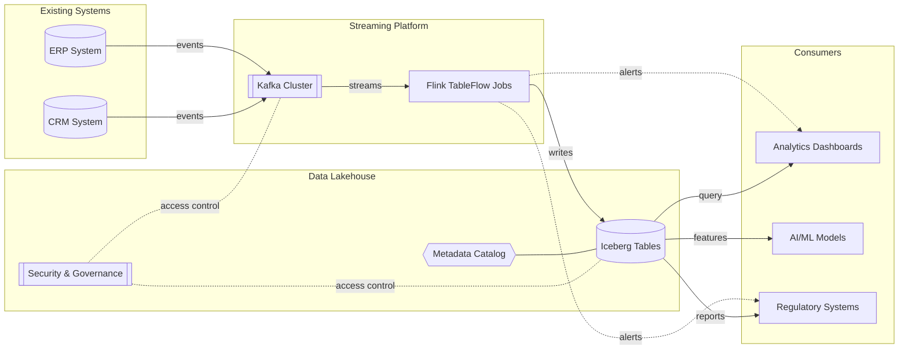
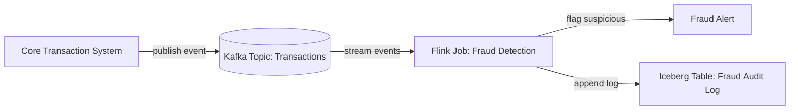
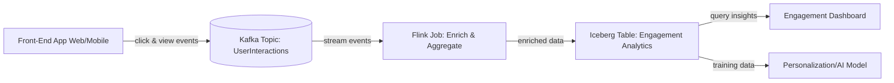
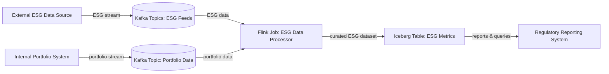
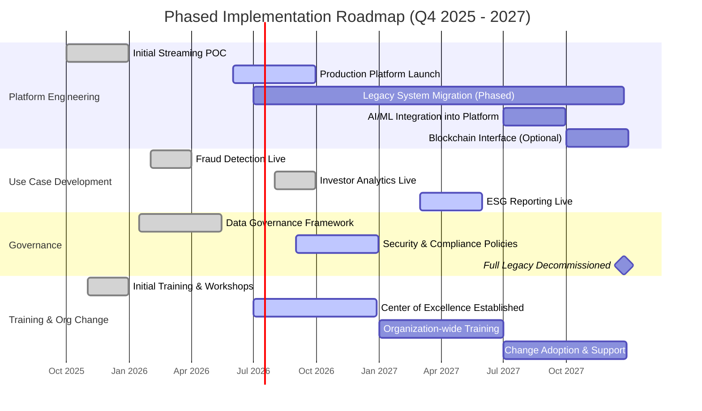

Perfect. I’ll generate interactive Mermaid diagrams covering:

1. **Overall streaming architecture**—Kafka + Flink (TableFlow) + Iceberg with supporting tools.
    
2. **Event flow diagrams** for key use cases (e.g., fraud detection, real-time investor engagement, ESG reporting).
    
3. **Phased roadmap swimlane** from foundation setup through to AI and blockchain readiness.
    

All will be web-document friendly, supporting interactivity and embedding. I’ll let you know as soon as they’re ready.

# Streaming Data Strategy Architecture and Flows

This document presents **Mermaid.js** diagrams illustrating a streaming data strategy for a UK asset management firm. It includes an **overall reference architecture**, detailed **event flow diagrams** for key use cases, and a **phased roadmap** in a swimlane format. Each diagram is accompanied by explanations and annotations for clarity.

## Overall Reference Architecture

The **reference architecture** diagram below shows how Apache **Kafka**, Apache **Flink** (using Confluent’s _TableFlow_ capability), and Apache **Iceberg** interact with existing enterprise systems and consumers. The architecture is logically divided into layers:

- **Source Systems:** Internal applications like **ERP** and **CRM** publish business events (e.g. trades, client updates) to Kafka topics in real time.
    
- **Streaming Platform:** An event streaming backbone with **Kafka** brokers transports the events. **Flink (TableFlow)** jobs perform real-time processing on these Kafka streams and materialize them into structured datasets (e.g. turning Kafka topics into Iceberg tables for analytics).
    
- **Data Lakehouse:** An **Iceberg** table store (on cloud or on-prem object storage) holds the curated streaming data with ACID guarantees and schema evolution. A **metadata catalog** (e.g. Hive/Glue or Iceberg’s catalog) tracks table schemas and snapshots, while **security & governance controls** (e.g. access policies, encryption) ensure compliant data access.
    
- **Downstream Consumers:** Various consumers make use of the data. **Analytics dashboards** and BI tools query Iceberg tables for up-to-date metrics. **AI/ML models** retrieve features and historical data from Iceberg (or subscribe to Kafka for live data) to drive intelligent decisions. **Regulatory and compliance systems** consume data (either via direct queries or exports from Iceberg) to produce reports and audits as required.
    

Together, Kafka, Flink, and Iceberg provide a unified, **secure data streaming and analytics platform** that bridges operational and analytical needs. The Flink/TableFlow component continuously **converts event streams into analytical tables** without complex ETL, keeping analytics in sync with real-time data.

**Figure: Overall Streaming Data Architecture.** Events from source systems flow into **Kafka**, are processed by **Flink (TableFlow)**, and land in **Iceberg** tables. A **Metadata Catalog** keeps track of schemas/lineage, and **Security** policies enforce access controls on streaming and stored data. **Downstream consumers** (BI dashboards, AI models, regulatory apps) either subscribe to filtered real-time events or query the Iceberg tables for analytics and reporting.

## Event Flow Diagrams

Below are event-level flow diagrams for three key use cases: **Real-Time Fraud Detection**, **Investor Engagement Analytics**, and **ESG Reporting**. Each diagram illustrates how data moves from sources through Kafka and Flink to outcomes like alerts, curated tables, and consumer applications.

### Real-Time Fraud Detection

This pipeline detects fraudulent transactions in real-time and logs all events for audit:

- **Transaction Ingestion:** The core banking or trading system publishes each transaction event to a Kafka **“Transactions”** topic as soon as it occurs.
    
- **Stream Processing & Detection:** A dedicated **Flink Fraud Detection** job consumes the transaction stream from Kafka. It performs real-time pattern matching and anomaly detection (e.g. comparing against account profiles or using an ML model) to flag suspicious activity. Flink’s stateful stream processing can maintain running aggregates and apply AI/ML scoring on each transaction to calculate fraud risk scores instantly.
    
- **Alert Generation:** If a transaction is deemed potentially fraudulent, the Flink job triggers an immediate **Fraud Alert**. This could be an alert event sent to another Kafka topic or a push notification to a fraud monitoring system/dashboard for analysts to investigate.
    
- **Audit Logging:** Whether fraudulent or not, all transaction events (with their fraud scores/flags) are appended to an **Iceberg “FraudAudit”** table. This immutable audit log provides a historical record for compliance and forensics – investigators can later query this table to review suspicious patterns and confirm that every event was evaluated. The Iceberg table, with ACID guarantees, ensures a reliable record of what happened and when, supporting regulatory audits and reporting.
    

**Figure: Real-Time Fraud Detection Flow.** A transaction event from the core system goes into **Kafka**, where a **Flink** job analyzes it in real-time. If suspicious, an **alert** is raised immediately, and the event (with its outcome) is written to a **Fraud Audit** table in **Iceberg** for later analysis. This approach combines streaming analytics (for instant fraud interdiction) with durable logging (for compliance and improvement of fraud models).

### Investor Engagement Analytics

This use case captures and analyzes user engagement events to drive client insights:

- **User Interaction Capture:** Front-end applications (web or mobile investor portals) emit events for user interactions – e.g. page views, clicks on research reports, transactions on the app. These events are published to Kafka (e.g. a **“UserInteractions”** topic) in real-time via lightweight SDKs or streaming APIs.
    
- **Enrichment & Aggregation:** A **Flink Enrichment/Aggregation** job consumes the stream of interaction events. It enriches each event with contextual data (for example, joining with customer profile info from a CRM or product reference data) and computes running engagement metrics. This can include aggregating events per session or user (to measure activity level, time spent, interests, etc.). The stream processing provides immediate insight into user behavior patterns as they happen.
    
- **Storage in Iceberg:** The enriched events or periodically aggregated results are written to an Iceberg **“EngagementAnalytics”** table. For instance, Flink might continuously update a table of daily engagement metrics per client segment, or simply append raw enriched events to a “bronze” table for later analysis. Iceberg’s table format lets analysts query current and historical engagement data in one place.
    
- **Downstream Consumption:** **BI dashboards** can query the Iceberg table to visualize up-to-the-minute user engagement KPIs. Meanwhile, **AI/ML models** (such as personalization algorithms or churn prediction models) can access this fresh data to retrain or score users continuously. Because the data pipeline delivers interaction data in real-time, the firm’s analytics can respond immediately to client behaviors (e.g. detecting a drop in logins or interest in certain content) and even enable adaptive user experiences.
    

**Figure: Investor Engagement Analytics Flow.** **User interaction events** from investor-facing apps are streamed into Kafka and processed by **Flink** for enrichment and metric aggregation. Processed engagement data lands in an **Iceberg** table, which feeds **dashboards** (for human insight) and **AI models** (for personalized services or risk models). This real-time pipeline ensures analytics and AI always work off the latest behavior data, enabling dynamic client insight and response.

### ESG Reporting Pipeline

This flow integrates disparate ESG (Environmental, Social, Governance) data sources and prepares them for reporting and compliance purposes:

- **Multi-Source Ingestion:** ESG data comes from both **external sources** (third-party ESG rating providers, climate data feeds, news sentiment, etc.) and **internal sources** (the firm’s own portfolio and risk systems). These data streams (e.g. periodic ESG scores, carbon footprint metrics, supplier risk events) are ingested into **Kafka** topics via connectors or APIs. For example, an external feed might push company ESG ratings into a **“ESGRatings”** topic, while internal systems send portfolio holdings or transactions into a **“PortfolioData”** topic.
    
- **Stream Integration & Curation:** A **Flink ESG Processor** job consumes the relevant ESG topics (multiple streams) and joins/merges them to create a unified view. In this stage, data is cleaned and aligned: e.g. linking external ESG scores to internal portfolio companies, calculating portfolio-level ESG indicators, and filtering or flagging data for quality issues. Flink can continuously update calculations like the firm’s real-time carbon footprint or detect ESG threshold breaches.
    
- **Iceberg Table Curation:** The integrated ESG data is written to an **Iceberg “ESGMetrics”** table (or a set of tables for different ESG aspects). This becomes a governed, versioned **source of truth** for all ESG-related metrics and events. Using Iceberg ensures that the data is stored with schema evolution, time-travel for audits, and ACID consistency (important for rigorous reporting).
    
- **Regulatory & Stakeholder Reporting:** **Regulatory reporting systems** (and internal compliance teams) pull data from the ESG Iceberg table to produce reports such as sustainability disclosures, compliance filings, and client ESG impact reports. Because the data is updated in near real-time, reports are always based on the latest information, and any changes are traceable. The streaming-enabled pipeline thus supports **transparent, up-to-date ESG reporting**, helping the firm meet evolving ESG regulations and provide timely updates to investors and regulators.
    

**Figure: ESG Reporting Flow.** **External ESG data** (ratings, climate metrics, etc.) and **internal data** (portfolio holdings/transactions) are ingested into **Kafka**. A **Flink** job merges and curates these feeds, writing results to an **Iceberg** table of ESG metrics. **Regulatory reporting systems** then query this table to generate compliance reports and disclosures. This streaming data pipeline ensures ESG information is integrated in real-time, facilitating proactive management and transparent reporting of sustainability metrics.

## Phased Roadmap (Q4 2025 – 2027)

The following **swimlane timeline** outlines the implementation roadmap across **Platform Engineering**, **Use Case Development**, **Governance**, and **Training/Organisational Change** tracks. Major milestones are highlighted by quarter from late 2025 through 2027:

- **Q4 2025:** **Initial POC** – Set up a small-scale Kafka/Flink/Iceberg prototype and deliver a successful proof-of-concept demonstrating streaming data integration. In parallel, conduct initial training workshops for key staff on streaming technologies.
    
- **H1 2026:** **Use Case Delivery (Fraud Detection)** – Deliver the first production use case (real-time fraud detection) on the new streaming platform by early 2026. The **streaming platform** goes live in production (Kafka, Flink, Iceberg deployed and hardened). A **data governance framework** (policies for data quality, security, schema management) is established to oversee the new data pipeline.
    
- **H2 2026:** **Expand Use Cases** – Launch the second use case (investor engagement analytics) by late 2026. **Security and compliance policies** (access controls, monitoring) are fully implemented as data volume and criticality grow. The platform begins **phased legacy migration**: gradually rerouting or replicating existing batch/ETL data pipelines into the Kafka-streaming-Iceberg architecture.
    
- **H1 2027:** **ESG Use Case & Adoption** – Deliver the third use case (ESG reporting integration) by early 2027. Organisation-wide training is conducted to onboard more teams onto the streaming platform, and a center of excellence may be established for ongoing support. By this stage, a significant portion of legacy systems are migrated or interfaced with the streaming platform.
    
- **H2 2027:** **AI Integration & Future Tech** – Integrate **AI/ML capabilities** into the streaming pipeline (e.g. deploying machine learning models within Flink for advanced analytics) as a major milestone in 2027. Also, explore an **optional blockchain interface** for audit or transaction tracking (if relevant to the business) in late 2027. By the end of 2027, the roadmap envisions legacy systems **fully decommissioned** and the modern streaming data platform handling all critical data flows.
    

**Figure: Phased Roadmap (2025–2027).** **Platform Engineering** executes the streaming infrastructure rollout (Kafka/Flink/Iceberg), progressing from an initial POC in 2025 to full production and legacy migrations by 2027. **Use Case Development** delivers key streaming applications in stages: Fraud Detection (early 2026), Investor Analytics (late 2026), and ESG Reporting (2027). The **Governance** track establishes data governance and security controls alongside these technical milestones, ensuring compliance as the new platform scales (with all legacy systems retired by end of 2027). In parallel, **Training & Organisational Change** initiatives (starting with 2025 workshops) cultivate the necessary skills and buy-in, via a center of excellence and ongoing training, to ensure successful adoption of the streaming data paradigm across the firm.