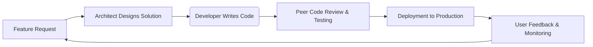
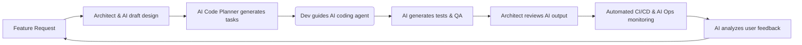
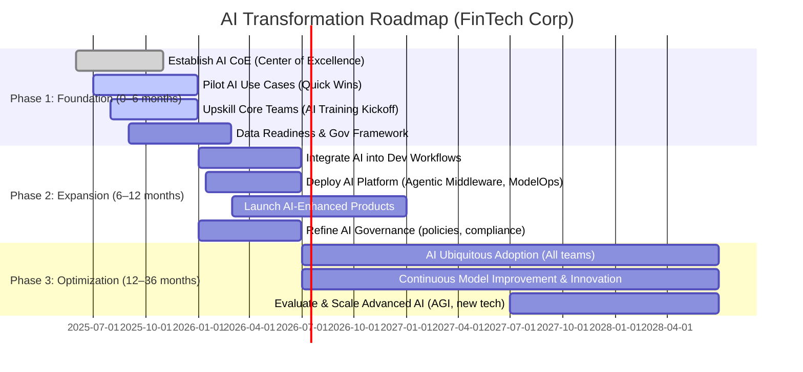
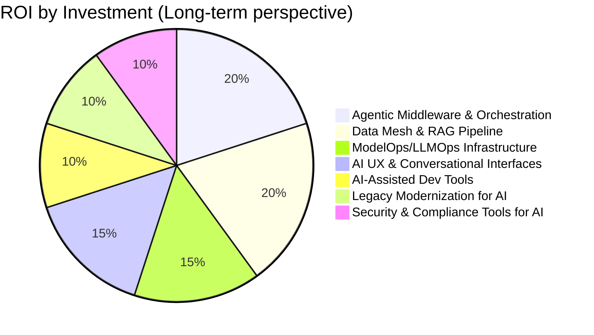
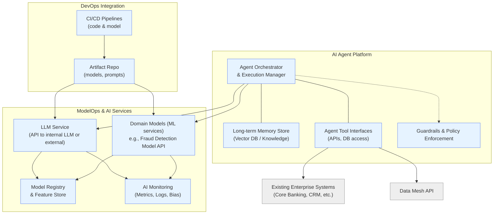

# FinTech AI Transformation Strategy

_Prepared by the Head of Architecture – A comprehensive strategy to become an AI-augmented enterprise in software development, operations, and data._

## Executive Summary

- **AI in Software Development:** The Software Development Lifecycle (SDLC) will be reinvented by AI co-pilots at every stage. From **vibe coding** (natural language-to-code) to AI-driven planning and testing, developers and architects will collaborate with AI agents to accelerate delivery. Bottlenecks shift from writing code to supervising AI outputs, and team dynamics evolve as AI handles rote tasks. (See Section 1)
    
- **Evolving Roles:** New specialties like **LLMOps, PromptOps, and AI Agent Designers** emerge to productionize AI solutions. Traditional roles (e.g., manual QA) diminish while existing engineers upskill to become “AI-augmented” in their domain. A role evolution matrix redefines responsibilities, ensuring each layer of the AI stack (data, models, orchestration) has owners. (See Section 2)
    
- **Upskilling & Learning:** A multi-modal learning strategy is vital. Self-serve AI learning hubs, cohort-based workshops, and hands-on “AI pairing” sessions will rapidly upskill teams. Over 60% of professionals currently adopting AI report being self-taught, so structured learning journeys and AI mentor prompts will guide continuous development. (See Section 3)
    
- **Strategic Roadmap:** A phased transformation roadmap spans **6, 12, and 36 months**. In the first 6 months, establish an AI Center of Excellence and pilot use cases. By 12 months, integrate AI into core workflows and adopt model operations pipelines. Within 36 months, AI becomes pervasive, with key OKRs achieved in productivity, risk reduction, and customer experience. Gantt charts outline initiatives and dependency gates for each phase. (See Section 4)
    
- **Architecture Investments:** Re-balance architectural focus toward **AI-native components**. Some current trends (e.g., rigid microservice boundaries or manual data pipelines) will evolve or fade as **agent orchestration frameworks** and **RAG (Retrieval-Augmented Generation) pipelines** rise. Capability-vs-ROI analysis shows high long-term returns on investing in trustable data layers and agentic middleware. (See Section 5)
    
- **Reference Architectures:** Updated C4 reference models illustrate an AI-augmented fintech platform:
    
    - **Data Mesh + RAG** (Data Layer) for a **trustable, real-time knowledge base**.
        
    - **Agentic Middleware & ModelOps** (Platform Layer) to deploy and orchestrate AI agents.
        
    - **AI UX** (Experience Layer) with conversational frontends for personalized user experiences.  
        Each reference includes an adoption plan and prompts to explore further improvements. (See Section 6)
        
- **Architectural Shifts:** A fundamental mindset shift is required. Design patterns move from deterministic, static workflows to **probabilistic, adaptive systems**. “Before vs. After” comparisons illustrate changes (e.g., rule-based engines vs. learning agents). Architects must embrace experimentation, continuous model learning, and prompt-based design, supported by prompts that encourage new thinking. (See Section 7)
    
- **Day-in-the-Life Scenarios:** Expect dramatic changes in daily routines. **Architects** start their day with AI-curated system insights and use design assistants. **Developers** pair program with AI and rely on automated code reviews and test generation. **Tech Leads** let AI summarize stand-ups and generate project plans. Timelines and toolkits for each persona highlight how work shifts from manual toil to high-level guidance. (See Section 8)
    
- **Org Design:** Organizational structure adapts to maximize AI benefits. We recommend a hybrid model: a **central AI/ML team** (AI Center of Excellence) provides platforms (e.g., PromptOps as a service) and governance, while **embedded AI experts** reside in product teams to apply AI locally. An illustrative org chart depicts reporting lines for centralized vs. federated AI roles. Prompt packs help leadership explore org design choices. (See Section 9)
    
- **Fintech Data Strategy:** Data becomes a secure, democratized asset powering AI. A **“secure data mesh”** approach enables personalization and analytics by federating data ownership with strong governance. This blueprint covers data classification, lineage, privacy (GDPR/PCI) compliance, and risk management, ensuring AI innovations meet regulatory standards. Prompt packs for data governance help teams self-service insights responsibly. (See Section 10)
    

Each section below provides an executive overview and technical deep-dive, with diagrams (Mermaid) and collapsible prompt packs to guide further exploration. This strategy is modular and linkable for web publishing, catering to both executive vision and engineering implementation details.

---

## 1. AI-Driven Software Development Lifecycle (SDLC)

_Key Takeaway:_ **AI will permeate every phase of software development, turning the SDLC into a human-AI collaborative process.** Developers will describe intent and review AI-generated output (“vibe code”) rather than hand-craft every line. This accelerates development but shifts architect responsibilities toward guiding AI, ensuring quality, and addressing new bottlenecks like data for training and prompt design. Team dynamics evolve as AI takes over repetitive tasks and humans focus on higher-level design and oversight.

**Current Challenges & Opportunities:** Traditional SDLC phases (requirements -> design -> coding -> testing -> deployment) often suffer from handoff delays, miscommunication, and repetitive manual work. AI-augmentation introduces agents for planning, coding, testing, and operations, promising to streamline these phases:

- _Ideation & Requirements:_ AI **deep research agents** can gather domain knowledge, analyze user feedback, or even draft initial requirements by parsing large documents or knowledge bases. This reduces time spent in research and ensures more informed design inputs.
    
- _Design & Architecture:_ Architects can leverage generative design tools to explore architecture patterns or create UML diagrams from natural language. AI can propose design alternatives or evaluate an architecture against best practices, acting as a constant pair in the design phase.
    
- _Implementation (Coding):_ **Vibe coding** is the new paradigm where developers describe the “vibe” of the code (intent) and AI generates the implementation. Instead of writing boilerplate, developers curate AI suggestions. Tools like AI pair programmers and code agents can handle routine coding tasks, leaving humans to handle edge cases and complex logic. This significantly compresses coding time and reduces human error.
    
- _Testing & QA:_ AI agents automatically generate unit tests, find edge cases, and even execute exploratory testing. A code review agent provides instant feedback on pull requests (style, security issues). This AI-in-the-loop testing can catch bugs faster and ensure higher coverage. The bottleneck moves from writing tests to validating AI-suggested tests for correctness.
    
- _Deployment & Ops:_ In DevOps, AI assists with deployment scripts, monitors build pipelines, and auto-resolves common CI/CD issues. **AIOps** agents detect anomalies in logs and metrics and suggest fixes. The SDLC becomes a continuous loop with AI proactively maintaining software health.
    

**AI-Augmented Workflow – Before vs. After:** Below is a simplified comparison of a feature implementation workflow before and after AI integration.

**Before (Traditional Development Workflow):**



**After (AI-Augmented Development Workflow):**



In the **AI-augmented SDLC**, an AI **code planner** turns requirements or Jira tickets into technical plans automatically. Developers then act as **conductors**: they oversee AI coding agents that write code and suggest solutions. AI-driven testing and code review are integrated into the process (e.g., an agent reviews code for errors and style). Deployment is assisted by a deployment agent, and post-release, AI systems monitor user feedback and system metrics to propose improvements or catch issues.

Key differences and benefits in the _after_ scenario:

- **Speed:** Many steps execute in parallel or much faster. For example, while code is being written by an AI, another agent might be generating tests.
    
- **Quality & Consistency:** AI agents apply known best practices and patterns uniformly (e.g., consistent error handling, coding standards).
    
- **Human Focus:** Developers and architects focus on specifying intent, clarifying requirements, and validating AI output, rather than manual grunt work. This increases focus on creative design and solving truly novel problems.
    
- **New Bottlenecks:** Ensuring AI’s output is trustworthy. Without insight into AI’s reasoning, debugging can be hard. Thus, tooling must provide traceability of AI decisions. Architects will need strategies to mitigate AI “hallucinations” or suboptimal suggestions (for instance, incorporating explainable AI or sandbox testing of AI-written code).
    

**Example – Atlassian’s AI SDLC Agents:** Atlassian recently introduced a suite of **Rovo AI agents** across the SDLC, including:

- a **Code Planner** that converts Jira user stories into technical implementation plans,
    
- a **Coding Assistant** agent to generate code,
    
- a **Code Reviewer** agent to analyze merge requests,
    
- and a **Deployment Agent** for automated releases.
    

They also added context-aware search to let developers query across tickets and documentation in natural language. According to Atlassian, these AI are _“tools and capabilities that automate manual tasks”_ rather than human replacements. The goal is to free developers from busywork so they can concentrate on creative problem-solving and oversight.

**Team Dynamics & Roles:** With AI deeply integrated:

- Developers pair with AI agents (like having a junior programmer on the team at all times). Senior engineers take on more mentorship roles – but now the “junior” is an AI needing guidance.
    
- Architects spend more time curating architectural knowledge that AI agents draw from (e.g., maintaining design rules, architecture decision records that AI can reference) and less time drawing every diagram by hand.
    
- The bottleneck shifts to the **quality of prompts and data** given to AI. A poorly specified task to an AI can lead it astray, requiring human correction (much like giving unclear requirements to a junior dev). Thus, a new skill of _prompt engineering_ becomes critical (see Section 2).
    

**Bottlenecks & Considerations:** While AI promises speed, it introduces new challenges:

- _Oversight Debt:_ If teams lean too heavily on AI without understanding the output, technical debt can accumulate in subtle ways. Code might function but be unoptimized or lack clarity. It’s vital to keep humans “in the loop” to refactor and clean up AI-generated code.
    
- _AI Limitations:_ Current AI models can struggle with complex logic or large existing codebases. They may make _“questionable design decisions”_ or get stuck in loops. Engineers must step in to correct course (“hands back on the wheel”). Therefore, the workflow should anticipate fallback to human-driven steps when AI hits its limits.
    
- _Security & Compliance:_ AI that generates code must be checked for vulnerabilities or compliance with secure coding practices, especially in fintech where security and regulatory compliance are paramount. AI may inadvertently introduce an insecure snippet (e.g., using outdated encryption) which a human needs to catch.
    
- _Data Privacy:_ If AI tools are using company data to inform coding (e.g., uploading code to an AI service), strict data governance is needed to prevent leakage of sensitive code or keys. Many organizations will prefer self-hosted AI models or those with strong privacy guarantees.
    

In summary, the AI-driven SDLC holds great promise for productivity and innovation in the fintech context. It will **reshape team workflows, requiring new checks and balances**. Success means pairing human creativity and judgment with AI’s speed and breadth of knowledge. The following sections will delve into how roles, skills, and architecture must adapt to realize this vision.

## 2. Evolving Roles and Skills

_Key Takeaway:_ **AI adoption in engineering demands a reimagination of roles.** Some traditional roles will diminish or be redefined, while new roles like **LLMOps engineers, PromptOps specialists, AI ethicists, and Agent Designers** become critical. We present a role evolution matrix mapping legacy roles to future-state roles, ensuring team members can transition rather than be displaced. Each new role addresses specific needs of AI-centric development (from model tuning to prompt management). This section also provides prompt packs to help individuals discover and develop their place in the AI-augmented organization.

### Role Evolution Matrix

The table below outlines how key roles in a software/fintech organization might evolve:

|**Current Role**|**Evolution / New Role**|**Description of Changes**|
|---|---|---|
|**Software Developer**|**AI-Augmented Developer** (AI Pair Programmer)|Continues to write code but now heavily leverages AI assistants for coding, debugging, and documentation. Focus shifts to supervising AI outputs, writing effective prompts, and integrating AI-generated modules into the codebase.|
|**Software Architect**|**AI Architect / Prompt Architect**|In addition to designing systems, now curates AI components (like deciding when to use an AI service vs. traditional logic). Develops internal prompt libraries and guidelines for how AI should be used in architectures. Ensures system designs include AI agent orchestration, knowledge bases, and compliance considerations.|
|**QA/Test Engineer**|**AI QA Strategist**|Rather than manually writing tests, oversees AI-driven testing. Trains AI test generators with scenarios, validates AI-found bugs. Focus on testing AI components (e.g., validating an AI model’s decisions) and setting up continuous quality monitoring for AI outputs.|
|**Data Engineer**|**Data/NLP Engineer (Data Ninja)**|Expands to manage not just data pipelines but also data for AI (prompt data, fine-tuning corpora, vector databases). Ensures data is AI-ready (clean, well-labeled, compliant). Called “Data Ninjas” in AI agent contexts, they feed the agents with the right data at the right time.|
|**Data Scientist/ML Engineer**|**LLMOps Engineer**|Transitions from pure model-building to deploying and maintaining large language models (LLMs) in production. Focus on versioning models, optimizing performance, monitoring for drift, and fine-tuning models for domain-specific needs. They handle the unique operational challenges of LLMs (long context windows, prompt sensitivity, etc.), extending traditional MLOps to LLMOps.|
|**DevOps/Release Engineer**|**AIOps Engineer** / **MLOps Engineer**|Augments CI/CD pipelines with AI tools. Manages deployment of AI services and monitors AI in production (latency, cost, usage). Also responsible for infrastructure supporting AI (GPU clusters, vector databases). AIOps roles use AI to automate incident response (e.g., AI-powered monitoring alerts).|
|**UX Designer**|**Conversational UX Designer** / **Agent Designer**|Evolves to design user experiences involving AI agents (chatbots, voice assistants, AI-driven personalization). Focus on _conversation flows_, ensuring the AI’s tone and behavior align with brand and user needs. As **Agent Designers**, they craft the personas and interaction rules for AI agents, merging UX with cognitive science.|
|**Product Manager**|**AI Product Manager**|Must understand AI capabilities and limitations to prioritize AI features. Works closely with LLMOps and PromptOps teams to translate business needs into AI solutions. Also ensures responsible AI use (fairness, explainability) in product features.|
|**Project Manager/Scrum Master**|**AI Facilitator**|Oversees AI integration into workflows. For example, ensures that retrospectives include reviewing AI contributions, that sprint planning accounts for what AI can deliver. Manages a “human+AI” team cadence. Might use AI tools to track progress and generate status reports.|
|**Security Engineer**|**AI Security Specialist**|Focuses on security of AI systems (model security, prompt injection attacks, data leakage via models). Develops threat models for AI components and ensures compliance with data privacy in AI workflows. Also uses AI to enhance security operations (AI for code review security, anomaly detection in logs).|
|**Compliance Officer** (Fintech)|**AI Compliance & Ethics Officer**|Interprets regulatory requirements for AI systems. Develops frameworks for AI model validation, monitoring for bias, and audit trails of AI decisions. Guides PromptOps and LLMOps teams to enforce policies (e.g., no sensitive data in prompts, bias mitigation strategies in models).|

This evolution matrix indicates that **no one is left behind** – instead, roles are elevated. Engineers become more multidisciplinary (combining domain expertise with AI oversight). New roles (like _PromptOps Specialist_) emerge to handle very specific challenges:

- **PromptOps Specialist:** Manages the creation, cataloging, and optimization of prompts used by AI systems. They treat prompts as a first-class product: performing A/B testing on prompt wording, maintaining a prompt repository, versioning prompts as the AI models or requirements change. This role may reside in a central team but works with every application team that uses prompts.
    
- **LLMOps Engineer:** As noted, akin to MLOps but for language models – handles deployment, scaling, and monitoring of LLMs. Ensures the AI model is available, fast, cost-efficient, and updated. They might also manage **RAGOps** if retrieval-augmented generation is used (handling the pipeline that feeds external data to the LLM).
    
- **AI Agent Designer:** This role blends UX design with AI behavior programming. They define how autonomous agents make decisions and interact. For example, in a fintech context, an Agent Designer might define an agent that helps customers with loan applications – crafting its dialogue flow, fallback behaviors, escalation path to humans, etc. They ensure the agent’s “personality” and process align with business goals and customer expectations.
    
- **AI Ethicist / Policy Advisor:** With AI making decisions, a role is needed to constantly evaluate ethical implications. This person reviews AI outputs for fairness (e.g., is our credit underwriting AI treating all demographics fairly?), oversees model bias audits, and keeps the company up to date with AI regulations. They work closely with compliance and data teams.
    

### Diminishing & Changing Roles

Certain roles may see reduced need or a shift in focus:

- **Manual QA Testers:** With AI able to generate and run tests, fewer people will be needed to manually execute test cases. Those in testing roles will shift to either higher-level QA strategy or to monitoring the AI’s testing (as an **AI QA Strategist**).
    
- **Business Analysts (in requirements gathering):** AI can help auto-generate specifications from conversation or analyze user data to propose features. Business analysts might move into an _AI Product Owner_ role focusing on validating AI-suggested requirements and ensuring they align with business strategy.
    
- **Level 1 Support**: AI chatbots and support agents will handle common customer inquiries. Customer service roles will shift to more complex cases and oversight of AI interactions (tuning the chatbot, handling escalations that AI cannot).
    
- **Data Entry/Operations:** Many routine operations tasks (report generation, simple data entry) can be automated with agents. Staff in these positions should be upskilled to supervise automation or to focus on more analytical work that AI isn’t handling yet.
    

However, it’s crucial to communicate that **AI augments but doesn’t outright replace the need for human expertise**. For example, even if code generation is automated, we still need skilled developers to architect systems, verify correctness, and build novel components. As Pete Hodgson noted, _“vibe-coding – fully autonomous AI coding – isn’t going to replace engineers in the near future”_; instead, engineers leverage vibe-coding to accelerate their work while keeping themselves in the loop.

### New Skills and Training

As roles evolve, so do the skill requirements. Key new skills across many roles include:

- **Prompt Engineering:** Crafting effective prompts to get the desired output from an AI, and knowing how to iteratively refine prompts. This is becoming as important as knowing a programming language. It’s part art (linguistic skill) and part science (systematically testing prompts).
    
- **AI Literacy:** Understanding at a high level how AI/ML models work (even for non-technical roles), including concepts of model bias, overfitting, or confidence scores. This literacy enables better collaboration with AI specialists.
    
- **Tooling Proficiency:** Familiarity with AI-integrated development tools (e.g., GitHub Copilot, internal AI assistants, data annotation tools). Developers might need to learn new IDE plugins or CI/CD integrations; ops teams need to learn AI monitoring dashboards, etc.
    
- **Data Analysis & Curation:** Since AI is data-driven, many roles will need stronger data skills. For instance, an AI-augmented business analyst should know how to interpret outputs of an AI analysis tool, or even how to do basic data querying to validate AI insights.
    
- **Change Management & Adaptability:** Soft skills in adaptability, continuous learning, and change management become critical. Teams will need to frequently update their processes as AI tools evolve.
    

To manage this transition, **role-specific training programs** and **clear career paths** are required. We must reassure team members that as their roles shift, there are growth opportunities (e.g., a manual tester can become an “AI Quality Lead” guiding the new testing strategy). Section 3 details upskilling strategies to help each role navigate this change.

Empower your team members to explore their evolving roles with AI assistance. They can use these prompts with an AI chatbot or mentor to understand and grow into new roles:

- _“I’m a backend engineer. How can I transition into an LLMOps role, and what skills should I acquire?”_ – Helps identify a learning path from software engineer to LLMOps engineer, listing relevant skills (MLOps, model serving, etc.) and resources.
    
- _“What does a day in the life of a PromptOps specialist look like in a fintech company?”_ – Yields a scenario of daily tasks for a PromptOps role, helping someone envision the role.
    
- _“As a UX designer, how can I evolve into an AI Agent Designer? What additional knowledge do I need?”_ – Provides guidance on conversation design, cognitive psychology basics, and tools for agent design.
    
- _“Which parts of my current QA testing job can be improved by AI, and how can I shift my role to focus on those improvements?”_ – Suggests how an individual in QA can introduce AI-driven testing and reposition themselves as an AI QA lead.
    
- _“Create a personal development plan for a DevOps engineer to become proficient in AIOps within 6 months.”_ – The AI will outline a timeline with milestones (learning monitoring tools for AI, practicing with AIOps platforms, etc.).
    
- _“What new roles related to AI should a fintech company hire for, and how do they interact with existing teams?”_ – Useful for managers: the AI lists roles like AI product manager, model validator, etc., and how they fit in.
    

Use these prompts as starting points in team workshops or one-on-one coaching to help staff find their future in the AI-augmented enterprise.

## 3. Upskilling and Learning Strategy

_Key Takeaway:_ **Continuous learning is the linchpin of AI transformation.** We will implement a comprehensive upskilling program combining self-serve resources, structured cohort training, and on-the-job AI pairing. The goal is to build AI fluency across all roles, from engineers learning prompt engineering to executives learning AI strategy. This section outlines tailored learning paths, modalities (self-paced vs. group), and tools (e.g., internal AI learning hub, certifications, AI mentors). We also include AI-driven learning prompts to personalize development plans.

### Guiding Principles for AI Upskilling

1. **Meet People Where They Are:** Acknowledge that team members have varying levels of AI familiarity. Some engineers might already tinker with GitHub Copilot or Kaggle models, while others only know AI from headlines. Our program will have **tiered learning paths** (Beginner, Intermediate, Advanced) and role-specific tracks.
    
2. **Blend Self-Serve and Collaborative Learning:** Leverage the fact that 60% of professionals in fields adopting AI (like architecture/design) report being **self-taught with no formal AI training**. We’ll provide rich self-serve materials (online courses, internal wiki, practice sandboxes) for independent learners. However, we also facilitate cohort-based workshops and hackathons, because learning is often accelerated in peer groups where people can share knowledge and build projects together.
    
3. **Hands-On, Contextual Learning:** The best way to learn AI is by applying it to real problems. Our strategy emphasizes _learning by doing_ – e.g., an Ops engineer might learn AIOps by setting up an AI-driven monitoring system in a dev environment. We’ll encourage project-based learning: each person or team picks a small AI experiment relevant to their work as a capstone to their training.
    
4. **AI as a Learning Coach:** We will deploy AI itself to help learning. For instance, an internal **AI Tutor chatbot** can answer questions (“Explain transformers in simple terms”) or quiz employees. We can fine-tune a model on our internal knowledge so it becomes a contextual help system for our tools and processes.
    

### Learning Journeys by Role

We define learning journeys for key roles, each with specific objectives:

- **Developers:** Goal is to gain proficiency in AI-assisted coding and prompt engineering.  
    **Learning Path:** Start with an _“AI Pair Programming 101”_ course (using tools like Codex/Copilot in examples). Then a workshop on writing effective prompts for code generation and debugging AI-written code. Next, a project: take a module from our codebase and reimplement it with an AI assistant to experience the workflow. Optional advanced topics: using AI for refactoring, performance tuning.  
    **Resources:** Online courses on generative AI coding, internal tutorials on our chosen code assistant tool, pair programming sessions with a mentor who has experience with AI coding.
    
- **Architects/Tech Leads:** Goal is to understand AI capabilities enough to design systems that incorporate AI.  
    **Learning Path:** Begin with an _“AI Fundamentals for Architects”_ seminar (covering what AI/ML can and cannot do, common patterns like RAG, basics of model life cycle). Follow with hands-on labs: using an AI to generate part of an architecture (like having ChatGPT draft a system diagram from requirements and then refining it). Another key module is _AI ethics and risk for architects_ – ensuring they know how to design for explainability and compliance.  
    **Resources:** Case studies of AI architecture in fintech, internal documentation on using our AI platform components, perhaps guest lectures from companies that have implemented AI in their architecture.
    
- **Data/ML Team:** Goal is to transition from traditional analytics to LLMOps and advanced AI techniques.  
    **Learning Path:** Advanced training on LLM fine-tuning, vector databases, and our model serving infrastructure. Certifications or courses on MLOps/LLMOps (some industry programs might be available by providers or online learning platforms). Encourage contributions to open-source or research projects to deepen expertise.  
    **Resources:** Access to a sandbox with our data where they can practice building RAG pipelines, reading materials like research papers (e.g., on retrieval augmented generation, new model architectures), and mentorship from any senior ML practitioners or partner vendors.
    
- **QA/Testing Team:** Goal is to master AI-driven testing tools.  
    **Learning Path:** Introduce them to tools that generate tests from code or requirements. Perhaps use an AI unit test generation tool on one of our codebases and analyze the results. Train on how to feed scenarios to AI and interpret results (e.g., using natural language to specify a test scenario).  
    **Resources:** Workshops with real examples from our code where AI found a bug that manual testing missed, tutorials on writing property-based tests that AI can help with, and materials on testing AI systems (important: how do you test an AI feature’s correctness? This is new for QA folks).
    
- **Non-Technical Roles (Product, Compliance, etc.):** Goal is AI literacy and identifying AI use cases.  
    **Learning Path:** A lightweight AI bootcamp that demystifies AI for a business audience – covering AI terminology, capabilities (like “AI can categorize documents, generate text, etc.”), and risks (bias, errors). Then interactive sessions: brainstorming where AI might improve their domain (e.g., product managers think of AI features, compliance officers consider how to audit AI decisions). Possibly include some hands-on with low-code AI tools to build a simple chatbot, to remove the “black box” mystique.  
    **Resources:** Internal talks by the AI team, simple tutorials on using AI (like building a Zapier workflow with an AI step, if applicable), and an “AI in Fintech” use case library showing what other companies have done (to inspire our non-tech teams).
    

### Modes of Delivery

- **Self-Serve Learning Platform:** We will create an internal AI Learning Hub (could be an Obsidian/Notion site or our LMS) where curated content is available. This includes reading lists, videos, interactive tutorials, and practice datasets/code for experimentation. Microsoft’s AI Learning Hub and similar industry resources can be referenced as starting points.
    
- **Cohort-Based Training:** Form cohorts by role or mixed teams to attend interactive training (could be virtual or in-person workshops). For example, a 2-week “AI for Developers” sprint where each day has a 1-hour lecture and 2-hour lab exercise. Cohorts encourage accountability and knowledge sharing.
    
- **Hackathons & AI Days:** Host company-internal hackathons focused on AI. Challenge teams to build a small AI prototype in 1-2 days (perhaps improving an internal process with AI). These events spur self-learning and creativity. Also consider an “AI Demo Day” every quarter where teams present how they used AI in their projects; this spreads best practices organically.
    
- **Mentorship and Communities of Practice:** Identify early adopters or experts in the company who can mentor others. Set up a _“Guild” or interest group_ for AI, where folks regularly meet to discuss new developments or problems they’re facing. This community can maintain an FAQ or help channel (with an AI assistant integrated to answer common questions).
    
- **External Resources and Certification:** Encourage use of external MOOCs, certifications (like those by cloud providers or universities on AI). Possibly subsidize or reward completion of relevant certifications. Cisco, for instance, has begun integrating AI into its certifications (like CCNA, CCNP now include AI topics), which shows industry momentum on formal credentials. Team members obtaining such credentials can increase our internal knowledge pool.
    

### AI Learning Plan Prompts

One innovative approach is to let individuals co-create their learning plan with AI. By asking an AI (which has knowledge of countless learning resources) for help, employees can get personalized plans. Below, we provide a prompt pack for this:

These prompts can be used by team members to generate a tailored learning plan with the help of an AI assistant (like our internal chatbot):

- _“I am a front-end developer with 5 years of experience. Create a 3-month learning plan for me to become proficient in AI-driven UX design and conversational interfaces.”_  
    _Expected AI Output:_ A week-by-week breakdown: e.g., Week 1-2 focus on basics of machine learning and NLP, Week 3-4 take a course on conversational UI design, Week 5 build a simple chatbot UI, etc., including recommended courses or reading.
    
- _“Help me learn how to use AI for testing software. I have no background in AI. Suggest resources and a schedule to become an AI QA specialist in 6 months.”_  
    _Expected AI Output:_ A structured plan starting from basics of AI in testing (introducing to tools), gradually moving to advanced topics like generative testing and model-based testing, with milestones at 2, 4, 6 months.
    
- _“Generate a learning syllabus for a ‘Finance AI Compliance Officer’ covering regulatory guidelines, AI basics, and ethical AI practices.”_  
    _Expected Output:_ A list of topics and resources: e.g., understanding AI regulations (EU AI Act, etc.), case studies of AI failures in finance, technical basics of how AI models work, processes for auditing AI decisions, etc.
    
- _“I lead a team of 10 developers. Propose a group learning journey that we can do together to adopt AI in our workflow (like weekly activities for 3 months).”_  
    _Expected Output:_ Something like: Each week, assign a chapter of an AI book or a Coursera module for everyone to discuss; every two weeks do a group exercise (like coding with an AI assistant); final project in month 3 where team pairs up to automate part of our development process with AI.
    
- _“What are the best online courses or certifications for a data engineer to learn about LLMOps and data for AI?”_  
    _Expected Output:_ Recommendations possibly including specific courses (e.g., Coursera’s Generative AI specialization, a university’s online program on MLOps, or vendor-specific training like AWS for ML engineers), along with reasons to take them.
    

These prompts can be provided to employees or integrated into our Learning Hub, so people can click and get a plan. It helps personalize learning at scale, leveraging the AI’s knowledge to complement our internal training.

By implementing this upskilling and learning strategy, we ensure our workforce can confidently adopt AI tools and methodologies. The combination of structured training, self-guided exploration, and AI-assisted learning will build a culture of continuous improvement, which is essential as AI technology continues to evolve rapidly. In turn, this cultivates internal talent for the new roles identified in Section 2, reducing the need to hire outside and empowering our people to lead the transformation.

## 4. Strategic Roadmap

_Key Takeaway:_ **Transforming into an AI-augmented enterprise is a journey best tackled in phases.** We propose a strategic roadmap over the next 36 months, broken into short-term (0–6 months), mid-term (6–12 months), and long-term (12–36 months) horizons. Each phase has clear objectives, key results (OKRs), and “gates” or prerequisites to move to the next phase. Below, we outline the roadmap with a Mermaid Gantt chart and narrative, detailing major initiatives and how they build upon each other.

### AI Transformation Roadmap Overview



#### Phase 1: Foundation (Months 0–6) – _“Laying the Groundwork”_

**Objectives:**

- **Governance & Vision:** Define the AI strategy, form governance structures, and secure executive buy-in.
    
- **Initial Capability:** Stand up the core team and infrastructure needed to start AI work.
    
- **Quick Wins:** Deliver a few small AI-driven improvements to build momentum and demonstrate value.
    

**Key Initiatives:**

- **Establish AI Center of Excellence (CoE):** Form the central AI leadership team, including key roles (lead AI architect, head of data science, etc.). This CoE will drive the strategy, set standards, and support other teams. Deliverable: AI CoE charter and operating model by end of Q2.
    
- **Pilot AI Use Cases:** Identify 1-3 “quick win” projects (e.g., an internal chatbot for IT support, or an AI that automates a simple finance reporting task). Aim for projects that can be done in <3 months and show clear ROI or efficiency gains. These pilots serve as learning exercises and proof points for AI value.
    
- **Upskill Core Teams:** Kick off the training programs (Section 3). Focus on the teams involved in pilots and CoE first. Deliverable: 100% of pilot team members complete a basic AI training by month 6.
    
- **Data Readiness & Governance Framework:** Start parallel efforts on data. Inventory our data sources, and address any immediate gaps needed for AI (e.g., gather historical customer interaction logs if we want to train a support AI). Also draft initial AI governance policies: guidelines for using external AI services, data security protocols for AI, etc. Possibly create an AI ethics committee.
    

**Key Results (OKRs) for Phase 1:**

- _OKR 1:_ AI CoE operational with defined roles and budget by Month 2.
    
- _OKR 2:_ At least 2 pilot projects delivered by Month 6, each achieving a measurable improvement (e.g., reduce support ticket handling time by 20%).
    
- _OKR 3:_ 50+ employees (across roles) complete an introductory AI training module (targeting those involved in pilots or key areas).
    
- _OKR 4:_ Data governance board expanded to include AI considerations; initial policy on “Responsible AI usage” published internally.
    

**Phase-Exit Gate:** By end of Phase 1, we expect to have an AI CoE guiding the effort, some early success stories, and foundational policies in place. A review should confirm: do we have management and staff buy-in to proceed? Are initial results promising? If yes, move to Expansion.

#### Phase 2: Expansion (Months 6–12) – _“Scaling Outward”_

**Objectives:**

- **Integrate AI into mainstream workflows** in development, operations, and customer-facing products.
    
- **Platform and Tools:** Build or deploy the infrastructure (agentic middleware, ModelOps, etc.) to enable wider AI use.
    
- **Governance Maturity:** Refine and enforce AI policies as usage grows; ensure compliance and risk controls keep pace.
    

**Key Initiatives:**

- **Integrate AI into Dev Workflows:** Roll out AI coding assistants, test generation tools, etc., to all development teams. This includes updating SDLC processes (Section 1’s AI-driven SDLC becomes standard practice). The LLMOps/PromptOps roles might start being formally embedded in teams now. Deliverable: All dev squads have access to code assistant and receive training on using it by Month 12.
    
- **Deploy AI Platform (Agentic Middleware & ModelOps):** By now, choose/build core components like the agent orchestration layer, a knowledge graph or vector DB for enterprise knowledge (supporting RAG), and CI/CD pipelines for models. This might involve procuring an enterprise AI platform or building with cloud services. Deliverable: AI Platform v1 live by Month 12, with at least one or two reusable agents in production (e.g., an agent integrated in our app or internal process).
    
- **Launch AI-Enhanced Products:** Take more ambitious customer-facing use cases live. For fintech, this could be launching a chatbot in the mobile app, or an AI-powered personalized dashboard for users. Work closely with product teams from design to deployment to ensure quality. Possibly do a limited beta first. Deliverable: 1 customer-facing AI feature in production by Month 12; gather user feedback.
    
- **Refine AI Governance:** As usage expands, update the governance: formalize an AI Ethics Committee, institute a model review board for high-risk models, refine policies (e.g., prompt review processes by PromptOps team, data privacy compliance checks before launching any AI feature). Also start tracking metrics like percentage of decisions automated by AI and any incidents (like an AI error causing an issue). Aim to proactively address issues.
    

**Key Results (OKRs) for Phase 2:**

- _OKR 1:_ 80% of development teams actively using at least one AI tool in their workflow (tracked via survey or tool usage metrics).
    
- _OKR 2:_ AI Platform online with X number of agents or models deployed and available for reuse across teams.
    
- _OKR 3:_ Customer satisfaction of AI features measured (via feedback); target an NPS or qualitative feedback indicating acceptance/improvement. For example, “Chatbot resolves 50% of queries without human support with CSAT >= 4/5”.
    
- _OKR 4:_ Compliance & security: complete an internal audit of AI usage for regulatory compliance (no major findings), establish an incident response plan for AI-related issues.
    

**Dependencies / Gates:** Before scaling fully, ensure the platform is secure and stable. For instance, our LLMs should run without leaking data, and response times are acceptable. Also, the workforce should be sufficiently trained; if not, pause to train more. Regulatory check: maybe engage with regulators or legal to make sure our AI usage (especially customer-facing like advice or predictions) is within guidelines. Passing these checkpoints allows moving to Phase 3.

#### Phase 3: Optimization (Months 12–36) – _“AI-First Organization”_

**Objectives:**

- **Pervasive AI:** AI is embedded and normalized in every suitable process and product. The organization operates with an “AI-first” mindset.
    
- **Continuous Improvement:** Establish feedback loops for model performance, user acceptance, and ROI. Use them to retrain, fine-tune, or replace AI components regularly (essentially, continuous AI delivery).
    
- **Explore Advanced Tech:** Look ahead to more advanced AI (new models, possibly AGI elements, advanced automation) to maintain competitive edge.
    

**Key Initiatives:**

- **AI Ubiquitous Adoption:** By end of year 2 and into year 3, every department should have AI augmentation where it makes sense. For example, HR uses AI to screen resumes or answer employee FAQs, Finance uses AI for anomaly detection in transactions, etc. This might require additional projects and integration work, but primarily it’s about cultural adoption. AI should be as common as the internet in our workflows.
    
- **Continuous Model Improvement & Monitoring:** Set up strong monitoring for all AI in production – track accuracy, bias, drift, usage, costs. Have a schedule to retrain or update models (perhaps a ModelOps pipeline triggers retraining when performance dips). Also solicit user feedback on AI features continuously and route that into improvements. Essentially treat AI components like products that need ongoing maintenance and enhancement.
    
- **Evaluate & Scale Advanced AI:** Starting around year 2, evaluate upcoming technologies: e.g., if a new state-of-the-art model (like GPT-5 or a powerful open-source model) emerges, test if it offers gains. Explore the potential of more **autonomous agents** for complex tasks (maybe multi-agent systems that can handle end-to-end processes). Also consider AI in strategic decision support – e.g., using AI to simulate market scenarios for strategy planning. Plan any necessary big investments (like significant computing infrastructure or partnerships with AI providers) for beyond year 3.
    

**Key Results (OKRs) for Phase 3:**

- _OKR 1:_ At least 5 major business processes redesigned with AI-first approach (e.g., customer onboarding, fraud detection, etc.), each yielding measurable improvement (speed, cost, accuracy).
    
- _OKR 2:_ Achieve a target such as 30% of all customer interactions being handled by AI (with high satisfaction), or 40% reduction in manual effort in ops due to AI automation by end of year 3.
    
- _OKR 3:_ All AI models in production have an established monitoring dashboard and retraining schedule; key metrics show stable or improving performance (no significant drift unaddressed).
    
- _OKR 4:_ Future-ready: produce a “Next-Gen AI Roadmap” by end of year 3 outlining how we’ll leverage new AI advancements (e.g., quantum ML, more advanced agents, etc.). Possibly file patents or develop unique IP in AI applications, indicating we’re at the cutting edge in fintech AI.
    

**Long-Term Vision:** By the end of 36 months, the company should have transformed into an AI-augmented enterprise:

- Employees trust and rely on AI tools daily (with proper understanding of limitations).
    
- The company’s products and services are differentiated by intelligent features delivering superior customer experience.
    
- Internally, efficiency and innovation are at all-time highs due to the removal of drudge work and the insights AI provides.
    
- The organization has a culture of data-driven decision-making and experimentation, supported by AI.
    
- We are recognized in the market and by regulators as a responsible user of AI, setting an example in fintech for ethical and effective AI integration.
    

After 36 months, it’s about continuous evolution. The roadmap would then be revisited and extended for the next horizon (perhaps aiming for more autonomous operations, or whatever the state of technology is then).

### Dependencies and Risk Management

Throughout these phases, we must manage risks:

- **Cultural Resistance:** Address via change management, champions, and clear comms of wins.
    
- **Regulatory Changes:** Keep an eye on new AI regulations (e.g., EU AI Act timelines) to adjust compliance plans.
    
- **Technology Hurdles:** Some things might underperform (e.g., an AI feature doesn’t work as hoped). That’s why pilots are important, and having a fallback plan for any critical customer impact.
    
- **Resource & Talent:** The plan assumes we can hire or train the necessary talent on schedule. If not, we may need to adjust scope or bring in partners.
    

### Visual Roadmap Elements

The Gantt chart above provides a timeline view. We could also represent parts of this as a Kanban or timeline of key milestones. The important part is clarity on what happens when, and how the phases build on each other (Phase 1 is about enabling, Phase 2 is about scaling execution, Phase 3 is about optimization and maturing).

This strategic roadmap aligns with achieving tangible results quickly (to justify investment) while setting the stage for sustainable, organization-wide transformation. Each phase completion de-risks the next, ensuring we don’t attempt a big bang change but rather an iterative, learning-driven journey.

## 5. Architectural Investment Focus

_Key Takeaway:_ **To support an AI-first vision, our architecture investments must shift towards AI-native components, while reassessing existing technology bets.** Some current trends will evolve or diminish in importance (e.g., rigid microservices may give way to more fluid agent-based systems). We need to prioritize investments in areas like **agent orchestration frameworks, knowledge graphs and vector databases, real-time data pipelines for RAG, and robust ModelOps infrastructure**. This section highlights which architectural capabilities to dial up or down, backed by ROI considerations, to guide our technology strategy.

### Fading or Evolving Trends

Certain architectural patterns prevalent today may see reduced emphasis in an AI-driven organization:

- **Overly Fine-grained Microservices:** While microservices aren’t going away, the way functionality is delivered might change. Instead of dozens of very granular services, we might encapsulate logic into AI agents that handle broader tasks by orchestrating behind the scenes. The principle of modularity remains, but how it’s achieved shifts from static APIs to dynamic agent collaborations. The _“monolith vs microservices”_ debate evolves to _“monolithic processes vs. mesh of intelligent agents”_. We foresee a _service mesh augmented with AI_, where services are more autonomous and context-aware, not just dumb endpoints.
    
- **Rule-Based Systems & Deterministic Workflows:** Many existing systems use hardcoded rules (e.g., fraud detection rules, underwriting rules engines). These will gradually be supplanted by learning models or AI logic that can adapt. For example, instead of maintaining a complex business rules engine for loan approval, we might invest in a machine learning model plus human oversight to make those decisions. The architecture shifts from rule engines to AI engines. Humans will set high-level policy, and AI will execute within guardrails. We will deprecate some legacy rule engines as confidence in AI predictions grows (with extensive validation).
    
- **Traditional ETL & Data Warehousing for BI only:** Historically, data architecture focused on nightly ETL jobs populating a warehouse for reporting. For AI, this changes to more streaming, real-time data availability and **feature stores** for ML. Batch ETL isn’t sufficient for AI needs (which may require up-to-the-minute data). We anticipate investing in event-driven data pipelines, and possibly de-emphasizing some old BI infrastructure in favor of AI/ML pipelines. Data will be treated as a product (data mesh approach) to support continuous learning systems.
    
- **Manual Integration Glue:** In integration architecture, we often rely on static mappings, manual transformations between systems. With AI, we can have smarter middleware that can interpret and transform data on the fly. For instance, instead of writing custom code to map one API’s fields to another, an AI agent might dynamically translate in between if both sides describe their schema. While not immediate, this hints that some custom integration code could be replaced by AI-driven adaptors (especially with advances in natural language interfaces to APIs).
    
- **UI-Driven Processes:** Many processes currently require user interfaces and manual clicking (for lack of automation). As we incorporate more AI, some processes become “zero UI” – things happen proactively or via conversation. This doesn’t fade exactly, but it means we might invest less in certain types of UI development and more in conversational interface design and background automation. For example, instead of a complex UI for an internal tool, we might provide an AI chatbot to handle the task for the user.
    

### Growing & New Investment Areas

Now, the areas warranting strong investment:

1. **Agent Orchestration & Middleware:** We need an **agentic middleware layer** that allows deploying and orchestrating AI agents to perform tasks across our systems. This is like an application server for AI agents. It should handle:
    
    - Agent collaboration (passing tasks between agents, managing multi-agent workflows).
        
    - State management (agents need memory of conversations or tasks).
        
    - Integration with our existing services (APIs, databases).
        
    
    By investing early in a robust agent framework (whether open-source or vendor), we create a foundation for many AI-driven applications. ROI: High long-term ROI as it becomes the backbone for automating many processes. Initially ROI might seem low until enough agents are built on it, but strategically very important.
    
    _Justification:_ As one practitioner noted, “enterprise AI needs glue: API layers, message protocols, and data normalization that spans the enterprise”. Our agent middleware will be that glue, ensuring AI agents aren’t siloed but can truly choreograph complex workflows.
    
2. **Knowledge Management (RAG infrastructure):** We should invest in making our data easily accessible to AI in a reliable way. That means:
    
    - **Vector Databases & Embeddings:** to enable semantic search of our documents and data for RAG (Retrieval Augmented Generation).
        
    - **Knowledge Graph / Data Catalog:** to organize enterprise knowledge with context and relationships that agents can traverse.
        
    - **Real-time Data Feed Integration:** so that AI responses are grounded in the latest data (e.g., connecting live to market data or latest transactions when answering questions).
        
    
    ROI: Very high, because _any AI’s usefulness is directly tied to the quality and freshness of data it can access_. Integrating RAG with a strong data mesh ensures our AI outputs are trustworthy and up-to-date. This prevents the AI from giving hallucinated or outdated answers – a critical need especially in fintech where accuracy is paramount.
    
3. **ModelOps and LLMOps Tooling:** We must treat models as first-class artifacts in our architecture, akin to microservices. Investment areas:
    
    - **Model Deployment and Serving:** possibly a specialized serving stack for LLMs with support for scaling and latency optimization (maybe using NVIDIA Triton Inference Server or similar, if on-prem, or a managed service).
        
    - **Continuous Training Pipelines:** Build pipelines for data collection, model retraining, and redeployment. This could involve AutoML for some models, or at least streamlined processes to retrain on new data or fine-tune open models for our needs.
        
    - **Monitoring & Observability for Models:** Logging model inputs/outputs, tracking drift in input data, setting up alerting if a model’s performance metric degrades.
        
    - **PromptOps Tools:** internal tools or UIs to manage prompt templates, do version control on them, and run experiments (like a prompt A/B testing harness).
        
    
    ROI: Medium to High. Initially, this is somewhat a cost center (building the plumbing doesn’t yield immediate business value) but it significantly reduces risk and improves velocity for every AI project. It’s like investing in DevOps – not glamorous but crucial for sustainability. Long-term ROI is huge in terms of reliability (fewer outages or issues from AI) and faster time-to-market for new AI ideas.
    
4. **AI UX & Multimodal Interfaces:** Investing in how users (internal and external) interact with AI. This includes:
    
    - **Conversational Interface Platforms:** to design, implement, and test chatbots/voice bots. We might invest in a platform like Microsoft Bot Framework, Rasa, or build on top of a cloud conversational AI service to standardize our chatbot dev.
        
    - **Personalization Engine:** AI to tailor UI or content for users – requires capturing user preferences, behaviors, and having an architecture for AI-driven UI components (like recommendations, dynamic UI changes).
        
    - **Experimentation Framework:** Because AI behavior can’t be fully predetermined, we need robust feature flagging and experimentation to test AI features (like showing an AI-generated insight to 10% of users and measuring engagement). Investment in such a framework yields ROI by safely iterating on AI UX without full rollouts.
        
    
    ROI: High, because these directly touch customer experience and can differentiate our product. E.g., a well-implemented AI assistant can boost user engagement or reduce calls to support (saving costs). However, it’s a space where design is as important as tech, so investing in talent (conversation designers, see Section 2) is part of this.
    
5. **Security & Compliance Architecture:** Ensure our systems are hardened for AI usage:
    
    - **Secure Data Enclaves for AI:** If using sensitive data for AI, possibly invest in secure computing (like using on-prem GPU servers or privacy-preserving technologies if needed).
        
    - **Audit Trail Systems:** Automatically log AI decisions and model versions used for any decision impacting customers (for future audits or explanations).
        
    - **Bias Detection Tools:** There are emerging tools that scan models or datasets for bias. We might invest in integrating one into our pipeline (for instance, running tests on a model with synthetic inputs to see if it treats demographic groups equally).
        
    - **Compliance Automation:** Given heavy fintech regulation, any way to use AI to lighten compliance overhead is valuable (e.g., automating certain parts of KYC/AML). But architecture-wise, likely connecting AI into our compliance workflows (subject to regulator approval).
        
    
    ROI: Medium. It’s risk mitigation more than direct profit. But one could quantify it as avoiding fines or reputation damage (which can be massive). Also, being ahead on AI compliance might be a competitive advantage if we can safely do things others hesitate to due to compliance concerns.
    

### Capability vs ROI Analysis

To visualize where to focus, consider a simplified chart of some capabilities:

|Capability / Investment|Short-term ROI (0-1yr)|Long-term ROI (3+yr)|Comment|
|---|---|---|---|
|AI Code Assistant Tools|**High** (immediate dev productivity)|**Medium** (becomes baseline productivity)|Quick boost to developer velocity with low effort. Over time, it's standard.|
|Agent Orchestration Framework|**Low** (needs development & adoption)|**High** (backbone of many AI solutions)|Foundational; ROI realized as more agents deploy.|
|RAG Data Layer (Vector DB + Mesh)|**Medium** (improves a few use cases initially)|**High** (essential for all knowledge-based AI)|Makes AI outputs accurate and trusted.|
|ModelOps Pipeline Automation|**Medium** (saves ML team time)|**High** (enables scale and reliability)|Prevents costly model failures, allows handling more models easily.|
|AI-Powered Decision Systems (replace rules)|**Low** (needs training, proving)|**High** (could out-perform static rules significantly)|E.g., ML-based fraud detection might reduce fraud losses more than rule system once matured.|
|Conversational UI Platform|**Medium** (improves one channel e.g., chatbot)|**Medium-High** (if used across many products)|Direct impact on customer experience, but must be well-adopted.|
|Legacy System Integrations|**High** (they already run business)|**Low** (eventually might be refactored by AI)|We maintain these, but not an area to _increase_ investment – rather gradually refactor with AI in mind.|

In prioritizing, **agent orchestration** and **RAG data infrastructure** stand out as high long-term value, even if initial payoff is less obvious. These essentially enable everything else (if we don't invest here, our AI will be limited or untrustworthy). AI assistant tools for dev are low-hanging fruit – they pay off immediately and are worth doing early (Phase 1-2 of roadmap, as we plan).

We should also look at **opportunity cost**: if we _don’t_ invest in these areas, where will we be?

- Not investing in RAG might lead to AI outputs that are wrong or not trusted, causing user backlash or requiring manual checking (losing the efficiency we wanted).
    
- Without agent orchestration, each team might build ad-hoc AI logic, resulting in duplicated effort and inconsistency.
    
- If we delay ModelOps, we risk model failures or a bottleneck in deploying new models, meaning competitors could outpace us with faster iteration.
    

### ROI Chart (Qualitative)



_Explanation:_ The pie above conceptually allocates our AI investment focus by impact. Agentic middleware and the data/RAG layer are largest because they unlock broad capabilities (40% combined). ModelOps and AI UX are next, ensuring we can build and deliver AI features effectively (30%). AI dev tools and modernization (20%) are enablers to optimize our teams and tech for AI. Security/compliance (10%) is crucial but often parallels these investments rather than separate large spends (some compliance features come with the platforms we invest in).

### Implementation Considerations

- **Buy vs Build:** For each area, decide if we build in-house or adopt existing solutions. E.g., for vector DB, we might use a managed service or open source (like Pinecone or FAISS), rather than writing our own. For agent orchestration, see if frameworks like LangChain, AutoGen, etc., meet enterprise needs or if a custom layer is needed.
    
- **Incremental Approach:** Introduce these components gradually via pilot projects (as per roadmap). Don’t overhaul everything at once; insert the new pieces where they add immediate value, then expand.
    
- **Sunset Plan for Legacy:** When we identify a trend to fade (say a rules engine), have a plan to replace it with AI over time: run AI side-by-side with the old system until proven, then switch (shadow mode to production mode transition).
    
- **Metrics to Track ROI:** As we invest, track key metrics: developer productivity (maybe pull-request throughput), incident counts, inference costs vs. manual process costs, customer retention or engagement from AI features, etc., to empirically justify ROI. Use those to adjust course (if an investment isn’t paying off, investigate why or if it’s premature).
    

In summary, focusing our architecture investment on **AI-native building blocks** and **evolving our use of legacy patterns** is critical. By doing so, we ensure our technology backbone can support and scale the AI solutions we plan to implement, delivering strong returns and future-proofing our stack in the age of AI.

## 6. Reference Architectures

_Key Takeaway:_ **Our technology stack will be reimagined as a three-layer AI-augmented architecture:**

- A **Data Layer** that provides a trustworthy, real-time, and RAG-enabled data mesh,
    
- A **Platform Layer** that hosts agent-based middleware and robust ModelOps capabilities,
    
- An **Experience Layer** that delivers AI-driven user experiences (conversational interfaces, AI-enhanced UI).
    

In this section, we present detailed reference architectures for each layer in C4 style (Context/Container diagrams in Mermaid), illustrating how AI components integrate with our existing systems. Each sub-section includes an adoption roadmap for that layer and a prompt pack for further exploration.

### A. Data Layer: RAG-Integrated, Trustable Data Mesh

**Executive Summary (Data Layer):** The data foundation for our AI enterprise must ensure that AI systems have access to high-quality, governed data in real time. We will implement a **data mesh** approach, where domain data products (owned by business domains) are made accessible through a unified catalog. On top of this, we'll integrate **Retrieval-Augmented Generation (RAG)** capabilities – meaning our AI agents and LLMs can retrieve relevant data (documents, records, facts) on the fly to ground their responses. The outcome is a _trustable data layer_ that mitigates AI hallucinations and ensures compliance (each data product has known owners, quality metrics, and access controls).

**Reference Architecture Diagram (Data Layer):**

```mermaid
flowchart LR
    subgraph Domain Data Products (Mesh)
      DP1["Domain Product 1\n(e.g., Transactions Service)\n➡ DB + API"]
      DP2["Domain Product 2\n(e.g., Customer Profiles)\n➡ DB + API"]
      DP3["Domain Product 3\n(e.g., Market Data)\n➡ Data Stream"]
    end
    DP1 --share data--> MeshGateway[(Data Mesh Gateway)]
    DP2 --share data--> MeshGateway
    DP3 --share data--> MeshGateway

    subgraph Data Mesh Platform
      MeshGateway[(Mesh Query API)]:::comp
      Catalog["Data Catalog\n& Lineage"]:::comp
      Governance["Data Governance\nPolicies"]:::comp
      MeshGateway -.-> Catalog
      Catalog -.-> Governance
    end

    subgraph AI Knowledge Layer
      MeshGateway == retrieves ==> VectorDB[(Vector Search DB)]:::comp
      MeshGateway -- fetch docs --> DocStore[(Document Store)]:::comp
      VectorDB -- indexes from --> DocStore
      PolicyEngine["Security & Privacy Filter"]:::comp
      MeshGateway -. checks .-> PolicyEngine
    end

    UserQuery["LLM/Agent Query"]:::ext --> MeshGateway{{Data Mesh Query}}
    MeshGateway ==> VectorDB
    MeshGateway --> DocStore
    DocStore -- raw data --> UserQuery

    classDef comp fill:#e6f3ff,stroke:#6495ED,stroke-width:1px;
    classDef ext fill:#EFE,stroke:#333;
```

_Diagram Notes:_

- Domain Data Products (DP1, DP2, DP3, etc.) represent our source systems or data lakes, each treated as a product with an interface (could be APIs, streaming endpoints, or SQL query endpoints depending on the nature). They feed into the Data Mesh Gateway.
    
- **Data Mesh Platform:** The Mesh Gateway provides a unified query interface (could be GraphQL or similar) where AI agents can ask for data without knowing which system holds it. It consults the **Data Catalog** to route queries to the right product, and the **Governance** rules ensure only allowed data is returned (e.g., no PII to an AI agent that isn't cleared for it).
    
- **AI Knowledge Layer:** We maintain a **Document Store** (which could be an indexed collection of documents, knowledge base articles, compliance docs, etc.) and a **VectorDB** that indexes semantic embeddings of this content. When an AI query comes (UserQuery in diagram could be an AI model trying to answer a question), we use the vector search to find relevant content to feed into the model (that’s RAG).
    
- A **Policy Engine** ensures that before data is passed to AI, it doesn’t violate security/privacy. For example, if an AI agent with user-level permissions queries the mesh, the engine filters results to that user’s allowed scope. Or if data is flagged as highly sensitive, maybe we don’t feed it into an external model without special handling.
    
- In practice, the LLM or agent would be making a call to this data layer (perhaps via an API call orchestrated by the agent logic). The result is that the LLM gets some context documents or facts it can use to produce an accurate answer.
    

**Adoption Roadmap (Data Layer):**

- _Phase 1:_ Identify key domains that need to share data with AI use cases. Implement one or two domain data products in mesh style (e.g., Customer Profiles as an API with necessary data). Stand up a minimal Data Catalog (could be using an existing tool). Load a small Document Store with frequently accessed reference documents (policies, FAQs). Implement a basic vector search on that document set. Initially, this can run in a dev environment for AI experiments.
    
- _Phase 2:_ Expand the Data Mesh Gateway to cover more domains (Transactions, Customer Support logs, etc.). Introduce the Policy Engine with rules from our compliance team (like tagging certain fields as sensitive and enforcing filters). Integrate the vector DB and doc store into user-facing AI pilots (e.g., the support chatbot now retrieves from a knowledge base). Start capturing lineage: every time the AI uses data from the mesh, log which data product it came from for traceability.
    
- _Phase 3:_ Mature the platform: performance tune the query gateway (for low-latency, possibly caching common queries or using event-driven updates for real-time data). On the knowledge side, set up an automated pipeline that updates the Document Store and vector index whenever source data changes (to keep things up-to-date). Possibly introduce summarization pipelines for very large documents (so the AI can consume a summary instead of raw long text). Aim to have all critical data sources accessible via the mesh so that any new AI project doesn’t start with a data integration project – the infrastructure is there.
    

**Benefits & ROI:** By Phase 3, any AI agent or model can ask a question and get a reliable answer because behind the scenes it pulls from the sanctioned single source of truth. This reduces duplication (teams no longer silo their own data copies for AI), improves compliance (we know exactly what data was used to make a decision, helping with audit/explainability), and speeds up AI deployment (data plumbing is solved centrally). The modulardata insight emphasizes transparency and governance in such a setup – our data layer is built to provide that transparency (with catalog and policy engine).

Use these prompts to dive deeper into our Data Layer architecture, identify gaps, or innovate further:

- _“List potential data sources in our company that should become ‘data products’ for AI, and suggest how to prioritize integrating them.”_ – The AI could analyze common data needs (customer info, transaction histories, logs, etc.) and give a recommended sequence to onboard them into the mesh, possibly identifying quick wins (like readily accessible databases) versus tricky sources (maybe external partner data).
    
- _“How can we ensure data quality in the data mesh when AI agents are consuming it? Propose processes or tools.”_ – Yields ideas like automated data validation, monitoring data drift in source systems, including feedback loops where if an AI output was wrong due to bad data, it flags the data owners.
    
- _“What are best practices to implement a vector database for enterprise search in a highly regulated industry?”_ – The AI might list considerations like encryption of embeddings, on-prem hosting, open-source vs managed solutions, and how to validate the quality of search results to satisfy compliance.
    
- _“Simulate an AI agent query for a complex question and show how it would retrieve info from the data mesh and knowledge base.”_ – For example, “What is the total transaction volume of customer X last month, and were there any fraud alerts on their account?” The answer should show the chain: query Customer data product for X’s transactions, maybe query fraud alerts product, compile results. This helps validate if our mesh design handles multi-domain queries or if we need to enhance it.
    
- _“Identify potential security risks in a data mesh with RAG and suggest mitigations.”_ – The AI could mention e.g. an agent getting unauthorized data if access control fails, data exfiltration via prompt injection attacks on the LLM, performance DoS if too many queries come at once, etc., and then suggest mitigations like strict auth, rate limiting, monitoring, etc.
    
- _“How to handle real-time data (like stock prices) in this architecture so that AI agents have up-to-the-second information?”_ – Could propose event streaming integration with the mesh, or having the AI agent call a live API separate from the mesh for those cases, etc. Helps ensure our architecture can extend to high-velocity data.
    

Use these explorations to refine the data layer design and ensure it's robust and meets all needs.

---

### B. Platform Layer: Agentic Middleware & ModelOps

**Executive Summary (Platform Layer):** The platform layer is the "brain and nerves" of our AI architecture. It comprises the **Agentic Middleware** – the runtime environment where AI agents live, communicate, and orchestrate tasks – and the **ModelOps infrastructure** that supports the AI models (LLMs, ML models) throughout their lifecycle (training, deployment, monitoring). This layer bridges the gap between raw models/data and end-user applications, providing necessary services like memory stores for agents, tool integrations (allowing agents to call APIs), and governance hooks (to ensure agents act within policy).

**Reference Architecture Diagram (Platform Layer):**



_Diagram Notes:_

- **Agent Orchestrator & Execution Manager:** This is the core runtime that manages AI agents. Agents could be implemented as processes or threads that can converse with the LLMService. The orchestrator might handle scheduling (if multiple agents), logging their actions, and an event loop (for example, an agent might output an “action” like calling an API, which the orchestrator executes via the Tools interface, then feeds the result back to the agent’s context).
    
- **Memory Store:** For agents to have context beyond a single prompt-response, they use a vector store or knowledge base as long-term memory. For instance, if an agent learns a new fact during a session, it can store it for later retrieval. This is also where shared knowledge between agents can reside (like a blackboard architecture).
    
- **Tool Interfaces:** Agents often need to perform actions like querying a database, calling an external API (like checking credit score), or even invoking a legacy system. We provide a standardized interface to these tools. In some frameworks, this is like providing function calls the agent can use. Our Tools component likely includes adapters to the Data Mesh API (from layer A), other enterprise services, sending emails, etc. It’s a controlled way for agents to affect the world.
    
- **Policy Guardrails:** This ensures agents don’t do unsafe things. For example, if an agent tries to call a disallowed API or generate output that violates compliance rules, this component intercepts or modifies it. It could be as simple as a set of validations or as complex as another AI model that critiques outputs for policy compliance.
    
- **LLM Service & Domain Models:** The LLM Service could either be a wrapper around external LLMs (OpenAI, etc.) or an on-prem model. Domain Models are any other ML models we use (like a fraud detection algorithm, recommendation model). Agents can call these via orchestrator. We may treat the LLM like a stateless service – the agent orchestrator handles conversation state with help of Memory.
    
- **Model Registry & Feature Store:** This is part of ModelOps. All our models (including versions of the LLM if we host, or fine-tuned variants, etc.) are tracked here. The feature store holds engineered features for models (particularly if we retrain often; e.g., a credit risk model uses features, ensure consistency across training/serving). The registry is a source of truth for what models are in use and can feed monitoring (to know which model version an event came from).
    
- **Monitoring:** Captures usage metrics (response times, success/failure of agent tasks), as well as AI-specific metrics like how often the LLM refused to answer or flagged something. Bias and drift monitoring might compare model outputs distribution over time. Monitoring also covers infrastructure (GPU usage, cost) and triggers alerts or auto-scaling.
    
- **CI/CD and Artifact Repo:** Ties in how we deploy both code and models. For example, when data scientists train a new model, they register it (ArtifactRepo stores it, e.g., as a Docker image or model file). CI/CD can then deploy it to the DomainModels serving cluster. Similarly, prompt version or agent code can be stored and versioned. Automated tests might validate prompts or agent decision sequences if possible. By treating prompts and agent logic as code artifacts, we integrate with DevOps processes (ensuring changes go through review, etc., albeit new types of “code”).
    

**Adoption Roadmap (Platform Layer):**

- _Phase 1:_ Stand up a basic LLM service connection (even if just calling OpenAI or similar) and experiment with an orchestrator on a small scale (maybe with a single agent that can do one or two tool calls). Set up the Model Registry (could be as simple as a spreadsheet to start, but aim to use a proper tool or cloud ML service). Establish basic CI for any models we build (even the pilot ones). Probably no need for complex policy engine yet in pilots, but define some rules of what an agent can/can't do.
    
- _Phase 2:_ Harden the orchestrator: introduce concurrency if needed (multiple agents), or multi-step reasoning (chain-of-thought). Integrate memory properly (choose a vector DB and connect). Add more tool adapters as we identify needs (e.g., allow agent to create a JIRA ticket via API or read from our core DB with read-only credentials). Deploy an internal “Agent Platform v1” with a couple of example agents for internal use (like an agent that watches a support ticket queue and suggests answers). Expand ModelOps: pick a ModelOps framework or extend our CI/CD to support model deployment; also implement monitoring in a dashboard (maybe integrate with existing APM tools or cloud monitoring).
    
- _Phase 3:_ Scale and optimize: If we rely heavily on external LLMs, consider hosting our own to reduce cost or latency (this is when we might invest in that if it makes sense). Implement the full PolicyGuard system with input from compliance (e.g., define forbidden actions, integrate with our DLP systems to scan outputs for sensitive data). Possibly implement **MCP (Model Context Protocols)** or similar, if standard emerges, to allow different agents or tools to share context smoothly. Essentially, refine the interplay between agents, ensuring they coordinate effectively (point 3 and 4 in [36] emphasize interoperability and coordination standards). By Phase 3, our platform layer should allow any developer in the company to deploy a new AI agent for their purpose by leveraging this common infrastructure – they don’t have to reinvent memory, tools, etc., just plug into the orchestrator.
    

**Benefits:** This centralized AI middleware fosters reuse and consistency. We won’t have one team’s chatbot built totally differently from another’s agent for operations – both use the same orchestrator and guardrails, simplifying maintenance and governance. We also future-proof: if a new better model comes, we swap it in at LLMService, and all agents benefit. The platform approach prevents fragmentation and maximizes ROI on our investments (one platform, many uses).

**Real-World Analogy:** Atlassian’s Rovo agents, as cited earlier, effectively built such a layer allowing code writing, reviewing, deploying tasks in integrated fashion. Also, emerging frameworks (LangChain, etc.) are trying to standardize how agents interact with tools and memory. We may leverage such frameworks within our custom platform.

Prompts to analyze and refine our Platform Layer:

- _“What potential failure modes should we anticipate in the agent orchestrator, and how to mitigate them?”_ – Could highlight issues like infinite loops (agents calling themselves or each other), conflicting agents (two agents giving opposing instructions), or resource exhaustion. Mitigations might be adding timeouts, having a supervisor agent or human-in-loop triggers.
    
- _“How can we ensure the LLM’s outputs used by agents remain compliant with regulations? Suggest enhancements to the guardrail component.”_ – The AI might suggest e.g. real-time content filtering on LLM output (to prevent it giving financial advice beyond scope, or leaking data), or requiring certain sensitive agent actions to get human approval (like a human-in-the-loop checkpoint).
    
- _“Compare two approaches: using one central large LLM for all agents vs. using smaller specialized models for different tasks. What are pros/cons for our platform?”_ – This can inform whether we stick to a single LLMService or have a few (maybe a very large one for complex reasoning, and a small fast one for straightforward tasks, etc.). It could touch on cost, performance, knowledge specialization.
    
- _“Propose an observability plan for the agent platform – what should we log or monitor to detect problems early?”_ – Expect suggestions like logging each agent action and outcome, monitoring how often agents fail to complete tasks, tracking distribution of decisions to catch bias, etc.
    
- _“Given our architecture, how could an agent leverage parallelism or multiple instances to speed up tasks?”_ – The AI might propose that if an agent has to handle many requests, spinning off sub-agents or tasks in parallel is possible, and how to manage that. This tests if our orchestrator design can handle multiple simultaneous tasks or multi-agent collaboration well.
    
- _“Suggest a strategy for versioning and updating agent behaviors (prompts or code) using the CI/CD pipeline.”_ – Ensures that when we improve an agent’s prompt or logic, we treat it like a code change, test it, then roll it out carefully – the AI could describe a workflow for that, emphasizing the artifact repository usage.
    
- _“What open-source or cloud tools could we incorporate to accelerate building this platform layer?”_ – Might list frameworks (LangChain, Haystack for RAG, Kubernetes operators for models, etc.), which might reveal something we haven’t considered and could plug in rather than build from scratch.
    

These explorations will help validate the architecture and possibly surface improvements or alternate designs for our AI platform layer.

---

### C. Experience Layer: AI UX and Conversational Frontends

**Executive Summary (Experience Layer):** The experience layer encompasses how users (customers or employees) interact with our AI-augmented systems. In a fintech context, this means rethinking user interfaces to incorporate AI-driven features: **conversational frontends** (chatbots in apps or websites, voice assistants), adaptive UIs that personalize content, and intuitive controls for AI outputs (like giving feedback or adjusting AI-driven recommendations). The goal is a seamless AI User Experience (AI UX) where the user feels in control and trust is established despite AI complexity behind the scenes.

**Reference Architecture Diagram (Experience Layer):**

```mermaid
flowchart LR
    subgraph Client Channels
      MobileApp["Mobile App\n(with AI chat)"]:::ext
      WebApp["Web Portal\n(with AI features)"]:::ext
      InternalTool["Internal UI\n(AI copilots integrated)"]:::ext
    end

    subgraph AI Experience Services
      ChatUI["Conversational UI Component"]:::comp
      Recommender["Personalization Engine"]:::comp
      NotificationAI["AI-driven Notifications/Alerts"]:::comp
      UXFeedback["User Feedback Collector"]:::comp
      ChatUI --> NLU["NLU/NLP Layer\n(intent detection)"]:::comp
    end

    subgraph AI Platform (from Layer B)
      AgentAPI["Agent/LLM API Gateway"]:::comp
      AgentAPI -.-> OrchestratorPlatform["Agent Orchestrator\n(Platform Layer)"]:::comp
    end

    MobileApp <--> ChatUI
    WebApp <--> ChatUI
    InternalTool --> ChatUI
    WebApp --> Recommender
    MobileApp --> Recommender
    Recommender --> AgentAPI
    ChatUI --> AgentAPI
    NotificationAI --> AgentAPI
    UXFeedback --> AgentAPI
    UXFeedback -.-> AnalyticsDB["Analytics/Data Lake"]:::comp

    classDef comp fill:#e6f3ff,stroke:#87a,stroke-width:1px;
    classDef ext fill:#FFF,stroke:#333;
```

_Diagram Notes:_

- **Client Channels:** Represent various frontends we have – mobile apps, web portals, even internal tools for employees. Post AI-transformation, these will embed AI interactions. E.g., the MobileApp may have a chatbot for customer service; the WebApp might have an AI financial advisor component; internal tools might have AI suggestions next to certain fields (like “this code review has AI suggestions enabled”).
    
- **Conversational UI Component:** This is a frontend module (could be a chat window in web or a chat screen in mobile) that manages the conversation: showing messages, taking user input, maybe recording voice. It connects to an NLU layer if needed (some chat frameworks use an NLU to interpret user intent and decide which agent to call). However, in our integrated system, the ChatUI might directly forward user queries to the AgentAPI and get responses to display.
    
- **NLU Layer:** If we decide to classify or pre-process user input (like detect if it’s a request about account balance vs. a general question), an NLU component could route to different specialized agents or flows. Alternatively, the LLM itself can do this, but sometimes using a lightweight classifier or state machine helps manage conversation (especially for multi-turn forms).
    
- **Recommender / Personalization Engine:** This is a service that provides personalized content. It could be AI that selects news to show a user, or tailors the app’s dashboard based on predicted interests. It likely uses the AgentAPI or calls a recommendation model via the platform.
    
- **NotificationAI:** A service to generate proactive alerts or insights for users. For example, “Your spending is 10% higher this month than usual” – content generated by an agent and delivered as a push notification or in-app alert. Tied to the experience because it’s how we proactively engage users with AI.
    
- **User Feedback Collector:** Crucial for AI UX – we will collect user feedback on AI outputs (did this answer your question? thumbs up/down on recommendations, etc.). This feeds back into AnalyticsDB or directly to AgentAPI for learning (the platform could retrain models or adjust prompts based on feedback). It provides the continuous improvement loop. Also needed for compliance (to log any problems, and show regulators we have oversight by capturing user complaints about AI).
    
- **Agent/LLM API Gateway:** This is essentially an endpoint that the frontends use to talk to our AI Platform (Layer B). The frontends should not directly talk to the LLM or orchestrator without going through a gateway that handles authentication, session management, and possibly load balancing. It might simply forward requests into the orchestrator or to specific agents.
    
- **Integration:** The ChatUI and others call AgentAPI to get responses. That goes into the orchestrator to figure out what to do (which agent, which data to fetch). The result comes back and ChatUI displays it.
    

**Adoption Roadmap (Experience Layer):**

- _Phase 1:_ Add an AI touchpoint in one channel. For example, integrate a basic chatbot in the web portal for a limited function (like answering FAQ about account opening). Or an internal developer tool has an AI code helper widget. Focus on design: ensure it’s clear what the AI can and cannot do, and how users can fall back to a human if needed (important for trust). Also implement a simple feedback mechanism (like a thumbs up/down on the chatbot reply). Collect usage data. This is our pilot for AI UX.
    
- _Phase 2:_ Expand AI features across more channels. Possibly launch a customer-facing conversational agent in the mobile app for a popular use case (e.g., “My spending insights”). At the same time, use personalization in the web dashboard (e.g., show a user their predicted budget or offer). Ensure consistent design guidelines: our AI elements should have a unified look & feel (and maybe a name/persona). Develop trust features: clearly label AI-generated content, provide disclaimers for certain advice (“This is an AI prediction, please consult an advisor for serious decisions.”). Start training customer support and others to handle AI escalations (so the user can seamlessly go from chatting with AI to a person if needed).
    
- _Phase 3:_ Innovate in UX: perhaps voice integration (if relevant, like voice assistant in a banking app or interactive phone support AI). Make the UI adaptive – e.g., if the AI observes user struggling, it might proactively offer help (“It looks like you’re trying to do X, can I assist?” akin to Clippy but smarter). Fully integrate feedback loops: feed ratings of AI responses back into the training process or prompt adjustments regularly. Also, incorporate explainability features in the UI: e.g., a user can click “Why do you recommend this?” and the AI provides a rationale (pulled via RAG from the knowledge base, etc.). By now, AI UX is just part of UX – every new feature we design, we consider if AI can enhance it.
    

**UX Considerations:**

- _Clarity:_ Always let the user know they’re interacting with AI, not a human (to set expectations). Use a friendly persona but don't overpromise.
    
- _Control:_ Give users an option to confirm important actions that AI assists with. For instance, if AI drafts a money transfer, user must approve it, thus user remains in control.
    
- _Error Handling:_ If the AI doesn’t know or fails, handle gracefully: provide a useful error message or escalate to human. Don’t leave the user in a dead end.
    
- _Privacy:_ For fintech, reassure how data is used. Possibly allow user to opt out of AI personalization if they are uncomfortable, and ensure our system respects that.
    

**Benefits:** A well-crafted AI experience can significantly improve user satisfaction: faster service (no waiting on hold), more relevant information, and a feeling of a personalized bank or advisor. But a poor UX (confusing or untrustworthy AI) can do the opposite. So investment in AI UX design is as important as the tech. That includes usability testing with real users on these new AI features.

Prompts for brainstorming and validating the Experience Layer:

- _“What are the top concerns users have when interacting with AI in fintech apps, and how can UI design address them?”_ – Likely answers: privacy, accuracy, reliability. Solutions: show data sources (explainable AI), allow easy opt-out, provide confirm steps for transactions, etc.
    
- _“Design a conversation flow for a user asking a fintech chatbot: 'Can you help me save more money?' ensuring it uses our agent platform to pull data and provide personalized advice.”_ – The AI might outline steps: greet user, ask permission to analyze spending, agent calls spending data, finds patterns, suggests a tip like reducing eating out, and offers to set a budget agent for them. Good to see if our system supports each step.
    
- _“What metrics should we track to evaluate the success of our AI-powered features in the UI?”_ – Suggests metrics like chatbot resolution rate (how many questions answered without human handover), user satisfaction rating of AI responses, click-through on recommendations, retention differences for users who engage with AI vs who don’t, etc.
    
- _“How can the AI personalize the experience without being creepy? Provide guidelines.”_ – Could produce best practices: transparency (tell user why it showed something), allow some user control (like toggling types of personalization), and using aggregate patterns rather than hyper-personal things initially to gauge comfort.
    
- _“Brainstorm ways an AI could assist an internal user (like an operations analyst) within their existing tool interface.”_ – Perhaps an agent in a dashboard that they can ask questions in natural language (“show me all transactions > $10k yesterday”), or a tooltip that explains a chart if they ask, etc. This ensures we also improve internal UX, not just customer UX.
    
- _“What are potential failure modes of a customer-facing AI chatbot, and how should the system mitigate them through UX or design?”_ – E.g., misunderstanding user intent (mitigate by confirming, or asking clarifying questions), giving wrong info (mitigate by linking source or a confidence indicator), user abusing the bot (mitigate with abuse detection and polite declines), etc.
    

These prompts help to refine the design of our AI experiences, ensuring they are user-centric and robust.

---

Each of these reference architectures (Data, Platform, Experience) is modular but interconnected. Together, they form our complete AI-augmented enterprise architecture. By following the adoption roadmaps for each layer, we ensure parallel progress: our data becomes ready as our platform matures and as our UX evolves, all in sync. This layered approach also aids governance – e.g., data governance rules flow from the data layer up to usage in the experience layer (maintaining a line of sight for compliance).

In summary, the reference architectures provide a blueprint for implementing AI capabilities systematically:

- The Data Layer guarantees a **single source of truth** and compliance for AI knowledge.
    
- The Platform Layer provides the **intelligence fabric** where AI reasoning and learning happen in a managed way.
    
- The Experience Layer delivers a **human-centric interface** to that intelligence, making it accessible and beneficial to users.
    

Next, we discuss how architects and engineers must shift their approach in designing systems given this new architecture (Section 7), and how daily workflows and org structures change (Sections 8 and 9), culminating in data strategy considerations specific to fintech (Section 10).

## 7. Architectural Shifts: Mindset and Approaches in an AI-First World

_Key Takeaway:_ **Adopting AI at scale requires a fundamental shift in architectural thinking.** Traditional software design principles still matter (security, modularity, scalability), but new patterns emerge and some old assumptions no longer hold. Architects and engineers must become comfortable with **probabilistic systems, continuous learning loops, and prompt-based development**. This section outlines key mindset changes and provides "Before vs. After" comparisons for patterns (with tables), as well as example prompts to help teams internalize these shifts.

### From Deterministic to Probabilistic

**Before:** Systems were largely deterministic – given input X, you’d expect output Y reliably. Designs aimed to eliminate uncertainty (e.g., via thorough specification, extensive unit tests to cover logic branches). If something was non-deterministic (like a random recommendation), it was usually behind the scenes and limited.

**After:** AI components (like an LLM responding to a prompt) are inherently probabilistic. The same prompt might not always yield the exact same result, or a model might have a small chance of error. We must **embrace non-determinism** as a feature, not a bug, of AI-first systems. This means:

- Accept that we design for **confidence levels** or **error rates** rather than absolute correctness in one shot. Much like in statistical processes or big data analytics, we consider acceptable error margins and then mitigate them via retries, ensembles, or oversight.
    
- Introduce **feedback loops** where the system monitors its own outputs and corrects over time (e.g., if an AI answer was found incorrect, use that feedback to adjust future answers). The architecture is more like a living organism that learns, rather than a fixed machine.
    
- Patterns like **“ask for clarification”** appear: If an AI isn’t certain, it might ask the user or consult more data rather than guess wrongly – making the flow interactive.
    

To illustrate:

|Aspect|Traditional Approach (Deterministic)|AI-First Approach (Probabilistic)|
|---|---|---|
|Design goal|Ensure the system always produces the same expected result for a given input.|Ensure the system produces a _highly likely_ correct result, and handle cases where it doesn’t.|
|Testing|Write test cases with hard-coded expected outputs for all scenarios.|Write tests that check outputs are within acceptable bounds or follow constraints, maybe fuzz testing. Also test the system’s ability to detect/correct errors.|
|Failure handling|Treat unexpected output as a bug to fix in code logic.|Treat unexpected output as a signal to update model/prompt or add guardrails. The “fix” might be retraining or prompt tuning rather than code.|
|Deployment|Roll out once logic is correct, then minimal changes.|Roll out and continuously observe. Possibly use canary releases or A/B tests to see how the AI performs on real data, ready to roll back or adjust promptly.|

### From Static Requirements to Evolving Behaviors

**Before:** Requirements for a system were specified upfront, code implemented to meet them, and behavior remained static unless the code was changed. Systems did exactly what we programmed them to do (and no more).

**After:** AI systems can exhibit new behaviors without explicit reprogramming – they learn from data or adapt to user interactions. This means architects must plan for **evolutionary behavior**:

- Include **model updates** as a regular part of the lifecycle (not a one-time project). For instance, plan that “this fraud detection model will be retrained monthly as fraud patterns evolve”.
    
- Design systems to handle **concept drift**: e.g., if the AI’s performance degrades because the world changed (people start phrasing questions differently), have monitoring to catch it and a pipeline to improve the model.
    
- Think of initial deployment as **phase 1** of learning: the system might not be perfect at launch, but it will improve as it gets more data/feedback. This is different from traditional where you aim for near perfection at launch.
    
- Requirements themselves might be discovered via AI: e.g., analyzing chat logs with AI might reveal features users want that were not originally specified. So some design directions will come post-launch.
    

**Example Shift:** Instead of a fixed algorithm to approve loans, we deploy an AI model. Initially, we set relatively conservative thresholds because we’re not fully confident. Over time, we gather outcomes (which loans did well, which defaulted) and the model is retrained to optimize decisions. The “requirements” of exactly who to approve are not fixed – they adapt to maximize a business objective (like minimize defaults while approving as many good customers as possible). The architecture must support that loop: data coming back from production to training.

### From Code-Centric to Prompt/Policy-Centric

**Before:** Architecture discussions revolve around modules, APIs, class hierarchies, etc. The blueprint is code structure.

**After:** A lot of the “logic” lives in AI models and prompts. So we need to treat **prompts and training data as first-class architectural elements**. This includes:

- Version controlling prompts and having a strategy for prompt updates. Possibly designing a **prompt hierarchy** where base prompts (company style, policy) are included everywhere, and specific prompts extend them for a task.
    
- Considering **policy as code** in a new way: Not just authorization rules, but policies like “the AI should never provide financial advice beyond general info” need to be encoded perhaps as prompt instructions or a filter model. Architecturally, we might include a policy layer in the pipeline (like the guardrail we discussed).
    
- Documentation and diagramming might include **prompt flows** or examples. E.g., an architecture document might show: “User input -> Prompt Template A + input -> LLM -> Validator -> output”. The prompt template is effectively part of the design.
    
- Recognizing that “coding” an AI behavior may mean gathering example data or writing an English spec (for few-shot learning), not writing an if-else structure. This is a new skill for architects: **designing for AI behavior by specification** rather than by implementation. It's closer to how one writes acceptance criteria for a human to follow, except here the human is an AI model.
    

A _Before/After_ snippet:

|Design Artifact|Before (Code-Centric)|After (Prompt/Policy-Centric)|
|---|---|---|
|Business Rule Implementation|Coded as logic (if X and Y then Z) in the application.|Provided as examples or instructions to an AI model (perhaps in a prompt: “If user asks about Z, do not do X”). Possibly still coded as backup but aiming for AI to learn it.|
|Change process|Developer changes code and config parameters to alter behavior.|AI team adjusts prompt or retrains model. E.g., if AI is too verbose, adjust the system prompt “Be concise.” These changes are tested and rolled out like code changes.|
|Architectural docs|Contain class diagrams, sequence diagrams of API calls.|Contain prompt snippets, training data descriptions, model-card info (model architecture and limitations) as part of architecture.|
|Role of Architect|Define modules, interfaces, data flow.|Also define which tasks go to AI vs code, craft initial prompts for those tasks, and set up the feedback loop for those prompts. Might maintain a “prompt repository” analogous to code modules.|

### From One-Time Delivery to Continuous Optimization

**Before:** After deployment, systems go into maintenance mode with periodic updates. If it’s working, not much changes.

**After:** AI systems require continuous optimization:

- Monitoring for model drift, performance (latency and quality), and user satisfaction must be always on. The team’s work is never “done” – it shifts to improvement.
    
- Similar to how DevOps brought continuous integration/deployment, now we have **continuous training/learning**. The pipeline from new data -> updated model could even be automated for some low-risk models.
    
- Architects must advocate for data infrastructure to support this (as covered in Data Layer), and for teams to have the capacity (maybe a dedicated LLMOps team) to constantly refine.
    
- Business owners must understand that an AI feature might have initially modest performance but can yield big ROI after a few iterations post-launch; thus allocate time and budget for that tuning phase (embedding that in project plans is a shift from the old “launch and move on” mindset).
    

### Before vs. After Patterns Table

Here’s a summary table of a few key patterns:

|**Aspect / Pattern**|**Before (Traditional)**|**After (AI-First)**|
|---|---|---|
|System Output Verification|All outputs predictable; heavy upfront QA.|Outputs variable; implement runtime verification and feedback loops (human or automated review of AI outputs).|
|Scalability|Scale by adding more instances, standard stateless scaling.|Scale also by model optimization (quantization, etc.), caching responses, using smaller models for simple requests to save cost. Scaling involves ML engineering, not just infrastructure.|
|Security & Permissions|Rigid access control checks in code paths.|Need dynamic checks on AI output (to prevent data leak) and possibly _differential privacy_. Also, train models on least necessary data to limit exposure. Security extends to model itself (e.g., preventing prompt injection).|
|Engineering Team Roles|Clear division: frontend vs backend vs QA.|Blurred: prompt engineers, data specialists working with backend devs. E.g., a feature team needs a data scientist alongside developers to succeed.|
|Failure Handling|Retry logic for transient errors, failover servers for outages.|Also includes fallback to simpler logic if AI fails (e.g., if AI service down or returns low confidence, have a rule-based fallback or gracefully inform user). Plan “what if the model is wrong” paths.|
|UX Design Process|Static wireframes, fixed user flows.|Include conversation design, consider multiple user intents in one flow. UX must accommodate AI asking user questions back, etc. Essentially more branching and dynamic UI flows.|
|Data Requirements|Only data needed for function (e.g., fields to display).|Additional data needed to train/improve AI (click logs, user feedback labels, etc.). The architecture for logging and storing this new data is important.|

As [36] notes, “Forget hardcoded workflows. Agents will orchestrate themselves using context: memory, goals, telemetry...”. This encapsulates the shift: instead of explicitly coding every path, we set up a context in which the system can figure out the path. It’s a move towards _context-based orchestration_ rather than fixed sequences.

### Fundamental Mindset Shifts for Architects/Engineers:

- **Think in Terms of Policies and Constraints, Not Exact Behavior:** Provide the AI system with policies (e.g., “do not expose private data”, “remain within risk appetite”) and let it optimize behavior within those. This is similar to how you guide a team member rather than micromanage.
    
- **Data is Part of the Architecture:** Not just an input/output. Training data, prompt data, model parameters – all are part of your system design. Poor data will yield poor system, no matter how elegant the code. Thus, architects engage with data engineers and even get involved in data quality discussions, which traditionally might have been out of scope.
    
- **Collaboration with AI:** Engineers will often be _collaborating_ with AI in the development process (e.g., using Copilot to write code). The architecture team itself might use AI tools to generate design options, or to analyze logs, etc. Embrace tools like "ChatGPT for architecture" to quickly draft proposals (with human validation).
    
- **Ethics and Responsibility as Design Parameters:** Not an afterthought or purely a compliance checkbox. Because AI can have unintended consequences, architects proactively include features for explainability, fairness, and risk mitigation in the design. For example, plan a feature for users to dispute an AI decision and get a human review – that's an architecture requirement now.
    
- **Interdisciplinary Thinking:** AI projects combine software engineering with data science, UX research, and domain knowledge. Architects become integrators of these disciplines – understanding a bit of the ML model inner workings, the user psychology of trusting an AI, and the compliance regs. The role is more cross-functional.
    

Prompts to help teams and architects shift their mindset:

- _“Explain the difference between designing a rule-based fraud detection system and an AI-based fraud detection system to a junior engineer.”_ – This forces articulation of the new approach (e.g., “In AI, we train on historical fraud examples, we can’t specify exact rules, we monitor model accuracy and retrain”).
    
- _“Our AI assistant gave a user incorrect info. Walk through an architecture-driven approach to prevent this in the future.”_ – Expect steps like analyze why (training data gap? hallucination?), perhaps add a verification step (cross-check answer with data source), or improve prompt. Reinforces that fixing issues is now often adjusting the AI system, not just debugging a function.
    
- _“How can we quantify and track the uncertainty in our AI system’s outputs in production?”_ – Good to generate ideas for metrics (confidence scores, number of times user overrides AI suggestion, etc.) and how to instrument that.
    
- _“List design patterns for human-in-the-loop AI systems and when to use them.”_ – For instance, cascade model (AI does first pass, human checks certain cases), or selective transparency (AI asks human for confirmation on high-risk decisions). Encourages thinking of hybrid designs, not AI or human only.
    
- _“Generate a checklist for an architecture review of an AI-powered feature.”_ – Might include questions: do we have a data provenance plan? How are we handling model updates? What’s the fallback if model fails? Did we address bias potential? This can become a guide for teams to ensure key considerations aren’t missed.
    
- _“An engineer is worried AI will make their coding skills obsolete. Provide a perspective to help them adapt positively.”_ – Possibly out of scope directly, but indirectly relevant: the AI-first world doesn’t eliminate engineers, but changes their focus (like how they can leverage AI). Helps shifting individual mindset to embrace AI tools.
    

Using these prompts in team workshops or one-on-one mentoring can accelerate the cultural shift. They encourage critical thinking about how AI changes engineering principles rather than just throwing AI into existing processes.

By internalizing these shifts, our engineering organization can effectively design and build systems that leverage AI's strengths while controlling its quirks. This mindset evolution is as critical as the tech itself – it’s what differentiates organizations that successfully transform from those that merely deploy some AI features on the surface. In the next section, we illustrate concretely how daily life changes for key roles under this new paradigm.

## 8. Day-in-the-Life Scenarios

_Key Takeaway:_ **The daily workflows of our technical staff will be significantly augmented by AI, leading to increased productivity and a reorientation of focus.** In this section, we narrate _day-in-the-life_ scenarios for three roles – an **Architect**, an **Engineer**, and a **Tech Lead** – showing hour by hour how AI tools and agents integrate into their routines. These scenarios highlight the practical impact: fewer mundane tasks, more creative and oversight work, and new interactions with AI assistants. We also list the toolsets each role uses throughout the day.

### Architect’s Day: Designing with AI Co-creators

**Profile:** Priya is a Solution Architect overseeing a new feature for personalized investment recommendations in our fintech platform. She works closely with development teams and stakeholders to design systems that meet business goals.

- **8:30 AM – Morning AI Briefing:** Priya starts her day by reviewing an overnight summary generated by an _Architecture Insights Agent_. This agent has parsed yesterday’s design discussions, new requirements added in JIRA, and even architecture news feeds. It presents a concise briefing:
    
    - “3 new user stories were added. Impacted domain: Portfolio Service. Suggest reviewing data schema for personalization.”
        
    - It also lists any relevant external news (e.g., “New data privacy regulation X was announced” if it finds that relevant to our designs).  
        This saves Priya from combing through emails and tickets; she’s instantly aware of what might need her attention.
        
- **9:00 AM – Design Brainstorm with AI Pair:** She opens her architecture modeling tool where an **AI design assistant** plugin is integrated. She voice-narrates or types high-level intentions: “We need a module that analyzes a user’s transaction history and generates tailored investment advice.” The AI assistant suggests a few patterns (it might draw on internal reference architectures or known patterns like event-driven analytics). It even drafts a component diagram (in Mermaid, perhaps!) with a data flow. Priya reviews and edits the diagram, using her expertise to adjust.
    
    - When she’s unsure about a particular integration, she asks the assistant: “How have others integrated an AI recommendation engine with a mobile app?” It quickly searches internal knowledge and answers, maybe citing how our chatbot uses an agent API.  
        In effect, Priya is co-designing with an AI that provides options and past knowledge, leaving her more time to consider trade-offs rather than draw boxes from scratch.
        
- **10:30 AM – Team Design Review Meeting:** It’s a short stand-up style sync with the development team leads. Priya uses an AI-generated diagram and description as the basis. She shares it, clarifying that “the AI proposed pattern X, which I agree with for these reasons… we might need to adjust Y.” Team members ask questions. If a question arises like “What’s the expected load on this recommendation engine?”, Priya quickly queries the **AI analysis tool** right in the meeting: “Based on similar services, what load can we expect?” The AI might quickly crunch some numbers from existing analytics and give an estimate (e.g., “Likely 50 req/sec per 100k users during market open hours”). This real-time info helps answer questions on the fly.  
    Everyone is aware of the AI’s presence – it’s like another team member focusing on data and documentation, freeing humans to focus on decisions.
    
- **11:30 AM – Policy & Compliance Checkpoint:** She spends some time with the compliance officer and uses an **AI compliance checker agent**. Priya feeds the drafted architecture (via text or diagram description) into this agent which simulates what a compliance review might flag. It returns notes:
    
    - “Personal data is used to train the recommendation model – ensure user consent and data anonymization as per GDPR.”
        
    - “Advice generation might fall under regulatory guidance Y; consider adding an explanation feature.”  
        Priya discusses these with compliance and product, making a note to incorporate them (like adding an explainability module as flagged). The AI here acts as a second pair of eyes versed in regulations so that Priya doesn't overlook something.
        
- **1:00 PM – Lunch & Learn:** Over lunch, Priya informally chats with an AI mentor chatbot provided by the company’s learning platform (from our Upskilling plan). She asks it things like, “Summarize the latest architecture trend on multi-agent systems” and it gives a quick overview, possibly citing industry blogs or our internal R&D. It’s like having a personalized news feed. This helps her stay current without separate research time.
    
- **2:00 PM – Mentoring Developers with AI’s Help:** A junior engineer pings Priya about a confusion in the architecture spec. Priya calls them for a quick chat. As they talk, Priya invokes the **AI design assistant** to bring up relevant parts of the documentation or previous design decisions. For example, “AI, show us the decision record for why we chose technology X for recommendations.” It pops up the ADR (Architecture Decision Record) that Priya had written (or the AI drafted and Priya finalized). This real-time recall of information helps her mentor effectively, and the junior takes notes (with AI summarizing the meeting afterwards into our knowledge base).
    
- **3:30 PM – Architecture Refinement:** Priya spends time refining the architecture doc for the recommendations feature. Using a **deep research agent** mode, she asks for performance benchmarks of similar recommendation systems. The AI retrieves data (maybe from an internal repository or public sources) indicating typical latency and resource usage. She then updates the capacity planning section of her doc accordingly.  
    She also uses the AI to generate some **Mermaid sequence diagrams** for key flows (user request -> agent -> data -> response) by describing them. She verifies and tweaks the diagrams. By now, much of the heavy lifting of documentation is handled, allowing Priya to focus on ensuring correctness and coherence.
    
- **5:00 PM – Wrap-up and Task Delegation:** Before finishing, she delegates tasks with the help of an **AI task planner**. She describes a high-level task: “Set up the vector database for the recommendation agent.” The AI planner breaks it down into smaller tasks (spin up instance, configure schema, integrate with data pipeline, etc.) and suggests who on the team might handle each, based on their past tasks. She reviews and posts these tasks to Jira. Essentially, she uses AI to ensure no sub-task is forgotten in planning.
    
- **5:30 PM – End of Day Reflection:** Priya uses a journaling agent which records what decisions were made today and why. She quickly dictates, “We decided to use an on-prem vector DB to ensure data privacy. Considered cloud option but compliance preferred on-prem.” The agent files this into the architecture wiki as a decision record. It also gives her a heads-up: “Your next meeting tomorrow is a cross-team review; here are 3 open questions from other teams about your design.” She glances at those, feeling prepared for tomorrow.
    

_Toolset Summary (Architect):_ Architecture Insights Agent, AI Design Assistant (for diagrams and suggestions), Compliance Checker Agent, Deep Research Agent (for data/benchmark lookup), AI Task Planner, and knowledge management bots (for recalling or journaling decisions).

**Outcome:** Priya accomplished in one day what might have taken several days before: gathering information, drafting designs, and coordinating tasks. AI handled clerical and data-heavy aspects, letting her apply her human judgment more efficiently. She ends the day confident that nothing fell through the cracks, as her AI companions have been diligently tracking details.

### Engineer’s Day: Coding with an AI Pair Programmer

**Profile:** Alex is a software engineer working on the backend API for the same personalized recommendation feature. They are integrating an AI recommendation engine into the existing service. Alex’s day shows how an individual contributor uses AI assistants to code faster and smarter.

- **9:00 AM – Code Generation Standup:** Alex starts at a daily standup. But in this AI-first world, the standup summary is partly generated by an AI **standup bot**. Before the meeting, it compiles each team member’s progress (from yesterday’s commits, ticket updates) and even draft their spoken update. Alex quickly reviews the suggested update: “Yesterday: integrated vector DB, fixed bug in data converter. Today: working on API endpoints. Blocked by unclear mapping of user risk profile.” This helps them articulate clearly to the team what’s up. The standup itself is facilitated by a bot that notes action items.
    
- **9:30 AM – Morning Coding Sprint with AI Pair:** Alex dives into coding. They use an IDE with **AI pair programming** (like a next-gen Copilot tuned on our codebase). They create a new module for “RecommendationAgentInterface”. As Alex writes a function signature, the AI suggests the entire function code based on patterns in similar modules. Sometimes it’s spot on; sometimes Alex refines it. For example, the AI might write a call to fetch data from the Data Mesh API and format it for the LLM request. Alex notices it used a slightly wrong field name – they correct it, and ideally that feedback goes into improving suggestions. The AI pair helps generate boilerplate quickly (like parameter parsing, error handling). It also auto-generates **unit tests** as Alex writes code, or at least suggests them, drastically reducing the time to write tests.
    
- **11:00 AM – Debugging with AI:** While running the module tests, an integration test fails. Instead of manually searching through logs, Alex asks the **AI debugger assistant** in the IDE: “Why might the recommendation agent call be failing this test?” The assistant parses the error trace, and possibly recognizes a common issue – e.g., “The vector DB returned no results for the test user because the embedding wasn’t created. Did you run the embedding job?” It basically does what a stackoverflow search might do but with context of our project. Alex realizes they forgot to seed test data into the vector store for the test environment. They then use the AI to write a quick script to generate test embeddings. Problem solved in minutes rather than an hour of troubleshooting.
    
- **12:00 PM – Code Review (AI Augmented):** Alex opens a pull request from a colleague. Our code review tool has an **AI code reviewer agent** that already added comments: things like “This function is 50 lines; consider refactoring for clarity” or “Possible null pointer at line 34 if data is missing.” Alex verifies these comments (they're often right, occasionally need nuance). This saves mental energy because many routine review points are flagged by AI. Alex can focus on more architectural feedback or logic questions. They leave a couple comments of their own, and accept the PR. When Alex’s own PR goes up later, the AI will do the first pass, potentially catching issues early.
    
- **1:30 PM – Learning and Improvement:** After lunch, Alex has a bit of time and uses an **AI tutor** mode in the IDE to improve their skills. For instance, they prompt: “Show me a more efficient way to write the vector search code I implemented.” The AI suggests some optimization, perhaps using a batch query instead of loop. It even offers to refactor the code live. Alex learns from this and applies it. This continuous learning while coding is fluid, not a separate training session.
    
- **2:30 PM – Integration Testing with an AI Agent:** Now that components are built, Alex wants to test the end-to-end recommendation flow. They spin up a staging environment where an **AI testing agent** acts as a synthetic user. This agent uses the same front-end interfaces a user would. Alex instructs it: “Login as a test user with high risk tolerance and ask for investment advice.” The agent goes through the motions (through the conversational UI perhaps) and receives the recommendation. It then validates if the response meets certain criteria (not empty, includes at least one stock suggestion, etc.). It reports success or any anomalies. This kind of integration test would be laborious manually, but now Alex can run many scenarios via the testing agent quickly (different user profiles, different market conditions fed into the system, etc.).
    
- **4:00 PM – Collaboration and Problem Solving:** There’s a snag: The performance of generating recommendations is slower than expected. The latencies from the LLM call are high. Alex calls in two teammates to brainstorm. They summon the **AI performance analyzer** (essentially an agent that can analyze logs and suggest bottlenecks). It might highlight: “The LLM is the main bottleneck (avg 1500ms). Consider using caching for repeated queries or a smaller model for trivial cases.” The team discusses and decides to implement a cache for repeated identical queries. Alex then goes to implement that with the AI pair helping generate the caching code.
    
- **5:30 PM – Wrap-up:** Alex writes a summary of what was done today in the team’s journal (AI can help by listing things like “3 files changed, tests added, resolved 2 issue tickets”). They also feed the integration test results to a dashboard that everyone can see. The AI assistant reminds Alex of one unfinished item: “Remember to update the API documentation for the new endpoint.” Grateful, Alex uses an **AI documenter** tool that reads the code and generates an initial draft of the API docs. Alex reviews, tweaks a bit, and publishes to the wiki.
    
- **6:00 PM – Closing:** Before shutting down, Alex quickly checks if the _AI Ops agent_ set up for our CI/CD shows green on all pipelines after today’s merges. It does, and if not, an alert would ping.
    

_Toolset Summary (Engineer):_ AI Pair Programmer (coding assistant), AI Debugger, AI Code Reviewer, AI Test Agent (for integration tests), AI Performance Analyzer, AI Documenter. Also the standup bot for team coordination and an AI tutor for on-demand learning/tips.

**Outcome:** Alex gets a huge boost from AI on routine tasks (coding patterns, debugging, writing tests, documentation). More of their time goes to solving higher-level problems (like improving performance or deciding on caching strategy) and less to writing boilerplate or chasing minor bugs. The day is filled with micro interactions with AI that prevent delay and keep momentum.

### Tech Lead’s Day: Orchestrating with AI Assistants

**Profile:** Maria is a Tech Lead for the team, balancing coding, planning, and coordination. She uses AI to stay on top of project progress and to help her team be productive. Her day shows more management and multi-tasking.

- **8:45 AM – Automated Standup Prep:** Much like Alex, Maria benefits from the standup bot. But beyond that, she also glances at an **AI project dashboard** that aggregates key metrics: number of open PRs, last night's build status, any new high priority bugs (with AI-generated suggested assignees), etc. It’s color-coded (maybe green overall, except one red flag about a failing test on an unrelated module). She makes a note to ask about that.
    
- **9:15 AM – Daily Standup:** She facilitates the standup. The bot provides each person's summary, which Maria and team tweak as needed. Because of AI brevity, standup is done in 10 minutes. Maria uses extra time to let the AI retrospective agent quickly point out any pattern: “Team has had 3 days of delay on task X compared to estimate.” They discuss if help is needed on that task.
    
- **10:00 AM – Planning Session with AI:** Maria is planning the next sprint. She uses an **AI sprint planner** that looks at velocity, pending backlog items, and team capacity (calendar data, etc.). It suggests which tickets could likely fit next sprint, and identifies any skill gaps (e.g., if a story involves AI model work and only one team member has done similar tasks, highlight that to plan pairing). Maria reviews suggestions, modifies (she has context AI doesn’t, like someone taking vacation). This speeds up what was once hours of backlog grooming into a quick review and adjust.
    
- **11:00 AM – Code Quality Monitoring:** Maria allocates time to ensure code quality remains high. An **AI code analysis agent** runs through the repository and highlights any code smells or architectural drift from guidelines. For instance, “3 instances of duplicated code found in recommendations module” or “The new service is directly calling database, not via data access layer, which breaks the pattern.” Maria creates refactor tasks or pings relevant devs, using these insights. It’s like an automated tech debt scanner. This prevents long-term rot.
    
- **11:30 AM – 1:1 Coaching with AI Support:** Maria has a one-on-one with a team member, John. To prepare, she asks an **AI performance coach** for some data: John’s recent contribution stats, any feedback or patterns (maybe the system tracks if his PRs often require rework). It might say “John completed 5 tasks last sprint, slightly below average, possibly due to being assigned a complex bug which took 3 days. Comments indicate he struggled with the AI API.” Armed with this, Maria in their chat discusses how John is finding the new AI tools, and if he needs more support or training (maybe he wasn’t aware of some features, and Maria can show him, or pair him with someone). The AI coach might even suggest talking points like “Ask if John is comfortable with the LLMOps tasks, given his background is more front-end.” It doesn’t replace Maria’s empathy and leadership, but it ensures she’s data-informed and doesn’t overlook something.
    
- **1:00 PM – Lunch Break and Brainstorm:** Maria often uses lunch to think creatively. Today she informally tests our system’s recommendation feature as a user via the app, interacting with the chatbot. She purposely tries edge cases (like asking a trick question). Then she consults the **AI UX evaluator** which records user sessions and flags if the AI response was good or not. It shows one of her queries got a sub-par answer. She notes this to bring up with the team.
    
- **2:00 PM – Multi-team Sync Meeting:** Maria meets with other tech leads and product manager. There's an AI meeting assistant that transcribes and highlights action items. During the meeting:
    
    - They discuss integrating another team’s feature (maybe a risk scoring service) with their recommendation engine. Maria asks the **AI translator agent** to quickly fetch how that risk score API works (it grabs the other team’s API docs and provides a summary).
        
    - The product manager wonders about the expected engagement. The meeting assistant quickly projects data: “If 20% of users use this feature weekly with an average of 2 queries, the LLM cost will be $X per month.” (It knows the cost per call and usage assumptions).
        
    - The AI also logs decisions made. So by end, Maria doesn’t worry about writing meeting minutes; it’s done and shared to all.
        
- **3:30 PM – Firefighting an Incident:** Suddenly, an alert from the AI Ops agent: CPU usage on the vector DB is spiking and causing slow responses. Maria jumps into incident mode. The **AIOps agent** already did some triage: it points to a specific query pattern causing the spike (maybe a bug causing repetitive scanning). It even suggests the likely commit that introduced it (since it correlates time of spike with a deployment). Maria quickly assembles the necessary devs on a call. They use the info to rollback that change. The AI agent posts a summary: “Incident: high CPU on vector DB at 3:35pm. Mitigation: rolled back deploy 42. Next steps: fix query bug.” Maria appreciates that the post-mortem write-up is half done by the AI by the time things are resolved, and they just fill in human context.
    
- **4:30 PM – Mentoring & Code Review:** Maria spends time on code review and technical mentorship, using the same AI code reviewer as Alex did but focusing on higher-level aspects. If someone wrote a complicated algorithm, she might ask the **AI explainer** to annotate it line by line or provide complexity analysis, so she can quickly grok it and suggest improvements. She maybe runs an **AI test generator** on that new code to see if there are edge cases not covered by existing tests. If it generates a new test that fails, she brings it up to the developer (a proactive way to catch issues).
    
- **5:30 PM – Closing Admin:** Maria reviews the AI-prepared sprint plan one more time, then publishes it. She checks the team’s time tracking or any HR tasks, which an AI assistant also helps with (like reminding who hasn’t updated something).
    
- **6:00 PM – Learning & Reflection:** Before logging off, Maria often asks an AI for any suggestions on how the day’s coding could be improved process-wise: “Did we make any process mistakes in today’s incident?” It might gently say “The pattern of bug could have been caught by integration test X.” She notes that as something to implement (like a new test scenario). She also tracks her own tasks with an AI to-do list which ensures she followed up on all blocking issues (the AI cross-checks open questions from stand-ups or emails with her to-do list, ensuring none dropped). Maria ends the day a bit tired (it was busy) but satisfied that nothing critical is left undone or forgotten thanks to her digital helpers.
    

_Toolset Summary (Tech Lead):_ Standup & project dashboard bots, AI Sprint Planner, AI Code/Quality Analyzer, AI Performance Coach (for team member data), AI Meeting Assistant (transcription & analysis), AI Translator (for cross-team info), AIOps/Monitoring Agent, AI Explainer and Test Generator for reviews, AI To-Do assistant.

**Outcome:** Maria’s focus is on decision-making and team guidance rather than manual tracking or data gathering. AI serves as her “chief of staff” in some ways – preparing information, monitoring ongoing work, and even anticipating issues. This frees Maria to spend more time coaching her team, coordinating with others, and solving high-level technical challenges. The team benefits from more immediate feedback and support through Maria’s enhanced capabilities.

---

These day-in-the-life scenarios demonstrate tangible changes:

- Many meetings and interactions have an AI taking notes or facilitating, so humans focus on discussion.
    
- Repetitive tasks (like writing boilerplate code, documentation, test cases, project plans) are heavily automated.
    
- Problem solving is accelerated by AI’s ability to sift data or recall knowledge instantly.
    
- Learning and mentoring are constant and on-the-job with AI as both tutor and analyst.
    

For executives, this means productivity gains and possibly happier engineers (doing creative work). For team members, it means a need to learn how to work with AI tools effectively (as we covered in upskilling). It also highlights that some roles blend – e.g., tech leads doing more AI-driven planning that a project manager might have done.

Timing-wise, not every minute is with an AI, but the assistance is pervasive enough that it fundamentally alters the flow: far fewer “stuck moments” waiting on info, far less grunt work after hours. People can actually focus on innovation and quality.

This kind of environment also needs support (the tools must be maintained, AI agents must be kept up to date with project knowledge, etc.), which might be roles of LLMOps/PromptOps to curate these AI teammates (like ensuring the code reviewer is tuned to our latest code guidelines).

Overall, the scenarios serve to make concrete the earlier points: improved efficiency, changed team dynamics (AI as part of team), and new types of tasks (monitoring an AI’s performance, feeding it knowledge) that become part of daily routine.

## 9. Org Design for an AI-Augmented Enterprise

_Key Takeaway:_ **Organizational structure and team constructs must evolve to support widespread AI adoption.** We recommend a hybrid model where a **central AI/ML Center of Excellence** (CoE) provides shared services (like LLMOps, PromptOps, data science support) and governance, while **embedded AI specialists** sit within product teams to drive domain-specific AI solutions. This section explores the pros/cons of centralized vs. decentralized AI teams, presents an org chart illustrating our recommended model, and provides prompt packs for leadership to explore organizational scenarios. It also addresses roles like "PromptOps as a shared service" and how to integrate them.

### Centralized vs. Embedded AI Functions

- **Centralized Model (AI CoE):** All AI expertise (data scientists, ML engineers, prompt engineers) are in one team that serves the whole organization.
    
    - _Pros:_ Standardization of tools and practices, critical mass of expertise (people can bounce ideas off each other easily), more control over governance (policies enforced consistently). Effective for initial phases to build core infrastructure and guidelines.
        
    - _Cons:_ Risk of becoming a bottleneck if every project needs the central team’s help. Product teams might feel the AI team is a black box or that solutions are not fully tailored to their needs.
        
- **Embedded Model (Decentralized):** Each product or domain team has their own AI experts (or at least “AI champions”) integrated.
    
    - _Pros:_ Closer alignment with domain context, faster iteration since the AI person is in the daily standup and understands nuances. Encourages widespread AI literacy as each team gets hands-on.
        
    - _Cons:_ Potential duplication of effort (multiple teams solving similar problems in parallel), inconsistency in approaches, harder to enforce governance or share lessons learned.
        
- **Hybrid (Recommended):** Use a central team to provide the **platform, frameworks, and governance** (the “how” of AI and ensuring “should/shouldn’t”), and embed AI experts in product teams for the **execution and domain customization** (the “what” and domain-specific nuance). Essentially, the CoE acts as a facilitator and enabler, not a gatekeeper.
    

In our fintech company’s context, this means:

- The AI CoE is responsible for core infrastructure (like maintaining the agent platform, AI tools, model library), establishing best practices (prompt templates, coding guidelines for using AI), and handling company-wide issues (like addressing ethical use, liaising with compliance).
    
- Each product line (Payments, Loans, Investment, Internal Ops, etc.) would have, say, an “AI Lead” or “PromptOps specialist” embedded who uses the CoE’s tools to build features for that domain. They also feedback improvements or needs to the CoE.
    

### Org Chart Illustration

Below is an organization diagram (simplified) showing how AI roles integrate:

```mermaid
flowchart TB
    CEO --> CTO
    CTO --> CoE["AI/ML Center of Excellence"]
    CTO --> DevOrg["Product & Engineering Teams"]
    
    subgraph CoE Team
      CoELead["Head of AI/ML CoE"]
      LLMOpsTeam["LLMOps & MLOps Engineers"]
      PromptOpsTeam["PromptOps & Agent Designers"]
      DataScienceTeam["Data Scientists & AI Researchers"]
      PlatformTeam["AI Platform Engineers"]
      GovernanceRole["AI Governance & Ethics Manager"]
      CoELead --- LLMOpsTeam
      CoELead --- PromptOpsTeam
      CoELead --- DataScienceTeam
      CoELead --- PlatformTeam
      CoELead --- GovernanceRole
    end
    
    subgraph Product Team A
      PMA["Product Manager A"]
      EngLeadA["Tech Lead A"]
      DevsA["Engineers"]
      EmbeddedAI_A["Embedded AI Specialist"]
      EngLeadA --- EmbeddedAI_A
    end
    
    subgraph Product Team B
      PMB["Product Manager B"]
      EngLeadB["Tech Lead B"]
      DevsB["Engineers"]
      EmbeddedAI_B["Embedded AI Specialist"]
      EngLeadB --- EmbeddedAI_B
    end

    DevOrg --- Product Team A
    DevOrg --- Product Team B

    CoE <..> EmbeddedAI_A
    CoE <..> EmbeddedAI_B
    
    classDef coe fill:#f9f,stroke:#333;
    classDef team fill:#cff,stroke:#333;
    class CoELead,LLMOpsTeam,PromptOpsTeam,DataScienceTeam,PlatformTeam,GovernanceRole coe;
    class ProductTeamA,ProductTeamB,EmbeddedAI_A,EmbeddedAI_B team;
```

_Explanation:_

- The **CoE** sits under the CTO (or could be Chief Data Officer depending on org). It includes sub-teams:
    
    - **LLMOps & MLOps Engineers:** manage model deployment, performance, etc., provide tools and environments for models to run.
        
    - **PromptOps & Agent Designers:** a small group that creates prompt templates, manages prompt catalogs, and designs general agent frameworks which teams can reuse. They might even operate a "prompt hotline" – i.e., any team can consult them for help phrasing or optimizing prompts for a task.
        
    - **Data Scientists/AI Researchers:** develop new models, run experiments (maybe on cross-product data), and keep the company up to date on state-of-art. They might prototype future capabilities (like a new model for fraud detection) which, if successful, is then handed to product teams to implement.
        
    - **AI Platform Engineers:** maintain the underlying platform (the stuff in Section 6B – orchestrator, memory stores, etc.). Ensure scalability, integrate new tools, etc.
        
    - **AI Governance & Ethics Manager (and perhaps a small team):** define policies, do audits, handle training on AI ethics, and ensure compliance alignment. This role connects with risk, legal, compliance departments too.
        
- **Product Teams (A, B, etc.):** Each has their usual makeup (Product Manager, Tech Lead, engineers, perhaps QA, UX). New is **Embedded AI Specialist** in each – this could be a person with strong ML/AI skill who sits with that team day-to-day. Their direct manager might still be the Eng Lead of the team (or dual reporting to CoE, to keep skills sharp). They ensure the team leverages the CoE’s offerings optimally and customizes AI to their features.
    
- The dotted lines (CoE <..> EmbeddedAI) indicate a community of practice: these embedded specialists have a strong link to the CoE. They likely attend CoE meetings, share knowledge with other embedded specialists, and have a dotted reporting to CoE leadership for technical mentorship. This ensures they don’t become isolated and reinvent wheels.
    

**PromptOps as Shared Service:**

- The diagram shows PromptOps as part of CoE. This means, for instance, if a product team wants help crafting prompts or auditing their prompt usage for bias, they can call on that PromptOps group.
    
- Alternatively, the CoE might provide a self-service interface – say an internal prompt repository and testing tool maintained by PromptOps team that anyone can use.
    
- In effect, prompt engineering knowledge (good prompt templates for various tasks like summarization, coding, etc.) is curated centrally so teams don’t have to start from scratch every time.
    

### Communication and Workflow

In practice:

- CoE meets with product teams regularly to understand needs. Possibly each embedded specialist serves as a liaison (they essentially are part of both worlds).
    
- The CoE could run an internal “AI Guild” – open forums, office hours, where anyone in org can come with ideas or problems related to AI. This fosters cross-pollination and keeps expertise centralized even while execution is decentralized.
    
- As AI matures, some companies shift more towards embedding (once everyone is fluent, a big CoE might shrink). But Fintech likely always keeps a governance core to handle regulatory and ethical oversight centrally.
    

### Org Design for Non-Engineering Functions:

The question focuses on architecture, but in a fintech, consider also:

- Risk & Compliance teams might have AI experts too (maybe under that AI Governance role or separate but connected).
    
- Customer Service might have an “AI Ops” person who manages the chatbot content etc., coordinating with the CoE.
    
- In essence, AI knowledge can also embed in non-tech teams for their AI tools (like an HR analyst who knows how to use AI for recruiting filtering responsibly).
    

### Advantages of This Model:

- Speed and autonomy for teams with their in-house AI person.
    
- Shared learning and efficiency via the CoE and communities.
    
- Clear accountability: CoE ensures things like model risk management are done systematically (so regulators can point to one team responsible for the oversight).
    
- Flexibility: If one product doesn’t need a full-time AI person, the CoE can dispatch someone as needed, or one specialist can cover two smaller products.
    

### Org Challenges & Mitigations:

- Potential tension: product teams might try to bypass CoE guidelines if rushed. Mitigation: CoE needs executive backing to enforce standards, but also be service-oriented (not just saying “no”, but helping achieve “yes” safely).
    
- Hiring and developing these roles: We may need to rotate some engineers through the CoE to upskill them so they can embed later. Or hire from outside – though in fintech, domain knowledge is key, so often upskilling internal folks is good.
    
- Org training: educate PMs and execs on how to incorporate AI folks in planning (they should be involved early in feature design, not just coding phase).
    
- Possibly creating a new role like “AI Product Owner” in product management for someone focusing on data/AI aspects of product.
    

Prompts for leadership to consider and refine our AI org structure:

- _“What are the biggest risks of not centralizing some AI functions in a large organization?”_ – Likely will highlight duplication, inconsistency, compliance risk (one team might do something that causes legal issue), etc. Emphasizes need for CoE.
    
- _“How can a central AI team ensure they are not a bottleneck but rather an enabler for product teams?”_ – AI might suggest strategies like self-service platforms, documentation, training embedded folks, establishing SLAs for requests, etc.
    
- _“Develop a RACI matrix for deploying a new AI feature, involving product team members and CoE members.”_ – This could clarify who is Responsible, Accountable, Consulted, Informed for tasks like model development, testing, compliance approval. For example, Product team Engineer is Responsible to implement, CoE Data Scientist Consulted on model choice, CoE Governance must Approve compliance, etc. Good for clearly delineating roles.
    
- _“How should performance evaluation work for embedded AI specialists when they have dual responsibilities to their product team and CoE?”_ – Could propose joint feedback, weighting their contributions to both, or a primary manager with input from the other.
    
- _“Simulate a conflict: a product team wants to use a new AI API quickly, but the CoE has reservations. How might we resolve this organizationally?”_ – Might yield a scenario where maybe a quick pilot is allowed with strict oversight, or an escalation to a steering committee including both sides. Good to anticipate friction points.
    
- _“What training or support do non-technical departments (HR, Finance, etc.) need to effectively collaborate with our AI CoE?”_ – Suggest internal consulting, maybe each CoE data scientist rotates to advise business units (like citizen AI development support).
    
- _“List success metrics for our AI Center of Excellence and for the embedded AI model.”_ – Could include metrics like number of AI features delivered per quarter (with CoE support), reduction in time to deploy models, usage of shared platform by teams (adoption), compliance incidents (hopefully zero), satisfaction of product teams with CoE help (maybe via survey). This ensures we know if org model works.
    

Using these prompts among leadership helps align expectations and fine-tune the model. For instance, maybe initial prompts show too much centralization, then we adjust to embed more, etc.

Overall, the organizational design aims to **balance innovation with control**. Fintech is high-stakes for AI (mistakes can cost money or compliance issues), so we want that governance, but we also want to innovate quickly in each product area. Our recommended structure and approach tries to get the best of both worlds.

As AI becomes more ubiquitous, this org can evolve: possibly eventually every engineer is comfortable with AI and the "AI specialist" role may blend back into standard roles, with CoE focusing on really advanced stuff or oversight. But for the transformation phase (next few years), having explicit roles and structures like this is prudent.

## 10. Fintech-Specific Data Strategy: Secure & Democratized

_Key Takeaway:_ **In a fintech context, data strategy must achieve a delicate balance: enabling broad use of data for AI-driven personalization and analytics, while maintaining rigorous security, privacy, and compliance.** Our approach is a **secure, democratized data mesh** where data is accessible to those who need it (including AI models) under strict governance controls. We outline how to handle sensitive financial data, ensure personalization and advanced analytics can thrive without compromising on risk and regulatory requirements, and how to enforce data governance in an AI-augmented environment. Prompt packs are provided to explore data governance scenarios and policies.

### Key Pillars of Fintech AI Data Strategy:

1. **Data Democratization with Guardrails:** We want to break down silos so that AI and analytics can draw from rich datasets across the company (customer info, transaction history, market data, etc.). But because this data is highly sensitive (financial info, personal IDs), democratization must come with guardrails:
    
    - Implement fine-grained **access controls and encryption**. For instance, data products in our mesh have layered access: an AI used by marketing might get anonymized spending patterns, whereas an AI for fraud detection gets identifiable transaction details, but only for real-time analysis and not to keep.
        
    - Use **data anonymization/pseudonymization** techniques when feeding data into AI model training. E.g., if we train an AI on chat logs or transactions, strip out names, account numbers, etc. or replace them with consistent IDs so the model learns patterns but not sensitive PII.
        
    - Consider **Federated Learning** for extremely sensitive scenarios (where raw data never leaves a secure environment, models are brought to data). For example, training an AI model on credit card transaction data might be done within a secure enclave, and only the model weights move out, not the data itself.
        
2. **Personalization vs. Privacy:** Fintech thrives on personalization (tailored financial advice, personalized offers) but is bound by privacy laws (GDPR, banking secrecy, etc.). Our strategy:
    
    - Solicit and manage **user consent** diligently. Customers should opt-in for AI-driven personalization (transparently explaining what data is used and how). Track consent in our data platform, and ensure AI agents check this before using personal data for certain features.
        
    - Use **segmentation and aggregation** where possible instead of individual data when not authorized. For example, an AI might say “customers like you saved 20% by doing X” using aggregated stats, instead of exposing individual data.
        
    - Maintain the ability to **explain to users what data was used** for any AI-driven decision or recommendation (ties into explainable AI which in data terms means traceability – log what data points influenced a model’s output for that user).
        
3. **Regulatory Compliance by Design:**
    
    - **Data lineage and audit:** Every piece of data that goes into a model or an AI decision should be traceable. Our data mesh catalog will record lineage: e.g., this AI recommendation was based on features derived from Table X (which is GDPR sensitive) and Document Y (which is an approved research report).
        
    - **Model Risk Management:** In financial services, certain uses of AI (like credit scoring, trading algorithms) are or will be heavily regulated. Our data strategy includes maintaining a **model inventory with data sources** and doing regular validations. E.g., if an AI model uses consumer data, have compliance review the training data and test for biases (which requires pulling slices of data by demographics, etc.).
        
    - **Retention policies:** Ensure AI doesn’t inadvertently cause data to be retained longer than allowed. For instance, if we have a regulation to delete user data after 7 years, ensure any derived embeddings or model parameters that uniquely contain that data are also scrubbed or retrained without it.
        
    - **Real-time monitoring for anomalies:** Use AI on data to also detect compliance issues – e.g., an agent monitors data access patterns and flags if someone queries a dataset in a way that looks like they might be siphoning data (insider threat). Or monitor AI outputs to ensure they aren’t based on outdated or disallowed data (like using training data that included something that should have been purged).
        
4. **Data Governance Blueprint:**
    
    - **Data Catalog & Classification:** All data sources should be classified (public, internal, confidential, highly sensitive). The classification dictates how and if the data can feed AI. (For example, highly sensitive: maybe only used in tightly controlled models with no direct output to users, or outputs must be approved by a human.)
        
    - **Data Stewards:** Assign owners for each data domain who approve AI access and ensure quality. They act as gatekeepers and domain experts. This maps with the data mesh concept of domain teams owning their data product.
        
    - **Quality and Bias Checks:** Regularly evaluate data feeding AI for biases (e.g., does our lending dataset underrepresent certain groups? That could lead to biased AI decisions). Establish processes to correct biases, either by data augmentation or by algorithmic fairness techniques.
        
    - **Continuous Education:** Train all employees (esp. devs, data scientists) on privacy/security. E.g., it's easy in AI experiments to accidentally use data one shouldn’t (maybe uploading to a cloud service without proper encryption). Governance includes fostering an internal culture of “data care”.
        

### Example: Personalized Advice with Compliance

Imagine our AI gives investment advice. Data used: user’s account data, transaction history, maybe open banking data, and market data.

- Before using any personal data, check user consent (perhaps stored as a flag accessible via our data mesh’s policy engine).
    
- Use the latest market data (through RAG) so advice is up-to-date.
    
- When delivering the advice, include a disclosure: e.g., “This recommendation was generated by analyzing your last 6 months of transactions and current market trends.” This provides transparency.
    
- Log the advice given + data snapshot behind it. If later a regulator asks “why did you advise this?”, we can pull the log: the model version, data inputs summary, etc.
    
- If user deletes their account or withdraws consent, ensure any stored vectors or fine-tuning data involving them are removed.
    

### Data Privacy and Security Technologies:

- **Differential Privacy:** We might implement it in some analytics – adding noise to data used to train models so that the model cannot spit out specific personal records if queried cleverly. Tech like DP could allow us to use broad user data to tune, without risking individual privacy breaches.
    
- **Encryption in Use:** Investigate homomorphic encryption or secure enclaves so that even when data is processed for AI, it's not exposed (still emerging tech though).
    
- **RAG with Content Filtering:** If AI is allowed to retrieve internal documents to answer questions (for employees or customers), ensure those documents go through a sanitization (no passwords or keys accidentally included) and access control. Possibly the retrieval agent filters out anything the user isn’t permitted to see.
    

### Fintech-Specific Data Domains:

- **KYC (Know Your Customer) data:** Highly sensitive (IDs, personal details). Likely not used to feed AI for personalization, but might be used to verify identity via AI (like document recognition). That should happen in isolation with strict control. We would not feed KYC data into a general language model training.
    
- **Transaction Data:** Very valuable for AI (behavior insights, fraud patterns), but also sensitive because it shows personal habits. We’d allow usage for certain purposes (fraud detection, spending analytics for user themselves) but maybe aggregated for marketing (not per individual unless consented).
    
- **Credit Data:** If we have credit scores or reports, those often come with regulatory rules (can’t be used beyond specific purpose). So data strategy includes tagging such data and ensuring it’s only used in approved models (like the underwriting model, and not, say, a marketing recommender).
    
- **Real-time Streams:** E.g., stock prices or payment transactions come as a stream. Our data strategy must incorporate streaming data handling so AI can react instantly (like flag fraud in milliseconds). That might be separate pipelines with event-based triggers rather than the typical query/response of data mesh. We unify by cataloging them and possibly storing some for historical analysis. But real-time data might be ephemeral (processed on the fly and not stored beyond logs).
    

### Data Governance Blueprint (Summary Form):

- **Principles:** Security (protect data at rest, in transit, in use), Privacy (honor customer privacy and consent), Compliance (meet all legal regs), Quality (ensure accurate data to avoid garbage-in, garbage-out for AI), Accessibility (get data to those who legitimately need it).
    
- **Roles:** Chief Data Officer / Head of Data Governance, Data Owners (per domain), Data Custodians (IT folks implementing controls), and now _AI Stewards_ (maybe part of CoE, ensuring models use data appropriately).
    
- **Processes:**
    
    - Data intake review (any new dataset or external data goes through approval),
        
    - Periodic audits (like FINRA suggests reviewing AI models and data for explainability and compliance),
        
    - Incident response (what if data leak or AI misuse is detected),
        
    - Continuous improvement (update policies as laws change or as new AI tech introduces new risks).
        
- **Tools:** Metadata catalog (with classification, lineage), access management system integrated with our data mesh, monitoring tools for unusual data access (like an AI that suddenly reads a million records might be stuck or abused), and training/communication channels for employees to report concerns.
    

Use these prompts for the data governance team or leadership to simulate and stress-test our strategy:

- _“An auditor asks how a particular AI credit decision was made. What data and records do we provide to satisfy them?”_ – Should outline retrieving the model version, input data attributes for that user, and any logs explaining the decision (maybe the model’s top factors). If AI cannot inherently explain, we'd need a surrogate explainability method. This reveals if our logging is sufficient.
    
- _“A user requests deletion of their data under GDPR. What steps do we take to ensure our AI systems also forget this user?”_ – The AI might reply: remove from training datasets, delete vector embeddings, if any models were specifically fine-tuned on small data that includes them then schedule a retrain or at least ensure model output can't recall them (which is tricky, touches on model inversion attacks). Good test of policy.
    
- _“Our marketing team wants to use transaction data to target promotions via an AI model. How do we enable this while staying compliant?”_ – Likely answer: use aggregated or derived features, ensure no sensitive PII used, perhaps require an explicit privacy check, and allow opt-out. If well answered, indicates our strategy is robust for secondary uses of data.
    
- _“Simulate a data breach scenario where an AI system inadvertently exposed sensitive info in an output. How did it happen and how do we prevent it next time?”_ – Could be e.g., AI chatbot gave out someone's account balance due to a bug. Prevention: stricter context scoping (the AI should only access data of the authenticated user), redaction of any sensitive patterns in outputs, etc.
    
- _“What automated checks can we put in place to ensure training data is bias-free and up-to-date?”_ – Might propose bias detection scripts, comparing model outcomes by group, or checking distribution of training labels; up-to-date means pipelines to refresh data. Ensures our strategy isn't just policy but also proactive checks.
    
- _“How do we handle data from external partners (like credit bureaus or banking APIs) in our AI systems to comply with data sharing agreements?”_ – For instance, we might restrict storing those beyond caching, not mix with other data for other purposes without permission, etc. Good to see strategy for third-party data integration.
    
- _“List the data governance considerations for using a cloud LLM service with our proprietary data.”_ – Possibly: ensure data is encrypted or use their enterprise tier that doesn’t use our data to train others (OpenAI etc. have policies now), maybe don't send full identifiers, etc. Helps codify how we use external AI providers safely.
    

These prompts ensure that the strategy is grounded in real scenarios and helps refine details (like "did we consider the opt-out flow or external vendor risk?").

By following this secure, democratized data strategy, we aim to unlock the enormous value in our data for AI and analytics – personalized user experiences, better risk models, operational efficiency – **without** stepping on the regulatory landmines or violating customer trust.

In fintech, trust is paramount; our AI can only succeed if customers and regulators trust how it's handling data. Therefore, the strategy heavily emphasizes transparency, control, and accountability. When done right, this becomes a competitive advantage: we can confidently launch AI features and address compliance questions head-on, while competitors might hesitate or stumble with these issues.

---

**Conclusion:**

This comprehensive AI Strategy outlined across the 10 dimensions (SDLC, Roles, Upskilling, Roadmap, Architecture, Reference Models, Mindset Shifts, Day-in-Life, Org Design, Data Strategy) provides a roadmap for transforming our fintech organization into an AI-augmented enterprise. By following this guide – leveraging AI throughout development and operations, investing in people and culture, planning strategically, adjusting our architecture, and governing data responsibly – we position ourselves to innovate rapidly and deliver exceptional value, all while managing risks and maintaining the trust that is the bedrock of financial services.