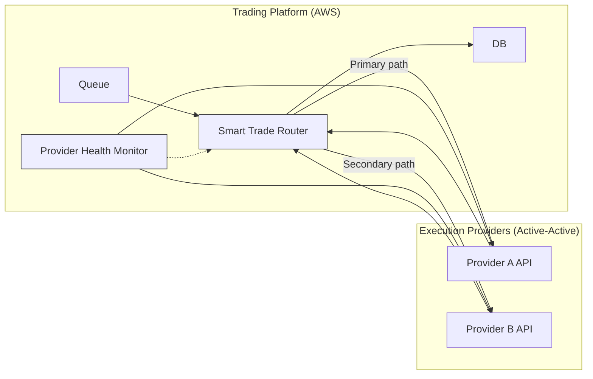

Thank you. I’ll conduct deep research and design a resilient architecture for your B2C personal investor platform, structured across three phases with a foundational trade queuing system. This will include detailed AWS-native and technology-agnostic solutions, professional C4 Mermaid diagrams, structured implementation strategies, and RACI matrices for each phase.

I'll begin by designing the foundational trade queuing system, followed by Phase 1 (Liability Management), Phase 2 (Manual Failover), and Phase 3 (Automated Active-Active Failover). I’ll notify you as soon as the full solution is ready for review.

# Resilient Trade Order Architecture for UK Personal Investor Platform (AWS)

**Overview:** This document presents a **comprehensive, phased architecture** to enhance trade order resilience for a UK-based B2C personal investor platform on AWS (serving ~800,000 customers). The design ensures **operational continuity** in the face of third-party trade provider outages, aligning with FCA operational resilience guidelines (impact tolerances for important business services) ([UK Operational Resilience Rules: Are You Ready for 31 March 2025? | Insights | Sidley Austin LLP](https://www.sidley.com/en/insights/newsupdates/2025/01/uk-operational-resilience-rules-are-you-ready-for-31-march-2025#:~:text=,be%20actively%20managed%20so%20that)). We incrementally introduce a **foundational trade queuing system** and then implement **Phase 1 (Liability Management)**, **Phase 2 (Manual Failover)**, and **Phase 3 (Automated Active-Active Failover)**. Each phase includes a C4 model diagram (Mermaid syntax) and a RACI matrix for clarity in responsibilities. **RTO/RPO objectives** are defined per phase, and all components adhere to FCA rules on customer harm and best execution.

## Foundational: Trade Queuing System (Decoupling & Buffering)

**Goal:** Decouple the platform from a single execution provider by introducing an asynchronous **trade order queue**. This queue buffers customer trade requests during provider downtime, allowing the platform to **fail fast** on the external call and quickly free up resources ([REL05-BP04 Fail fast and limit queues - Reliability Pillar](https://docs.aws.amazon.com/wellarchitected/latest/reliability-pillar/rel_mitigate_interaction_failure_fail_fast.html#:~:text=integration%20pattern%20that%20can%20smooth,has%20already%20given%20up%20on)) while **persisting orders** for later execution. This ensures no orders are lost (improved RPO) and the user-facing service remains responsive even if the downstream broker is down. However, orders may execute with delay.

### Queue Architecture Options (Tech-Agnostic vs AWS-Native)

- **Apache Kafka (Amazon MSK) – Tech-Agnostic:** A distributed log-based streaming platform offering high throughput and persistent storage (configurable retention, e.g. can keep messages indefinitely) ([Choosing between Apache Kafka and Amazon SQS: A developers' guide | Fyno](https://www.fyno.io/blog/choosing-between-apache-kafka-and-amazon-sqs-a-developers-guide-cm3bdumkz000q2bbz0g48grnk#:~:text=Kafka%3A%20Messages%20can%20be%20stored,or%20analyze%20historical%20data%20patterns)). Kafka supports replay/analytics and multiple consumer groups, but it requires managing clusters and partitions. It excels in event streaming and **fine-grained control** over data retention and processing, at the cost of operational complexity ([Kafka vs AWS sqs. When comparing AWS SQS (Simple Queue… | by Alice Dai | Medium](https://medium.com/@qingedaig/kafka-vs-aws-sqs-62338367a90c#:~:text=,data%20retention%20and%20stream%20processing)) ([Choosing between Apache Kafka and Amazon SQS: A developers' guide | Fyno](https://www.fyno.io/blog/choosing-between-apache-kafka-and-amazon-sqs-a-developers-guide-cm3bdumkz000q2bbz0g48grnk#:~:text=to%20manage%20scaling%20yourself)).
    
- **AWS SQS (Simple Queue Service) – AWS Native:** A fully managed message queuing service with virtually unlimited scale (standard queues allow nearly unlimited TPS) ([Amazon SQS standard queues - Amazon Simple Queue Service](https://docs.aws.amazon.com/AWSSimpleQueueService/latest/SQSDeveloperGuide/standard-queues.html#:~:text=Amazon%20SQS%20provides%20standard%20queues,in%20which%20messages%20are%20sent)). SQS is easy to integrate and **auto-scales** without user management ([Choosing between Apache Kafka and Amazon SQS: A developers' guide | Fyno](https://www.fyno.io/blog/choosing-between-apache-kafka-and-amazon-sqs-a-developers-guide-cm3bdumkz000q2bbz0g48grnk#:~:text=Both%20systems%20scale%20differently%3A)). Messages are stored redundantly across multiple AZs for durability (no single AZ failure will lose the message) ([Amazon SQS standard queues - Amazon Simple Queue Service](https://docs.aws.amazon.com/AWSSimpleQueueService/latest/SQSDeveloperGuide/standard-queues.html#:~:text=When%20you%20send%20a%20message,can%20render%20the%20messages%20inaccessible)) and can be retained up to 14 days ([Choosing between Apache Kafka and Amazon SQS: A developers' guide | Fyno](https://www.fyno.io/blog/choosing-between-apache-kafka-and-amazon-sqs-a-developers-guide-cm3bdumkz000q2bbz0g48grnk#:~:text=SQS%3A%20Messages%20are%20retained%20for,requests%20or%20handling%20application%20events)). **FIFO** queues provide ordering and exactly-once processing (with lower throughput), whereas standard queues offer higher throughput with at-least-once delivery (duplicates possible). SQS suits our need to **quickly set up a resilient queue** without infrastructure overhead ([Choosing between Apache Kafka and Amazon SQS: A developers' guide | Fyno](https://www.fyno.io/blog/choosing-between-apache-kafka-and-amazon-sqs-a-developers-guide-cm3bdumkz000q2bbz0g48grnk#:~:text=,message%20volumes%20without%20infrastructure%20overhead)).
    
- **AWS Kinesis Data Streams – AWS Native (Alternative):** A managed streaming service that can ingest and persist high-volume events with ordering per shard. Kinesis offers multi-consumer capability (like Kafka’s pub/sub model) and configurable retention (default 24 hours, up to 7 days or more with extended retention). It could be used for streaming trade events, but for a simple queue of trade orders (single consumer workflow), SQS or Kafka are more straightforward. Kinesis shines for real-time analytics on streams, whereas our primary goal here is reliable queuing and buffering.
    
- **Others:** AWS MQ (managed RabbitMQ/ActiveMQ) could provide standard message broker features (durable queues, pub/sub), but introduces another component to manage. Given the scale (800k users) and need for minimal ops, SQS (or MSK Kafka if replay/multi-consumer needed) are preferred.
    

**Chosen Approach:** **AWS SQS** (Standard Queue) is chosen for the foundational trade queue due to its simplicity, reliability, and native integration. It decouples the front-end from the trade provider with minimal ops burden. Key design considerations:

- **Asynchronous Workflow:** The trade request is accepted by our platform and placed onto SQS. The client gets an immediate acknowledgment (“order received”) rather than waiting for execution.
    
- **Consumer Process:** A **Trade Execution Service** (stateless consumer, e.g. an AWS Lambda or EC2-based worker) pulls from the queue and calls the third-party trade API. This service will **retry on failures**, and if the provider is down, messages remain in SQS (which persist for up to 14 days if needed) ([Choosing between Apache Kafka and Amazon SQS: A developers' guide | Fyno](https://www.fyno.io/blog/choosing-between-apache-kafka-and-amazon-sqs-a-developers-guide-cm3bdumkz000q2bbz0g48grnk#:~:text=SQS%3A%20Messages%20are%20retained%20for,requests%20or%20handling%20application%20events)).
    
- **Backpressure & Scaling:** SQS auto-scales throughput and the consumer can be **horizontally scaled** (multiple workers) to handle surges. If the backlog grows or messages age, CloudWatch metrics (e.g. ApproximateAgeOfOldestMessage) will trigger alarms so ops teams can evaluate (possible failover if prolonged outage).
    
- **Ordering & Deduplication:** If strict ordering per user or instrument is needed, we could use FIFO queues (group by customer) or implement an ordering key. However, FIFO throughput is limited (~300 msg/s per shard). In standard queues, out-of-order or duplicate delivery is rare but possible ([Amazon SQS standard queues - Amazon Simple Queue Service](https://docs.aws.amazon.com/AWSSimpleQueueService/latest/SQSDeveloperGuide/standard-queues.html#:~:text=Amazon%20SQS%20provides%20standard%20queues,in%20which%20messages%20are%20sent)), so the consumer must handle idempotency (e.g. each order has a unique ID; duplicate pickups are recognized and ignored if already processed).
    
- **Dead-Letter Queue (DLQ):** Configure an SQS DLQ for orders that fail processing after a certain number of attempts or remain unprocessed beyond a threshold time. This prevents infinite retries on poison messages and allows manual intervention for stuck orders ([REL05-BP04 Fail fast and limit queues - Reliability Pillar](https://docs.aws.amazon.com/wellarchitected/latest/reliability-pillar/rel_mitigate_interaction_failure_fail_fast.html#:~:text=,a%20system%20is%20in%20failure)).
    
- **Durability & Multi-AZ:** SQS assures high durability by storing messages in multiple AZs ([Amazon SQS standard queues - Amazon Simple Queue Service](https://docs.aws.amazon.com/AWSSimpleQueueService/latest/SQSDeveloperGuide/standard-queues.html#:~:text=When%20you%20send%20a%20message,can%20render%20the%20messages%20inaccessible)). This meets strict RPO=0 requirements (no data loss even if an AZ or component fails). Our application servers and consumer workers will also run in multiple AZs behind load balancers (standard AWS HA practices).
    
- **Security & Compliance:** Ensure the queue is encrypted (KMS) and access-controlled. No sensitive PII is in the queue messages except order details. This aligns with FCA’s expectations of robust controls over critical systems and third-party dependencies ([UK Operational Resilience Rules: Are You Ready for 31 March 2025? | Insights | Sidley Austin LLP](https://www.sidley.com/en/insights/newsupdates/2025/01/uk-operational-resilience-rules-are-you-ready-for-31-march-2025#:~:text=,be%20actively%20managed%20so%20that)).
    

Below is a **C4 Container diagram** (Mermaid) illustrating the trade queue interactions in the foundational architecture:

```mermaid
flowchart LR
    subgraph Customer["Customer (Investor)"]
      UI["Mobile/Web Trading App"]
    end
    subgraph Platform["Trading Platform (AWS)"]
      API["Trade Order API Service"] 
      Queue["Trade Orders Queue (SQS)"]
      Worker["Trade Execution Worker(s)"]
      DB["Order/Trade DB"]
    end
    subgraph ThirdParty["Third-Party Trade Provider"]
      BrokerAPI["Broker Trade API"]
    end

    UI -->|1. Place Order| API
    API -->|2. Enqueue Order| Queue
    API -->|3. Ack to User| UI
    Worker -->|4. Pull Order| Queue
    Worker -->|5. Call Execute| BrokerAPI
    BrokerAPI -->|6. Confirm/Result| Worker
    Worker -->|7. Update Status| DB
    DB -->|8. Send Confirmation| API
    API -->|9. Notify User (Exec Confirmation)| UI

    classDef external fill:#ffd,stroke:#333,stroke-width:1px,color:#000;
    classDef internal fill:#eef,stroke:#333,stroke-width:1px,color:#000;
    class Customer,ThirdParty external;
    class Platform internal;
```

_Description:_ Step 1: Customer places a trade via the app/website. Step 2: The platform’s **Trade Order API Service** puts the order onto the **SQS queue** and returns an acknowledgment to the user (order accepted). Step 4–5: One of the **Trade Execution Worker** instances pulls the next order from the queue and attempts to execute it via the **third-party Broker API**. If the primary broker is **unavailable**, the order remains queued (the worker may log an error and the message will become visible again after a visibility timeout for retry). Step 6–9: Upon successful execution, the worker stores the result in the Orders DB and the user is notified of completion (this could be via websocket/push or a status update in-app). The decoupling means the user-facing part can continue taking orders even if **BrokerAPI** is down – orders will just queue up (buffered for later). Monitoring on the queue length/age helps determine if intervention is needed.

**RTO/RPO (Phase 0:** _Queue in place, single provider_): The introduction of the queue means **RPO = 0** (no lost orders; all orders are persisted durably in SQS). **RTO** for the trade execution service improves from “indefinite outage” to _dependent on backlog processing_: the platform can accept orders continuously, but actual execution is delayed until the provider is back online. Essentially the _trading service is degraded but not completely down_. We still rely on the provider’s own RTO unless we move to failover (later phases). We set an **impact tolerance** (per FCA) that, e.g., all queued orders must be executed within X hours or we invoke failover procedures.

**Compliance:** Even in this foundational state, the system **actively manages third-party risk** – the FCA notes that if a partner outage can take down your service, you must have controls to mitigate it ([Is it Worth the Effort to Move to Active-Active?](https://www.shadowbasesoftware.com/wp-content/uploads/2016/08/Is-It-Worth-the-Effort-to-Move-to-Active-Active.pdf#:~:text=taken%20out%20of%20commission%20by,are%20concerned%2C%20you%20are%20down)). The queue ensures the platform remains within tolerance for short outages by **buffering trades** instead of failing them immediately. We also ensure **best execution** obligations are not violated: if execution is delayed, we will later account for price movements (Phase 1). All customer orders and execution timestamps are logged for audit, supporting any FCA inquiries on outage impact.

### RACI Matrix – Trade Queuing System

|**Activity**|**Trading Dev Team**|**Cloud/DevOps**|**Trading Ops Team**|**Risk/Compliance**|**Third-Party Provider**|
|---|---|---|---|---|---|
|**Design & Architecture of Queue**|A (Lead Architect)|C (Consulted)|C (provide input on operational needs)|C (ensure FCA compliance)|I (informed of approach)|
|**Queue Infrastructure Setup (AWS SQS / MSK)**|R (develop integration code)|R (provision AWS resources, IaC)|I|C (security review)|I|
|**Queue Monitoring Configuration**|C (build app metrics)|R (CloudWatch alarms, dashboards)|I (view alerts)|I|I|
|**Order Enqueuing Logic (App)**|R (implement API to enqueue)|C (review)|I|I|I|
|**Order Consumer/Worker Implementation**|R (implement worker logic, retries, DLQ)|C (deploy scalable compute e.g. AWS Lambda/EC2)|I|C (review error handling policy)|I|
|**Maintenance & Tuning of Queue**|C (optimize message schema)|R (manage SQS scaling, DLQ redrive)|I|I|I|
|**Monitoring Queue Backlog**|C (ensure app logs for delays)|R (24x7 monitor alerts on queue age/size)|C (if backlog growing, evaluate triggering failover)|I|I|
|**Incident Response (Provider Down)**|I (development support if needed)|R (alert on call, execute runbook steps)|R (coordinate with provider, decide on failover)|C (report to regulators if needed)|A (inform outage status)|

_Key:_ **R = Responsible** (executes the task), **A = Accountable** (ultimate owner), **C = Consulted**, **I = Informed**.  
In the above: The **Trading Dev Team** (developers/architects) design the queuing system (Accountable for design), implement application-side changes. **Cloud/DevOps** provisions and operates the AWS queue and related infrastructure (Accountable for AWS setup, monitoring). **Trading Ops Team** (business/operations) is consulted for requirements (and will later decide on triggering failover if queue builds up) and is responsible for managing incidents (communication with provider, initiating failover according to runbooks). **Risk/Compliance** is consulted to ensure the design meets regulatory requirements (e.g. client data security, FCA operational resilience expectations). The **Third-Party Provider** is simply informed of our new buffering mechanism (they may notice bursts of orders after downtime).

---

## Phase 1: Liability Management (Live Price Tracking & Exposure Mitigation)

**Objective:** In a prolonged outage or delay, the market may move away from the price at which the customer placed the order. To protect customers (and the firm) from adverse price movement risk, we introduce a **live price feed monitoring and liability tracking system**. This system will detect when the execution price is likely to differ significantly from the originally quoted price (due to the delay) and estimate the “exposure” or **potential customer harm**. It will also facilitate **automatic reimbursement calculations** for impacted trades. This aligns with FCA principles of treating customers fairly and best execution – if our system’s delay causes a worse price, we may compensate the difference so the client isn’t worse off.

### Real-Time Price Feed Monitoring and Divergence Detection

- **Price Feed Integration:** We consume live market price data for the assets being traded. This can be done via a dedicated market data API or feed (from the primary provider if they supply quotes, or a third-party data service). On AWS, a scalable approach is to stream prices into a service like **Amazon Kinesis Data Streams**. Each price tick (or periodic quote update) is put onto the stream. Downstream, we have a consumer application (could be an AWS Lambda or Kinesis Data Analytics job) that processes these updates in real-time.
    
- **Tracking Pending Orders:** We maintain a list of all customer orders that are queued and pending execution (due to the outage or delay). For example, when an order is enqueued in SQS, we also record its details in a **DynamoDB table** “PendingOrders” – including order ID, timestamp, original quote price, and quantity. DynamoDB is a serverless NoSQL DB that can scale to high write volumes (every trade placed) and provides low-latency retrieval by order ID or other keys.
    
- **Divergence Logic:** For each new price update event, the system checks relevant pending orders to see if the price has moved beyond a threshold from the order’s quote. E.g., if a buy order was queued at £100/share and now the market price is £105, that’s a 5% increase – the customer would pay more than expected. We define thresholds (absolute or percentage) that constitute a significant divergence. If met or exceeded, we flag that order’s **potential exposure** = (current price – quote price) * quantity (for buys; for sell orders, exposure could be quote – current price if current is lower).
    
- **Cumulative Exposure:** The system also aggregates total exposure across all pending orders. For instance, if many orders are delayed, sum the differences to see total risk the firm might need to cover to honor original prices.
    
- **Alerts:** Using **Amazon CloudWatch**, we set alarms on metrics such as:
    
    - _Max price divergence for any single order_ (e.g. > X% or > £Y).
        
    - _Total accumulated exposure_ (e.g. if the firm might owe more than £Z in compensation).
        
    - _Order age_ (e.g. any order waiting > N minutes). When triggers occur, notifications (via Amazon SNS or Slack integration) alert the **Trading Ops/Risk team**. This allows human intervention if needed (e.g. pause new order intake if extreme volatility, or manually notify customers).
        
- **Liability Dashboard:** We can implement a simple dashboard (perhaps with Amazon QuickSight or a custom UI) for ops teams to monitor live price vs quote for pending orders, and the estimated liability in real time.
    

Notably, by continuously monitoring, we **remain aware of potential client harm in real-time**, which is crucial under FCA’s Consumer Duty and best execution rules. The executed price can differ from the quoted price due to settlement delays and volatility ([Fundamentals: What is the difference between quoted, executed, and adjusted prices?](https://0x.org/post/what-is-the-difference-between-quoted-executed-and-adjusted-prices#:~:text=)), so proactively tracking this difference ensures we can make the client whole if needed.

### AWS Services for Implementation

- **Amazon Kinesis Data Streams:** Ingests real-time price feed data (high throughput, scalable). If using a price API that pushes data, an alternative is **Amazon API Gateway + Lambda** or **Amazon EventBridge** to forward price events. But for streaming numerous price ticks, Kinesis is ideal. The stream might have shards partitioned by asset or market.
    
- **AWS Lambda / Kinesis Data Analytics:** A Lambda function can be triggered by batches of stream records to process price updates. It will look up pending orders from DynamoDB (e.g. query by asset or a global secondary index on asset symbol in the PendingOrders table) and compute divergences. Optionally, use Amazon Kinesis Data Analytics (flink SQL) for continuous sliding window computations if needed (though a Lambda with Dynamo lookup is simpler for this use case).
    
- **Amazon DynamoDB:** Stores **PendingOrders** and possibly an aggregate record of exposure. Every new order insert adds an item. When an order eventually executes (leaves queue), we update or remove that item. DynamoDB’s high availability ensures this state tracking is resilient. We might include a TTL (time-to-live) on items to auto-expire ones that are executed (with a delay).
    
- **Amazon CloudWatch & SNS:** CloudWatch will track custom metrics (we can publish, for example, the current max divergence or total exposure as a custom metric from our Lambda after each price cycle). Alerts on these metrics will notify via SNS to email/SMS/on-call. Also, CloudWatch Events (EventBridge) could trigger automated Lambda responses for certain conditions (e.g. if exposure high, automatically invoke some reimbursement logic or trigger failover).
    
- **AWS Step Functions (optional):** If the compensation process needs a workflow (e.g. notify customer, credit account, log completion), Step Functions could orchestrate that once an order executes with deviation.
    

### Reimbursement Logic for Customer Impact

When a delayed trade finally executes, we compare the **executed price vs the original quote** for that order:

- If the customer got a _worse price_ due to the delay (e.g. buy executed higher, or sell executed lower than quote), the platform will compensate the difference. For example, if a buy order for 100 shares was quoted at £10 (would cost £1000) but executed at £12 (£1200), the customer paid £200 more. The platform could refund £200 to the customer’s account to honor the original quote cost.
    
- If the customer got a _better or equal price_ (market moved favorably or unchanged), no compensation is needed (or we could optionally pass on the improvement, but typically firms don’t need to if price improved).
    
- The **Liability Management Service** (could be a component or Lambda triggered on order execution events) will calculate the difference for each order. It will record a **reimbursement entry** (e.g. in a DynamoDB table or core database) and either automatically credit the customer (if business policy allows automated credit) or create a task for the Finance team to approve and credit.
    
- **Edge cases:** If the price moved so much that executing is very unfavorable, ops might decide to cancel the order (with customer consent) instead of executing at a bad price and reimbursing – depending on trading terms. This process would be handled via communications outside this automation but flagged by our system.
    

The reimbursement logic ensures that even though we are buffering trades for resilience, customers are not financially harmed by delays. This supports FCA’s focus on avoiding intolerable harm to clients of important services ([UK Operational Resilience Rules: Are You Ready for 31 March 2025? | Insights | Sidley Austin LLP](https://www.sidley.com/en/insights/newsupdates/2025/01/uk-operational-resilience-rules-are-you-ready-for-31-march-2025#:~:text=1,This%20is%20the)) ([UK Operational Resilience Rules: Are You Ready for 31 March 2025? | Insights | Sidley Austin LLP](https://www.sidley.com/en/insights/newsupdates/2025/01/uk-operational-resilience-rules-are-you-ready-for-31-march-2025#:~:text=2,operation%20of%20the%20financial%20markets)). It effectively treats large price divergences as incidents requiring remediation (compensation).

Below is a **C4 diagram** focusing on the Phase 1 additions (price feed and liability monitoring) integrated with the foundational architecture:

```mermaid
flowchart TB
    subgraph Platform["Trading Platform (AWS)"]
      direction TB
      API["Trade Order API"]
      Queue["Trade Orders Queue (SQS)"]
      Worker["Trade Execution Worker(s)"]
      PendingDB["PendingOrders DB (DynamoDB)"]
      PriceStream["Price Feed Stream (Kinesis)"]
      PriceConsumer["Price Divergence Monitor (Lambda)"]
      ExposureDB["Liability/Exposure Records (DynamoDB)"]
      Alerting["CloudWatch Alerts/SNS"]
      ReimburseFn["Reimbursement Processor (Lambda)"]
    end
    subgraph MarketData["Market Price Feed Provider"]
      PriceAPI["Live Market Data API/Feed"]
    end
    subgraph ThirdParty["Primary Trade Provider"]
      BrokerAPI["Broker Trade API"]
    end
    API --> Queue
    Queue --> Worker
    Worker --> BrokerAPI
    BrokerAPI --> Worker
    Worker -->|Update| PendingDB:::db (remove executed order)
    API -->|On Order| PendingDB:::db (add new order)
    MarketData -->|Price Updates| PriceStream
    PriceStream --> PriceConsumer
    PendingDB -->|Check pending orders| PriceConsumer
    PriceConsumer -->|Publish metrics| Alerting
    PriceConsumer -->|High exposure alert| Alerting
    PriceConsumer -->|Record exposure| ExposureDB:::db
    Worker -->|Exec result| ReimburseFn
    PriceConsumer -.Optional-> ReimburseFn
    ReimburseFn -->|Credit/adjust| ExposureDB:::db
    ReimburseFn -->|Notify Ops/Customer| Alerting

    classDef db fill:#fff,stroke:#333,stroke-width:1px,color:#000;
```

_Description:_ The core trade flow (API -> Queue -> Worker -> BrokerAPI) remains as before. New components: **MarketData PriceAPI** provides live prices into a **Kinesis PriceStream**. A **Price Divergence Monitor Lambda** consumes these price events and cross-references any **PendingOrders in DynamoDB** (populated by the Trade API when placing orders, and cleared by the Worker on execution). If a significant price move is detected for a pending order, it records the exposure in an **Exposure/Liability DB** and triggers **CloudWatch Alerts/SNS** (to inform ops or risk teams). The **Reimbursement Processor** is triggered when an order execution result comes back (the Trade Execution Worker can invoke it with order details). The processor calculates if a credit is due and updates the records (and possibly directly credits the client’s account balance or creates a payout request). It may also be invoked by the monitor if we choose to preemptively compensate before execution in extreme cases (dotted line optional). Alerts/notifications are sent so that operations and customer service are aware of compensations made.

**RTO/RPO:** Phase 1 doesn’t change the core service RTO for execution (that is addressed in Phase 2/3), but it addresses **“impact tolerance”** in terms of customer harm. The platform’s **RPO remains 0** (no lost data). The **RTO for serving clients without harm** is improved: even if execution is delayed beyond our tolerance, the _financial impact_ to clients is mitigated within minutes via monitoring and credits. Essentially, the service can be “down” longer without causing intolerable harm, because we ensure clients aren’t out-of-pocket due to delays. This helps remain within FCA-defined tolerances for important business services even during a disruption ([UK Operational Resilience Rules: Are You Ready for 31 March 2025? | Insights | Sidley Austin LLP](https://www.sidley.com/en/insights/newsupdates/2025/01/uk-operational-resilience-rules-are-you-ready-for-31-march-2025#:~:text=impact%20tolerances%20for%20each%20of,new%20rules%2C%20including%20written%20records)). We might document that if primary execution is down > X minutes, our impact tolerance is, say, customers lose £0 (we guarantee to reimburse), thus we can tolerate longer outage from a customer outcome perspective, albeit with cost to us.

**Compliance:** The liability management system is designed in line with **FCA best execution** duties – taking “all sufficient steps” to get the best outcome for clients ([COBS 11.2A Best execution – MiFID provisions - FCA Handbook](https://www.handbook.fca.org.uk/handbook/COBS/11/2A.html#:~:text=Handbook%20www,into%20account%20the%20execution%20factors)). If our platform cannot execute immediately, we effectively ensure the client receives as good as or better outcome than the quoted terms, fulfilling the spirit of best execution. All adjustments and exposures would be recorded for transparency. The firm’s compliance team would oversee the reimbursement policy (e.g. thresholds at which we compensate) to ensure fairness and consistency. Additionally, maintaining records of price discrepancies and client communications will be important for audit and possible regulatory reporting (e.g. if a major incident, we’d report how many clients were affected and how we compensated them).

### RACI Matrix – Phase 1 (Liability Management)

|**Activity**|**Trading Dev Team**|**Cloud/DevOps**|**Trading Ops/Risk Team**|**Compliance/Finance**|**Market Data Provider**|
|---|---|---|---|---|---|
|**Integrate Live Price Feed** (setup API/Kinesis)|R (build consumer code)|R (configure Kinesis, network access)|I (use data for monitoring)|C (approve data source contracts)|A (ensure feed reliability)|
|**Pending Orders DB Design** (schema for Dynamo)|R (design & implement)|C (capacity planning, IAM roles)|I|C (data retention policy)|–|
|**Divergence Detection Logic** (Lambda code)|R (develop & unit test)|C (deploy Lambda, set env thresholds)|C (set risk thresholds, consulted on logic)|C (ensure threshold logic aligns with duty)|–|
|**Alerting and Monitoring Setup**|C (define metrics to watch)|R (CloudWatch alarm creation, SNS topics)|A (Risk team owns threshold values and responding to alerts)|I (informed of alerts and outcomes)|–|
|**Reimbursement Calculation Engine**|R (implement computation, integration with accounting)|C (ensure secure deployment)|C (Ops to validate calculations, handle exceptions)|A (Finance accountable for customer credits, approves large payouts)|–|
|**Customer Communication for Delays**|C (provide data for messaging)|–|R (Trading Ops/Customer Support notifies clients of delays and any compensation)|A (ensure communications meet regulatory standards)|–|
|**Liability Policy & Thresholds**|C (advise on tech feasibility)|–|C (Risk provides input on risk appetite)|A (Compliance sets policy for when to compensate)|–|
|**System Monitoring & Maintenance** (price feed, Dynamo)|–|R (ensure feed running, DB performance)|I (monitor outputs)|I|A (maintain feed uptime per SLA)|

_Notes:_ The **Dev Team** is responsible for implementing the feed integration, divergence logic, and reimbursement function. The **Cloud/DevOps** team sets up the AWS services (Kinesis, DynamoDB, Lambdas, CloudWatch alarms) and ensures scalability and security of those. The **Trading Ops/Risk Team** (which may include a risk manager) is accountable for handling the alerts – they own the decision thresholds and the response (thus marked Accountable for alerting outcome). They coordinate any manual decisions (e.g. halting trading or informing clients). **Compliance/Finance** are heavily involved: Compliance sets the overarching policy (Accountable for the compensation policy and client fairness), Finance is accountable for executing reimbursements (approving and processing credits) – we combine them here as they must work together on this process. The **Market Data Provider** (could be the same as trade provider or separate) is accountable for delivering reliable price data (if the feed goes down, our monitoring fails, so we might even have secondary data sources, though not detailed here).

---

## Phase 2: Manual Failover to Secondary Provider

**Objective:** Introduce a **secondary trade execution provider** and define a **manual failover process** to use this backup when the primary provider is down for an extended period. This phase reduces downtime (RTO) by providing an alternative path for order execution, albeit activated manually. The transition is designed to be minimally disruptive: the goal is that customers can continue trading through the secondary provider if the primary fails, with operational teams performing the switch in a controlled manner.

### Architecture for Dual-Provider Integration

In this architecture, our platform is connected to **two trading providers** (Primary and Secondary). We abstract the provider-specific details behind a **Trade Provider Interface** within our system:

- The **Trade Execution Worker/Service** from Phase 0 is enhanced to be aware of multiple providers. It could call a local function or check a flag to decide which provider’s API to send orders to.
    
- We maintain configuration (perhaps in a DynamoDB config table or AWS Systems Manager Parameter Store) indicating the **“Active Provider”**. In normal state, this is “Primary”. In failover, ops will switch it to “Secondary”.
    
- The architecture remains largely the same up to the queue. We still queue orders, but _which endpoint processes them can change_. For example:
    
    - Option A: Keep a **single unified queue**. The worker knows which provider is active and sends all orders accordingly. During failover, we simply toggle the target and the same queue is drained into the secondary API.
        
    - Option B: Use **two separate queues** (one per provider) and have workers for each, but normally only Primary’s queue receives orders. In a failover scenario, new orders start going to Secondary’s queue. (This is more complex and not necessary if we can just switch endpoints on the fly. We prefer a single queue for simplicity.)
        
- **Secondary Provider API Integration:** Ahead of time, we fully integrate and test the secondary provider’s API (connectivity, authentication, message format). It might differ from the primary’s, so the Trade Execution Service may need a plugin or adapter for each. For example, we might have a ProviderAClient and ProviderBClient implementing a common interface. At runtime, the service picks one.
    
- **Data Consistency:** Ensure that whether orders execute on Provider A or B, our platform records them uniformly in our database. Customer positions and balances should update the same way. This might require pulling execution results from both providers (e.g. via webhooks or polling their order status). We must consolidate that into our system of record so that a customer’s portfolio reflects all trades regardless of provider. This is crucial for a seamless customer experience.
    
- **Minimal Disruption:** Because the failover is manual, we likely will **pause order processing momentarily** during the switch:
    
    - When ops decide to fail over, they might stop the queue consumers (to avoid sending to a down provider or switching mid-flight).
        
    - Ensure any in-flight orders with the primary are resolved (or marked failed) to avoid duplication.
        
    - Flip the config to Secondary.
        
    - Restart consumers (or they pick up new config) so new queued orders now go to secondary.
        
    - There may be some orders still queued that were intended for primary. Since our approach uses one queue and simply changes endpoint, those orders will now go to secondary after failover. This is fine if both providers can handle those orders (they likely can, assuming they trade the same instruments).
        
    - It’s important to confirm that none of those orders actually got executed by primary right before the failover. This implies we need a clear signal of primary outage and perhaps confirm primary isn’t partially executing. We might rely on the primary’s outage declaration or a timeout threshold.
        
- **Post-Failover Sync:** After switching, the backlog will be processed by secondary. The ops team should inform the secondary provider about any unusual volume incoming and monitor that provider’s performance closely. Meanwhile, the primary provider’s status is monitored for recovery. We do not automatically switch back in Phase 2; that will be a deliberate decision (likely off-hours or after draining all orders).
    
- **Client Transparency:** It may be prudent to notify customers that we are using a backup execution venue, especially if there are any differences (possibly execution costs or slight differences in how confirmations look). However, ideally the switch is transparent and client sees no difference except perhaps a note in terms & conditions that a backup may be used.
    

Below is a C4 container/component diagram showing integration of a secondary provider and the manual control:

```mermaid
flowchart LR
    subgraph Platform["Trading Platform (AWS)"]
      Queue
      WorkerPrimary["Trade Exec Worker A (Primary Mode)"]
      WorkerSecondary["Trade Exec Worker B (Secondary Mode)"]
      Switch["Failover Toggle (Config Flag)"]
      API
      DB
    end
    subgraph ProviderA["Primary Provider"]
      APIA["Primary Trade API"]
    end
    subgraph ProviderB["Secondary Provider"]
      APIB["Secondary Trade API"]
    end

    API --> Queue
    Switch -.-> WorkerPrimary
    Switch -.-> WorkerSecondary
    Queue --> WorkerPrimary
    Queue --> WorkerSecondary
    WorkerPrimary --> APIA
    WorkerSecondary --> APIB
    APIA --> WorkerPrimary
    APIB --> WorkerSecondary
    WorkerPrimary --> DB
    WorkerSecondary --> DB

    WorkerPrimary -.disabled.-> X[ ]
    WorkerSecondary -.disabled.-> Y[ ]

    classDef inactive stroke-dasharray: 5 5,color:grey;
    X & Y are placeholders to indicate one worker is inactive depending on switch;
    class X,Y inactive;
```

_Description:_ Here we illustrate two sets of workers or two modes for the Trade Execution service – one pointing to Provider A, the other to Provider B. In practice, this could be a single service instance where the “Switch” (failover flag) determines which API endpoint to call, or we could literally scale down one worker group and scale up another. The **Failover Toggle** is controlled manually by operations. Under normal conditions, **WorkerPrimary** is active and **WorkerSecondary** is idle. When failover is initiated, the toggle flips: WorkerPrimary is disabled and WorkerSecondary is activated (depicted conceptually by the dashed lines). The same **Queue** feeds whichever worker is active, so order messages don’t care which provider—they’re just processed by whichever consumer is running. Both workers write to the same DB for consistency. This design ensures **minimal disruption**: we don’t need to reroute feeds or change how orders are queued; we only change which external API gets called.

### Manual Failover Procedures (Runbook)

A clear runbook is crucial for manual failover to ensure timely and error-free execution. Key steps might include:

1. **Detect Need for Failover:** Operations monitor the primary provider’s health. Triggers include:
    
    - CloudWatch alarms from Phase 1 (e.g. queue age > X, meaning orders piling up).
        
    - Heartbeat pings to primary API failing.
        
    - An official outage notification from the provider.
        
    - If primary is partially working but performing poorly (high error rate), a judgment call may be needed.
        
    - FCA guidelines require that we remain within impact tolerance, so if outage is approaching that limit, we prepare to failover.
        
2. **Notify Internal Stakeholders:** Ops informs relevant teams (DevOps, Risk, Compliance, Customer Service) that failover is being initiated. Ensure the secondary provider is alerted as well (so they can expect incoming orders).
    
3. **Quiesce Primary Flow:** Temporarily halt new order intake or processing:
    
    - Possibly set the front-end to a “draining mode” for a minute: accept orders but warn of slight delay, or simply continue as normal if queueing is fine.
        
    - Stop the trade execution consumers (e.g. if they are running on EC2 or as Lambda event source mapping, disable the event source).
        
    - Ensure no message is mid-processing. (For safety, one could purge any in-memory tasks or let current Lambda invocations finish.)
        
    - Confirm from monitoring that no orders are being sent to primary (and any that were in flight either timed out or failed).
        
4. **Switch Config to Secondary:** Flip the Failover Toggle:
    
    - If using SSM Parameter Store or Feature Flag service, update the “activeProvider” parameter to “Secondary”. This could also be a DNS switch if we had a custom domain for provider (e.g. trade-api.service which CNAMEs to one of the providers), but usually better to handle in application logic.
        
    - The Trade Execution Worker(s) should pick up this change. If stateless Lambdas, we might deploy a config change or have them read from parameter store on each invocation. If EC2, restart or send a signal to use new config.
        
    - Alternatively, bring up a separate set of consumers already configured for Secondary.
        
5. **Resume Processing to Secondary:** Start processing orders:
    
    - Enable the consumers (pointing to secondary). They will start retrieving from the queue and calling Secondary’s API.
        
    - Watch the first few orders closely in logs: did they execute successfully at secondary? Is the response handling okay? Validate that results are correctly recorded.
        
    - Increase throughput gradually if needed (e.g. if we limited concurrency, now scale out to catch up backlog).
        
6. **Communicate:** While tech steps happen, **Customer Service** may send out a notice to customers (if required by policy) that we are using alternate execution due to technical issues, and that all orders are being handled. Transparency can reduce panic, but this depends on legal/PR advice. At minimum, front-line support should be informed to answer customer queries.
    
    - Also, consider FCA notification if the outage is severe. Major firm-wide incidents often require regulatory notification within a tight time frame. Since we have continuity via secondary, we might report it as a near-miss or an incident handled via contingency.
        
7. **Monitor Secondary Performance:** Ensure the secondary provider is keeping up. They might have capacity limits; watch for any throttling or errors. Also monitor market conditions – if this is during high volatility, secondary might also strain, so be prepared.
    
8. **Post-failover Operations:**
    
    - The liability monitoring from Phase 1 still runs. But now, if secondary has different pricing or fees, ensure our reimbursement logic still holds if needed.
        
    - The Risk team should track if using secondary is causing any different costs or slippage.
        
    - Keep primary provider’s status under watch. We do not auto-failback in this phase, but plan a controlled failback once primary is stable, likely outside of market hours or when backlog is clear.
        
9. **Failback (Manual):** Similar process to switch back when confident. Possibly wait for a lull or after market close. Ensure all orders on secondary are completed, then reverse the steps (halt consumers, toggle to primary, resume).
    
    - Before failing back, reconcile any open orders: e.g., if there were Good-til-cancel orders in flight on secondary or trades not fully settled, handle those.
        

The manual process should be tested in advance (in a non-prod environment or during a weekend maintenance window) to iron out any issues. Staff should be trained and drills conducted, as per operational resilience best practices (scenario testing is required by FCA ([UK Operational Resilience Rules: Are You Ready for 31 March 2025? | Insights | Sidley Austin LLP](https://www.sidley.com/en/insights/newsupdates/2025/01/uk-operational-resilience-rules-are-you-ready-for-31-march-2025#:~:text=system%20or%20the%20orderly%20operation,of%20the%20financial%20markets))).

### Risk Analysis and Mitigations

**Regulatory Risks:**

- _Data Sharing & Compliance:_ Using a secondary provider means client data (orders) go to another entity. Ensure appropriate agreements and GDPR considerations (UK customers’ data handling) are in place. Mitigation: Data minimalism (share only what’s needed to execute trades), encryption in transit, and contractual clauses for data protection.
    
- _Best Execution:_ We must ensure the secondary provider offers comparable execution quality. If the secondary has significantly worse pricing or higher fees, we could be seen as not getting best execution. Mitigation: choose a reputable secondary and regularly compare execution quality metrics between providers ([FCA finds firms fail to deliver best execution](https://www.fca.org.uk/news/press-releases/fca-finds-firms-fail-deliver-best-execution#:~:text=FCA%20finds%20firms%20fail%20to,when%20trading%20on%20their%20behalf)). Document in the Best Execution policy that secondary is used only when primary is down, as executing at all (even with possibly slightly higher cost) is better for clients than not executing.
    
- _Regulatory Notification:_ A failover indicates a major incident with the primary. FCA may expect an incident report. Mitigation: maintain detailed logs of the incident timeline, decisions made, and outcome (no client harm due to our processes), to demonstrate compliance with operational resilience requirements.
    
- _License/Permission:_ If our regulatory permission (e.g. as a broker or agent) is tied to using a specific provider or venue, adding a new one might require notifying regulators or clients. Mitigation: Get approvals and update disclosures in advance.
    

**Financial Risks:**

- _Cost of Secondary:_ The secondary provider might charge higher fees per trade, affecting profit margins. Mitigation: Accept this as insurance cost; only used in emergencies. Possibly negotiate a standing-by rate or pay-as-you-go plan.
    
- _Volume Capacity:_ The secondary may not handle the full load of 800k customers if suddenly all trade through them, especially during a volatile period. Mitigation: Test capacity with the secondary (ask for their peak capacity, maybe only route a portion of flow in a test scenario to them to gauge). Also, communicate expected volumes to them in contract.
    
- _Dual Execution:_ The worst case would be an order that ends up executed on both providers (e.g., primary recovers and processes some orders at the same time we sent them to secondary). This could double-fill and create reconciliation issues and potentially financial loss if we have to unwind one. Mitigation: Use unique order IDs and have idempotency checks. When primary recovers, it should not blindly execute previously failed orders without confirmation from us. Ideally, we cancel or ignore any previously sent orders on primary once failover starts. If primary’s system has orders queued on their side, coordinate to cancel them when declaring outage.
    
- _Settlement and Positions:_ If providers also custodian assets, having trades split could mean some assets end up in two places. For simplicity, assume they are purely execution brokers sending trades to the market, and our platform (or a custodian) holds assets. If not, we need a post-trade reconciliation to perhaps transfer resulting holdings from secondary’s custody to primary later. Mitigation: Align on post-trade settlement – possibly the secondary could transfer assets to our main custodian or we allow temporary dual-custody. This is complex but manageable with ops procedures.
    

**Technical Risks:**

- _Integration Bugs:_ The secondary path might not be as well-tested as primary. Mitigation: Do regular tests and keep the integration up-to-date. Perhaps periodically route a small fraction of trades (or synthetic test orders) through secondary to ensure it works (this blends into Phase 3 approach of active-active testing).
    
- _Latency or API Differences:_ The secondary’s API might be slower or have slight differences (e.g. different order types supported). This could cause unforeseen issues (timeouts, etc.). Mitigation: account for differences in code (maybe abstract via strategy pattern), increase timeouts if needed, and test thoroughly.
    
- _Operational Error:_ Manual processes can introduce human error (e.g. flipping the switch the wrong way, or not realizing an order stuck). Mitigation: Checklists for failover, dual approval on the switch if possible (e.g. two people agree to change the config), and robust monitoring so it’s obvious if something goes wrong.
    

**Mitigations Summary:** In addition to the above, the company should perform **scenario testing** as required by the FCA ([UK Operational Resilience Rules: Are You Ready for 31 March 2025? | Insights | Sidley Austin LLP](https://www.sidley.com/en/insights/newsupdates/2025/01/uk-operational-resilience-rules-are-you-ready-for-31-march-2025#:~:text=system%20or%20the%20orderly%20operation,of%20the%20financial%20markets)). For example, simulate a primary provider outage on a busy trading day and practice the failover procedure. This will reveal gaps and build confidence. Also, maintain close relationship with both providers; get early warnings of issues if possible.

### RTO/RPO for Phase 2

With a manual failover, our **target RTO for trade execution improves significantly**. Instead of waiting possibly hours for the primary to come back, we can restore service by switching to backup, ideally within minutes. For example, we might set an RTO of 30 minutes (from outage detection to failover complete) as an impact tolerance. This means even in a severe primary outage, clients can resume trading within 30 minutes via secondary. In practice, with a well-drilled process, it could be faster (5-10 minutes), but we account for diagnosis and communications.

**RPO remains 0** – we still do not lose any orders or data. Orders that were queued are processed by secondary, and all trade records are captured.

One nuance: if the primary outage also involved loss of any data on their side (e.g. an order was confirmed received by them but not executed), our platform might not be aware. However, since we queue internally, we wouldn’t mark an order as complete until we get confirmation. So any uncertainty from primary’s side is mitigated by our internal source of truth and the failover process (which might treat any unconfirmed orders as needing execution elsewhere).

Thus, Phase 2 achieves a significant resilience boost: **the service can continue operating within a short downtime window** even if the main vendor fails – consistent with “important business service” continuity expectations. As one reference notes, _if a partner outage can take you down, you are effectively down_ ([Is it Worth the Effort to Move to Active-Active?](https://www.shadowbasesoftware.com/wp-content/uploads/2016/08/Is-It-Worth-the-Effort-to-Move-to-Active-Active.pdf#:~:text=taken%20out%20of%20commission%20by,are%20concerned%2C%20you%20are%20down)); by having a secondary partner, we remove that single point of failure.

### RACI Matrix – Phase 2 (Manual Failover to Secondary)

|**Activity**|**Trading Dev Team**|**Cloud/DevOps**|**Trading Ops Team**|**Compliance/Risk**|**Secondary Provider**|
|---|---|---|---|---|---|
|**Secondary API Integration Development**|R (implement adapter in code)|C (assist with network/firewall, secrets management)|I (provide requirements e.g. features needed)|C (due diligence on provider, approve data sharing)|C (tech support during integration)|
|**Testing Secondary Execution (pre-production)**|R (write test cases, conduct dry runs)|R (set up test environments)|C (verify trades flow end-to-end)|I (review test results)|R (assist in UAT, provide sandbox)|
|**Runbook Preparation (Failover procedures)**|C (technical steps validation)|C (infrastructure steps)|A (author and own the runbook)|C (ensure compliance steps included)|I (may be informed of procedure)|
|**Decision to Initiate Failover**|I (support with technical input)|I (provide monitoring data)|A (Operations Manager makes call)|C (Risk consulted if borderline scenario)|I (notified when we switch)|
|**Executing Failover Switch**|I|R (flip config flag in AWS, re-deploy as needed)|R (coordinate timing and pause/resume of processing)|I (observe/record for incident log)|I (acknowledge and prepare for load)|
|**Communication During Incident**|I|I|R (communicate to internal teams, customers, and possibly regulators)|C (approve customer/regulator communications)|I (coordinate comms on their side if needed)|
|**Monitoring during Failover**|C (ensure application metrics)|R (infrastructure metrics, e.g. AWS, network health)|A (monitor overall success, no orders failing)|I (oversee risk levels)|R (monitor their systems for influx)|
|**Post-Failover Review/Reporting**|C (provide logs, data)|C (provide system metrics)|R (prepare incident report, lessons learned)|A (ensure FCA reporting if required)|I (give their incident report)|
|**Failback to Primary** (planning & exec)|C|R (technical config revert)|A (decide when to failback)|C (risk assessment before switching back)|C (coordinate readiness to resume primary)|

In this matrix: The **Ops Team** is clearly **Accountable** for the overall failover process (they own the runbook and the decision making during an incident). Dev and DevOps are mostly Responsible for executing the technical aspects (integration, switching the config). Compliance/Risk is consulted at key points to ensure all regulatory angles are covered (and they take accountability for any external reporting). The Secondary Provider is also actively involved: during integration testing they are Responsible for helping test (providing a sandbox, etc.), during actual failover they are kept in the loop (maybe they’ll have their support on call to handle issues).

---

## Phase 3: Automated Active-Active Failover (Multi-Provider Resilience)

**Objective:** Evolve to a fully **automated, active-active architecture** where both providers can be utilized in real-time, and the system intelligently routes trades to whichever provider is optimal or available. This phase aims for near-zero downtime (transparent failover within seconds) and improved load distribution. Essentially, the platform will always have both execution paths available and can dynamically switch or split traffic based on health checks and performance metrics. This is the ultimate in resilience: even if one provider fails, the system self-heals by routing to the other without manual intervention, maintaining continuous service.

### Active-Active Trade Routing Architecture (AWS-Native & Agnostic)

**Core idea:** Implement a **Trade Routing Layer** that sits between the trade queue and the external providers. This layer makes real-time decisions for each order: Primary vs Secondary (or even split orders if that made sense, though likely we choose one per order).

Possible implementations:

- A **Lambda function** triggered per message from SQS that contains logic to call the appropriate provider. (Lambdas cold start might add latency, but we can optimize with provisioned concurrency if needed. Or use a container service for always-on.)
    
- A **Containerized microservice** (e.g. running in ECS/Fargate or Kubernetes/EKS) that pulls from the queue and routes trades. This could maintain in-memory health status and counters for faster decisions.
    
- We might also consider AWS Step Functions to orchestrate a try-primary-then-secondary flow for each message (Step Functions can have a flow: attempt API A, if exception, call API B). This would ensure if primary fails for that message, it automatically tries secondary. This is a simpler active-passive per request rather than load-balancing, but yields automated failover on a per-trade basis.
    
- Regardless of compute, the decision engine should use a **circuit breaker** pattern for each provider:
    
    - Continuously monitor provider health (via synthetic calls or via error rates).
        
    - If Primary is healthy, route normally. If Primary has an outage (circuit open), route all to Secondary until Primary healthy again (then gradually resume).
        
    - If Secondary fails while Primary is also up, route back to Primary (or if both fail, we’re back to queue waiting – extremely unlikely both fail simultaneously, but we should handle gracefully).
        
    - Possibly route a percentage of traffic to the secondary at all times (“active-active load balancing”) to keep it warm and tested, and to maybe share load if needed.
        
- **Health Checks:** We can implement background health check pings:
    
    - Use a scheduled Lambda or a sidecar process to call a lightweight endpoint of each provider (if available) or even just do a quick authentication call.
        
    - Measure latency and success. Update a status (e.g. in a DynamoDB table or an in-memory variable if inside a long-running service).
        
    - AWS does not natively health-check external APIs for us except maybe through Route53 Health Checks, but those could be used in a creative way: e.g. set up two private Route53 records (PrimaryAPI and SecondaryAPI) that point to respective endpoints and attach health checks. Then our routing could query Route53 health or use the DNS failover feature. However, since these are external, Route53 health checks would just mark them healthy/unhealthy and can automatically switch DNS if we had an abstraction domain. But since we likely are calling them by host, better to do app-level checks.
        
- **Smart Routing Criteria:** Beyond simple up/down, we might include:
    
    - _Latency:_ If one provider’s latency spikes (taking too long to ack orders), the router might prefer the other if it’s faster. Low latency is important for client experience.
        
    - _Error rate:_ If provider A’s error rate (failed trades, timeouts) goes above a threshold in last X minutes, shift traffic to B.
        
    - _Capacity usage:_ If we intentionally split load (say 70/30 normally) and one is reaching a capacity limit (e.g. we observe slower responses as volume increases), adjust distribution.
        
    - _Instrument-based routing:_ Perhaps one provider might specialize in certain assets (maybe one is better for stocks, another for funds). The router could choose provider based on the asset type for optimization. However, our scenario didn’t specify differences in coverage, so assume both can handle all our trades.
        
    - These decisions could be coded with a dynamic algorithm or a simple rule set. A/B testing approach or machine learning might be overkill; a rule-based engine suffices.
        
- **Stateful vs Stateless:** The router should treat each order independently. Ensure that if an order fails on one provider mid-processing, it can be tried on the other without duplication. A possible approach is:
    
    - On pulling an order, try Primary synchronously. If it responds with failure (or doesn’t respond in a short timeout), immediately try Secondary. This all happens within the same processing context (like a Step Function or a single Lambda invocation that encapsulates both tries). This gives the fastest failover per order (no need to requeue and wait).
        
    - If both fail (rare), perhaps put the message back in queue (or to DLQ) for later manual intervention.
        
    - This approach ensures an order is executed at most once successfully. If Primary succeeds, we don’t call Secondary. If Primary fails, we try Secondary. We need to be careful if the Primary call is actually just slow and not fully failed when we kick off Secondary – but typically we’d enforce a strict timeout.
        
    - Alternatively, a design with two separate consumer groups each reading the queue in parallel (one for each provider) could lead to race conditions and duplicates, so better to have one logical consumer deciding.
        
- **Data consistency:** As in Phase 2, results from both providers must feed into our unified databases. Likely, the same order database now includes a field for provider used, or separate tracking, but still unified view for the customer.
    

**AWS Considerations:**  
We can leverage AWS for some routing:

- Using **AWS Application Load Balancer** with weighted target groups might come to mind, but that works for routing incoming HTTP requests to servers, not for our scenario of calling external endpoints.
    
- However, we could create an internal proxy service that the worker calls, and that proxy (behind an ALB) then forwards to provider A or B based on health. This is an extra layer and might replicate what we do in code.
    
- **AWS Route 53 DNS Failover:** If we had control of the domain for providers (which we usually don’t), or if providers had multiple endpoints, Route53 could failover. Not directly applicable since these are third-party URLs.
    
- **AWS SDK Retries or API Gateway:** If providers offered some kind of interchangeable endpoints, maybe not applicable. So likely custom code is the way.
    

This architecture is largely cloud-agnostic in concept: one could implement similar logic on-prem. But AWS gives us the glue (Lambda, Step Functions, CloudWatch, etc.) to do it serverlessly if desired.

Below is a C4 diagram of the **active-active routing**:



_Description:_ The **Smart Trade Router** (a component within our platform) reads orders from the queue and decides which provider’s API to call. It consults ongoing input from the **Provider Health Monitor**, which continuously pings or observes Provider A and B (the dotted line indicates the router is aware of health metrics or status). Under normal conditions, Router sends to **Provider A** (primary) by default. If Provider A is down or deemed unhealthy, Router sends orders to **Provider B**. It can also split some traffic or instantly failover per order if a call to A fails. Both provider responses come back to the Router which then updates the system **DB** (mark order executed, etc.). The Health Monitor calls both Provider A and B periodically to update their status (and possibly latency stats). This is an automated feedback loop. Both providers are effectively **active** in the sense the system can use either at any time. If both are healthy, we might still mostly use A (if cheaper or preferred) but we could send a trickle to B (this ensures B is always tested – a technique to avoid “stale” standby). If A goes down, we ramp up B to 100% immediately. If B goes down (or slower), we can stick with A. If both have issues, at least one might handle some volume or worst-case orders queue up until one recovers (which is similar to Phase 0 scenario but now much less likely that _both_ fail).

### Continuous Validation Strategies (Chaos Engineering & Synthetic Testing)

Achieving confidence in an active-active setup requires **continuous testing** because you don’t want the first real outage to be the first time the system switches. Strategies include:

- **Synthetic Transactions:** Regularly (say every few minutes) generate a test trade order through the system. This could be a trade on a test symbol or a tiny amount that is harmless. Mark it as a synthetic order (so it doesn’t affect real customer accounts). The order should be processed by the routing logic as usual. We verify it executes successfully on whichever provider it went to. If possible alternate which provider it targets (perhaps by temporarily simulating one provider down to force the path). These synthetic trades act like canaries to ensure both paths work. They can also measure latency (how fast did each provider execute the trade).
    
- **Chaos Testing (Fault Injection):** Use tools or scripts to simulate provider failures:
    
    - For example, one could have a toggle to **block outgoing traffic** to Provider A (simulate an API blackout) or make it return errors. On AWS, this could be done with the **AWS Fault Injection Simulator (FIS)** by manipulating network routes or security groups for the service calling provider A ([Chaos Testing with AWS Fault Injection Simulator and AWS CodePipeline | AWS Architecture Blog](https://aws.amazon.com/blogs/architecture/chaos-testing-with-aws-fault-injection-simulator-and-aws-codepipeline/#:~:text=AWS%20Fault%20Injection%20Simulator%20,world)). Alternatively, within the Router code, one can simulate errors based on a trigger (for testing only).
        
    - Periodically, maybe during off-peak hours, deliberately cut off Provider A and observe that the system automatically shifts to Provider B with no manual intervention. Then restore A and see if it resumes normal routing.
        
    - Simulate partial degradation: e.g. increase latency artificially or cause 50% of calls to fail to see if the system gradually reduces using that provider.
        
    - The chaos experiments should be automated as part of CI/CD or a scheduled resilience test, as per modern practices ([Chaos Testing with AWS Fault Injection Simulator and AWS CodePipeline | AWS Architecture Blog](https://aws.amazon.com/blogs/architecture/chaos-testing-with-aws-fault-injection-simulator-and-aws-codepipeline/#:~:text=This%20blog%20shows%20an%20architecture,in%20an%20unpredictable%20production%20environment)). For instance, every deployment or every weekend, run a chaos test that drops one provider for a short period.
        
- **Load Testing on Failover:** Ensure that if all traffic suddenly goes to one provider, that provider and our system can handle it. We might do a controlled load test where we direct a high volume (maybe during a test window) to the secondary to mimic primary outage at peak load.
    
- **Monitoring & Alerting enhancements:** With auto-failover, it’s possible an incident might go unnoticed by humans because the system self-corrected. But we should still alert ops when a failover event happens (so they know primary is down even if customers aren’t impacted). So we set up CloudWatch alerts for “Provider A health bad for > X seconds” or “Routing switched to secondary for > N orders”. This ensures operations is informed and can notify provider A, etc. In essence, our system should not only handle but also **log and alert** on failovers so we can investigate root causes and formally report incidents if needed.
    
- **Metrics to watch:** success rates per provider, latency percentiles per provider, number of active orders per provider, etc. These can be graphed and alarmed. Over time, this also gives data to evaluate provider performance and potentially negotiate or decide if one is consistently better to use as primary.
    

With these validation practices, we continuously **prove resilience**. FCA’s operational resilience rules emphasize regular testing of severe but plausible scenarios ([UK Operational Resilience Rules: Are You Ready for 31 March 2025? | Insights | Sidley Austin LLP](https://www.sidley.com/en/insights/newsupdates/2025/01/uk-operational-resilience-rules-are-you-ready-for-31-march-2025#:~:text=impact%20tolerances%20for%20each%20of,new%20rules%2C%20including%20written%20records)). By automating chaos tests, we essentially fulfill that by frequently injecting failure scenarios (like a provider outage) and demonstrating that our important business service (trade execution) remains within tolerance (no downtime or impact).

### RTO/RPO and Final Resilience Posture

In Phase 3, our **RTO (Recovery Time Objective) is effectively ~0** for a single provider failure. The system will detect and route around a failed provider within seconds to a minute. As cited, active-active setups allow failover in seconds ([Is it Worth the Effort to Move to Active-Active?](https://www.shadowbasesoftware.com/wp-content/uploads/2016/08/Is-It-Worth-the-Effort-to-Move-to-Active-Active.pdf#:~:text=transactions%20to%20surviving%20nodes,rolling%20upgrades%20through%20the%20application)). The only delay is the detection and the timeouts on a few failed requests; subsequent orders flow to the healthy provider almost immediately. This likely beats any impact tolerance we set (e.g. 5 minutes outage maximum). Planned downtime of a provider (maintenance) can also be handled by weighting traffic away ahead of time, achieving essentially continuous operations.

**RPO remains 0**, and even in multi-provider mode, data consistency is maintained – all orders and executions are recorded. We might need to reconcile at day’s end that all executed orders have been captured especially if any failover happened mid-flight, but the system design covers that by writing to our DB after execution.

We should also consider **region-level resilience** (though not explicitly asked, but relevant to FCA’s broader scope). If our AWS region fails, that’s a separate scenario. We might eventually deploy this system in a **multi-region active-active** or active-passive DR, but that's beyond current scope. However, with multi-provider, one could even use providers in different regions to trade if exchanges are global. We ensure at least multi-AZ for now, and have a DR plan if the AWS region goes down (maybe spin up in another region, which is easier if using Kafka MSK or if SQS we replicate via backup queue or have region-spanning design, etc.).

At this point, the platform’s important business service (trade execution) is very robust – it would take simultaneous failures of both providers (which might only happen in a systemic market outage) or a total AWS failure to stop it. This satisfies the stringent resiliency the FCA expects by 2025 for critical services.

### RACI Matrix – Phase 3 (Automated Active-Active)

|**Activity**|**Trading Dev Team**|**Cloud/DevOps (SRE)**|**Trading Ops Team**|**Risk/Compliance**|**Providers (A & B)**|
|---|---|---|---|---|---|
|**Design Routing Engine Algorithm**|A (Solution Architect designs logic)|C (ensure it aligns with infra capabilities)|C (provide input on any business rules like preferring one provider)|C (ensure no conflict with policies)|I (not directly involved)|
|**Implement & Deploy Router Service**|R (code the service or Lambda/Step Function)|R (deploy infrastructure, containers or lambdas)|I|I|I|
|**Implement Health Check Module**|R (code health probes)|R (set up scheduled triggers, perhaps FIS experiments)|I|I|I|
|**Setup Monitoring & Automated Alerts**|C (define what events to alert on)|R (CloudWatch metrics, alarms, dashboards)|I (just informed or view dashboards)|I|I|
|**Chaos Testing (continuous)**|C (develop chaos scenarios)|R (operate AWS FIS or custom scripts to induce failures)|I (observe tests)|C (approve tests in prod environments)|I (should be informed if tests might hit their API)|
|**Synthetic Transaction Setup**|R (create test order generator)|R (schedule it, ensure isolation from real data)|I|C (approve approach if it involves live markets)|I|
|**Monitoring Provider Performance**|C (build analytic reports)|R (maintain logs and metrics collection)|A (Ops/SRE team takes ownership of monitoring tools in real-time)|I (review periodic reports for risk)|I (get feedback on their performance)|
|**Dynamic Configuration Tuning** (e.g. changing routing weights or thresholds)|C (recommend based on observations)|R (apply config changes via Parameter Store or code deploy)|C (input if issues observed)|C (if changes affect policies)|I|
|**Incident Response (automated failover)**|I (developers likely not needed in real-time if automated)|A (SRE team oversees automated failovers, ensures system working)|C (Ops is consulted if both providers have issues or if human decision needed)|I (just kept in loop for major incidents)|I (they will get incident reports from us after)|
|**Provider Relationship Management** (regular reviews, performance SLA)|I (technical input)|I|A (Business owner or Ops manage vendor SLAs)|C (ensure contracts meet resilience reqs)|A (both providers accountable to meet uptime SLA)|

Notes: In Phase 3, much of the routine failover is automated, so the **Dev/DevOps (SRE) teams** take center stage in maintaining the system. The Dev Team is Accountable for designing the sophisticated routing (that’s a critical architectural component), and Responsible for implementing it. The **SRE (Site Reliability Engineering)** or CloudOps team is Accountable for the system’s automated operations and chaos testing. They ensure that everything runs smoothly and intervene if even the automation fails. Trading Ops’ role shifts more to oversight – they aren’t flipping switches daily, but they should monitor that trades are flowing and perhaps focus on any outlier events (like if both providers degrade, then Ops might decide things like halting new orders or other emergency moves). Risk/Compliance continue to have input but in steady state their concern might be verifying that using both providers doesn’t cause any compliance issues (e.g. trade reporting: ensure trades executed on secondary are properly reported to any trade repository or regulatory body just like primary’s would be).

---

## FCA Compliance and Operational Resilience Considerations

Throughout all phases, the design decisions have been made with **FCA guidelines** and industry best practices in mind:

- **Operational Resilience (PS21/3):** Trading is an important business service where prolonged disruption can cause intolerable harm (clients unable to exit positions, potential financial loss). We identified this service and set impact tolerances (e.g. X minutes outage, Y financial loss). Our phased improvements ensure the firm can remain within these tolerances: Phase 0+1 mitigate harm, Phase 2 reduces outage duration via backup, Phase 3 virtually eliminates outages by automation. The FCA expects firms to actively manage third-party dependencies ([UK Operational Resilience Rules: Are You Ready for 31 March 2025? | Insights | Sidley Austin LLP](https://www.sidley.com/en/insights/newsupdates/2025/01/uk-operational-resilience-rules-are-you-ready-for-31-march-2025#:~:text=,be%20actively%20managed%20so%20that)) and be able to remain within tolerance even during “severe but plausible” incidents. A primary broker outage is definitely plausible (happened in various markets), and our architecture addresses that scenario robustly.
    
- **Best Execution & Consumer Duty:** The liability management (Phase 1) directly ties to FCA’s focus on customer outcomes. If there is any detriment due to delay, we compensate, thus ensuring clients still get the intended result ([Fundamentals: What is the difference between quoted, executed, and adjusted prices?](https://0x.org/post/what-is-the-difference-between-quoted-executed-and-adjusted-prices#:~:text=)). We also ensure that shifting to a secondary provider does not disadvantage clients; the best execution policy of the firm would enumerate that if primary venue is down, orders will be executed on alternative venue in clients’ best interest rather than not at all.
    
- **Security & Data Protection:** All data in transit (orders, prices) and at rest (queue, databases) is encrypted. Multi-AZ redundancy is used for all components so that even infrastructure issues do not cause data loss or unavailability ([Amazon SQS standard queues - Amazon Simple Queue Service](https://docs.aws.amazon.com/AWSSimpleQueueService/latest/SQSDeveloperGuide/standard-queues.html#:~:text=When%20you%20send%20a%20message,can%20render%20the%20messages%20inaccessible)). The design also accounts for authentication and authorization when connecting to providers (keys stored in AWS Secrets Manager, rotated regularly). Only necessary data is shared with providers.
    
- **Scalability & Performance:** The architecture is built on AWS services that scale to hundreds of thousands of users. SQS/Kinesis/DynamoDB are scalable by design (managed). We avoid bottlenecks by decoupling and using parallelism (multiple workers, stream processing). This ensures high throughput (trade spikes can be handled by queueing and horizontal scaling). Kafka on MSK was considered for heavy streaming needs, but given our use case, SQS suffices with simpler ops.
    
- **Testing & Drills:** As required by regulators, we map out all dependencies and failure modes (which we did: provider outage, price divergence, etc.) and test them via chaos engineering and routine drills. Any lessons learned feed back into improvements (continuous resilience improvement culture).
    
- **Governance:** Each phase introduces more complexity, so governance is key. We maintain clear documentation, runbooks, and a RACI for each process (as outlined) so everyone knows their role. We also establish governance for any changes: e.g., adding a new provider, changing thresholds, etc., goes through a change management process with risk evaluation.
    

Finally, this phased approach allows the firm to deliver incremental resilience quickly (Phase 0 and 1 can be done relatively fast, providing immediate protection for customers and meeting a baseline of compliance), then proceed to Phase 2 and 3 which require more coordination (additional provider onboarding, advanced engineering). By Phase 3, as literature suggests, we achieve an active-active setup that **“eliminates unplanned downtime”** by instant failover ([Is it Worth the Effort to Move to Active-Active?](https://www.shadowbasesoftware.com/wp-content/uploads/2016/08/Is-It-Worth-the-Effort-to-Move-to-Active-Active.pdf#:~:text=kept%20synchronized%20by%20data%20replication,If)) ([Is it Worth the Effort to Move to Active-Active?](https://www.shadowbasesoftware.com/wp-content/uploads/2016/08/Is-It-Worth-the-Effort-to-Move-to-Active-Active.pdf#:~:text=from%20hours%20or%20days%20to,to%20an%20active%2Factive%20configuration%20simply)). This positions the trading platform as highly reliable, compliant with 2025 FCA rules, and ultimately delivering a better service to customers who can trust they’ll have continuous access to markets.
