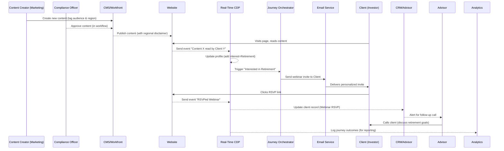

---
title: "Martech Strategy"
tags: [architecture, data, martech, storage, GDPR]
aliases: ["Martech Data", "Data Management", "Data Strategy", Martech Strategy]
created: 2025-04-02 07:45:30
updated: 2025-04-02 07:45:30
---

## Executive Summary

**Strategic Goals:** The global asset management firm (AUM in the billions) aims to modernize its marketing technology (martech) to drive personalization, regulatory compliance, and efficiency across both B2B and B2C channels. The strategy is anchored on **dual-track execution**: an **immediate roadmap** (next 12–18 months) focusing on quick wins (e.g., data unification, consent management, basic AI integration), and a **long-term roadmap** (3–5 years) to build an AI-driven, composable martech ecosystem. The firm’s current partial use of **Adobe** tools (Adobe AUM components) presents an inflection point: continue expanding within Adobe’s ecosystem or pivot to a more **extensible, hybrid stack** that balances capability with reduced engineering overhead. The strategy hence evaluates Adobe’s strengths (integration, content velocity, compliance features) versus alternatives (headless/hybrid CMS, composable customer data platforms, enterprise SaaS, and open-source tools).

**Summary Findings:**

- _Trends:_ Financial services are rapidly adopting **personalization at scale**, **customer data platforms (CDPs)**, and **AI-driven insights** to improve omnichannel engagement. Marketers in this sector face _data silos_, _regulatory scrutiny_, and _customer privacy concerns_, making data unification and governance top priorities.
    
- _Adobe Stack:_ Adobe’s Experience Cloud offers a broad suite (Experience Manager, Analytics, Target, Real-Time CDP, etc.), enabling content reuse and one-to-one personalization with demonstrated ROI (e.g., Vanguard achieved 176% higher engagement and ~$2.2M savings with Adobe’s stack). It excels in **content management and governance** but comes with high licensing costs and specialized skill requirements.
    
- _Alternatives:_ Modern stacks gravitate towards **headless or hybrid CMS** for flexibility, **composable CDPs** for leveraging cloud data warehouses, and **best-of-breed SaaS** for CRM and journey orchestration. Alternatives like Contentful, Sitecore, Salesforce, or open-source (e.g., Drupal + Mautic) can reduce vendor lock-in and cost but require robust integration.
    
- _Compliance & Architecture:_ The strategy emphasizes a **“compliance-by-design”** architecture. Every component, from identity resolution and consent management to AI services, must comply with global regulations (GDPR in EU, MiFID II for investor comms, CCPA in California, LGPD in Brazil, etc.). A layered architecture with data sovereignty controls (regional data storage, consent capture) ensures regulatory alignment.
    
- _Roadmap:_ In the near term, the firm should audit and consolidate martech tools (reducing redundant solutions, integrating Adobe Analytics or alternatives with CRM data). Data unification via a CDP (Adobe’s or an alternative) is a priority to break silos and enable personalized, **“always-on” marketing**. Long-term, invest in **AI/ML** (GenAI, predictive models) embedded in martech workflows for hyper-personalization and efficiency (e.g., content generation, auto-segmentation). The strategy culminates in a modular martech architecture that is _omnichannel_, _privacy-first_, and _AI-ready_.
    

**Dual-Track Roadmap:**

- **Near Term (0–18 months):**
    
    - _Martech Stack Audit & Rationalization:_ Inventory current Adobe usage versus other tools; eliminate underutilized platforms (note: companies use only ~33% of martech capabilities on average ([Why Bank Marketers Need to Rationalize Martech Stacks in 2024](https://thefinancialbrand.com/news/bank-marketing/why-marketers-need-to-rationalize-and-aggregate-their-martech-stacks-in-2024-172695#:~:text=,just%20since%202022.))).
        
    - _Data Foundation:_ Implement or enhance a **Real-Time CDP** for unified profiles (Adobe RT-CDP or alternatives). This addresses data silos, enabling a 360° customer view and compliance tagging (consent status, region tags).
        
    - _Content & CMS Quick Wins:_ Accelerate content velocity by using **reusable content fragments** (Adobe Experience Fragments or headless CMS components) to ensure consistent omnichannel experiences.
        
    - _Consent & Privacy:_ Deploy enterprise **consent management** (integrating tools like OneTrust with Adobe or other CDPs) and update privacy workflows to meet GDPR/CCPA opt-in standards across web, email, and mobile channels.
        
    - _Multichannel Orchestration:_ Leverage existing tools (Adobe Journey Optimizer or marketing automation alternatives) for orchestrating campaigns in email, web, and social, focusing on personalization rules using unified data.
        
    - _Compliance Alignment:_ Form a joint Marketing-Compliance task force to review MiFID II “fair, clear, not misleading” guidelines for all content, and implement a review workflow via the CMS/workflow tool (e.g., Adobe Workfront for content approvals).
        
- **Long Term (18 months – 5 years):**
    
    - _Composable & Modular Stack:_ Gradually introduce **headless** architecture elements. For example, use a headless CMS that feeds multiple front-ends (web, mobile app, advisor portals) via APIs, improving flexibility and site performance.
        
    - _AI/ML Integration:_ Scale **AI personalization** – deploy machine learning models in the CDP for propensity scoring and next-best-action recommendations (e.g., Adobe’s AI services or custom models using Python/ML on your data lake). Explore **LLM-powered campaign optimization**, where large language models analyze customer interactions to suggest campaign tweaks.
        
    - _Journey Automation & Decisioning:_ Implement advanced journey orchestration (could be Adobe Journey Optimizer or Pega/Thunderhead) that ties into the CDP for real-time decisioning across channels, including call center and branch touchpoints. The goal is **one-to-one journey personalization** beyond batch campaigns.
        
    - _Globalization & Localization:_ Use modular architecture to quickly clone and adapt experiences for different regions (as Vanguard did, launching international sites in 4 weeks with a unified platform). Ensure local content teams can leverage core assets while customizing to regional compliance (disclaimers, languages).
        
    - _Governance & Monitoring:_ Build a **governance layer** with automated policy checks (e.g., compliance bots to flag terms or unapproved content) and regular audits of data usage. As AI usage grows, institute an **AI governance board** to oversee model bias, transparency, and compliance with emerging AI regulations.
        

The following sections delve into the supporting research and reasoning for this strategy, including trends, stack evaluations, architecture designs, compliance considerations, and a recommended phased approach. Each section is modular, serving as an advisory brief for business and IT leadership, and a blueprint for technical teams.

## Current Martech Trends in Financial Services

Financial services marketing is being reshaped by several key **Martech trends in 2024–2025**:

- **Personalization at Scale:** Personalization has moved from a buzzword to an operational mandate. Financial customers expect tailored experiences akin to retail, with _72% considering personalization crucial in banking_. Firms that fail to personalize (e.g., relevant product offers, timely content) risk customer attrition to data-savvy competitors. The rise of **AI-powered personalization** tools is enabling marketers to go beyond rule-based segmentation to dynamic 1-to-1 targeting. For example, AI can analyze behavior patterns (website visits, transaction history) and in real-time adjust content shown or offers made to a customer.
    
- **Customer Data Platforms (CDPs) & Data Unification:** The fragmented data environment (legacy systems, point solutions) in finance has historically hindered personalization. CDPs have emerged as a critical solution: they **aggregate and normalize customer data** from various sources into unified profiles. According to Merkle research, _46% of brands are actively using a CDP and 53% are in the market for one_, highlighting near-universal recognition of this need. In financial services, CDPs address stringent compliance needs by automating data governance and consent enforcement across channels. A CDP is seen as _“the next step for marketing maturity and the first step for true personalization at scale”_. This trend dovetails with the deprecation of third-party cookies—first-party data (often managed via CDPs) is now gold for insight into customer needs.
    
- **Omnichannel Orchestration:** Customers engage across web portals, mobile apps, advisor interactions, email, and even physical branches. The trend is toward **omnichannel journey orchestration**, ensuring messaging and experience continuity. In 2024, _multi-channel marketing_ remains vital, with an emphasis on seamless transitions (for example, a customer receiving a follow-up email referencing a topic they discussed with a call center rep). Tools like journey orchestrators or marketing automation suites are integrating with CDPs to trigger context-aware actions (if a high-net-worth client browses retirement products on the website, the system queues a relationship manager call or targeted follow-up content).
    
- **AI and Machine Learning Adoption:** AI is transforming marketing operations by **improving efficiency and insight**. In financial services, AI started with risk and fraud analytics, but 2024 marks deeper marketing use: _“AI [is] becoming a more valuable tool in a marketer’s day-to-day toolbelt...for driving account growth”_. Use cases include predictive analytics (identifying which clients are likely to churn or buy a new product), content intelligence (AI to auto-tag and categorize content assets), and **generative AI** for content personalization (e.g., tailoring investment commentary to a client’s portfolio context). An industry survey noted _90% of marketers use generative AI tools at least once a month_ ([GenAI Getting To Be a Habit With Marketers: Basis - CDP Institute](https://www.cdpinstitute.org/news/genai-getting-to-be-a-habit-with-marketers-basis/#:~:text=GenAI%20Getting%20To%20Be%20a,according%20to%20a%20survey)), reflecting rapid adoption. However, financial firms are cautious, ensuring **AI outputs comply with regulations** and brand standards. Early experiments include using large language models (LLMs) to analyze customer feedback at scale or to generate draft campaign copy, always with human oversight.
    
- **Composable and Hybrid Stacks:** The martech landscape has exploded to over 13,000 solutions ([Why Bank Marketers Need to Rationalize Martech Stacks in 2024](https://thefinancialbrand.com/news/bank-marketing/why-marketers-need-to-rationalize-and-aggregate-their-martech-stacks-in-2024-172695#:~:text=,just%20since%202022)), pushing firms to be selective and strategic in assembly. A notable trend is **composable architectures** – instead of one monolithic suite, firms combine modular best-of-breed components (via APIs and microservices) for greater agility. For example, a composable stack might use a headless CMS for content, a separate DAM (Digital Asset Management) system, a CDP for data, and a journey orchestration engine, all integrated. This approach can mitigate the _“only 33% utilization of martech capabilities”_ issue Gartner observed ([Why Bank Marketers Need to Rationalize Martech Stacks in 2024](https://thefinancialbrand.com/news/bank-marketing/why-marketers-need-to-rationalize-and-aggregate-their-martech-stacks-in-2024-172695#:~:text=,greater%20utilization%2C%20consolidation%20and%20aggregation)), by allowing firms to swap out unused parts. In financial services, where legacy systems exist, composability allows modern layers to be added without a full rip-and-replace. **Hybrid CMS** (with both headless APIs and traditional front-end options) are also popular, giving marketers user-friendly templates while enabling developers to innovate on front-ends.
    
- **Privacy and Trust as Differentiators:** Heightened regulatory focus (GDPR, ePrivacy, etc.) and consumer awareness of data privacy mean martech strategies now treat **compliance as a feature**, not an afterthought. Leading firms promote their careful handling of data as part of brand trust. Techniques like **consent-based personalization** (only using data for which customers have opted in) and giving customers transparency/control over their data are becoming standard. There’s also growth in **privacy-preserving analytics** (e.g., using on-device data processing or aggregated insights to avoid raw PII exposure). In financial services, trust is paramount, so marketing tools that inherently support strong encryption, audit trails, and consent management are favored.
    

These trends illustrate a landscape where **the ability to harness data responsibly and activate it intelligently across channels** is the key to marketing success. Financial institutions are balancing innovation (AI, omnichannel experiences) with their obligations (security, compliance), which directly informs the martech strategy for our asset management firm.

## Adobe AUM Stack Evaluation

The firm has invested in components of Adobe’s stack, so it’s critical to evaluate the **Adobe Experience Cloud** offering in the asset management context (small-to-medium scale AUM, global operations):

**Key Components in Use (or Available):** Adobe’s ecosystem spans content, data, analytics, and orchestration:

- **Adobe Experience Manager (AEM) Sites & Assets:** AEM is Adobe’s powerful content management system (CMS) coupled with digital asset management (DAM). It allows content teams to create and reuse digital assets across channels using “Experience Fragments,” enabling efficient multi-channel content reuse. For an asset manager, this means a fund profile or article can be authored once and published to web, mobile, and email with consistency. AEM’s strength lies in enterprise-grade content workflows, role-based access, and integration with creative tools (Creative Cloud). _Benefits:_ Reusable components (e.g., a rate chart module) accelerate page creation (Vanguard saw a 6x–10x increase in website build efficiency via reusable components). It supports personalization via Adobe Target integration (e.g., swapping content based on audience segment). _Strength:_ Scales to global sites (Vanguard launched localized sites in weeks). _Drawbacks:_ **Cost & Complexity** – AEM can cost ~$250k–$1M+ annually (license + infra), and it often demands specialized Adobe-certified developers to implement and maintain. Non-technical users face a steep learning curve if the implementation isn’t heavily tailored for ease of use.
    
- **Adobe Analytics:** A robust digital analytics platform capturing web/app interactions. For financial services, Adobe Analytics helps track user behavior on logged-in investment platforms vs. public sites, providing insight into content engagement and conversion (e.g., how many research article views lead to product inquiries). It integrates well with AEM and the broader Adobe stack, feeding data into the CDP or Adobe Audience Manager (DMP) for segmentation. Adobe’s analytics is respected for its ability to handle large volumes and complex visitor segment definitions, which is useful when tracking diverse investor types across journeys.
    
- **Adobe Audience Manager (AAM):** A data management platform (DMP) used to manage cookies and IDs for ad targeting. However, with third-party cookies waning, AAM’s role is evolving. In an Adobe stack, it’s often paired with the CDP to connect anonymous data with known profiles.
    
- **Adobe Target:** A personalization and testing engine. Target can do A/B tests, multivariate tests, and personalized content or offers to site visitors or app users. For example, Target could show different homepage banners for retail investors vs. advisors, or test two versions of a fund promo to see which yields more engagement.
    
- **Adobe Real-Time CDP (Customer Data Platform):** A relatively newer addition, it aggregates customer data (both known and anonymous) from multiple sources to build unified profiles and segments in real-time. _Strengths:_ Built-in identity resolution, consent tracking, and easy connectors to activation channels. As noted, _“The solution makes it much easier for marketers to work with data, eliminating the need to use SQL or Python to query data sets.”_. This lowers the technical barrier for marketing analysts to use customer data. Real-Time CDP supports streaming data and integrates natively with Adobe Journey Optimizer (for cross-channel messaging). _Relevant Example:_ Vanguard uses Adobe RT-CDP to move from batch emails to behavior-triggered outreach (e.g., webinar invites after a client views certain content).
    
- **Adobe Campaign / Journey Optimizer:** Tools for orchestrating and sending communications (emails, push notifications, etc.). Adobe Campaign Classic/Standard have been traditional campaign management tools; Journey Optimizer is Adobe’s modern cloud-based journey tool, ideal for **“always-on” marketing** where triggers from the CDP drive personalized messages.
    
- **Adobe Workfront:** A work management tool integrated for content and campaign workflow (useful to manage requests, creative production, compliance approvals in one system). Vanguard integrated Workfront to streamline content creation workflows, which can be valuable for coordinating marketing and compliance reviews.
    

**Strengths of Adobe Stack:**

- _Integration & Cohesion:_ All components are designed to work together. For example, segments in the CDP can be used in Target for on-site personalization and in Campaign for email, ensuring consistency. This unified approach reduces data fragmentation (which is a plague in many marketing orgs). Adobe’s platform provides a **single-vendor solution** for content, data, and orchestration, which can simplify vendor management and, with proper implementation, provide a seamless user experience to marketers.
    
- _Enterprise Capabilities:_ Adobe is **enterprise-grade** – high scalability, global support, and a broad community of partners. Features like **auto-scaling architecture** (especially in AEM as Cloud Service) handle traffic spikes without manual intervention, useful for campaign-driven surges. Adobe also offers strong **governance features**, such as Experience Platform’s data governance module which provides central control over data usage policies. This is crucial in finance where misuse of data can lead to compliance breaches. The ability to label data and enforce policies (e.g., “don’t use EU customer data in US campaigns”) is built-in.
    
- _Compliance Fit:_ Adobe has invested in **trust and privacy** capabilities. Experience Platform provides tools to honor privacy requests (like GDPR data subject requests) and integrate with consent platforms. It enables brands to **centralize consent** and privacy preferences and propagate those across all Experience Cloud products. For a regulated firm, this means fewer gaps in honoring opt-outs or data handling rules. Adobe also touts a “future-ready” architecture built to accommodate new regulations – meaning they will likely update the platform to handle laws like ePrivacy, CPRA, etc., reducing the maintenance burden on the firm’s side.
    
- _Content Velocity & Reuse:_ As seen with Vanguard, a key benefit was improved content velocity (6–10x faster page builds). By having a library of approved, compliance-reviewed components (text, charts, forms), marketing can assemble pages quickly without reinventing the wheel each time. This is a strength of AEM with Experience Fragments and Style Systems.
    
- _Analytics & Insight:_ Adobe Analytics combined with the CDP can yield deep insights – e.g., tracing an individual’s journey from anonymous website visitor to lead in CRM to funded client. The ability to join data across touchpoints (with the CDP as the hub) helps measure what’s working (which content, which campaign) and attribute success properly. These insights guide the personalization algorithms and marketing strategy adjustments.
    

**Weaknesses / Considerations:**

- _Cost and Licensing:_ As noted, Adobe’s pricing is premium. The all-in license for multiple Experience Cloud products can be substantial, which is often justified for large enterprises by the breadth of capability. However, for a small-to-medium asset manager, cost-benefit must be closely examined, especially if not all modules are fully used (the Gartner stat of 33% utilization is cautionary ([Why Bank Marketers Need to Rationalize Martech Stacks in 2024](https://thefinancialbrand.com/news/bank-marketing/why-marketers-need-to-rationalize-and-aggregate-their-martech-stacks-in-2024-172695#:~:text=,greater%20utilization%2C%20consolidation%20and%20aggregation))). Also, costs are not just license but implementation (third-party partner fees, ongoing development).
    
- _Specialized Talent:_ The complexity of some Adobe tools (AEM’s steep learning curve, and need for careful DevOps) means the firm must invest in either internal skill development or retain consultants/partners. The risk is _“AEM is highly complex, requires lots of support...and issues are not quick to address”_. This complexity could slow time-to-market if the team is not well-versed, counteracting the benefits.
    
- _Over-engineering for Scale:_ Adobe excels for enterprise scale and complexity (multiple brands, millions of customers). If our asset manager’s needs are simpler, the Adobe stack might be more horsepower (and overhead) than necessary. For example, if content volume is moderate and mostly web-focused, a lighter headless CMS plus simpler DAM might suffice versus AEM’s full heft.
    
- _Innovation Pace and Lock-In:_ Adobe’s cloud evolution has improved, but historically some Adobe products (Campaign, AEM) were slower to adapt to modern paradigms (e.g., headless CMS trend forced Adobe to add GraphQL and headless capabilities to AEM). The firm should consider if Adobe’s roadmap aligns with their innovation needs. There is also an element of **vendor lock-in**: once many Adobe tools are embedded, switching can be arduous due to data and template coupling, so the decision to stick with Adobe is somewhat self-reinforcing.
    
- _Adobe vs. Specialized Tools:_ In some areas, best-of-breed point solutions may surpass Adobe’s component. E.g., Adobe Target is solid, but some firms prefer optimization tools like Optimizely or dynamic content via CMS if they need simpler personalization. Adobe Campaign is capable, but some marketing teams prefer the UX of Salesforce Marketing Cloud or even newer customer journey tools. The question is whether Adobe’s integrated approach yields better results than mixing and matching superior individual tools.
    

**Integration and Extensibility:**

- Adobe’s tools integrate well with each other, but how about **external systems**? The firm uses CRM (Salesforce or MS Dynamics perhaps). Adobe provides connectors (and the Experience Platform has open APIs), but integration projects can be significant. If the firm’s IT strategy leans toward Azure or AWS cloud ecosystems, consider how Adobe (which runs on its cloud or Azure for some services) will fit.
    
- Extensibility: Adobe AEM allows custom code and has an extensive API, so custom components can be built. Adobe’s CDP can accept custom data schema. The key is ensuring any customization does not break upgrade paths (Adobe’s newer Cloud deployments mitigate this somewhat by continuous updates).
    

**Adobe’s Compliance Fit:** For financial services, Adobe has case studies and presumably has passed muster with many IT risk teams. They emphasize things like encrypted data, role-based access, and importantly **audit logs** and content versioning which help in compliance audits (e.g., proving what content was live at a certain date and that it was approved). Their data governance framework can enforce tagging data (like marking fields as sensitive, or EU-only) and prevent those from misuse (e.g., blocking an activation if it violates policy). Adobe’s Experience Platform is **patented for data governance** capabilities, showing a commitment to compliance use-cases in regulated industries.

**Verdict on Adobe:** Adobe Experience Cloud is a robust option that _can_ meet the firm’s needs for content, data, and personalization under one umbrella. It is particularly strong if the firm values an integrated approach and has (or plans to build) the capability to harness it. If the firm stays with Adobe:

- Maximize usage: Roll out more of the suite (like Journey Optimizer, RT-CDP, etc.) to get ROI, but do so with clear **enablement** (training users, dedicating an internal “Adobe Platform Owner”).
    
- Lean on Adobe’s experience with financial clients: E.g., the case with Vanguard, or others like Manulife. Possibly engage Adobe Professional Services or a specialized partner for strategy to fully leverage the tools (with knowledge transfer to internal teams).
    
- Ensure there’s a plan to **manage complexity**: This could mean focusing on a subset of features that matter and not over-engineering initial solutions (get the core right: CMS templates, analytics tracking plan, a few high-impact personalization campaigns).
    

However, given the concerns of cost and specialized overhead, the next section evaluates alternatives to see if a leaner yet effective stack is feasible.

## Alternatives to Adobe Stack

The martech universe offers numerous alternatives, ranging from **headless CMS platforms** to **open-source tools** and **other enterprise clouds**. The goal is to identify options that could replace or augment Adobe components, potentially reducing complexity or cost while still meeting requirements for a global asset manager.

**Headless & Hybrid CMS Options:** Managing content effectively is central. Alternatives to AEM that often come up:

- **Contentful:** A leading headless CMS known for its developer-friendly APIs and robust content modeling. _Pros:_ SaaS model (no infrastructure to manage), strong multi-language and localization support, and easy integration with static site generators or front-end frameworks. It has overlapping capabilities with AEM in content and asset management, minus the WYSIWYG site building. _Cons:_ Purely headless – content editors must work without a preview unless a preview front-end is built. Pricing can also ramp up for high content volume or users.
    
- **Sitecore XM/XP or Optimizely (Episerver):** These are .NET-based CMS that often appear in financial services. They can run headless or traditional. Sitecore has an integrated suite (like Adobe) and is adding headless options. Optimizely offers content + commerce + personalization with .NET underpinnings.
    
- **Acquia/Drupal:** An open-source path – Drupal CMS (especially with Acquia’s cloud managed offering) can be an alternative. _Pros:_ Flexible, large community, no license cost for software (only support/hosting). Drupal has modules for workflows, multilingual, etc. It can be used headless (Decoupled Drupal) or hybrid. Also, Drupal’s open-source nature means freedom to customize. _Cons:_ Requires significant internal expertise to manage and secure. Without enterprise support, the onus is on the firm to keep it running smoothly.
    
- **HubSpot Content Hub:** HubSpot offers a CMS (Content Hub) that is more marketer-friendly and comes with built-in CRM and marketing tools. It’s an all-in-one approach targeting mid-market. It has a strong **digital asset management** feature set and content personalization via HubDB and CRM data. _Pros:_ Great UX for marketers, lower technical overhead. _Cons:_ Can it handle complex requirements (likely fine for content marketing but maybe not as flexible for custom apps or large authenticated sites).
    
- **Other Notables:** WordPress VIP (enterprise WordPress) paired with plugins or custom dev could be an option for content (cheaper, but potentially less secure or robust for authenticated experiences). **Brightspot** and **CoreMedia** present themselves as easier alternatives to AEM. **Magnolia CMS** is a Java-based headless CMS with enterprise features (used in some banks, and dotCMS lists it as a strong open-source competitor to AEM).
    

**Customer Data Platform & Data Layer Alternatives:** If not Adobe’s RT-CDP:

- **Salesforce CDP (Marketing Cloud Personalization/Interaction Studio):** Salesforce’s answer, which naturally ties in if the firm uses Salesforce CRM or Marketing Cloud. _Pros:_ Seamless with Salesforce data (e.g., pulling in customer financial holdings if stored in SFDC). _Cons:_ Still maturing, and some features may lag Adobe’s depth in real-time edge computing.
    
- **Tealium AudienceStream or mParticle:** These are independent CDPs well-known for data integration and tag management origins. They excel at connecting data from many sources and syndicating to many outputs. Good for a best-of-breed approach.
    
- **Treasure Data or Segment (Twilio):** CDP platforms that can act as the data backbone. Segment, for example, focuses on collecting events and forwarding to other systems, while maintaining profiles.
    
- **Composable CDP approach:** As referenced, some companies build a “CDP” on their data warehouse (Snowflake, Databricks) – using tools like Hightouch or GrowthLoop for activation. This _composable_ approach avoids duplicating data into a separate CDP database. _Pros:_ Leverages existing cloud investments and potentially better for governance (one less copy of data). _Cons:_ Requires engineering to set up identity resolution and profile logic; not as marketer-friendly out-of-the-box.
    
- Many **marketing clouds** (Oracle CX, SAP Customer Data Cloud) also offer CDP-like capabilities, but Adobe and Salesforce are the main ones in FS currently.
    

**Analytics & Personalization Alternatives:**

- **Google Analytics 4 (GA4) + BigQuery:** Some firms might lean on GA4 for basic digital analytics (cheaper, but with privacy tradeoffs and limits in functionality compared to Adobe for large sites). GA4 can feed raw data to BigQuery for advanced analysis.
    
- **Mixpanel or Amplitude:** Product analytics tools if focusing on digital behavior analysis, though these are more common in fintech startups than established FS.
    
- **Optimization/Personalization:** If not Adobe Target, alternatives include **Optimizely Web**, **Google Optimize 360** (though Google is sunsetting some Optimize features), **Evergage** (which Salesforce now owns as Interaction Studio), or even CMS-driven personalization rules (like Sitecore’s personalization engine).
    

**Marketing Automation & Campaign:** If Adobe Campaign is not used:

- **Salesforce Marketing Cloud (ExactTarget/Pardot):** Common in financial services, especially if Salesforce CRM is core. Offers robust email, journey builder, etc., plus Pardot for B2B nurturing. _Pros:_ Native CRM integration, strong email deliverability support, many users out there. _Cons:_ Can be complex to learn, and segments still need a data foundation (enter CDP or data syncing).
    
- **Marketo Engage (which is actually Adobe-owned now):** Marketo is well-known for B2B marketing automation. Ironically it’s Adobe as well, but separate from the Experience Cloud stack. The firm might already have Marketo for demand gen; integrating Marketo with AEM or others is doable but not seamless like Adobe’s own combos.
    
- **HubSpot Marketing Hub:** For a simpler approach, HubSpot handles email, automation, and even CMS and CRM in one. Many smaller financial firms like its ease of use, but for an asset manager with complex needs, HubSpot might lack some depth or compliance features (though it has some financial customers).
    
- **Open-Source / Others:** Mautic (open-source marketing automation) could be considered if open-source is a theme, but likely not mature enough for large scale FS out-of-the-box.
    

**Extensibility and Custom Build vs Buy:** The firm could consider a **custom-built solution** for certain layers if the vendor solutions don’t align perfectly. For instance, a **custom portal** for advisors/investors might be built on Angular/React with content via API from a headless CMS and data from in-house systems, if security or unique UX is paramount. The trade-off is development speed and maintenance. Many modern martech stacks actually involve significant custom development to glue components together or present unified tools to end-users (e.g., a custom marketing portal that surfaces data from various systems).

**Enterprise SaaS vs Open Source:**

- **Enterprise SaaS (Software as a Service):** like Adobe, Salesforce, etc., offers support, SLAs, and continuous updates – appealing for lean internal teams. But cost and lock-in are the downsides.
    
- **Open Source:** like Drupal (CMS) + Oro (CRM) + custom code, remove license costs and give freedom, but you “own” the problems and need in-house talent. Some firms do a mix: maybe use open-source for the web CMS (to have more control) but a SaaS for CDP (since building that is heavy lift).
    

**Key Criteria in evaluating alternatives:**

1. **Extensibility:** Can the alternative integrate with our existing systems (CRM, data lake, etc.) easily via APIs? Headless CMS, for example, is very extensible by nature. Composable CDP approach is extensible but requires cloud integration.
    
2. **Total Cost of Ownership:** Not just licenses, but infra and people. Open source may save on license but cost more in support engineers. Adobe/Marketing Cloud cost more in license but perhaps less in certain integration areas since the suite covers it (though still needs expertise).
    
3. **Specialization Fit:** Some alternatives are purpose-built for **financial services marketing** (e.g., certain campaign tools or content platforms might have FS-specific templates). For example, Seismic or Hearsay (though those are more sales enablement and social compliance tools respectively) might fill niches that Adobe doesn’t.
    
4. **Regional Support:** Given the firm’s footprint (Europe, UK, Australia, Canada, Mexico, Brazil), any cloud used must support data residency or at least compliance in these regions. Adobe has data centers in EU for EU data, Salesforce does as well. For open-source self-hosted, the firm can choose region by region.
    
5. **User Experience:** Alternatives like HubSpot prioritize **ease-of-use** for marketers. If the marketing team’s tech savvy is limited, a slightly less powerful but more user-friendly tool might drive better adoption than an unwieldy “Ferrari” tool that only a few use well. This is crucial since underutilized martech is wasted money ([Why Bank Marketers Need to Rationalize Martech Stacks in 2024](https://thefinancialbrand.com/news/bank-marketing/why-marketers-need-to-rationalize-and-aggregate-their-martech-stacks-in-2024-172695#:~:text=,greater%20utilization%2C%20consolidation%20and%20aggregation)).
    
6. **Innovation & Roadmap:** A consideration: Adobe and Salesforce will likely keep up with new tech (Adobe adding AI features, etc.). A smaller vendor or open source might lag or require self-innovation. Example: Adobe and Sitecore both integrated AI to auto-tag assets or summarize content. A smaller CMS might rely on manual or community solutions for that.
    

To summarize the alternatives: The firm could adopt a **hybrid approach**: maybe keep Adobe Analytics but use a headless CMS + simpler DAM instead of AEM, or keep AEM for content but use a different CDP. There is no one-size-fits-all; it often ends up as a **mix and match** to suit the organization. The key is ensuring the components can knit together (which is addressed in the architecture section next).

## Architecture Comparison — Headless vs Hybrid vs Headful

A critical decision in designing the content and experience architecture is choosing between **headless, hybrid, or traditional (headful) CMS approaches**, as well as overall system architecture style:

- **Traditional “Headful” CMS (Monolithic):** This is where the CMS handles everything – content creation, management, and the front-end delivery (templates, rendering). AEM in its classic sense, Sitecore XP, and WordPress are examples. _Pros:_ Marketers get WYSIWYG control and immediate visualization of content as it will appear. Often simpler to set up small sites. _Cons:_ Less flexible for multi-channel (only does web easily, other channels like mobile apps need workarounds), can be harder to modernize front-end tech, and scaling the web delivery is tied to the CMS’s own scaling.
    
- **Headless CMS:** A headless CMS decouples content from presentation. It manages content in a back-end and exposes it via APIs (JSON, GraphQL) for any front-end to consume. Examples include Contentful, Strapi, Magnolia in headless mode, or AEM’s Content Services feature. _Pros:_ Ultimate flexibility in front-end frameworks (developers can use React, Angular, etc. to create web or mobile experiences), one content repository serves many channels (website, mobile app, even IoT or partner sites). It’s also often easier to integrate into modern cloud architectures (content is just another service). _Cons:_ Marketers lose the “what you see is what you get” preview; it requires either a headless preview solution or trust in front-end developers. Some tasks might need developer help (like creating a new page type might need front-end work). Also, a pure headless CMS might lack built-in personalization or presentation logic – those have to be handled separately (e.g., via front-end logic or CDP-driven).
    
- **Hybrid CMS:** A hybrid tries to combine both – it has headless capabilities (API-first content) but also allows some coupled delivery or visual editing for web. For instance, Adobe’s latest allows headless delivery, but also offers SPA editor for single-page apps. Magnolia calls itself hybrid: content can be delivered headless or via traditional templates. _Pros:_ Flexibility with a gentler learning curve for content editors. You can use out-of-the-box templating for simpler needs and APIs for advanced ones. _Cons:_ Complexity – two modes in one can sometimes mean two things to maintain. But if done right, it offers a best-of-both-worlds.
    
- **Headless vs Hybrid Tradeoff:** If the firm values multi-channel a lot (not just web, but consistent content to a mobile app for investors, maybe even feeding content to third-party platforms via API), headless is attractive. If the web is still the primary channel and the team is small, a hybrid or traditional might be easier initially.
    

Beyond CMS, consider **architecture paradigms**:

- **Monolithic Suite vs Composable Microservices:** Adobe represents more of a monolithic (integrated suite) approach, whereas an alternative might be to compose multiple microservices (e.g., separate microservice for content, for identity, for recommendations, etc.). A microservices architecture aligns with headless philosophy and can be more resilient (one part fails, others run). It also allows scaling components independently (e.g., high load on content delivery can be scaled without scaling the entire stack). The downside is it introduces complexity in integration and requires robust DevOps and API management.
    
- **Cloud-Native vs Legacy Integrations:** The firm likely has some legacy (e.g., perhaps a mainframe or core finance DB). A modern architecture often uses a **data lake or warehouse** as a hub for data, feeding the CDP. Cloud-native tools (serverless functions, managed services for scaling) can simplify infrastructure. For example, using AWS Lambda or Azure Functions for image resizing or using a CDN (Content Delivery Network) to offload global content delivery.
    
- **Security & Compliance Layers:** In any architecture, especially headless, ensuring security is paramount. With headless, content is delivered via APIs, so one must secure those APIs (OAuth, API gateways) to prevent unauthorized content access or injection. With microservices, implementing a consistent security policy across them and logging for audit is key.
    

**Trade-off Matrix (Headless vs Hybrid vs Headful):**

|Aspect|Headful (Traditional CMS)|Headless CMS|Hybrid CMS|
|---|---|---|---|
|**Multi-Channel**|Limited (web-centric, other channels separate)|Excellent (API can feed any channel)|Good (supports API and built-in web)|
|**Editor Experience**|High (visual editing, in-context preview)|Lower (requires preview tooling or technical help)|Medium (some visual tools available)|
|**Developer Freedom**|Constrained (must use CMS’s tech stack)|High (use any front-end framework or service)|High (APIs available, plus templates if needed)|
|**Performance Scaling**|Tied to CMS scaling (monolithic scaling)|Fine-grained (scale delivery tier separately)|Flexible (depends on usage mode)|
|**Integration**|Moderate (proprietary connectors or plugins)|High (everything via API, easier integration)|High (if using headless features)|
|**Personalization**|Built-in (like Adobe Target inside AEM)|External (need separate service like CDP+front-end logic)|Can be built-in or external depending on setup|
|**Compliance/Audit**|Centralized (one system to audit content)|Distributed (content in CMS, delivery in multiple places – need holistic logging)|Medium (CMS covers content, API calls track usage)|
|**Time-to-Market**|Faster initially (out-of-box site templates)|Faster long-term (once framework set, iterations quick; initially slower to set up)|Medium (some initial speed with templates, plus flexibility later)|

Given this asset manager operates internationally and likely wants consistent messaging across web, mobile, and possibly partner channels, a **hybrid approach** might make sense – allow headless for developer innovation (for client-facing investment portals or mobile apps), but also give marketers a friendly interface for content that’s primarily web/article based. Adobe AEM can actually operate in that hybrid mode (with Experience Fragment APIs, GraphQL content APIs). If Adobe is dropped, a combo of say Contentful (headless) plus a front-end framework (like Next.js for website) might be considered; this is a very modern approach but again requires developer capacity.

The architecture decision also impacts **engineering overhead vs marketing independence**: A fully headless approach might require more ongoing dev support for the marketing team’s needs (like creating new page layouts or interactive content). A headful approach like AEM empowers marketing to do more without IT, but with the cost of that platform complexity.

**Recommendation in context:** Given the firm’s size (not a mega-bank but sizable), a **hybrid architecture** is likely ideal:

- Use a CMS that provides headless delivery for channels where needed but also has a user-friendly interface for common tasks.
    
- Embrace a **headless CDP** concept – the CDP is inherently headless (an API/data service feeding other tools).
    
- Build front-end experiences that are decoupled and modular – e.g., if a new marketing channel emerges, you don’t want to be locked in because the CMS can’t serve it.
    
- At the same time, ensure there’s a **unifying layer** (like an API gateway or an orchestration layer) so that from the outside, the various services (content, data, identity) act in concert.
    

We’ll illustrate this in the architecture diagram section (Mermaid diagram) later, showing how headless content, data, and AI services flow together.

## CRM & Supporting Technologies

No martech stack in isolation can succeed without considering how it interacts with **CRM (Customer Relationship Management)** and other supporting systems. In asset management, CRM often means tracking institutional clients, financial advisors, and retail investors, along with their interactions and transactions. Common CRMs include **Salesforce Sales/Financial Services Cloud**, **Microsoft Dynamics 365**, or for smaller scale, maybe **HubSpot CRM** or others.

**Role of CRM vs CDP:** It’s important to delineate what the CRM does versus a CDP:

- A **CRM** is primarily for managing direct interactions with known individuals – sales opportunities, customer service cases, logging meeting notes, etc. It’s often used by salespeople or relationship managers. It contains PII like names, addresses, and very business-specific fields (account status, AUM, etc.). CRMs excel at pipeline management and 1-1 relationship tracking.
    
- A **CDP** (Customer Data Platform) focuses on ingesting and aggregating data from many sources (could include CRM, website, mobile app, email engagement, offline transactions) to create a unified profile. It’s less about individual manual entries and more about automated data collection and segmentation. Marketing, analytics, and product teams use CDPs to see behavioral patterns and audience segments.
    
- They are **complementary**: The CRM might feed the CDP with high-quality customer data (e.g., a flag that a client is high-value or assigned to a certain tier). The CDP might in return feed the CRM with insights (e.g., “this client visited the website 3 times this week” or a propensity score).
    
- Adobe’s perspective: _“CDPs provide a big picture of how all customers and platforms interact with your brand, while CRMs note interactions between a specific customer and your brand”_. CRM data is narrow but deep per customer (like an account of record), whereas CDP data is broad, capturing the **entire journey and funnel**, including anonymous touches.
    

**Salesforce vs Dynamics vs HubSpot:**

- **Salesforce CRM:** Ubiquitous in financial services. It offers the Financial Services Cloud which is tailored to wealth management and asset management use cases (householding, financial account objects, etc.). If the firm uses Salesforce, it naturally pushes consideration of **Salesforce Marketing Cloud** (ExactTarget, Pardot) and **Salesforce CDP** to keep an all-SFDC stack. Salesforce CRM integrates with Adobe too (Adobe has SFDC connectors). The decision often rests on whether the marketing side or the sales/client side drives the data strategy. For marketing-led, Adobe or independent CDP may be fine; for sales-led, Salesforce may claim it can handle much of what a CDP does by adding Interaction Studio.
    
- **Microsoft Dynamics 365:** Sometimes chosen by asset managers who are Microsoft-centric. It can integrate well with Azure data tools and LinkedIn (for B2B). MS offers Dynamics Marketing for campaigns. It’s less commonly cited in martech discussions but if the firm is on Dynamics, it should be part of the integration plan (e.g., ensure leads from marketing flow to Dynamics; use Dynamics as a source into the CDP).
    
- **HubSpot CRM:** Could be an option if the firm’s client base is smaller or if they prefer an all-in-one approach, but for billions AUM, they likely have a more robust CRM.
    

**CDP & CRM Orchestration Boundaries:** Where to draw the line on segmentation and activation? A possible approach:

- Use **CRM** for direct sales/relationship outreach (one-to-one emails, calls) and as the “source of truth” for certain regulated data (e.g., KYC info, client category).
    
- Use **CDP** for building marketing segments (e.g., all retail investors with interest in sustainable funds who visited site in last 30 days) and orchestrating automated campaigns to those segments through various channels.
    
- The CRM might store consents as well, but the CDP will operationalize them (e.g., only include profiles with email opt-in in an email campaign).
    
- The **Customer Support and Workflow systems** (like a ticketing system, or even the core banking/portfolio system) also play a role: Data from those could feed the CDP (for example, a recent support ticket might down-rank a client from a marketing campaign until their issue is resolved).
    

**Other Supporting Tech:**

- **Data Lake / Warehouse:** It’s increasingly common to have a central data lake/warehouse (Snowflake, AWS S3+Redshift, Azure Data Lake) where raw and refined data is stored. The CDP could be built on it (composable CDP approach) or at least sync with it. This allows deeper analytics (with Python/SQL, or training ML models) outside the CDP’s GUI.
    
- **Consent & Preference Center:** Possibly a custom-built or third-party tool where customers can update their email preferences, GDPR requests, etc. This needs integration with both CRM and CDP, and possibly CMS (for embedding in website).
    
- **Analytics & BI:** While Adobe/Google Analytics handle web stats, the firm likely has BI tools (Tableau, PowerBI) for broader metrics (ROI, customer lifetime value by segment). Part of the architecture ensures the martech data flows to these BI systems for holistic reporting (like marketing attribution into business KPIs).
    
- **Workflow & Collaboration:** Adobe Workfront was mentioned, but if not using that, they might use Jira, Asana, or similar to manage marketing tasks. Not core to architecture, but important for project execution.
    
- **Tag Management & Data Capture:** Tools like Tealium iQ, Google Tag Manager, or Adobe Launch are used to manage site/app tagging for data collection, feeding into analytics or CDP. Ensuring consistent tagging across global sites is crucial so that data is uniform for segmentation.
    
- **Email Delivery and Transactional Messaging:** If not using Adobe for email, consider SendGrid, SparkPost, or other SMTP services for either marketing or system-triggered emails (like a password reset email from the portal vs a monthly newsletter – possibly handled by different systems).
    
- **Social & AdTech Integration:** Marketing often involves retargeting on Google/Facebook, LinkedIn for advisors, etc. The martech architecture should allow creating audiences that can be pushed to these networks (Adobe, Salesforce, and CDPs all have connectors to send an audience list to Facebook Ads, for example). If using an external CDP, ensure it has those integrations or that can be custom-built.
    

In summary, **CRM is the relational memory** (person-level info, often static attributes and sales activities), **CDP is the behavioral brain** (aggregating cross-channel behavior and enabling segmentation), and **orchestration tools** (like journey builders or CMS personalization) are the hands executing actions. The architecture must make them work in unison. For instance, a use-case: A client has a low risk tolerance in CRM (captured by an advisor) and hasn’t logged into the portal recently (captured via analytics -> CDP). The martech system should combine these signals: perhaps trigger a campaign about a low-risk investment product to re-engage them, and notify their advisor via CRM task. That’s orchestration across CRM & Martech.

We will reflect this interplay in the persona flows and architecture diagram, showing how data moves from CRM to CDP to channels, and back.

## Regulatory and Compliance Considerations

Operating across **UK, EU, Australia, Canada, Mexico, and Brazil** means a complex compliance landscape. The martech strategy must embed compliance requirements for data privacy, financial promotions, record-keeping, AI ethics, and data residency. Below is a map of key regulations and how they influence the martech design:

- **General Data Protection Regulation (GDPR) – EU:** Applies in EU and effectively also sets baseline for UK (through UK GDPR). Key tenets: personal data processing must have a legal basis (e.g., consent for marketing emails), individuals have rights (access, erasure, rectification), and data should not be transferred outside the EU without safeguards. _Implications:_
    
    - Need a **Consent Management Platform (CMP)**: e.g., cookie consent banners and preference centers, integrated such that Adobe/analytics only track or activate on users who consented (especially for tracking cookies, personalization).
        
    - **Data Minimization & Purpose Limitation:** CDP profiles should only store data relevant for defined marketing purposes. Avoid hoarding data that’s not needed.
        
    - **Right to be Forgotten:** Must ensure that if an EU customer opts out or requests deletion, their data is purged from all martech systems (CDP, analytics, etc.) within required SLAs. Adobe Experience Platform has tools to manage such requests efficiently.
        
    - **Privacy by Design:** Our architecture should use pseudonymization (e.g., use unique IDs in analytics instead of plain personal info), encryption at rest and in transit, and allow processing of EU data in EU data centers (Adobe, for example, can host in Europe, or if using AWS/Azure, choose EU regions).
        
    - **Consent for Emails and Tracking:** Ensure double opt-in for email in jurisdictions that need it, log when/how consent was obtained (e.g., via website form, via advisor, etc.). Canada’s CASL, for instance, requires record-keeping of consent. Our martech needs to store timestamps and source of consent, likely in CRM or a preference DB, and sync to email tools.
        
    - **Data Protection Impact Assessments (DPIA):** Likely needed if deploying new tech like a CDP which profiles individuals. Work with compliance to do DPIAs for major components, and ensure vendor contracts have proper data protection agreements.
        
- **MiFID II (Markets in Financial Instruments Directive II) – EU/UK:** While more of a trading/investment regulation, it has specific rules on **marketing communications for investment firms**:
    
    - _Communications must be fair, clear, and not misleading_, and risks cannot be downplayed. Also, they must be identifiable as marketing (no disguising ads as, say, impartial advice).
        
    - **Record-Keeping:** Firms must keep records of all marketing communications, including what was sent to whom, when, and (with new focus) even social media posts. Our architecture should thus archive outbound campaign content and perhaps screenshots/versions of web content. AEM’s versioning is handy here to store what content looked like at a given time.
        
    - **Approval workflows:** The martech should enforce that any client communication (email, pdf, web content with financial info) is approved by a compliance officer if required. Tools like Workfront or even a simple custom approval in CMS can handle this. The system should log approver and time.
        
    - The **Dear CEO letter (Ireland’s CBI)** highlights issues like unclear identification of marketing, poor governance, outsourcing issues, etc. To address this:
        
        - All marketing content in CMS should have clear disclaimers. Templates should include an “Advertising” label or appropriate disclosures by default for certain content types.
            
        - If using influencers or social, track those campaigns separately and ensure disclosures (#ad, etc.).
            
        - Our plan should include routine monitoring of published content. Possibly use automated scans of websites/emails for compliance keywords (though manual review is still key).
            
        - By Jan 2025, firms had to review and board-approve their marketing practices vs MiFID II expectations. Our strategy includes setting up this review – the martech lead should deliver a report on how the new stack ensures compliance (consent, records, fairness checks).
            
- **UK FCA Regulations:** Similar to MiFID II, the UK (even post-Brexit) has rules via FCA for financial promotions. They require certain risk disclosures, and have particular rules for different products (e.g., you can't market certain high-risk investments to retail without specific wording and targeting only appropriate individuals). The architecture should allow **audience restrictions** (like only send a certain product’s campaign to eligible, pre-qualified investors which CRM flags).
    
    - UK also introduced new rules on **“Consumer Duty”** in 2023/24, meaning communications must support customer understanding and not be misleading. This aligns with having clear language (maybe use AI to simplify language? There are tools to score readability).
        
- **Australia (ASIC, OAIC, CDR):**
    
    - The **Australian Securities and Investments Commission (ASIC)** enforces financial marketing rules; often aligned with “clear, true, balanced” principles. They also crack down on misleading online marketing. We should have an audit trail and content repository to show what was communicated, in case ASIC inquires.
        
    - The **Office of the Australian Information Commissioner (OAIC)** handles privacy (Australia’s Privacy Act). It’s not as strict as GDPR but has 13 Privacy Principles. Consent and transparency are needed especially for personal info uses outside expectation.
        
    - **Consumer Data Right (CDR):** This is like open banking, giving consumers rights to their data portability. Not directly a martech concern unless we integrate with open data ecosystems, but it underscores that the customer can request their data. We should design our data architecture to be able to export a customer’s profile data easily if they ask (similar to GDPR access requests).
        
- **Canada (CASL and PIPEDA):**
    
    - **CASL (Canada’s Anti-Spam Law):** One of the strictest anti-spam laws. Requires express consent for most marketing emails (with some exceptions for existing business relationships). It also mandates certain email content: identification of sender, contact info, and easy unsubscribe in every message. Our marketing automation must ensure compliance: e.g., templates include the required footer, and it does not send to Canadian contacts without a consent flag. Also, CASL requires record-keeping of consent (who, when, how), which our CRM or CDP should log.
        
    - **PIPEDA:** Canada’s federal privacy law. Less heavy than GDPR but similar principles of consent and appropriate use. If we comply with GDPR, we likely cover PIPEDA. One distinct thing: if using AI that makes significant decisions about individuals, under a proposed bill (AI and Data Act, still evolving) there may be transparency requirements. This could impact how we use AI in personalization – possibly disclosing if content was personalized via an algorithm.
        
- **Mexico (Federal Law on Protection of Personal Data) & Brazil (LGPD):**
    
    - Mexico’s law requires consent for data usage in many cases and has data subject rights. It’s akin to early GDPR principles. Ensure Spanish-language privacy notices and a process to handle requests in Mexico.
        
    - **LGPD (Lei Geral de Proteção de Dados)** in Brazil is very similar to GDPR. Consent or other basis needed, rights to access, correct, delete. Enforcement is increasing. So treat Brazilian data like EU data: respect consent, allow opt-outs, etc. Data residency might be an issue; Brazilian data might need to stay in Brazil unless proper x-border measures are in place (Brazil allows some transfers with consent or if necessary for contract, etc.).
        
    - Brazil also has specific marketing rules from CVM (for funds) and the Central Bank – likely similar in spirit to avoid misleading ads about returns, etc.
        
- **AI Compliance & Ethics:** As we plan for GenAI and predictive models, regulators are turning attention here:
    
    - The EU is working on the **AI Act**, which may classify certain AI uses in finance as high-risk (requiring disclosures, oversight). If our martech uses AI to, say, make personalized investment suggestions, that could be sensitive.
        
    - **Algorithmic Transparency:** Possibly needed to avoid claims of unlawful discrimination. For example, ensure our segmentation or personalization doesn’t inadvertently exclude or target users in a way that could be seen as biased (e.g., only offering certain opportunities to certain demographics without justification). Using AI ethically includes tracking what data goes into models and how decisions are made, to explain them if needed.
        
    - **Auditability:** If AI writes or significantly personalizes content (like an AI-driven fund performance summary), compliance might need to review the template or logic. For now, we likely keep a human in the loop for content that is client-facing and could be seen as advice.
        
    - **Consent for AI using personal data:** If we use personal data to train models, we must ensure it’s within the scope of consent provided by users. If using third-party AI services, careful about not accidentally sending personal data into them (unless those are governed properly).
        
- **Data Sovereignty:** Some countries require data about their citizens to be stored locally or at least not exported freely.
    
    - _E.g.,_ if we have EU client data, storing profiles on U.S. servers could violate GDPR unless under specific safeguards (like Standard Contractual Clauses or Binding Corporate Rules). If using Adobe or similar, ensure the instance for EU is hosted in EU and avoids US transfer (post-Schrems II, this is a hot issue; Adobe has capabilities for EU-only processing).
        
    - Australia and Canada currently don’t strictly force local storage (banks often keep data locally out of caution though). Brazil’s LGPD doesn’t strictly force localization but mandates similar protections as GDPR for transfers.
        
    - Implement a **data classification**: mark which data is sensitive, which region it belongs to, and configure systems accordingly. For instance, the CDP could have separate datasets per region with partitioning to ensure no mix-up.
        

**Consent Management & Preference Center:** This deserves special mention: A unified preference center should allow a user to manage subscriptions (for CASL/GDPR compliance) and consent to various data uses (like “allow personalization using my data” – optional in some regions). The martech stack should integrate with this, ensuring if someone toggles off “personalized content” we exclude them from certain tracking or targeting. Consent strings (like IAB TCF for cookies) should propagate to tools (Adobe has IAB support for Analytics and Target to only run if consent given, for example).

**Checklist Approach by Region:** We can produce _regional compliance checklists_ as an artifact, e.g.:

- **EU/UK:** GDPR compliance checklist (consents, DSR workflow), MiFID II financial promotions checklist (disclosures, record-keeping), conduct risk check.
    
- **Australia:** Privacy principles compliance, include options to opt-out of marketing (they have an opt-out list akin to Do Not Call for phone/email to consider).
    
- **Canada:** CASL checklist (explicit consent obtained, proof stored; correct unsubscribe mechanisms).
    
- **Brazil/Mexico:** LGPD/LFPDPPP checklist (consents, privacy notice in local language, local data considerations).
    

In essence, **compliance is woven into our martech architecture**: from data capture (tagging and consent) to content creation (approval and archiving) to data usage (policies enforced by systems). It should not significantly hinder agility because we design the workflows and systems to accommodate these needs up front. A great marketing strategy fails if a regulator fines the firm or bans a campaign, so compliance by design protects the strategy’s longevity.

## Strategic Roadmap

Bringing together all elements, the roadmap is phased to balance quick wins, structural foundations, and future innovation. Here’s a detailed phase-based plan:

**Phase 1: Foundation & Quick Wins (Months 0–6)**

1. **Stakeholder Alignment & Governance Setup:** Form a Martech Steering Committee (Marketing, IT, Compliance, Data). Set objectives and success metrics (e.g., increase campaign conversion by X%, reduce compliance review time by Y%). Approve data governance policies (classify data, define consent requirements).
    
2. **Martech Audit & Rationalization:** Inventory all existing tools (Adobe and non-Adobe). Identify redundancies (e.g., if Adobe Analytics and Google Analytics both in use – choose one and plan migration to avoid duplication). Assess contract renewals timing to plan switch if needed.
    
3. **Consent and Privacy Upgrades:** Implement a **Global Consent Management** solution. If Adobe, configure Adobe Experience Platform Privacy for GDPR/CCPA requests and integrate OneTrust or similar CMP. If not, use Tealium Consent Manager or custom solution. Ensure website has updated cookie banners per region. Launch a unified **Preference Center** on the website for email/SMS preferences and GDPR requests.
    
4. **Data Unification (CDP initial rollout):** If going with Adobe RT-CDP, stand up the instance, connect key data sources (website analytics events, email engagement data, CRM export of clients). Start with building a few key unified profiles and segments. Alternatively, if selecting another CDP (or building on the data lake), do the same setup. Goal: by end of Phase 1, have a **single customer view for a pilot region or segment** (e.g., UK retail investors) and use it to power one or two use-cases, like a retargeting audience or personalized email segment.
    
5. **Content Hub Launch (CMS quick win):** Address the most painful content issue. If currently lots of static pages, either optimize AEM use or pilot a new CMS. For instance, set up AEM’s Experience Fragment library for common content (disclosures, header, footer, etc.) to ensure consistency. Or if moving to headless, run a pilot with a microsite using Contentful/another CMS to test the workflow. The quick win could be consolidating multiple regional microsites into one platform for easier updates (like how Manulife consolidated 1200 pages to 250 with Adobe).
    
6. **CRM Integration Step 1:** Integrate marketing and sales for lead management. E.g., connect web forms (via CMS or Marketo) to CRM so that when someone requests info, sales is alerted. Ensure a feedback loop: when sales converts a prospect to client, mark them in marketing lists appropriately (no more prospecting emails, switch to onboarding journeys).
    
7. **Regulatory Baseline:** Develop **standard content templates** with compliance-approved language for common items (e.g., email footers, product disclaimers by region). Incorporate these into CMS and email tools. Provide training to marketing on new protocols (e.g., always tag content by region and audience, use only approved templates for certain comms).
    
8. **Analytics Continuity:** If using Adobe Analytics, review and refine implementation (maybe move to Adobe Web SDK for better data, or ensure tracking is consistent across all global sites). Set up dashboards for marketing leadership to see unified metrics (traffic, leads, etc.). If switching analytics, run both in parallel for a period to validate data.
    
9. **Quick AI Win (Pilot):** To build momentum, attempt a pilot with AI in marketing. For example, use an **AI writing assistant** (like integrating Adobe Sensei’s copy suggestions or a tool like Jasper AI) to create variants of product descriptions, which compliance then reviews. Or use AI to analyze last year’s campaign data for patterns (maybe via a BI tool plugin). Keep it non-public-facing initially to avoid risk, but demonstrate potential time-savings or insights from AI.
    

**Phase 2: Expansion & Integration (Months 7–18)**

1. **Full CDP Deployment:** Expand the CDP to cover all regions and customer types (B2B, B2C). Ingest additional data sources – mobile app events, call center logs (if available), advisor interactions. Implement identity resolution rules (e.g., matching emails to CRM records, stitching anonymous web sessions to known profiles once they log in). Use CDP to create advanced segments like “engaged but not invested” prospects for targeted nurturing. Also set up **Audience Sharing** – pushing segments to ad platforms or email tool for activation.
    
2. **Journey Orchestration Implementation:** Introduce or expand a **Journey Orchestration** tool. If Adobe Journey Optimizer, deploy for key journeys (e.g., new client onboarding: when a new client is flagged in CRM, trigger a multi-step journey with welcome email, educational content, etc.). If not Adobe, use Salesforce Journey Builder or another tool. Focus on _cross-channel_ journeys – coordinate an email with an advisor phone call, etc., using the CDP data as trigger logic (for example: if client hasn’t logged in in 3 months, add to a “re-engagement journey” that includes an email and if still no response, notify the service team).
    
3. **Headless Front-End Development:** Begin building the new customer-facing site or app components in a headless manner. For example, redesign the public website section for insights/articles using React pulling content from the CMS’s API. This can run parallel to current site until ready. Also develop a **component library** (design system) to ensure consistency across web/app. Connect the front-end to personalization APIs (like if CDP offers an API to get a customer segment or recommendation).
    
4. **Data Lake & Analytics Integration:** Connect the CDP and other martech data to the enterprise data lake/warehouse. This might mean exporting CDP profiles or events to Snowflake, etc. Implement **advanced analytics**: e.g., data science team trains a churn prediction model using this unified data. Results (scores) are fed back into CDP or CRM for action. Ensure compliance: if modeling, avoid sensitive attributes (like protected classes) or at least document usage.
    
5. **AI-Powered Personalization Rollout:** Use machine learning for personalization at scale. Two avenues:
    
    - Content personalization via AI: For example, use Adobe Target’s Auto-Target or similar AI that chooses the best content for each user out of a pool. Or if not using Target, incorporate a recommendation engine (could be native in CMS or via an add-on like AWS Personalize) to recommend relevant articles or funds based on user profile.
        
    - **Chatbots/Conversational AI:** Perhaps deploy an AI chatbot on the website to answer basic investor questions, integrated with knowledge base content. Ensure it’s vetted (train it on approved FAQ data, and have guardrails so it doesn’t stray into advice territory improperly).
        
    - **LLM for insights:** Use an LLM internally to let marketers query the CDP (“Which segment had the highest engagement last quarter?”) in natural language. Some CDP vendors are adding this ([Sitecore, Adobe update customer data platforms - TechTarget](https://www.techtarget.com/searchcontentmanagement/news/366619282/Sitecore-Adobe-update-customer-data-platforms#:~:text=Sitecore%2C%20Adobe%20update%20customer%20data,both%20aggregate%20and%20individual%20levels)). This can improve data-driven decision making without heavy SQL.
        
6. **Regional Rollouts & Localization:** After proving in core regions, roll out the new stack and processes to all markets. E.g., launch the new CMS for EU, then APAC. Migrate content from legacy systems to new (with cleanup). Train regional marketing teams on the tools. Verify that regional compliance (translations of privacy notices, local cookie laws) are correctly implemented.
    
7. **Compliance Deepening:** By month 12, perform an **internal audit** of the new system against compliance requirements. E.g., simulate a GDPR deletion request and ensure all systems purge that user. Audit a sample of campaigns for proper approvals and disclosure. Fix any gaps. Present this to regulators if needed (some regulators appreciate proactive demonstration of compliance framework).
    
    - Additionally, implement continuous monitoring: e.g., monthly scans of websites for keywords like “guaranteed return” (to catch problematic language), or using the CDP’s governance feature to ensure no marketing to someone who opted out (and log if any attempted).
        
    - Update the **record retention** policy: ensure all marketing materials are archived for at least the minimum period (for MiFID, usually 5 years).
        
8. **Performance & Optimization:** At this point, start optimizing the stack’s performance. E.g., improve page load times via CDN and headless caching strategies; optimize CDP queries to be faster for real-time needs. Also evaluate usage: are there Adobe components not used much? If so, plan to drop them next renewal to save cost, or conversely if an alternative isn’t meeting need, consider Adobe replacement.
    
9. **Community & Training:** Build an internal user community (“Martech Champions”). Conduct regular trainings for both marketing and IT on new features (as the stack updates). Encourage experimentation (e.g., hackathons on using the new tools creatively, as long as compliance is respected).
    

**Phase 3: Future-Proofing & Innovation (Years 2–3 and beyond)**

1. **Scale AI and Agentic AI:** By now, AI is proven in pockets. Expand to more advanced uses: e.g., an **“AI Marketing Analyst”** that analyses campaigns and suggests improvements or even autonomously runs A/B tests. Evaluate tools that offer **agentic AI** (AI agents that can execute certain tasks). Carefully govern this: sandbox experiments first, then gradual production use with human oversight.
    
2. **Hyper-Personalization & Real-Time Marketing:** Achieve the goal of any-channel, any-time personalization. Use the CDP’s real-time profile to personalize even on first website visit (welcome message different for, say, a visitor from an investment forum vs direct traffic). Implement in-app personalization for the mobile app with the same logic (the CDP or a decision engine in the middle can deliver next-best-action suggestions to any channel).
    
    - If not already, possibly introduce a **Decision Engine** (like Pega Customer Decision Hub or IBM Watson campaigns) to centralize decision logic, ensuring the next best action is consistent whether the person is on the website or talking to a call center.
        
3. **Channel Expansion:** Incorporate emerging channels: maybe messaging apps (WhatsApp for client communications, with proper consent), or integrate with smart speakers (deliver market updates via Alexa to clients, if that aligns with strategy). The architecture should handle this by just plugging into existing content/data APIs.
    
4. **Continuous Compliance Adaptation:** New laws or guidelines will emerge (perhaps an AI transparency law, or updated privacy laws). Have a small **compliance tech team** that continuously monitors this and updates the martech configuration. e.g., if the EU mandates an AI decision explanation for personalization, ensure the system can provide why a certain product was recommended (“based on your profile and behavior, we thought you'd be interested in X”).
    
5. **Measure & Evolve:** By year 3, measure the impact of changes: increased client acquisition, retention, efficiency? Perhaps do a formal study or leverage vendor ROI analyses. Vanguard’s case showed huge efficiency and engagement gains; calculate our firm’s metrics. Use these to secure budget for further innovation (maybe the next frontier like AR/VR experiences for clients? Or blockchain-based personalization?).
    
6. **Build vs Buy Re-evaluation:** The tech landscape will change. Periodically re-evaluate: should we build something custom now that we understand our data better (like our own recommendation algorithm instead of vendor’s)? Or should we consolidate more with one vendor for simplicity? Keep the strategy dynamic; it might pivot if, say, a new Adobe release or a new startup product dramatically does things better.
    

**Dual Governance of Roadmap:** Throughout, maintain two layers of governance:

- _Steering (strategic)_ ensures alignment with business goals,
    
- _Operational (tactical)_ monitors project execution and issue resolution (like data quality issues, user adoption shortfalls).
    

The roadmap should be treated as _iterative_: after each phase, reflect and adjust next steps. The near-term steps are clearer (Phase 1 and 2 as above), whereas Phase 3+ will be informed by outcomes and new tech at that time (e.g., by 2027, marketing in metaverse or something might be relevant).

In summary, the roadmap takes the firm from today’s somewhat siloed, Adobe-partial state to a fully integrated, modern martech powerhouse, incrementally and with careful checks to not outrun regulatory headlights.

## Disruptive Tech Impact Forecast

Looking ahead 3–5 years, several **disruptive technologies** could significantly influence the martech strategy, especially relevant to a global asset manager:

**Generative AI & LLMs in Marketing:** Generative AI stands to transform content creation, personalization, and even strategy:

- _Content Generation & Personalization:_ GenAI can produce text, images, even video tailored to each customer. For instance, an AI could draft a personalized portfolio commentary for a client, or generate different hero images for an email based on customer segment. By 2025, experiments in this space are increasing. _90% of marketers_ using genAI monthly suggests rapid learning ([GenAI Getting To Be a Habit With Marketers: Basis - CDP Institute](https://www.cdpinstitute.org/news/genai-getting-to-be-a-habit-with-marketers-basis/#:~:text=GenAI%20Getting%20To%20Be%20a,according%20to%20a%20survey)). We expect tool integration (Adobe is integrating genAI in Creative Cloud and Experience Cloud for copy and design suggestions). The martech stack should be ready to ingest AI-generated content but with guardrails: human review for compliance, brand voice tuning, etc.
    
- _LLM-Integrated CDPs:_ As indicated by GrowthLoop, **composable CDPs use LLMs** to generate real-time recommendations from customer data. An LLM could parse through a customer’s data and output a human-like summary (“This client is interested in sustainable investing and might respond to a webinar invite”). This could help marketers who aren’t data scientists to get insights. Also, LLMs can sit on top of the data layer to allow querying in natural language (making data more accessible). We anticipate CDP vendors and BI tools adding such **“Chat with your data”** features widely.
    
- _Agentic AI in Campaigns:_ The concept of AI agents that autonomously run marketing tasks – e.g., an AI that monitors performance and automatically reallocates budget or switches content if metrics fall. While early, by 2025-2026, we expect some solutions claiming to be “self-driving” marketing. We should keep an eye and maybe pilot in low-risk areas (like an AI that optimizes send times for emails).
    
- _Risk:_ Regulatory pushback on AI (AI Act in EU) could mean we need ways to document what our AI is doing (algorithm registry). And any biases or errors by AI (hallucinations in content) could be costly in finance (imagine an AI saying “this fund guarantees a 10% return” incorrectly). So parallel development of **AI governance** is required.
    

**Customer Data & Privacy Tech:**

- _Browser/Platform Changes:_ The death of third-party cookies means reliance on first-party data and technologies like **browser APIs for attribution** (e.g., Google’s Privacy Sandbox). We might see less granular tracking but more modeled insights. Our stack should adapt to new methods (Adobe and others are already adjusting analytics to work in a cookieless world).
    
- _Personal Data Stores & Decentralization:_ There’s talk of consumers controlling their data via wallets or personal data stores. If that emerges (maybe more likely in EU or specific segments), marketing might shift to a model where we request access to data rather than collect it. Unlikely mainstream by 2025, but conceptually possible.
    
- _Consent String Enrichment:_ Tools might allow sharing consent across ecosystems better (IAB’s TCF evolving, etc.). Might simplify our consent management if standards consolidate.
    
- _Real-Time Compliance Tech:_ Possibly AI that can scan communications in real-time for compliance (like an “compliance copilot”). We might get tools that check a draft campaign against all regulations and give a report (“90% compliant, fix these phrases for MiFID II”). That would be a boon to speed and could be integrated in content workflows.
    

**Omnichannel & Experience Tech:**

- _IoT and Wearables:_ While marketing on a fridge or watch isn’t core now, IoT devices could be channels (e.g., a client’s smartwatch gets a haptic alert when markets move dramatically, as part of a premium service). Our architecture with APIs could extend to such devices if needed.
    
- _AR/VR Experiences:_ Some wealth managers toy with VR for client education (like a virtual seminar). Not widespread yet, but if the metaverse concept for financial education grows, content systems might need to feed VR platforms. Keep content structured (headless helps here) to be format-agnostic.
    
- _Voice and Conversational Interfaces:_ More interaction via voice assistants or chat interfaces (like a voice query “Alexa, what’s my portfolio update?”). Marketing can play a role, e.g., brand content delivered via a briefing. Ensure our content is accessible in these formats (structured data, etc.). Possibly partner with the product team to integrate marketing messages into voice responses tastefully.
    

**Data Regulations & Sovereignty Changes:**

- We foresee continued tightening of data laws. The U.S. might even pass a federal privacy law by then. More countries could adopt GDPR-like laws. Our system must be flexible to apply new rules quickly (like adding a new consent field, or splitting data to a new region-specific storage).
    
- Data Localization might grow (some countries requiring local storage of certain financial data). We may need to deploy regional instances of parts of the stack (maybe a separate CDP cluster for, say, China or India if expansion goes there, though those regions are not in current scope). Cloud providers and SaaS are already addressing this with multi-region options, so leverage those.
    

**Marketing Strategy Shifts Influenced by Tech:**

- _Hyper-personalization vs. Privacy Paradox:_ As tech allows micro-targeting (down to “segment of one”), regulators and public sentiment might push back on hyper-personalization that feels invasive. We might deliberately dial in “responsible personalization” – not using certain sensitive data even if allowed, frequency caps so people don’t feel stalked, etc. Possibly using AI to determine not just what to send, but when _not_ to send anything (to avoid fatigue).
    
- _From Campaigns to Real-Time Experiences:_ The tech trend is moving away from big scheduled campaigns to continuous engagement. Our system should by 2025+ be capable of event-driven marketing (respond instantly to individual behavior). That might mean rethinking org structures (less “email team” vs “social team”, more integrated “experience team” that monitors a dashboard of triggers).
    
- _B2B2C and Ecosystem Marketing:_ Asset managers often work via intermediaries (advisors, platforms). Tech could enable more direct connection to end investors without upsetting intermediaries – e.g., personalized content that appears in an advisor’s client portal, but powered by the asset manager. This requires API-driven content sharing, maybe via partnerships. If that’s strategic, build APIs that can expose selected content or data externally in a secure way (like a content API an advisor’s system can call to get latest insights for a mutual client).
    

**Forecast Summary:** We anticipate a martech world where **AI is ubiquitous** (but quietly governed), **data is even more central** (and regulated), and **channels are fluid** (with content truly write once, publish everywhere). Our firm’s architecture, by being modular and data-centric, should handle this well. Investing in the CDP and headless CMS approach essentially “future proofs” for new channels and AI overlays, as opposed to a closed all-in-one that might not adapt quickly.

The martech strategy should include a small R&D budget to test these disruptive tech each year—like a lab. For example, test a new AI personalization API on a small segment, or a pilot with a new channel integration. The ones that show promise can be scaled.

In conclusion, the disruptors won’t overhaul the strategy, but the **firm’s readiness to experiment and integrate new tech** will be a competitive advantage. Asset management marketing has lagged some industries in digital, so doing this can leapfrog competitors and also appeal to younger, tech-savvy investors and advisors.

## Decision Criteria & Recommendations

To make the final decisions on platforms and approach, we establish clear criteria and provide a **platform fit matrix** and **vendor scorecard**:

**Key Decision Criteria:**

1. **Business Fit:** How well does the platform support asset management marketing specifics (e.g., does it handle both B2B and B2C use cases, can it showcase content like fund documents, handle secure advisor logins, etc.)? Also, can it support both the retail marketing scale (potentially millions of prospects) and institutional relationship depth (few high-touch accounts)?
    
2. **Total Cost (ROI):** License/subscription costs, implementation, required headcount, and ongoing maintenance vs the expected ROI (efficiency gains, conversion improvements). A platform that is expensive but yields significantly higher engagement (like Adobe yielding 176% higher engagement for Vanguard) might justify cost if ROI is proven.
    
3. **Integration & Extensibility:** Ability to integrate with existing systems (CRM, core data). Open APIs, ease of connecting data in and out. No platform can be an island; the scorecard favors those with robust integration frameworks.
    
4. **Compliance & Security:** Features to handle consent, data residency, audit logs, user permissions. E.g., Adobe’s strong data governance vs a smaller vendor might tip the scales. Security certifications (ISO, SOC2) and track record matter especially for cloud solutions.
    
5. **User Experience (Marketer and Developer):** For marketers, intuitive UI, minimal code for basic tasks, good learning resources. For developers, modern architecture, good documentation, and community. If a tool is great but no one uses it due to UX, it fails.
    
6. **Vendor Stability & Roadmap:** Consider the vendor’s health, innovation pace, and roadmap alignment (are they investing in AI which we want? Will they be around in 5 years?). Adobe, Salesforce are stable bets; newer startups might be acquired or pivot. However, newer ones might innovate faster.
    
7. **Regional Support:** Does the vendor have support and data centers in our key regions? And multilingual support for content/admin interfaces if needed (for local marketers).
    
8. **Capability Depth:** For each function (CMS, CDP, analytics, etc.), how deep is the functionality? E.g., Adobe Analytics is very deep in web analytics, whereas some other suites might have a “check the box” analytics that isn’t as powerful. We might rate each component.
    
9. **AI-Readiness:** Since AI is a focus, does the platform natively incorporate AI or allow easy AI integration? e.g., Adobe Sensei in Experience Cloud (for personalization and insights), or an open platform that could plug into our own AI services.
    

**Platform Fit Matrix (Simplified Example):**

Let’s compare three scenarios on key criteria: **(A) Double-down on Adobe**, **(B) Hybrid Stack (mix of vendors)**, **(C) Largely Open-Source/Custom**.

|Criteria|A: Adobe Experience Cloud|B: Hybrid (e.g., Contentful+Salesforce+Tealium)|C: Open/Custom (Drupal+Mautic+Custom CDP)|
|---|---|---|---|
|Business Fit (FS needs)|High – Many FS case studies (Vanguard, banks); proven use in asset mgmt. Adobe has FS solution accelerators ([Vanguard engages investors with Adobe Experience Cloud](https://business.adobe.com/customer-success-stories/vanguard-case-study.html#:~:text=Investment%20firm%20Vanguard%20is%20different,global%20leader%20in%20asset%20management)).|Medium/High – Each component needs assessment (Salesforce has FS Cloud, Contentful neutral, etc.). Likely can meet needs but less unified.|Medium – Very flexible (custom), but out-of-box no FS features. Requires define & build.|
|Cost & ROI|High cost, potentially high ROI if fully utilized. Need volume to justify.|Medium – Can optimize costs by selecting needed pieces (e.g., cheaper CMS, invest in CDP). Watch integration cost.|Low license cost, but high development/maintenance cost. ROI depends on in-house efficiency.|
|Integration|Excellent internal integration; okay external (has APIs and connectors).|Good if designed well (headless approach). But risk of silo if not integrated thoroughly.|High control (we build integrations). Risk of more effort and potential points of failure.|
|Compliance & Security|Very High – built-in governance, consent tools, enterprise security.|Varies – Salesforce and Contentful etc. are secure, but piecemeal compliance (need glue to ensure end-to-end compliance).|High (we can build stringent compliance), but requires heavy lifting to implement and certify.|
|Marketer UX|Medium – Powerful but can be complex (AEM complexity). Adobe working on UI improvements.|Medium/High – e.g., Salesforce and Contentful are generally user-friendly if set up well. But multiple UIs (one for CMS, one for journeys, etc.).|Low/Medium – Drupal editing can be okay but not as slick, multiple custom tools might confuse users unless unified UI built.|
|Developer DX|Medium – Need specialized knowledge for Adobe, but good docs. Could be frustrating if not experts.|High – modern APIs, developer chooses stack; more standard tech possibly (like JS, REST).|Medium/High – full freedom to use modern frameworks, but have to handle all issues.|
|Vendor Stability|Very High – Adobe is stable; committed to this space.|High – Salesforce, etc., stable; Contentful stable; just more vendors to manage.|N/A (open source communities stable if large; custom reliant on our team stability).|
|AI-Readiness|High – Adobe Sensei and new AI features, plus can integrate others. Already enabling AI personalization in FS.|Medium – Salesforce has Einstein AI (good), other parts might need integration of third-party AI. Overall possible but not unified.|Medium – We can integrate any AI, but nothing out-of-box. Could be cutting-edge if our data science is strong.|
|Regional Fit|High – Adobe has multi-region hosting, supports multi-lingual content authoring, etc.|Medium/High – e.g., Salesforce and CMS can be regionally hosted (assuming using their cloud options appropriately), but ensuring seamless multi-region might need extra config.|High control – we host where needed, but must implement multi-language and region support ourselves.|

Scoring (hypothetical):

- Adobe route gets strong scores in business fit, compliance, stability, but lower in cost and maybe UX.
    
- Hybrid gets moderate across the board, with possibly a more balanced profile.
    
- Custom open gets high flexibility and low vendor cost, but heavy internal burden and risk.
    

**Recommendation:** Given all factors, a **Hybrid Best-of-Breed** approach (option B) likely provides the optimal balance. The firm should:

- **Leverage Adobe where it excels and we already invested** (e.g., continue using Adobe Analytics and Target, possibly Experience Manager if already deeply used, to avoid disruption, but streamline it).
    
- **Introduce best-of-breed in areas to reduce complexity** (e.g., consider replacing AEM Assets with a simpler DAM if AEM is too heavy; or use a headless front-end to modernize without discarding AEM entirely).
    
- **Ensure CDP capability** – either stick with Adobe RT-CDP if the Adobe stack is primary (taking advantage of its integration), or if Adobe isn’t core, consider Salesforce CDP or a neutral CDP like Tealium, based on which integrates better with CRM and channels.
    
- **CRM alignment** – If Salesforce CRM is core, leaning into Salesforce Marketing Cloud for some aspects could simplify data flow. But that doesn’t mean all Adobe is out; many firms actually use Salesforce CRM + Adobe for content and analytics (just need good integration, which is feasible).
    

**Vendor Scorecard Example:** (for a CDP selection, for instance)

- Adobe RT-CDP: Scores high on integration with Adobe stack, good on compliance, medium on ease of use (improving UI), cost high.
    
- Salesforce CDP: Scores high if Salesforce CRM heavy, medium on real-time capabilities historically, cost high.
    
- Tealium: Scores high on data integration, lighter weight, cost medium, requires integration to activation tools.
    
- DIY on Snowflake: Scores high on flexibility, low on marketer usability, cost depends on infra and labor.
    

**Build vs Buy:**

- _CMS:_ Recommendation: **Buy (or SaaS)**. The complexity of building a CMS or heavily customizing open source likely not worth it unless extremely unique needs. Plenty of mature CMS options exist.
    
- _CDP:_ **Buy or Leverage existing data infra.** Building a CDP from scratch is non-trivial (especially real-time aspects). If the firm already has a strong internal data engineering team and data lake, a composable approach could work, but often a vendor CDP accelerates time to value (with the caveat of cost).
    
- _Marketing Automation:_ **Buy.** These are well-established. Building an email engine or journey tool in-house would be a distraction.
    
- _AI for Marketing:_ **Mix.** Use vendor AI where convenient (Adobe Sensei, Salesforce Einstein), but also invest in building models on your first-party data for proprietary insights (e.g., a churn model or recommendation model that might outperform generic vendor ones). Use open-source AI libraries in a cloud environment for that. The key is your data is unique; AI on it can be a competitive edge.
    

**Recommendations Summary:**

1. **Proceed with a phased Hybrid Stack adoption** – retaining high-value Adobe components and integrating best-of-breed solutions where appropriate for flexibility and lower overhead. For example, maintain Adobe Analytics and Target for now, but evaluate a headless CMS alternative to AEM if AEM use is minimal or could simplify operations.
    
2. **Focus on Data and CDP as the cornerstone** – whether Adobe’s or another, invest in building the unified profile capability and ensure it’s well integrated with CRM and channels. A single customer view is the backbone of personalization and measurement.
    
3. **Prioritize compliance integration** – choose vendors that demonstrably handle global compliance (ask for references in finance, check if the tool can segregate EU vs non-EU data, etc.). If any vendor can’t meet a regional requirement, strike them off (e.g., if a CMS can’t do right-to-be-forgotten easily, not acceptable).
    
4. **Embrace AI carefully but boldly** – ensure any new platform chosen has a path for AI (either built-in or via API access to data for our AI tools). Start building a competency in AI usage and oversight now, because in a few years it will be even more central. Possibly partner with vendors on beta programs (Adobe might have beta AI features, etc., which give us a head start).
    
5. **Vendor Scorecard and Demos**: Do detailed scorecards and have stakeholders (marketing end-users, IT, compliance) score each shortlisted solution. Weight the criteria. Also do sandbox trials or proofs-of-concept especially for critical components like CMS or CDP – better to discover integration issues or UX issues early.
    
6. **Implementation Partner Selection**: If going Adobe, pick a strong Adobe partner with FS experience. If going hybrid, maybe engage a consulting firm specialized in martech integration. Their expertise can shorten time and avoid pitfalls.
    

Finally, **executive recommendation**: Present a clear recommendation to leadership:

- E.g., _“We recommend evolving to a hybrid martech architecture: continuing with Adobe Analytics/Target to leverage existing investment, introducing a composable content platform to increase agility, and implementing a real-time CDP (Adobe or Tealium) to unify data. This approach is expected to increase marketing efficiency by X%, improve personalization leading to Y% lift in engagement (based on industry benchmarks), and ensure compliance in all our operating regions. The estimated 3-year TCO is $Z million, which is offset by an anticipated ROI of $Z+ in revenue uplift and cost savings.”_
    

The recommendation should be backed by a visual **platform fit matrix** included in presentation slides, and a **vendor scorecard** appendix. This helps leadership see the rationale clearly.

## Artifacts & Deliverables

To support the strategy’s communication and execution, we’ll produce several artifacts:

- **Architecture Diagram (System Level):** A comprehensive diagram showing the martech platform’s components and data flows. We will use **Mermaid** to sketch it out in an easy-to-understand way:
    

```mermaid
flowchart LR
    subgraph Identity & Consent
        Consent[Consent Mgmt\n(OneTrust/CMP)]
        IDM[Identity Resolution\n& SSO]
    end
    subgraph Data Core
        CDP[Real-Time CDP\n(Unified Profiles)]
        DataLake[(Enterprise Data Lake\n & Analytics)]
        AIEngine[AI/ML Services\n(GenAI, Models)]
    end
    subgraph Content & Experience
        CMS[Experience Platform\n(CMS/DAM)]
        ContentRepo[(Content Repository)]
        Personalization[Personalization & Testing\n(Adobe Target / Optimizely)]
    end
    subgraph Channels
        Web[Web & Portal]
        Mobile[Mobile App]
        Email[Email & SMS]
        Social[Social Media]
        CallCenter[Call Center CRM]
    end
    subgraph CRM & Workflow
        CRM[CRM System\n(Salesforce/Dynamics)]
        Workflow[Work Management\n(Workfront/Jira)]
    end

    %% Flows
    Consent --> CDP: "Consent flags\nOpt-in/out"
    IDM --> CDP: "Visitor IDs-> Profile"
    CDP --> Personalization: "Segment & Profile Data"
    CMS --> Web: "Content Delivery\n(API/Pages)"
    CMS --> Mobile: "Headless Content API"
    CMS --> Email: "Templates & Assets"
    CDP --> Email: "Audience & Triggers"
    CDP --> Social: "Custom Audiences"
    CDP --> CRM: "Lead & Activity Sync"
    CRM --> CDP: "Customer Attributes & Transactions"
    CRM --> CallCenter: "Screen Pop & Next Best Action"
    Personalization --> Web: "Dynamic Content"
    Personalization --> Mobile: "In-App Personalization"
    AIEngine --> CDP: "Predictions & Scores"
    AIEngine --> Personalization: "AI-driven Offers"
    DataLake --> AIEngine: "Training Data"
    Web & Mobile --> CDP: "Behavior Events (analytics)"
    Email --> CDP: "Engagement Data"
    Social --> CDP: "Social Interactions"
    Workflow --> CMS: "Content Requests & Approvals"
    Workflow --> CRM: "Campaign Approvals\n& Reviews"
```

above illustrates how Real-Time CDP activates customer behavior triggers (like a webinar invite after site visit) in Vanguard’s use case. This diagram shows that _Identity & Consent_ flows into everything (permission basis for data), the _Data Core_ (CDP, Data Lake, AI) is central – feeding channels and receiving data, _Content & Experience_ connects to channels (web, mobile, email) and personalizes content per CDP segmentation, and the _CRM & Workflow_ ensure sales and compliance alignment.

- **Key Personas and Flow**: Identify personas:
    
    - _Content Creator (e.g., Marketing Content Manager):_ Uses CMS to create articles, uses Workfront to request compliance approval, ensures proper tags (audience, region) on content. Persona goal: publish timely, compliant content without IT help.
        
    - _Marketing Operations Analyst:_ Uses CDP to build segments, sets up journeys in Journey Orchestrator, monitors campaign performance dashboard. Ensures data flows are working (with IT help if needed). Persona goal: execute effective campaigns using data.
        
    - _Engineer (Martech Developer):_ Maintains integrations (CMS to CDP, CDP to CRM), builds new components or APIs for headless content, ensures platform uptime. Persona goal: provide a reliable, flexible platform and build new capabilities.
        
    - _Customer Service Rep / Advisor:_ In call center or advisory, uses CRM. They benefit from marketing data via CRM (like seeing what content the client consumed). Persona goal: have full context of client to serve them well, including marketing touchpoints.
        
    - _Compliance Officer:_ Reviews content in Workfront, checks journey templates, monitors that data usage aligns with consents. Persona goal: minimize compliance risk, ensure all marketing is within regulations.
        

We can illustrate _how content flows_ with a mini diagram or bullet flow:

1. **Content Creation:** Content Creator drafts an article about retirement planning in CMS. They select target persona tags (e.g., “Retail Investor”) and region “UK” which automatically attaches the compliance-required UK disclaimer.
    
2. **Approval:** Workflow triggers a compliance review task. Compliance Officer reviews in Workfront (or CMS if that’s where preview is) and comments or approves. Once approved, the content is published (CMS deploys it to the website and also makes it available via API).
    
3. **Profile Enrichment:** Meanwhile, the CDP has been tracking behavior. A user logs in to the website (Identity resolution matches them to CDP profile). They read the newly published article. The Web sends that event to the CDP (profile now has “Read Retirement Article”).
    
4. **Segmentation:** The Marketing Ops Analyst has a segment rule in CDP: if “High-value client & reads retirement content,” mark as interested in retirement services. This user now qualifies. The CDP sends a trigger.
    
5. **Journey Orchestration:** The Journey tool picks up the trigger and sends an email about a retirement webinar. The Email content is personalized – the CMS provided a snippet (Experience Fragment) for personalization, selected via Personalization engine based on segment (could be different image for younger vs older clients, etc.).
    
6. **Follow-Up & CRM:** The user clicks RSVP in email (tracked to CDP). They attend the webinar. All these events flow to CDP and also a summary goes to CRM (maybe via integration: “Client X attended Webinar Y”). The Sales/Advisor (CRM user) gets a task created: follow up with client about any questions on retirement planning.
    
7. **Analysis:** Later, the Marketing Analyst uses analytics dashboards (maybe fed by Data Lake or CDP) to see that, say, 50 clients followed this journey, 10 booked a meeting with advisor, and 2 converted to a new service. ROI is measured, and segments or content can be tweaked (with AI help possibly pointing out that clients with attribute Z responded more – insight from AIEngine).
    

- **Mermaid Diagram for Persona Flow (simplified):**
    



This illustrates the interplay: Marketing creates, Compliance validates, CDP and Journey ensure right person gets right message, CRM ties it back to human touch, and Analytics closes the loop. All steps enforce compliance (tags controlling who sees what, consent checked before sending email, content had proper disclaimer, and records of who got what are all stored).

- **Regional Checklists:** Provide each region’s compliance checklist (UK/EU, NA, LATAM, APAC). These can be a simple list document or table in the white paper appendix. For example:
    
    - _UK/EU:_ GDPR consent obtained, privacy notice shown, MiFID disclaimers on investment content, record archived.
        
    - _Canada:_ Express consent (CASL) timestamp, include sender address and unsubscribe in every email.
        
    - _Brazil:_ Consent language in Portuguese for data use, LGPD rights communicated in privacy center.
        
- **Capability Comparison Tables:** Perhaps include a table comparing current vs future capability. E.g., “Today vs Target”:
    
    - Data Silos (Today) -> Unified CDP (Target),
        
    - Batch Email (Today) -> Real-time Omnichannel (Target),
        
    - Manual compliance checks (Today) -> Automated compliance tagging (Target).
        
- **Persona Flow Charts:** We described above with sequence diagram. We might include flow charts for key processes (content approval, campaign execution, data request handling).
    
- **Mermaid for Data Flow or Org chart if needed:** Possibly a Mermaid state diagram for data states (raw data -> CDP profile -> segment -> activation) or an org responsibility RACI chart.
    
- **Compliance Playbook Snippets:** Could attach sample process like “How to respond to a GDPR deletion request” – detailing how the martech systems purge data (for internal use to show we have a plan).
    

Throughout, ensure these artifacts are clear. The diagrams should use labels that business execs can follow (avoid too many technical acronyms without explanation). The idea is a CMO or CTO should glance and get how things connect.

All deliverables should be Obsidian-friendly Markdown, but we can also export diagrams to images for presentations. The architecture diagram and persona sequence likely will be included as images or mermaid code (as done).

By providing these artifacts, we give leadership and implementation teams a concrete visualization of the strategy, making the abstract plan more tangible and actionable. Each artifact can be reused: e.g., the architecture diagram in an IT architecture review, the persona flow in training materials, and the compliance checklists in the compliance playbook, etc.